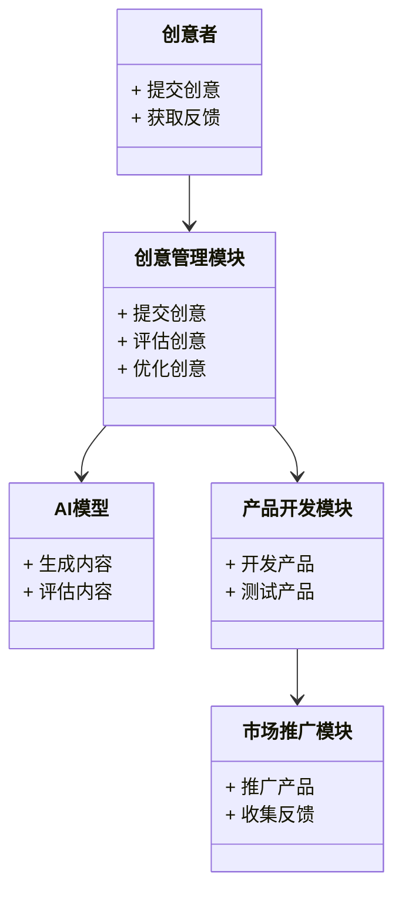
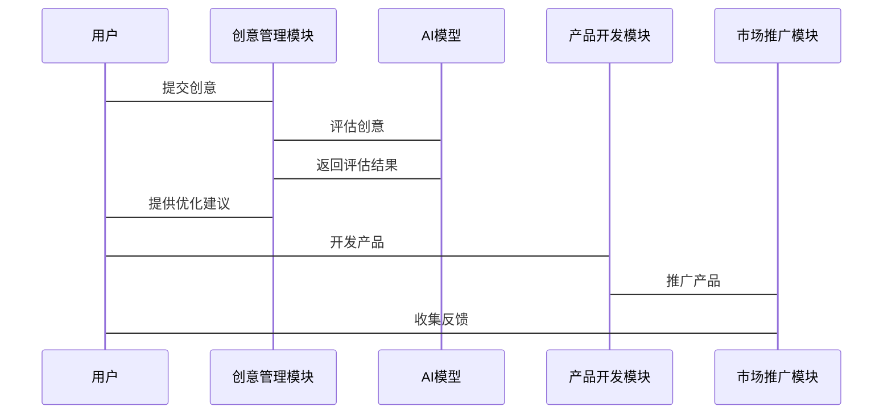

                 


```markdown
# 构建AI创新孵化器：从创意管理到商业化落地

> 关键词：AI创新孵化器，创意管理，AI技术，商业化落地，系统架构，生成式AI模型，创新生态系统

> 摘要：本文将详细探讨如何构建一个AI创新孵化器，从创意的产生、筛选、培育到最终的商业化落地，系统性地分析其中的关键环节和实现方法。我们将从AI创新孵化器的背景与概念入手，深入讲解创意管理、AI技术以及商业化落地之间的关系，通过生成式AI模型的实现，展示AI技术在创新过程中的具体应用。最后，我们将从系统架构设计的角度，详细阐述AI创新孵化器的实现方案，并通过一个实际案例，展示如何将创意转化为实际的产品并推向市场。

---

# 第一部分: AI创新孵化器的背景与概念

## 第1章: AI创新孵化器的背景介绍

### 1.1 问题背景与问题描述
#### 1.1.1 创意管理与AI技术的结合
创意管理是将创意从概念转化为可实施的商业产品的过程。随着AI技术的快速发展，AI能够辅助创意的生成、筛选和优化，从而提高创意管理的效率和质量。

#### 1.1.2 AI技术在创新中的作用
AI技术不仅能够加速创新过程，还能够提供新的创新方式。例如，生成式AI可以用于生成创意内容，推荐系统可以辅助创意的筛选和优化。

#### 1.1.3 创新孵化器的核心问题
创新孵化器的核心问题是如何将创意转化为实际的产品，并实现商业化。这需要一个系统化的流程，包括创意的生成、评估、培育和商业化支持。

### 1.2 问题解决与边界定义
#### 1.2.1 创意到商业化的核心问题
创意到商业化的核心问题包括创意的可行性评估、资源分配、市场验证和风险管理。

#### 1.2.2 AI创新孵化器的边界与外延
AI创新孵化器的边界包括创意的生成、评估和优化，以及商业化过程中的技术支持。其外延包括市场推广、用户反馈和持续改进。

#### 1.2.3 创新孵化器的生态体系
创新孵化器需要构建一个完整的生态体系，包括创意者、技术支持、市场资源和用户反馈等。

### 1.3 核心概念结构与要素
#### 1.3.1 创意管理的三要素
创意管理包括创意的生成、评估和优化三个要素。

#### 1.3.2 AI技术的三层次
AI技术包括数据处理、模型训练和应用开发三个层次。

#### 1.3.3 商业化落地的三阶段
商业化落地包括产品开发、市场推广和持续运营三个阶段。

## 第2章: AI创新孵化器的核心概念与联系

### 2.1 创意管理、AI技术、商业化落地的概念原理
#### 2.1.1 创意管理的定义与特征
创意管理是通过对创意的生成、评估和优化，提高创意的质量和可行性。

#### 2.1.2 AI技术的核心原理
AI技术通过数据处理、模型训练和应用开发，实现对创意的支持和优化。

#### 2.1.3 商业化落地的模式
商业化落地包括产品开发、市场推广和持续运营三个阶段。

### 2.2 核心概念属性对比表格
| 概念 | 属性 | 描述 |
|------|------|------|
| 创意管理 | 创意生成 | 创意的产生过程 |
|      | 创意筛选 | 创意的评估与选择 |
| AI技术 | 数据处理 | 数据的采集与预处理 |
|      | 模型训练 | 模型的训练与优化 |
| 商业化落地 | 产品开发 | 产品的设计与开发 |
|      | 市场推广 | 市场的推广与销售 |

### 2.3 ER实体关系图
```mermaid
er
actor: 创意者
model: AI模型
project: 项目
market: 市场
actor -[提交创意]-> project
project -[驱动模型]-> model
model -[生成产品]-> product
product -[进入]-> market
```

---

# 第二部分: AI创新孵化器的算法原理

## 第3章: 生成式AI模型的原理与实现

### 3.1 生成式AI模型的工作原理
#### 3.1.1 概念解释
生成式AI模型通过生成新的数据，辅助创意的生成和优化。

#### 3.1.2 模型结构
生成式AI模型通常采用深度神经网络结构，包括编码器和解码器。

#### 3.1.3 训练过程
生成式AI模型的训练过程包括数据预处理、模型训练和超参数调优。

### 3.2 生成式AI模型的数学模型
$$P(x) = \prod_{i=1}^{n} P(x_i | x_{i-1})$$

### 3.3 生成式AI模型的实现代码
```python
import torch
import torch.nn as nn
import torch.optim as optim

class GAN(nn.Module):
    def __init__(self, input_size, hidden_size, output_size):
        super(GAN, self).__init__()
        self.generator = nn.Sequential(
            nn.Linear(input_size, hidden_size),
            nn.ReLU(),
            nn.Linear(hidden_size, output_size),
            nn.Sigmoid()
        )
        self.discriminator = nn.Sequential(
            nn.Linear(output_size, hidden_size),
            nn.ReLU(),
            nn.Linear(hidden_size, 1),
            nn.Sigmoid()
        )
    
    def forward(self, x):
        gen = self.generator(x)
        dis = self.discriminator(gen)
        return gen, dis

# 初始化模型和优化器
gan = GAN(input_size=100, hidden_size=256, output_size=1)
generator_opt = optim.Adam(gan.generator.parameters(), lr=0.001)
discriminator_opt = optim.Adam(gan.discriminator.parameters(), lr=0.001)

# 训练过程
for epoch in range(100):
    for batch in data_loader:
        # 生成假数据
        noise = torch.randn(batch_size, 100)
        gen_output, dis_output = gan(noise)
        
        # 计算损失
        gen_loss = torch.mean(torch.log(dis_output))
        dis_loss = torch.mean(torch.log(1 - gen_output))
        
        # 反向传播和优化
        generator_opt.zero_grad()
        gen_loss.backward()
        generator_opt.step()
        
        discriminator_opt.zero_grad()
        dis_loss.backward()
        discriminator_opt.step()
```

### 3.4 生成式AI模型的实现流程图
```mermaid
graph TD
A[数据预处理] -> B[模型训练]
B -> C[生成数据]
C -> D[模型优化]
```

---

## 第4章: 创意到商业化的AI技术实现

### 4.1 创意筛选的AI技术实现
#### 4.1.1 创意筛选的算法选择
使用自然语言处理技术对创意内容进行分类和评估。

#### 4.1.2 创意筛选的实现代码
```python
from sklearn.feature_extraction.text import TfidfVectorizer
from sklearn.metrics.pairwise import cosine_similarity

def calculate_similarity(texts):
    vectorizer = TfidfVectorizer()
    vectors = vectorizer.fit_transform(texts)
    similarities = cosine_similarity(vectors)
    return similarities
```

### 4.2 创意优化的AI技术实现
#### 4.2.1 创意优化的算法选择
使用强化学习对创意内容进行优化和改进。

#### 4.2.2 创意优化的实现代码
```python
import tensorflow as tf
from tensorflow.keras import layers

model = tf.keras.Sequential([
    layers.Dense(256, activation='relu'),
    layers.Dense(1, activation='sigmoid')
])

model.compile(optimizer='adam', loss='binary_crossentropy', metrics=['accuracy'])
```

### 4.3 商业化落地的AI技术支持
#### 4.3.1 商业化落地的算法选择
使用机器学习对市场需求进行预测和分析。

#### 4.3.2 商业化落地的实现代码
```python
import pandas as pd
from sklearn.linear_model import LinearRegression

data = pd.read_csv('market_data.csv')
model = LinearRegression()
model.fit(data[['feature1', 'feature2']], data['target'])
```

---

# 第三部分: AI创新孵化器的系统架构设计

## 第5章: 系统功能设计

### 5.1 系统功能模块划分
系统功能模块包括创意提交、创意评估、创意优化、产品开发和市场推广。

### 5.2 系统功能的Mermaid类图


### 5.3 系统功能的实现流程
创意提交 -> 创意评估 -> 创意优化 -> 产品开发 -> 市场推广。

---

## 第6章: 系统架构设计

### 6.1 系统架构设计的Mermaid架构图


### 6.2 系统架构的实现细节
系统架构包括前端界面、后端逻辑和AI模型三部分。

---

## 第7章: 系统接口设计

### 7.1 系统接口设计的Mermaid序列图


### 7.2 系统接口的实现细节
系统接口包括创意提交接口、评估结果接口和优化建议接口。

---

## 第8章: 系统交互设计

### 8.1 系统交互的Mermaid序列图


### 8.2 系统交互的实现细节
系统交互包括创意提交、评估生成和优化建议三个阶段。

---

# 第四部分: AI创新孵化器的项目实战

## 第9章: 项目实战

### 9.1 项目环境安装
安装必要的Python库，如TensorFlow、Keras和Scikit-learn。

### 9.2 项目核心代码实现
```python
import tensorflow as tf
from tensorflow.keras import layers

model = tf.keras.Sequential([
    layers.Dense(256, activation='relu'),
    layers.Dense(1, activation='sigmoid')
])

model.compile(optimizer='adam', loss='binary_crossentropy', metrics=['accuracy'])
```

### 9.3 项目代码应用解读与分析
解读代码的功能和实现过程，分析其在创新孵化器中的应用。

### 9.4 项目实际案例分析
通过一个具体案例，展示如何将创意转化为实际的产品并推向市场。

### 9.5 项目小结
总结项目的实施过程和取得的成果，提出改进建议。

---

# 第五部分: AI创新孵化器的最佳实践

## 第10章: 最佳实践

### 10.1 小结
总结全文的核心内容和主要观点。

### 10.2 注意事项
在实际应用中需要注意的问题和潜在风险。

### 10.3 拓展阅读
推荐进一步学习的资源和相关领域的研究方向。

---

# 作者

作者：AI天才研究院/AI Genius Institute & 禅与计算机程序设计艺术 /Zen And The Art of Computer Programming
```

