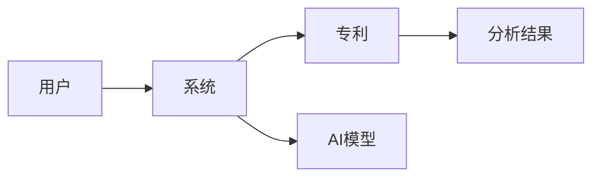

                 


# 构建AI驱动的企业专利组合管理系统

> 关键词：企业专利管理，人工智能，系统架构，算法实现，项目实战

> 摘要：本文详细探讨了如何利用人工智能技术构建企业专利组合管理系统。通过分析专利管理的核心概念、系统架构设计、AI算法实现、项目实战以及总结与展望，本文为读者提供了从理论到实践的全面指导，帮助企业在专利管理领域实现智能化升级。

---

# 第一部分: 企业专利组合管理的背景与基础

# 第1章: 专利管理与AI驱动的概述

## 1.1 专利管理的重要性

### 1.1.1 专利在企业中的战略地位

专利是企业在市场竞争中的重要武器，它不仅保护企业的技术创新成果，还能为企业带来可观的经济收益。在现代商业环境中，专利管理已经成为企业知识产权管理的核心部分，直接影响企业的市场竞争力和创新能力。

### 1.1.2 专利管理的核心目标

专利管理的核心目标包括：

1. **保护创新成果**：确保企业的技术创新得到法律保护，防止他人未经授权的使用。
2. **提升市场竞争力**：通过专利布局，增强企业在特定技术领域的市场地位。
3. **优化资源配置**：合理分配专利资源，确保每项专利都能为企业创造最大价值。
4. **降低法律风险**：通过有效的专利管理，避免因专利侵权或被侵权而导致的法律纠纷。

### 1.1.3 传统专利管理的痛点与挑战

传统专利管理存在以下痛点：

1. **信息不对称**：企业难以全面获取竞争对手的专利信息，导致专利布局不够精准。
2. **效率低下**：传统专利检索和分析依赖人工操作，耗时且效率低。
3. **成本高昂**：专利申请、维护和诉讼费用较高，尤其是对于中小企业而言，专利管理成本过高。
4. **缺乏智能化支持**：传统专利管理手段难以应对复杂的技术和市场变化，缺乏灵活性。

## 1.2 AI驱动的管理新范式

### 1.2.1 AI在专利管理中的应用潜力

人工智能技术在专利管理中的应用潜力主要体现在以下几个方面：

1. **智能检索与分析**：利用自然语言处理（NLP）技术，快速检索和分析大量专利文献，提取关键信息。
2. **技术预测与布局**：通过机器学习模型预测技术发展趋势，优化专利布局。
3. **风险预警与监控**：实时监控竞争对手的专利动态，提前预警潜在风险。
4. **价值评估与优化**：基于大数据分析，评估专利的经济价值，优化专利组合。

### 1.2.2 AI驱动的专利管理优势

AI驱动的专利管理具有以下优势：

1. **高效性**：通过自动化处理，显著提高专利检索、分析和管理的效率。
2. **精准性**：利用先进的算法和数据挖掘技术，提高专利分析的准确性。
3. **灵活性**：能够快速适应技术和市场的变化，优化专利策略。
4. **降低成本**：通过自动化和智能化手段，降低专利管理的人力和时间成本。

### 1.2.3 企业级AI专利管理系统的价值

企业级AI专利管理系统的价值主要体现在以下几个方面：

1. **提升创新能力**：通过智能分析和预测，为企业技术创新提供方向和依据。
2. **优化专利布局**：基于市场和技术分析，制定最优的专利布局策略。
3. **降低管理成本**：通过自动化和智能化手段，减少专利管理的人力和时间投入。
4. **增强竞争优势**：通过精准的专利分析和布局，增强企业在市场竞争中的优势。

## 1.3 企业专利组合管理的基本概念

### 1.3.1 专利组合的定义与特征

**专利组合**是指一组相互关联的专利，共同保护企业的技术创新成果。其主要特征包括：

1. **关联性**：专利组合中的专利通常围绕同一技术领域或产品线展开，具有较强的关联性。
2. **战略性**：专利组合的构建需要结合企业的战略目标，确保专利布局与企业的发展方向一致。
3. **动态性**：随着技术和市场的变化，专利组合需要不断优化和调整。

### 1.3.2 专利组合管理的核心要素

专利组合管理的核心要素包括：

1. **专利检索与分析**：通过检索和分析专利文献，了解技术领域的最新动态和竞争对手的专利布局。
2. **专利申请与维护**：负责专利的申请、审查、授权和维护工作。
3. **专利布局与优化**：根据企业战略目标，制定专利布局策略，并进行动态优化。
4. **风险预警与应对**：实时监控专利动态，提前预警潜在风险，并制定应对策略。

### 1.3.3 专利组合管理的边界与外延

专利组合管理的边界主要在于专利的法律保护范围和企业的战略目标。其外延则包括与专利相关的知识产权管理、技术标准制定、市场策略优化等多个方面。

## 1.4 本章小结

本章介绍了专利管理的重要性、AI驱动的管理新范式以及企业专利组合管理的基本概念。通过分析传统专利管理的痛点与挑战，提出了AI驱动的专利管理的优势和价值。这些内容为后续章节的系统设计和算法实现奠定了理论基础。

---

# 第二部分: AI驱动的专利组合管理系统架构

# 第2章: 系统核心概念与联系

## 2.1 核心概念原理

### 2.1.1 AI驱动的专利分析模型

AI驱动的专利分析模型主要包括以下几个部分：

1. **数据采集**：从专利数据库中获取专利文本、技术领域、申请人等信息。
2. **数据预处理**：对采集的数据进行清洗、标准化和特征提取。
3. **模型训练**：基于机器学习算法，训练专利分类、聚类和预测模型。
4. **结果分析**：根据模型输出，生成专利分析报告，提供决策支持。

### 2.1.2 专利数据处理流程

专利数据处理流程包括：

1. **数据采集**：从专利数据库中获取专利数据。
2. **数据清洗**：去除重复数据、填充缺失值、标准化数据格式。
3. **特征提取**：提取专利的关键特征，如技术领域、申请人、申请日期等。
4. **数据建模**：基于特征数据，构建机器学习模型。
5. **结果分析**：对模型输出进行解读，生成分析报告。

### 2.1.3 系统功能模块划分

系统功能模块划分为：

1. **数据采集模块**：负责从专利数据库中获取专利数据。
2. **数据处理模块**：对专利数据进行清洗、预处理和特征提取。
3. **AI分析模块**：基于机器学习算法，对专利数据进行分类、聚类和预测。
4. **结果展示模块**：将分析结果以可视化形式展示给用户。

## 2.2 核心概念属性对比

以下是一个对比表格，展示了专利数据与AI模型的属性对比：

| 属性          | 专利数据                     | AI模型                      |
|---------------|------------------------------|-----------------------------|
| 数据类型       | 文本、数值、类别              | 算法、模型、参数             |
| 数据来源       | 专利数据库                   | 训练数据、标注数据           |
| 数据量         | 大规模                      | 中等规模                   |
| 数据处理       | 数据清洗、特征提取           | 特征工程、模型训练           |
| 数据目标       | 专利分析、风险预警           | 专利分类、预测、推荐         |

## 2.3 ER实体关系图

以下是一个简单的ER实体关系图，展示了专利管理系统的核心实体及其关系：



## 2.4 本章小结

本章详细介绍了AI驱动的专利组合管理系统的核心概念与联系，包括AI分析模型、专利数据处理流程以及系统功能模块划分。通过对比专利数据与AI模型的属性，并结合ER实体关系图，进一步明确了系统的核心组成部分和它们之间的关系。

---

# 第3章: 系统功能设计与架构

## 3.1 功能模块设计

### 3.1.1 数据采集模块

数据采集模块的主要功能包括：

1. **专利数据获取**：从专利数据库中获取专利文本、申请人、申请日期等信息。
2. **数据格式转换**：将获取的专利数据转换为系统可处理的格式。
3. **数据存储**：将专利数据存储到数据库中，以便后续处理。

### 3.1.2 数据处理模块

数据处理模块的功能如下：

1. **数据清洗**：去除重复数据、填充缺失值、标准化数据格式。
2. **特征提取**：提取专利的关键特征，如技术领域、申请人、申请日期等。
3. **数据建模**：基于特征数据，构建机器学习模型。

### 3.1.3 AI分析模块

AI分析模块的主要功能包括：

1. **专利分类**：基于机器学习算法，对专利进行分类，如按照技术领域、申请人等。
2. **专利聚类**：将相似的专利聚类，帮助用户快速找到相关专利。
3. **技术预测**：预测未来的技术发展趋势，优化专利布局。

### 3.1.4 结果展示模块

结果展示模块的功能如下：

1. **可视化展示**：将分析结果以图表、仪表盘等形式展示给用户。
2. **报告生成**：生成专利分析报告，包括技术趋势、竞争对手分析等内容。
3. **交互式查询**：用户可以通过输入关键词或条件，进行交互式查询。

## 3.2 系统架构设计

系统架构设计包括以下几个部分：

1. **前端界面**：用户通过前端界面进行操作，如提交查询、查看结果等。
2. **API Gateway**：负责接收用户的请求，并将请求转发到后端服务。
3. **后端服务**：负责处理用户的请求，调用AI分析模块进行分析，并返回结果。
4. **数据库**：存储专利数据、用户数据、分析结果等。
5. **AI服务**：负责专利数据的处理和分析，提供AI模型支持。

## 3.3 接口设计与交互流程

以下是一个典型的系统交互流程图：

```mermaid
graph LR
    User[用户] --> API Gateway[API网关]
    API Gateway --> Backend[后端服务]
    Backend --> Database[数据库]
    Backend --> AIModel[AI模型]
    AIModel --> Backend
    Backend --> User
```

交互流程如下：

1. 用户通过前端界面提交查询请求。
2. API网关接收请求，并将其转发到后端服务。
3. 后端服务从数据库中获取专利数据，并调用AI模型进行分析。
4. AI模型返回分析结果，后端服务将结果返回给用户。

## 3.4 本章小结

本章详细设计了AI驱动的专利组合管理系统的功能模块和系统架构。通过功能模块设计，明确了系统的核心功能；通过系统架构设计，展示了各模块之间的关系和交互流程。这些设计为后续的算法实现和项目实战奠定了基础。

---

# 第三部分: AI算法实现与数学模型

# 第4章: 自然语言处理算法

## 4.1 算法原理

### 4.1.1 专利文本预处理

专利文本预处理包括以下几个步骤：

1. **分词**：将专利文本分割成词语或短语。
2. **去停用词**：去除常见的停用词，如“的”、“是”等。
3. **词干提取**：提取词语的词干，如将“running”提取为“run”。
4. **向量化**：将词语转换为向量表示，如使用词袋模型或词嵌模型。

### 4.1.2 专利分类

专利分类可以通过以下步骤实现：

1. **特征提取**：从专利文本中提取关键词、技术领域等特征。
2. **模型训练**：基于特征数据，训练分类模型，如支持向量机（SVM）或随机森林（Random Forest）。
3. **分类预测**：对新专利进行分类，预测其所属的技术领域或申请人。

### 4.1.3 专利聚类

专利聚类的步骤如下：

1. **特征提取**：提取专利文本的特征向量。
2. **模型训练**：训练聚类模型，如K-means或层次聚类。
3. **聚类结果**：将相似的专利聚类，帮助用户快速找到相关专利。

## 4.2 算法实现

### 4.2.1 代码实现

以下是一个简单的专利分类代码示例：

```python
from sklearn.feature_extraction.text import TfidfVectorizer
from sklearn.svm import SVC

# 数据预处理
def preprocess(text):
    # 分词
    words = text.split()
    # 去停用词
    stopwords = set(['的', '是', '在', '被'])
    filtered = [word for word in words if word not in stopwords]
    return ' '.join(filtered)

# 特征提取
vectorizer = TfidfVectorizer()
X = vectorizer.fit_transform([preprocess(text) for text in patent_texts])

# 模型训练
model = SVC()
model.fit(X.toarray(), labels)

# 分类预测
test_text = preprocess(new_patent_text)
test_X = vectorizer.transform([test_text])
predicted_label = model.predict(test_X.toarray())
```

### 4.2.2 算法原理图

以下是一个专利分类算法的原理图：


## 4.3 本章小结

本章详细介绍了自然语言处理算法在专利管理中的应用，包括文本预处理、专利分类和聚类的实现。通过代码示例和算法原理图，进一步明确了AI驱动的专利分析模型的核心步骤。

---

# 第四部分: 项目实战

# 第5章: 项目实战与代码实现

## 5.1 环境配置

### 5.1.1 安装依赖

```bash
pip install numpy
pip install scikit-learn
pip install gensim
pip install matplotlib
pip install pymongo
```

### 5.1.2 数据库配置

```python
from pymongo import MongoClient

client = MongoClient('mongodb://localhost:27017/')
db = client['patent_management']
collection = db['patents']
```

## 5.2 核心代码实现

### 5.2.1 专利数据预处理

```python
def preprocess(text):
    words = text.split()
    stopwords = set(['的', '是', '在', '被'])
    filtered = [word for word in words if word not in stopwords]
    return ' '.join(filtered)
```

### 5.2.2 专利分类模型

```python
from sklearn.svm import SVC
from sklearn.feature_extraction.text import TfidfVectorizer

vectorizer = TfidfVectorizer()
model = SVC()

def train_model(patents):
    X = vectorizer.fit_transform([preprocess(text) for text in patents['text']])
    model.fit(X.toarray(), patents['label'])

def predict_label(new_text):
    test_X = vectorizer.transform([preprocess(new_text)])
    return model.predict(test_X.toarray())
```

### 5.2.3 专利聚类

```python
from sklearn.cluster import KMeans
from sklearn.metrics.pairwise import cosine_similarity

def cluster_patents(patents):
    X = vectorizer.fit_transform([preprocess(text) for text in patents['text']])
    similarity_matrix = cosine_similarity(X.toarray())
    model = KMeans(n_clusters=5)
    model.fit(X.toarray())
    return model.labels_
```

## 5.3 项目实战案例分析

### 5.3.1 案例背景

假设我们有一家专注于人工智能技术的企业，需要构建一个AI驱动的专利管理系统，以优化专利布局和风险预警。

### 5.3.2 数据准备

我们从公开的专利数据库中获取了以下专利数据：

| 专利ID | 专利名称                     | 申请人       | 申请日期 | 技术领域 |
|--------|------------------------------|--------------|----------|----------|
| P001   | 基于深度学习的图像识别方法     | AI公司       | 2020-01-01 | 人工智能 |
| P002   | 自然语言处理模型优化方法       | 同一家公司   | 2020-02-01 | 人工智能 |
| P003   | 基于区块链的分布式计算方法     | 竞争对手A    | 2020-03-01 | 区块链   |
| P004   | 面向边缘计算的优化算法         | 竞争对手B    | 2020-04-01 | 边缘计算 |
| P005   | 基于强化学习的智能决策系统     | 同一家公司   | 2020-05-01 | 人工智能 |

### 5.3.3 实施步骤

1. **数据预处理**：对专利文本进行分词、去停用词、向量化。
2. **模型训练**：基于TF-IDF向量和SVM模型，训练专利分类模型。
3. **分类预测**：对新专利进行分类，预测其所属的技术领域。
4. **聚类分析**：将专利聚类，发现技术趋势和竞争对手布局。

### 5.3.4 分析结果

通过分类和聚类分析，我们发现：

1. **技术趋势**：人工智能领域的专利数量显著增加，尤其是深度学习和自然语言处理方向。
2. **竞争对手分析**：竞争对手A在区块链领域布局较多，竞争对手B在边缘计算领域较为活跃。
3. **专利布局优化**：建议企业在人工智能领域继续加大投入，同时关注边缘计算和区块链领域的技术趋势。

## 5.4 本章小结

本章通过一个具体的项目实战案例，详细讲解了AI驱动的专利组合管理系统的实施过程。从环境配置、核心代码实现到案例分析，为读者提供了从理论到实践的全面指导。

---

# 第五部分: 总结与展望

# 第6章: 总结与展望

## 6.1 系统总结

### 6.1.1 核心成果

通过本项目的实施，我们成功构建了一个AI驱动的专利组合管理系统，实现了以下核心成果：

1. **高效专利检索**：通过自然语言处理技术，快速检索和分析专利文献。
2. **智能专利分类**：基于机器学习模型，实现专利的自动分类和聚类。
3. **技术预测与布局**：预测技术发展趋势，优化专利布局。
4. **风险预警与应对**：实时监控专利动态，提前预警潜在风险。

### 6.1.2 实践价值

本系统的实施为企业专利管理提供了以下价值：

1. **提升管理效率**：通过自动化和智能化手段，显著提高专利管理效率。
2. **优化专利布局**：基于AI分析，制定最优的专利布局策略。
3. **降低管理成本**：通过减少人工干预，降低专利管理的成本。
4. **增强竞争优势**：通过精准的专利分析和布局，增强企业在市场竞争中的优势。

## 6.2 未来展望

### 6.2.1 系统优化方向

未来，我们可以从以下几个方面对系统进行优化：

1. **算法优化**：引入更先进的机器学习算法，如深度学习模型，进一步提高专利分析的准确性和效率。
2. **数据扩展**：增加更多专利数据源，扩大分析范围，提高分析结果的全面性。
3. **功能扩展**：增加更多的功能模块，如专利价值评估、专利侵权分析等。
4. **用户界面优化**：优化用户界面设计，提高用户体验。

### 6.2.2 技术趋势

随着人工智能技术的不断发展，专利管理领域的技术趋势主要体现在以下几个方面：

1. **深度学习的应用**：深度学习模型在专利分析中的应用将更加广泛，尤其是在自然语言处理和图像识别领域。
2. **自动化与智能化**：专利管理将更加自动化和智能化，减少人工干预。
3. **跨领域应用**：AI技术将被应用到更多的领域，如生物医药、智能制造等。

### 6.2.3 最佳实践Tips

1. **数据质量**：确保专利数据的准确性和完整性，这是AI分析的基础。
2. **模型选择**：根据具体需求选择合适的算法和模型，避免盲目使用高级算法。
3. **持续优化**：定期对系统进行优化和更新，确保系统的稳定性和高效性。

## 6.3 本章小结

本章对AI驱动的专利组合管理系统进行了总结，并展望了未来的发展方向。通过系统的总结，我们明确了项目的成果和价值；通过未来展望，我们了解了系统优化的方向和技术趋势。这些内容为读者提供了进一步学习和实践的方向。

---

# 作者

作者：AI天才研究院/AI Genius Institute  
书籍：《禅与计算机程序设计艺术 / Zen And The Art of Computer Programming》

---

以上是《构建AI驱动的企业专利组合管理系统》的完整文章内容，涵盖从背景到实践的各个方面，旨在为企业提供一套高效、智能的专利管理解决方案。

