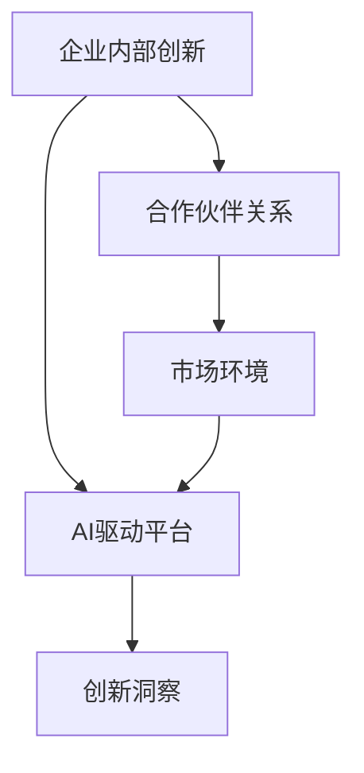
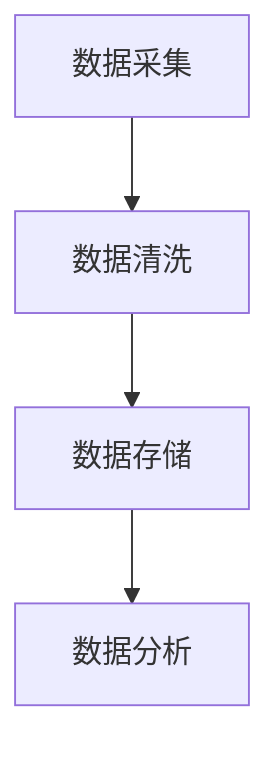
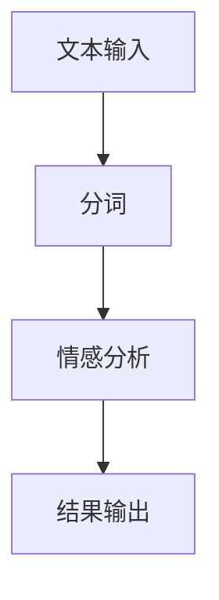
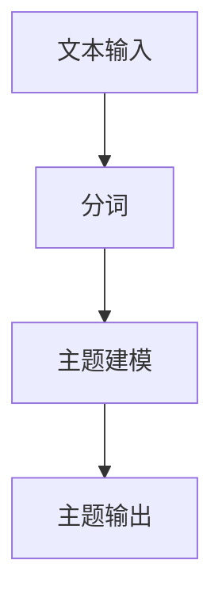
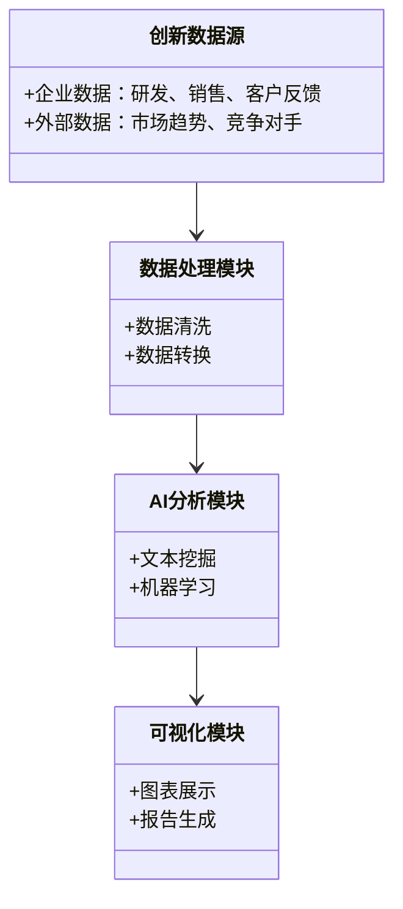
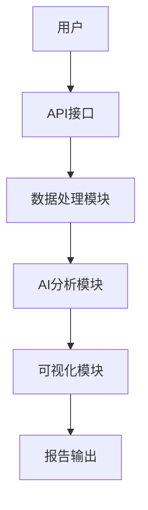
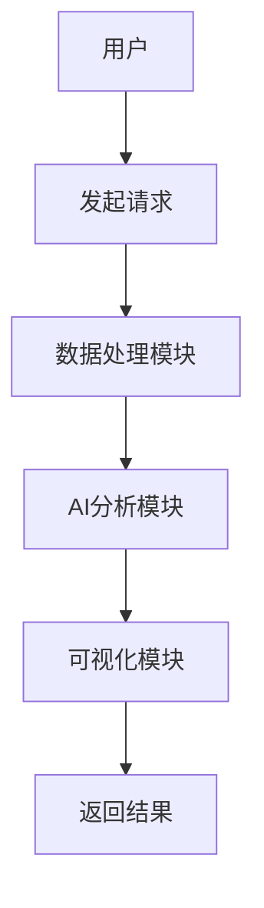

                 


# 构建AI驱动的企业创新生态系统分析平台

> 关键词：AI驱动，创新生态系统，数据分析，企业创新，机器学习，NLP，系统架构

> 摘要：随着人工智能技术的快速发展，企业创新生态系统分析平台的构建已成为推动企业创新的重要工具。本文将详细探讨如何利用AI技术构建一个高效的企业创新生态系统分析平台，涵盖背景、核心概念、技术基础、算法原理、系统架构、项目实战和最佳实践等各个方面，帮助读者全面理解和掌握构建此类平台的关键技术和方法。

---

# 第一部分: 引言

## 1.1 企业创新生态系统分析平台的背景与意义
### 1.1.1 企业创新的现状与挑战
在当前全球经济环境下，企业的创新能力是其核心竞争力的重要组成部分。然而，传统的创新管理方式存在效率低下、信息孤岛、资源浪费等问题。企业需要一种更高效、更智能的方式来进行创新生态系统分析。

### 1.1.2 AI技术在企业创新中的作用
人工智能（AI）技术的快速发展为企业创新分析提供了新的工具和方法。通过AI技术，企业可以更快速地从海量数据中提取有价值的信息，识别潜在的创新机会，优化创新流程。

### 1.1.3 本书的目标与读者定位
本文旨在为企业提供一套基于AI技术的创新生态系统分析平台的构建方法，帮助企业在数字化转型中提升创新效率。本文适合企业IT架构师、数据科学家、创新管理从业者以及对AI技术感兴趣的读者阅读。

---

# 第二部分: 核心概念与理论基础

## 2.1 AI驱动的企业创新生态系统分析平台概述
### 2.1.1 创新生态系统的核心要素
创新生态系统包括企业内部的创新活动、外部合作伙伴关系、市场环境等多个维度。以下是创新生态系统的核心要素：

| 要素 | 描述 |
|------|------|
| 企业内部创新 | 包括研发、产品开发、内部创新项目等 |
| 合作伙伴 | 包括供应商、客户、合作伙伴等 |
| 市场环境 | 包括行业趋势、政策法规、竞争分析等 |

### 2.1.2 AI驱动的分析平台的定义与特点
AI驱动的企业创新生态系统分析平台是一种基于人工智能技术，能够对企业内外部数据进行实时分析，并提供创新洞察和建议的智能平台。其特点包括：

- **数据驱动**：通过分析海量数据，识别潜在的创新机会。
- **实时性**：能够实时更新数据，提供最新的分析结果。
- **可扩展性**：能够适应不同规模和类型的企业需求。

### 2.1.3 平台的核心功能与应用场景
平台的核心功能包括数据采集与处理、创新趋势分析、竞争分析、创新机会识别等。应用场景包括企业战略规划、新产品开发、市场进入策略等。

## 2.2 创新生态系统与AI驱动平台的关系
### 2.2.1 创新生态系统的基本结构
创新生态系统是一个复杂的网络，包括企业、合作伙伴、市场环境等多个组成部分。通过AI驱动的分析平台，企业可以更好地理解生态系统中的各个要素之间的关系。

### 2.2.2 AI驱动平台在生态系统中的角色
AI驱动的分析平台在创新生态系统中扮演着数据整合者、洞察提供者和决策支持者的角色。它能够将分散在企业内外部的创新数据整合到一个平台上，并通过AI技术提供有价值的洞察和建议。

### 2.2.3 平台与生态系统的关系图解


## 2.3 创新生态系统分析平台的核心要素
### 2.3.1 数据源的多样性与重要性
平台需要整合多种数据源，包括内部数据（如研发数据、销售数据）和外部数据（如市场趋势、竞争对手信息）。数据源的多样性是平台分析能力的基础。

### 2.3.2 分析模型的构建与优化
平台的核心是AI算法，包括文本挖掘、机器学习等技术。通过不断优化分析模型，平台能够更准确地识别创新机会。

### 2.3.3 平台的可扩展性与灵活性
平台需要具备良好的可扩展性和灵活性，能够适应不同企业的需求和数据规模。

---

# 第三部分: 技术基础

## 3.1 大数据处理与分析技术
### 3.1.1 数据采集与预处理
平台需要从多种数据源采集数据，并进行清洗、转换等预处理步骤。以下是数据采集与预处理的流程：

1. 数据采集：通过API、爬虫等方式从多个数据源获取数据。
2. 数据清洗：去除重复数据、处理缺失值、异常值。
3. 数据转换：将数据转换为适合分析的格式。

### 3.1.2 数据存储与管理
平台需要使用高效的数据存储和管理系统，如Hadoop、MongoDB等。以下是数据存储与管理的流程图：



### 3.1.3 数据分析与挖掘
通过大数据分析技术，平台能够从海量数据中提取有价值的信息。常用的分析方法包括聚类分析、关联规则挖掘等。

## 3.2 自然语言处理（NLP）技术
### 3.2.1 NLP的基本概念与技术
NLP技术用于处理文本数据，包括分词、句法分析、情感分析等。以下是NLP的基本流程：

1. 文本分词：将文本分割成词语或短语。
2. 句法分析：分析句子的语法结构。
3. 实体识别：识别文本中的实体（如人名、地名等）。

### 3.2.2 文本挖掘与情感分析
文本挖掘用于从文本数据中提取有用的信息，情感分析用于识别文本中的情感倾向。以下是情感分析的流程图：



### 3.2.3 NLP在创新分析中的应用
NLP技术可以应用于创新趋势分析、竞争对手分析等领域。例如，通过分析竞争对手的产品评论，可以了解市场对产品的看法。

## 3.3 机器学习与深度学习
### 3.3.1 机器学习的基本原理
机器学习是一种通过数据训练模型的技术，包括监督学习、无监督学习等。以下是机器学习的基本流程：

1. 数据准备：收集和预处理数据。
2. 模型训练：使用训练数据训练模型。
3. 模型评估：通过测试数据评估模型性能。

### 3.3.2 深度学习的核心算法
深度学习是一种基于人工神经网络的机器学习技术，常用的算法包括卷积神经网络（CNN）、循环神经网络（RNN）等。

### 3.3.3 机器学习在创新分析中的应用
机器学习可以应用于创新机会识别、市场趋势预测等领域。例如，通过训练模型，可以预测下一个季度的市场需求。

---

# 第四部分: 算法原理与实现

## 4.1 文本挖掘与主题建模
### 4.1.1 文本挖掘的基本流程
文本挖掘是从文本数据中提取有用信息的过程，包括分词、主题建模等。以下是文本挖掘的基本流程：

1. 文本分词：将文本分割成词语或短语。
2. 主题建模：识别文本的主题。

### 4.1.2 主题建模的实现
主题建模是一种无监督学习技术，常用的算法包括LDA（Latent Dirichlet Allocation）模型。以下是LDA模型的数学公式：

$$
\theta \sim Dirichlet(\alpha) \\
z_i \sim Multinomial(\theta) \\
w_i \sim Multinomial(\beta_{z_i})
$$

### 4.1.3 LDA主题模型的流程图


## 4.2 情感分析与语义理解
### 4.2.1 情感分析的算法原理
情感分析是通过分析文本的情感倾向来判断文本的情感。常用的算法包括基于词袋模型的分类算法。以下是情感分析的流程：

1. 文本分词：将文本分割成词语。
2. 特征提取：提取词语的特征向量。
3. 模型训练：训练分类器。

### 4.2.2 语义理解的实现
语义理解是通过分析文本的语义结构来理解文本的含义。常用的语义理解技术包括Word2Vec、BERT等。

### 4.2.3 情感分析的Python代码实现
以下是基于Word2Vec的情感分析代码示例：

```python
from sklearn.feature_extraction.text import CountVectorizer
from sklearn.naive_bayes import MultinomialNB

# 文本数据
texts = ["This product is great!", "This product sucks!"]

# 特征提取
vectorizer = CountVectorizer()
X = vectorizer.fit_transform(texts)

# 模型训练
model = MultinomialNB()
model.fit(X, [1, 0])

# 预测
new_text = ["This product is excellent!"]
X_new = vectorizer.transform([new_text])
print(model.predict(X_new))
```

## 4.3 时间序列分析与预测
### 4.3.1 时间序列分析的基本原理
时间序列分析是通过分析时间序列数据来预测未来的趋势。常用的分析方法包括ARIMA、LSTM等。

### 4.3.2 预测模型的构建与优化
通过训练时间序列模型，可以预测未来的市场需求。以下是基于LSTM的时间序列预测模型的代码示例：

```python
import numpy as np
from keras.models import Sequential
from keras.layers import LSTM, Dense

# 数据准备
X_train = np.random.random((1000, 1, 1))
y_train = np.random.random((1000, 1))

# 模型构建
model = Sequential()
model.add(LSTM(50, input_shape=(1, 1)))
model.add(Dense(1))
model.compile(optimizer='adam', loss='mse')

# 模型训练
model.fit(X_train, y_train, epochs=10, batch_size=32)
```

### 4.3.3 时间序列分

---

# 第五部分: 系统架构设计

## 5.1 系统功能设计
### 5.1.1 领域模型
以下是平台的领域模型：



### 5.1.2 系统架构
以下是平台的系统架构图：



## 5.2 系统接口设计
### 5.2.1 系统接口
平台需要提供以下接口：

1. 数据接口：用于数据的输入和输出。
2. 分析接口：用于调用AI分析模块。
3. 可视化接口：用于生成报告和图表。

### 5.2.2 系统交互
以下是用户与系统交互的流程图：



---

# 第六部分: 项目实战

## 6.1 环境安装
### 6.1.1 安装Python
需要安装Python 3.6或更高版本。

### 6.1.2 安装依赖库
安装以下依赖库：

```bash
pip install numpy
pip install pandas
pip install scikit-learn
pip install matplotlib
pip install gensim
```

## 6.2 系统核心实现源代码
### 6.2.1 数据处理模块
以下是数据处理模块的代码示例：

```python
import pandas as pd
import numpy as np

def data_preprocessing(df):
    # 去除重复数据
    df.drop_duplicates(inplace=True)
    # 处理缺失值
    df.dropna(inplace=True)
    return df
```

### 6.2.2 AI分析模块
以下是AI分析模块的代码示例：

```python
from sklearn.naive_bayes import MultinomialNB
from sklearn.feature_extraction.text import CountVectorizer

def text_analysis(texts):
    vectorizer = CountVectorizer()
    X = vectorizer.fit_transform(texts)
    model = MultinomialNB()
    model.fit(X, [1, 0])
    return model
```

## 6.3 代码应用解读与分析
通过上述代码，我们可以实现数据的预处理和文本分析功能。以下是代码的详细解读：

1. 数据处理模块：通过`data_preprocessing`函数实现数据的清洗和预处理。
2. AI分析模块：通过`text_analysis`函数实现文本的特征提取和分类模型的训练。

## 6.4 实际案例分析
以下是一个实际案例的分析过程：

1. 数据采集：从企业内部和外部数据源采集数据。
2. 数据处理：清洗和预处理数据。
3. 文本分析：使用NLP技术分析文本数据，识别创新机会。
4. 可视化：生成图表和报告，展示分析结果。

## 6.5 项目小结
通过以上步骤，我们可以构建一个基于AI的企业创新生态系统分析平台，帮助企业高效地进行创新分析和决策。

---

# 第七部分: 最佳实践

## 7.1 小结
本文详细探讨了构建AI驱动的企业创新生态系统分析平台的关键技术和方法，包括背景、核心概念、技术基础、算法原理、系统架构、项目实战和最佳实践等方面。

## 7.2 注意事项
在实际应用中，需要注意以下几点：

1. 数据隐私和安全问题。
2. 模型的可解释性和透明度。
3. 系统的可扩展性和灵活性。

## 7.3 拓展阅读
以下是一些拓展阅读资料：

1. 《机器学习实战》
2. 《深度学习入门：基于Python的CNN、RNN、GAN等技术实践》
3. 《自然语言处理入门：基于Python的文本挖掘、情感分析与信息提取》

---

# 作者：AI天才研究院/AI Genius Institute & 禅与计算机程序设计艺术/Zen And The Art of Computer Programming

