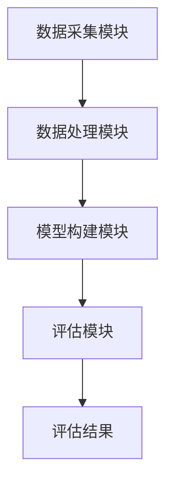
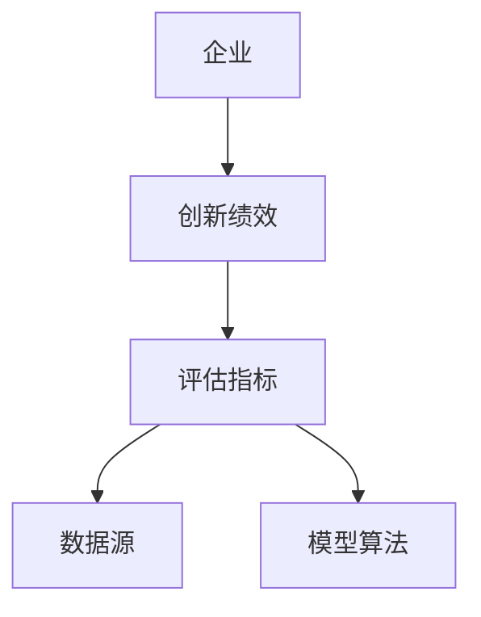
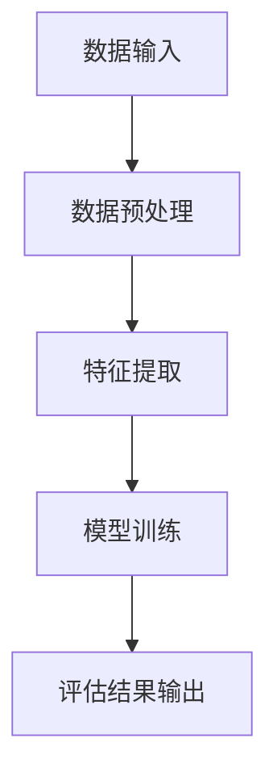
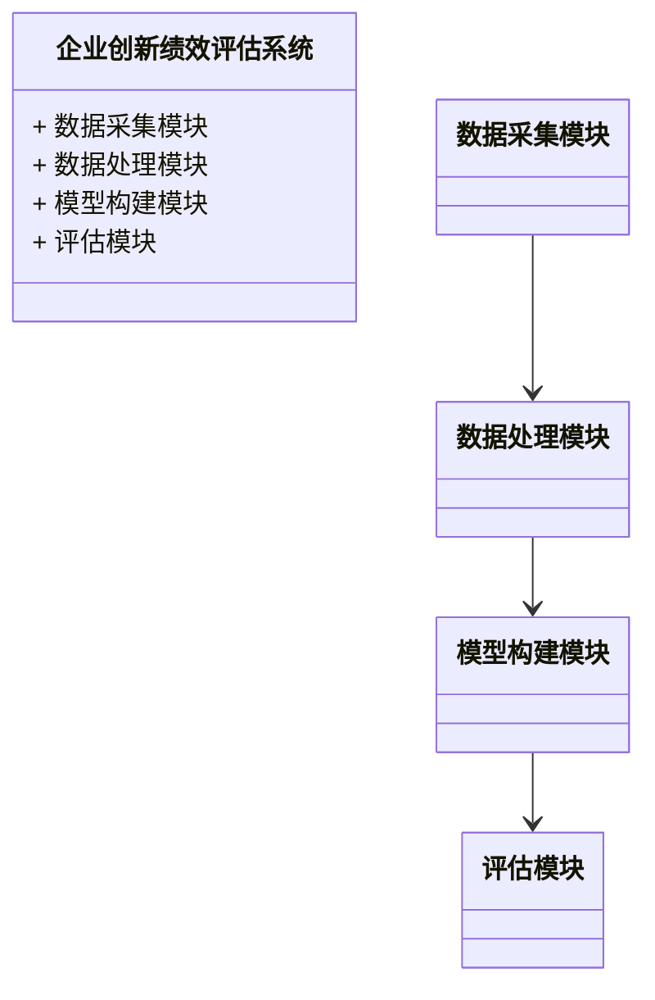
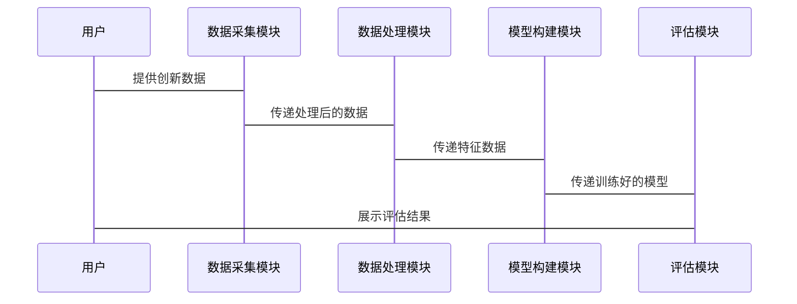

                 


# 构建AI驱动的企业创新绩效评估系统

> 关键词：AI驱动、企业创新、绩效评估、系统架构、算法实现、项目实战

> 摘要：本文详细介绍了如何利用人工智能技术构建企业创新绩效评估系统。从背景概述、核心概念、算法原理到系统架构设计、项目实战，最后总结了最佳实践和未来展望。文章内容丰富，结构清晰，旨在为企业创新绩效评估提供一套高效、智能的解决方案。

---

## 第一部分: 背景与概述

### 第1章: 背景与概述

#### 1.1 问题背景

##### 1.1.1 传统企业绩效评估的局限性
传统的企业绩效评估方法通常依赖于主观的评价指标和人工分析，存在以下问题：
- **数据维度不足**：难以全面反映企业的创新绩效。
- **评估周期长**：人工评估耗时，无法实时反馈。
- **主观性高**：不同评估者的标准可能不一致。
- **缺乏动态性**：无法及时捕捉创新活动的变化。

##### 1.1.2 AI技术对企业绩效评估的变革作用
人工智能技术的引入，为企业绩效评估带来了革命性的变化：
- **数据驱动**：通过大量数据的分析，提供客观、精准的评估结果。
- **实时性**：AI算法可以实时处理数据，快速生成评估结果。
- **可扩展性**：能够处理大规模数据，适应企业快速发展的需求。

##### 1.1.3 当前企业创新绩效评估的核心挑战
当前企业在创新绩效评估方面面临的主要挑战包括：
- **数据质量问题**：数据来源多样，清洗和预处理难度大。
- **模型选择**：如何选择合适的算法，提升评估准确率。
- **结果解释性**：如何让管理层理解AI生成的评估结果。

#### 1.2 问题描述

##### 1.2.1 创新绩效评估的定义与目标
创新绩效评估是指通过量化指标，对企业在创新活动中的表现进行全面评价。其目标是帮助企业识别创新优势和不足，优化资源配置，提升创新效率。

##### 1.2.2 创新绩效评估的关键维度
企业创新绩效评估的关键维度包括：
- 创新投入：企业在研发、知识产权等方面的投资。
- 创新产出：企业专利数量、新产品数量等。
- 创新影响力：创新成果对行业和社会的影响。

##### 1.2.3 创新绩效评估的边界与外延
创新绩效评估的边界在于企业的核心业务范围，外延则包括与创新相关的外部合作、市场反馈等。

#### 1.3 问题解决

##### 1.3.1 AI驱动的创新绩效评估的优势
AI驱动的创新绩效评估具有以下优势：
- **自动化**：AI算法可以自动处理数据，生成评估结果。
- **精准性**：通过机器学习模型，提高评估结果的准确性。
- **动态性**：实时更新数据，提供动态评估结果。

##### 1.3.2 数据驱动的评估方法
数据驱动的评估方法包括：
- 数据清洗与预处理。
- 特征提取与选择。
- 模型训练与验证。

##### 1.3.3 企业创新绩效评估的系统化解决方案
系统化解决方案包括：
- 构建数据采集与处理模块。
- 设计模型训练与优化模块。
- 实现评估结果展示与分析模块。

#### 1.4 核心概念结构与组成

##### 1.4.1 系统组成模块
- 数据采集模块：负责收集企业创新相关的数据。
- 数据处理模块：对数据进行清洗、转换和标准化。
- 模型构建模块：设计并训练机器学习模型。
- 评估模块：生成并展示评估结果。

##### 1.4.2 模块之间的关系
模块之间的关系可以用以下表格表示：

| 模块 | 输入 | 输出 | 关系 |
|------|------|------|------|
| 数据采集模块 | 企业创新数据 | 数据处理模块 | 数据处理模块依赖数据采集模块提供数据。 |
| 数据处理模块 | 未处理数据 | 处理后的数据 | 数据处理模块为模型构建模块提供预处理数据。 |
| 模型构建模块 | 处理后的数据 | 训练好的模型 | 模型构建模块依赖数据处理模块提供数据。 |
| 评估模块 | 训练好的模型 | 评估结果 | 评估模块依赖模型构建模块提供模型。 |

##### 1.4.3 系统整体架构
系统整体架构可以用以下ER图表示：



---

## 第二部分: 核心概念与联系

### 第2章: 核心概念与联系

#### 2.1 核心概念原理

##### 2.1.1 数据采集与处理
数据采集与处理是系统的核心模块之一，主要负责将企业的创新数据转化为可分析的形式。数据采集可以通过API接口、数据库查询等方式完成。数据处理包括数据清洗、特征提取和数据标准化。

##### 2.1.2 模型构建与训练
模型构建与训练是系统的关键部分，负责通过机器学习算法对数据进行建模和训练。常用的算法包括线性回归、随机森林、神经网络等。模型训练的目标是提高预测准确率。

##### 2.1.3 评估与反馈
评估与反馈模块负责对模型的预测结果进行评估，并根据评估结果提供反馈。评估指标包括准确率、召回率、F1值等。

#### 2.2 核心概念属性对比

##### 2.2.1 数据源的特征对比
数据源的特征对比可以用以下表格表示：

| 数据源 | 特征 | 优势 | 劣势 |
|--------|------|-------|------|
| 专利数据 | 数量、时间 | 客观性高 | 数据量大，处理复杂 |
| 产品数据 | 类型、市场反馈 | 反馈及时 | 数据分散 |
| 市场数据 | 销量、市场份额 | 数据全面 | 数据维度多 |

#### 2.2.2 模型算法的性能对比
模型算法的性能对比可以用以下表格表示：

| 模型 | 优势 | 劣势 | 适用场景 |
|------|-------|-------|-----------|
| 线性回归 | 简单、可解释性高 | 无法处理非线性关系 | 线性问题 |
| 随机森林 | 高准确性、抗过拟合 | 计算复杂 | 非线性分类 |
| 神经网络 | 强大学习能力 | 需要大量数据 | 复杂模式识别 |

#### 2.2.3 评估指标的维度对比
评估指标的维度对比可以用以下表格表示：

| 指标 | 计算公式 | 优势 | 劣势 |
|------|----------|-------|------|
| 准确率 | (TP+TN)/(TP+TN+FP+FN) | 简单易懂 | 不适合类别不平衡数据 |
| 召回率 | TP/(TP+FN) | 聚焦于模型的查全率 | 无法反映整体性能 |
| F1值 | 2*(Precision*Recall)/(Precision+Recall) | 综合考虑精确率和召回率 | 不适合多分类问题 |

#### 2.3 ER实体关系图



---

## 第三部分: 算法原理讲解

### 第3章: 算法原理讲解

#### 3.1 算法原理概述

##### 3.1.1 基于机器学习的评估模型
基于机器学习的评估模型包括监督学习和无监督学习两种类型。监督学习适用于有标签的数据，无监督学习适用于无标签的数据。

##### 3.1.2 深度学习在绩效评估中的应用
深度学习在绩效评估中的应用主要体现在神经网络模型的设计上，如卷积神经网络（CNN）和循环神经网络（RNN）。

##### 3.1.3 混合算法的优势
混合算法结合了多种算法的优势，能够提高模型的准确性和鲁棒性。

#### 3.2 算法流程图



#### 3.3 算法实现代码

```python
import numpy as np
from sklearn.model_selection import train_test_split
from sklearn.metrics import accuracy_score

# 示例数据集
X = np.array([[0, 0], [1, 1], [2, 2], [3, 3]])
y = np.array([0, 1, 2, 3])

# 数据分割
X_train, X_test, y_train, y_test = train_test_split(X, y, test_size=0.2)

# 训练模型
from sklearn.svm import SVC
model = SVC()
model.fit(X_train, y_train)

# 预测结果
y_pred = model.predict(X_test)

# 评估准确率
print("Accuracy:", accuracy_score(y_test, y_pred))
```

---

## 第四部分: 系统分析与架构设计方案

### 第4章: 系统分析与架构设计方案

#### 4.1 问题场景介绍
企业创新绩效评估系统的应用场景包括企业内部评估、投资决策支持、政策制定等。

#### 4.2 系统功能设计

##### 4.2.1 领域模型



#### 4.3 系统架构设计

##### 4.3.1 系统架构图


#### 4.4 系统接口设计

##### 4.4.1 系统接口描述
系统接口包括数据输入接口、模型训练接口和结果输出接口。

##### 4.4.2 接口交互流程
数据输入接口接收企业创新数据，模型训练接口对数据进行建模，结果输出接口生成评估结果。

#### 4.5 系统交互图



---

## 第五部分: 项目实战

### 第5章: 项目实战

#### 5.1 环境安装

##### 5.1.1 安装Python
安装Python 3.8及以上版本。

##### 5.1.2 安装依赖
安装所需的库，如numpy、pandas、scikit-learn等。

#### 5.2 系统核心实现源代码

##### 5.2.1 数据采集模块

```python
import requests
import json

def get_patent_data(api_key):
    url = f"https://api.patents.com/v1/patents?api_key={api_key}"
    response = requests.get(url)
    return json.loads(response.text)
```

##### 5.2.2 数据处理模块

```python
import pandas as pd
from sklearn.preprocessing import StandardScaler

def preprocess_data(data):
    df = pd.DataFrame(data)
    scaler = StandardScaler()
    df_scaled = scaler.fit_transform(df)
    return df_scaled
```

##### 5.2.3 模型构建模块

```python
from sklearn.ensemble import RandomForestClassifier

def train_model(X_train, y_train):
    model = RandomForestClassifier()
    model.fit(X_train, y_train)
    return model
```

##### 5.2.4 评估模块

```python
from sklearn.metrics import classification_report

def evaluate_model(y_test, y_pred):
    print(classification_report(y_test, y_pred))
```

#### 5.3 代码应用解读与分析
- 数据采集模块通过API接口获取专利数据。
- 数据处理模块对数据进行标准化处理。
- 模型构建模块使用随机森林算法进行训练。
- 评估模块通过分类报告展示评估结果。

#### 5.4 案例分析
以某科技企业为例，展示系统的实际应用效果。

#### 5.5 项目小结
总结项目的实现过程，提出改进建议。

---

## 第六部分: 最佳实践与未来展望

### 第6章: 最佳实践与未来展望

#### 6.1 最佳实践

##### 6.1.1 数据预处理
- 确保数据的完整性和准确性。
- 处理缺失值和异常值。

##### 6.1.2 模型调参
- 使用网格搜索优化模型参数。
- 调整学习率和正则化参数。

##### 6.1.3 结果可视化
- 使用可视化工具展示评估结果。
- 生成交互式仪表盘。

#### 6.2 未来展望
- 引入更多创新评估指标。
- 研究更高效的算法。
- 探索AI在创新管理中的其他应用。

#### 6.3 总结
本文详细介绍了AI驱动的企业创新绩效评估系统的构建过程，从背景概述到项目实战，为企业提供了实用的解决方案。

---

## 作者

作者：AI天才研究院/AI Genius Institute & 禅与计算机程序设计艺术/Zen And The Art of Computer Programming

