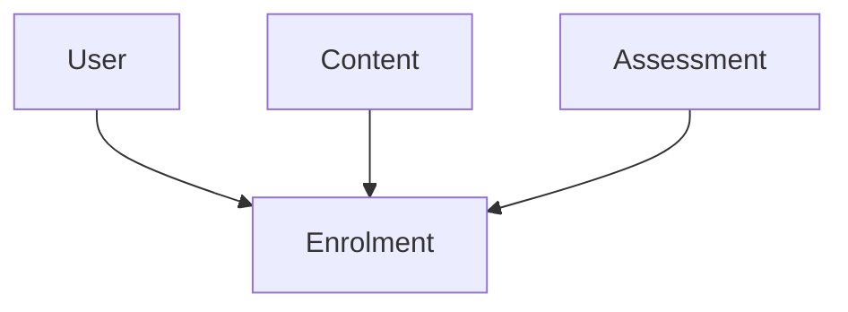
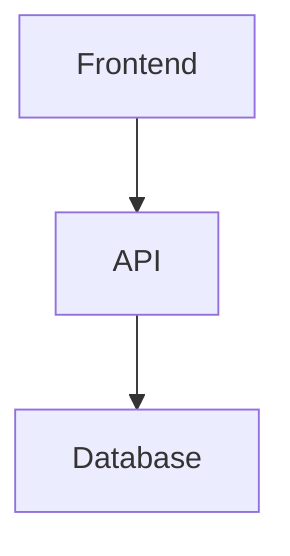
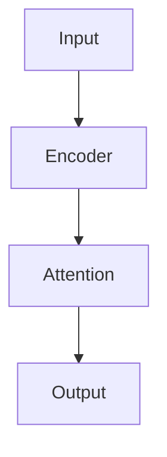

                 


# 构建AI驱动的企业学习管理系统(LMS)

## 关键词：AI驱动、企业学习管理、LMS、个性化学习、推荐算法、系统架构设计

## 摘要：  
随着人工智能技术的快速发展，企业学习管理系统（Learning Management System, LMS）正在经历一场深刻的变革。传统的LMS依赖于人工管理和简单的规则引擎，难以满足现代企业对个性化学习、智能化管理的需求。本文将深入探讨如何利用人工智能技术构建一个智能化的企业学习管理系统，从系统设计、算法实现到实际应用，全面解析AI驱动的LMS的核心原理和实现方法。通过结合机器学习、自然语言处理和推荐算法等技术，本文将为企业构建智能化、个性化的学习管理系统提供理论基础和实践指导。

---

# 第一部分: 背景与核心概念

# 第1章: 企业学习管理系统(LMS)概述

## 1.1 什么是企业学习管理系统

### 1.1.1 LMS的定义与核心功能  
企业学习管理系统（LMS）是一种用于管理、监控和评估员工学习过程的软件系统。它通常包括以下核心功能：  
1. 用户管理：支持多角色（如管理员、教师、学员）的创建、权限分配和管理。  
2. 内容管理：支持课程内容的上传、分类和管理，包括文档、视频、测试等多种形式。  
3. 学习路径推荐：基于用户的学习需求和能力水平，推荐个性化的学习路径。  
4. 学习效果评估：通过测试、评分等方式，评估用户的学习效果并生成报告。  

### 1.1.2 LMS的描述  
传统的LMS主要依赖于规则引擎和简单的条件判断来实现基本的流程管理，但随着企业对学习效率和个性化需求的提高，这种基于规则的系统已难以满足复杂的学习场景需求。  

### 1.1.3 为什么需要AI驱动的LMS  
AI技术的引入，使得LMS能够实现以下功能：  
- **个性化学习推荐**：基于用户的学习历史、兴趣和能力，推荐最优的学习内容和路径。  
- **智能评估与反馈**：利用自然语言处理和机器学习技术，实时评估学习效果并提供反馈。  
- **动态调整学习计划**：根据用户的学习进度和效果，动态调整学习计划和目标。  

### 1.1.4 系统的边界与外延  
AI驱动的LMS不仅是一个学习平台，更是一个智能化的知识管理与应用系统。其边界包括用户界面、学习内容、算法引擎和数据存储，而其外延则涉及企业培训、知识管理、绩效评估等多个领域。  

---

## 1.2 AI驱动的LMS的背景与趋势  

### 1.2.1 传统LMS的局限性  
传统LMS主要依赖人工管理和简单的规则引擎，存在以下问题：  
- **缺乏个性化**：无法根据用户的需求和能力提供个性化的学习路径。  
- **学习效果评估单一**：主要依赖测试和评分，难以全面评估学习效果。  
- **内容管理复杂**：缺乏对学习内容的深度理解和自动分类能力。  

### 1.2.2 AI技术如何赋能LMS  
AI技术的引入，使得LMS能够实现以下功能：  
- **数据驱动的个性化推荐**：利用机器学习算法，分析用户行为和数据，推荐个性化学习内容。  
- **自然语言处理应用**：通过NLP技术，实现对学习内容的理解和分类，支持智能搜索和内容推荐。  
- **智能评估与反馈**：利用深度学习模型，对学习效果进行多维度评估，并提供实时反馈。  

### 1.2.3 企业学习管理的未来趋势  
随着AI技术的不断进步，未来的LMS将更加智能化和个性化。企业将更加注重数据驱动的决策和动态调整的学习计划，学习管理系统将成为企业知识管理和人才培养的核心工具。  

---

## 1.3 本章小结  

本章从LMS的基本概念出发，分析了传统LMS的局限性和AI驱动LMS的优势。通过对比，明确了AI技术在LMS中的重要作用，并展望了未来企业学习管理的发展趋势。

---

# 第二部分: 核心概念与系统架构

# 第2章: AI驱动的LMS核心概念  

## 2.1 AI与LMS的结合方式  

### 2.1.1 数据驱动的个性化学习  
通过收集和分析用户的学习数据，系统能够实时调整学习路径和内容推荐策略。例如，利用协同过滤算法，系统可以根据用户的兴趣和学习习惯推荐相关课程。  

### 2.1.2 自然语言处理在学习内容中的应用  
通过NLP技术，系统可以对学习内容进行深度理解和分类。例如，利用文本摘要和关键词提取技术，系统可以快速生成课程大纲和知识点索引。  

### 2.1.3 机器学习在学习效果评估中的应用  
通过机器学习模型，系统可以对学习效果进行多维度评估。例如，利用情感分析技术，系统可以评估用户对课程的满意度，并根据反馈优化课程内容。  

---

## 2.2 系统核心要素与关系  

### 2.2.1 用户角色与权限  
AI驱动的LMS通常包含以下用户角色：  
1. **管理员**：负责系统配置、权限管理以及课程内容的审核。  
2. **教师**：负责课程设计、内容上传和教学管理。  
3. **学员**：通过系统进行课程学习、测试和知识巩固。  

### 2.2.2 学习内容的结构化表示  
学习内容需要进行结构化表示，以便系统能够进行智能推荐和动态调整。例如，课程可以被分解为多个知识点，每个知识点可以有多个学习资源和测试题。  

### 2.2.3 学习效果的量化评估  
学习效果需要进行量化评估，以便系统能够实时调整学习计划。例如，通过评分系统和学习曲线分析，系统可以评估用户的学习进度和效果，并动态调整学习内容。  

---

## 2.3 核心概念关系图  

### 2.3.1 ER实体关系图  
以下是一个简化的ER实体关系图：  


---

# 第3章: 系统架构设计  

## 3.1 系统功能模块划分  

### 3.1.1 用户管理模块  
- 用户注册与登录  
- 权限管理  
- 用户信息管理  

### 3.1.2 内容管理模块  
- 课程上传与分类  
- 知识点提取与标签化  
- 内容推荐  

### 3.1.3 学习路径推荐模块  
- 用户画像构建  
- 个性化推荐算法  
- 推荐结果展示  

### 3.1.4 学习效果评估模块  
- 学习进度跟踪  
- 学习效果分析  
- 反馈与优化  

---

## 3.2 系统架构设计  

### 3.2.1 分层架构设计  
以下是一个典型的分层架构设计：  


---

## 3.3 接口设计与交互流程  

### 3.3.1 用户登录注册流程  
- 用户通过前端界面提交注册信息。  
- 系统验证信息并生成用户账户。  
- 用户登录系统并获得访问令牌。  

### 3.3.2 学习内容推荐流程  
- 用户登录系统后，系统会根据用户的学习历史和兴趣推荐相关课程。  
- 用户选择感兴趣的课程，系统会根据推荐算法生成学习计划。  

### 3.3.3 学习效果反馈流程  
- 用户完成课程学习后，系统会自动评估学习效果并生成反馈报告。  
- 用户可以根据反馈报告调整学习计划。  

---

# 第三部分: 算法原理与实现  

# 第4章: 个性化学习推荐算法  

## 4.1 基于协同过滤的推荐算法  

### 4.1.1 协同过滤的基本原理  
协同过滤是一种基于用户相似性推荐算法，分为基于用户的协同过滤和基于物品的协同过滤。  

### 4.1.2 基于用户的协同过滤实现  
以下是一个简单的协同过滤算法实现示例：  
```python
def collaborative_filtering(user_matrix, item_matrix):
    # 计算用户相似度
    user_similarity = user_matrix.T.dot(user_matrix)
    # 生成推荐
    recommendation = user_similarity * item_matrix
    return recommendation
```

### 4.1.3 基于物品的协同过滤实现  
基于物品的协同过滤算法通常用于数据稀疏性较高的场景，其核心思想是找到与目标物品相似的其他物品，并将它们的评分加权平均作为推荐结果。  

---

## 4.2 基于深度学习的推荐算法  

### 4.2.1 基于神经网络的推荐模型  
深度学习推荐模型通常基于神经网络，例如多层感知机（MLP）和注意力机制（Attention）。  

### 4.2.2 基于Transformer的序列推荐模型  
Transformer模型在自然语言处理领域表现出色，也可以应用于推荐系统。以下是一个简化的Transformer模型结构：  


---

## 4.3 算法实现代码示例  

### 4.3.1 协同过滤算法实现  
```python
import numpy as np

def collaborative_filtering(user_matrix, item_matrix):
    # 计算用户相似度矩阵
    user_similarity = np.dot(user_matrix, user_matrix.T)
    # 生成推荐结果
    recommendation = np.dot(user_similarity, item_matrix)
    return recommendation
```

### 4.3.2 基于深度学习的推荐模型实现  
```python
import tensorflow as tf

def deep_learning_recommender(input_shape):
    model = tf.keras.Sequential()
    model.add(tf.keras.layers.Dense(64, activation='relu', input_shape=input_shape))
    model.add(tf.keras.layers.Dense(1, activation='sigmoid'))
    model.compile(optimizer='adam', loss='binary_crossentropy', metrics=['accuracy'])
    return model
```

---

## 4.4 算法原理的数学模型和公式  

### 4.4.1 协同过滤的数学模型  
协同过滤的相似度计算通常使用余弦相似度：  
$$ \text{similarity}(u_i, u_j) = \frac{\sum_{k=1}^n u_i(k) \cdot u_j(k)}{\sqrt{\sum_{k=1}^n u_i(k)^2} \cdot \sqrt{\sum_{k=1}^n u_j(k)^2}} $$  

### 4.4.2 深度学习推荐模型的数学模型  
深度学习推荐模型通常使用多层感知机（MLP）进行特征变换：  
$$ h = \sigma(W_1 x + b_1) $$  
$$ y = W_2 h + b_2 $$  
其中，$\sigma$ 是激活函数，通常使用ReLU或Sigmoid。  

---

## 4.5 算法实现的注意事项  

在实际应用中，推荐算法的效果依赖于数据质量和算法调优。以下是一些注意事项：  
1. **数据预处理**：确保数据的干净性和一致性。  
2. **模型调优**：通过交叉验证和网格搜索优化模型参数。  
3. **实时性优化**：在大规模数据场景下，需要考虑算法的实时性和可扩展性。  

---

# 第四部分: 项目实战  

## 5.1 项目环境安装  

### 5.1.1 安装Python环境  
建议使用Anaconda或Miniconda来管理Python环境。  

### 5.1.2 安装依赖库  
```bash
pip install numpy pandas scikit-learn tensorflow
```

---

## 5.2 核心代码实现  

### 5.2.1 协同过滤推荐算法实现  
```python
import numpy as np

def collaborative_filtering(user_matrix, item_matrix):
    # 计算用户相似度矩阵
    user_similarity = np.dot(user_matrix, user_matrix.T)
    # 生成推荐结果
    recommendation = np.dot(user_similarity, item_matrix)
    return recommendation

# 示例数据
user_matrix = np.array([[1, 0, 1], [0, 1, 1], [1, 1, 0]])
item_matrix = np.array([[1, 0, 1], [0, 1, 1], [1, 1, 0]])

# 调用函数
recommendation = collaborative_filtering(user_matrix, item_matrix)
print(recommendation)
```

---

## 5.3 项目案例分析  

### 5.3.1 案例背景  
假设某企业有1000名员工，每人需要学习5门课程。系统需要根据员工的学习需求和能力推荐个性化课程。  

### 5.3.2 案例实现  
以下是推荐算法的具体实现步骤：  
1. 收集员工的学习数据，包括学习时间、考试成绩、学习兴趣等。  
2. 使用协同过滤算法生成推荐结果。  
3. 根据推荐结果生成个性化学习计划。  

---

## 5.4 项目小结  

通过本章的项目实战，读者可以掌握AI驱动LMS的核心算法实现和项目开发流程。在实际应用中，需要根据具体需求选择合适的算法，并进行优化和调整。

---

# 第五部分: 最佳实践与总结  

## 6.1 最佳实践  

### 6.1.1 数据质量管理  
确保数据的完整性和一致性，是AI驱动LMS成功的关键。  

### 6.1.2 算法调优  
通过交叉验证和网格搜索优化模型参数，提高推荐算法的准确性和效率。  

### 6.1.3 系统可扩展性设计  
在系统设计阶段，需要考虑未来的扩展性和可维护性，例如采用微服务架构和模块化设计。  

---

## 6.2 小结  

AI驱动的LMS不仅是一种技术工具，更是一种企业知识管理和人才培养的核心能力。通过本文的系统设计和算法实现，读者可以掌握构建智能化企业学习管理系统的完整方法。

---

## 6.3 注意事项  

在实际应用中，需要注意以下几点：  
1. **数据隐私保护**：确保用户数据的安全性和隐私性。  
2. **系统性能优化**：在大规模数据场景下，需要优化算法的效率和系统的响应速度。  
3. **用户体验设计**：在设计用户界面和交互流程时，需要注重用户体验，确保系统的易用性和友好性。  

---

## 6.4 拓展阅读  

1. 《机器学习实战》  
2. 《深度学习入门：基于Python的理论与实现》  
3. 《自然语言处理入门：基于Python和TensorFlow》  

---

# 结语  

通过本文的系统设计和算法实现，读者可以掌握构建AI驱动的企业学习管理系统的完整方法。未来，随着AI技术的不断进步，LMS将变得更加智能化和个性化，为企业提供更加高效和精准的知识管理与培训支持。

---

## 作者：AI天才研究院/AI Genius Institute & 禅与计算机程序设计艺术 /Zen And The Art of Computer Programming  

---

以上是完整的文章大纲内容，希望对您有所帮助！

