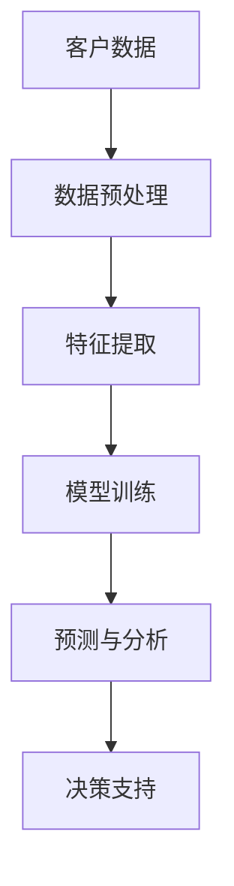
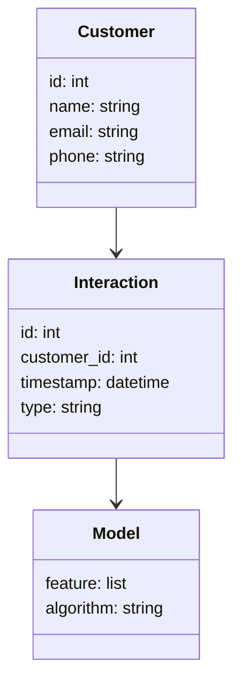

                 


# 构建AI驱动的企业客户关系管理(CRM)系统

> 关键词：AI驱动，CRM系统，客户关系管理，数据挖掘，机器学习

> 摘要：本文将详细探讨如何构建一个基于AI驱动的企业客户关系管理（CRM）系统。通过分析传统CRM系统的局限性，结合人工智能技术的特点，提出一种全新的CRM系统架构。本文将从系统背景、核心概念、算法原理、系统设计、项目实战等多个维度展开讨论，详细阐述AI如何赋能CRM系统的各个模块，包括客户画像、预测分析、智能推荐等核心功能。同时，本文将通过具体案例分析，展示AI驱动CRM系统的实际应用效果，并总结最佳实践和未来发展方向。

---

# 第1章: 背景介绍

## 1.1 问题背景

### 1.1.1 传统CRM系统的局限性
传统CRM系统主要依赖人工录入和管理客户信息，存在以下问题：
- 数据分散：客户信息分布在多个系统中，难以统一管理。
- 管理复杂：人工操作效率低，容易出错。
- 个性化不足：难以根据客户需求提供个性化服务。

### 1.1.2 AI技术对企业CRM的变革作用
人工智能技术的引入，为CRM系统带来了革命性的变化：
- 数据驱动决策：通过机器学习和数据挖掘，CRM系统可以自动分析客户行为，预测客户需求。
- 智能交互：自然语言处理技术使得系统能够与客户进行智能对话，提供个性化服务。
- 自动化管理：AI可以自动处理客户信息，优化客户服务流程。

### 1.1.3 当前企业CRM系统的痛点分析
- 数据孤岛：企业内部数据分散在不同系统中，难以整合。
- 客户体验不足：传统CRM系统难以满足客户对个性化服务的需求。
- 决策滞后：缺乏实时数据分析，导致决策延迟。

## 1.2 问题描述

### 1.2.1 客户数据分散与管理复杂性
客户数据分散在多个系统中，导致管理复杂，难以形成统一的客户画像。

### 1.2.2 个性化服务与客户体验需求
客户期望获得个性化的服务体验，而传统CRM系统难以满足这一需求。

### 1.2.3 数据驱动的决策需求
企业需要通过数据分析来优化客户服务和业务决策，但传统CRM系统缺乏足够的数据处理能力。

## 1.3 问题解决

### 1.3.1 引入AI技术的核心目标
通过引入AI技术，实现客户数据的智能化管理，提升客户体验，优化业务决策。

### 1.3.2 AI驱动CRM系统的解决方案
- 数据整合：通过AI技术整合分散的客户数据，形成统一的客户画像。
- 智能推荐：基于机器学习算法，为客户提供个性化的推荐服务。
- 实时分析：通过AI实时分析客户行为，优化客户服务流程。

### 1.3.3 系统边界与外延
- 系统边界：AI驱动CRM系统主要处理客户数据的收集、分析和应用。
- 系统外延：系统可以与其他企业系统（如ERP、营销系统）进行集成，形成完整的业务生态。

## 1.4 核心概念与组成

### 1.4.1 系统核心要素分析
- **客户数据**：包括客户的基本信息、行为数据、交易记录等。
- **AI算法**：包括机器学习、自然语言处理等技术，用于数据分析和预测。
- **客户画像**：基于AI算法生成的客户画像，用于个性化服务和精准营销。

### 1.4.2 系统功能模块划分
- 数据采集模块：负责收集客户数据。
- 数据处理模块：对数据进行清洗和预处理。
- 数据分析模块：基于AI算法分析数据，生成客户画像和预测结果。
- 服务模块：根据分析结果，提供个性化服务。

### 1.4.3 系统架构的初步设想
- **前端**：用户界面，供客户和员工使用。
- **后端**：AI算法处理数据，生成分析结果。
- **数据库**：存储客户数据和分析结果。

## 1.5 本章小结
本章介绍了传统CRM系统的局限性，分析了AI技术对企业CRM的变革作用，并提出了AI驱动CRM系统的解决方案和初步架构设计。

---

# 第2章: AI驱动CRM的核心概念与联系

## 2.1 AI与CRM的结合

### 2.1.1 AI在CRM中的应用场景
- **客户画像**：通过机器学习算法分析客户行为数据，生成客户画像。
- **智能推荐**：基于客户画像，推荐个性化的产品和服务。
- **智能客服**：通过自然语言处理技术，实现智能对话和问题解决。

### 2.1.2 数据挖掘与客户画像
- **数据挖掘**：从海量数据中提取有价值的信息，用于客户画像的生成。
- **客户画像**：通过聚类分析和分类算法，将客户分为不同的群体，制定针对性的营销策略。

### 2.1.3 自然语言处理在客户交互中的应用
- **智能对话**：通过自然语言处理技术，实现与客户的智能对话。
- **情感分析**：分析客户反馈，了解客户情感倾向，优化客户服务。

## 2.2 核心概念对比分析

### 2.2.1 CRM与传统数据库的区别
| 特性      | CRM系统              | 传统数据库          |
|-----------|----------------------|--------------------|
| 数据类型  | 结构化与非结构化数据 | 结构化数据          |
| 功能      | 客户关系管理          | 数据存储与检索      |
| 应用场景  | 企业客户管理          | 数据分析与应用      |

### 2.2.2 AI驱动CRM与传统CRM的对比
| 特性                | 传统CRM              | AI驱动CRM          |
|---------------------|----------------------|--------------------|
| 数据处理能力        | 依赖人工录入          | 自动化数据处理      |
| 客户画像            | 简单的客户信息记录    | 细致的客户画像      |
| 个性化服务          | 基于规则的推荐        | 基于算法的个性化推荐 |

### 2.2.3 数据驱动与规则驱动的差异
- **数据驱动**：通过数据分析和机器学习，生成决策规则。
- **规则驱动**：基于预定义的规则，进行决策。

## 2.3 系统架构图



## 2.4 实体关系图

```mermaid
entity Customer {
    id: int
    name: string
    email: string
    phone: string
}
entity Interaction {
    id: int
    customer_id: int
    timestamp: datetime
    type: string
}
```

## 2.5 本章小结
本章详细阐述了AI与CRM的结合方式，分析了核心概念之间的联系，并通过图表展示了系统架构和实体关系。

---

# 第3章: 算法原理

## 3.1 算法原理概述

### 3.1.1 决策树算法
- **决策树**：通过特征选择和分裂，生成树状结构，用于分类和回归。
- **数学公式**：熵和信息增益。
  $$ entropy = -\sum_{i=1}^{n} p_i \log p_i $$
  $$ information\_gain = entropy(parent) - \sum_{j=1}^{k} \frac{count_j}{count} \times entropy(child_j) $$

### 3.1.2 随机森林算法
- **随机森林**：通过集成多个决策树，提高模型的准确性和鲁棒性。
- **数学公式**：无，但可以通过投票或加权的方式生成最终结果。

## 3.2 算法实现

### 3.2.1 决策树实现
```python
class Node:
    def __init__(self, feature=None, threshold=None, left=None, right=None):
        self.feature = feature
        self.threshold = threshold
        self.left = left
        self.right = right

class DecisionTree:
    def __init__(self, max_depth=None):
        self.max_depth = max_depth
        self.tree = None

    def fit(self, X, y):
        self.tree = self._build_tree(X, y, 0)
        return self

    def _build_tree(self, X, y, depth):
        # 特征选择
        n_features = X.shape[1]
        max_info_gain = -float('inf')
        best_feature = None
        best_threshold = None

        for feature in range(n_features):
            feature_values = X[:, feature]
            possible_thresholds = sorted(list(set(feature_values)))
            for threshold in possible_thresholds:
                left = X[feature_values <= threshold]
                right = X[feature_values > threshold]
                current_info_gain = self._calculate_info_gain(y, left, right)
                if current_info_gain > max_info_gain:
                    max_info_gain = current_info_gain
                    best_feature = feature
                    best_threshold = threshold

        if max_info_gain == 0:
            return self._leaf_node(y)

        node = Node(feature=best_feature, threshold=best_threshold)
        node.left = self._build_tree(X[left], y[left], depth+1)
        node.right = self._build_tree(X[right], y[right], depth+1)

        return node

    def _calculate_info_gain(self, y, left_y, right_y):
        # 熵的计算
        def entropy(y):
            p = len(y[y == 1]) / len(y)
            return -p * np.log2(p) - (1 - p) * np.log2(1 - p)

        total = len(y)
        p_left = len(left_y) / total
        p_right = len(right_y) / total
        entropy_parent = entropy(y)
        entropy_child = p_left * entropy(left_y) + p_right * entropy(right_y)
        info_gain = entropy_parent - entropy_child
        return info_gain

    def _leaf_node(self, y):
        # 叶子节点，返回多数类
        return Node()
```

### 3.2.2 随机森林实现
```python
from sklearn.ensemble import RandomForestClassifier
from sklearn.datasets import make_classification
from sklearn.metrics import accuracy_score

X, y = make_classification(n_samples=1000, n_features=4, n_classes=2, random_state=0)
clf = RandomForestClassifier(n_estimators=100, max_depth=2, random_state=0)
clf.fit(X, y)
print("Accuracy:", accuracy_score(y, clf.predict(X)))
```

## 3.3 算法实现分析
- **决策树**：适合中小规模数据，易于解释。
- **随机森林**：适合大规模数据，具有高准确性和鲁棒性。

## 3.4 本章小结
本章详细介绍了决策树和随机森林算法的原理和实现方式，并通过代码示例展示了算法的应用。

---

# 第4章: 系统分析与架构设计

## 4.1 问题场景介绍

### 4.1.1 项目介绍
- **项目目标**：构建一个基于AI的CRM系统，实现客户画像、预测分析和智能推荐功能。
- **项目范围**：涵盖客户数据采集、分析和应用三个阶段。

## 4.2 系统功能设计

### 4.2.1 领域模型


### 4.2.2 系统架构设计


### 4.2.3 系统接口设计
- **API接口**：
  - `/api/customer/add`: 添加客户信息
  - `/api/customer/update`: 更新客户信息
  - `/api/predict/risk`: 预测客户流失风险

### 4.2.4 系统交互设计
```mermaid
sequenceDiagram
    Customer sends request to Backend
    Backend processes request
    Backend queries Database
    Backend gets response from Database
    Backend sends response to Customer
```

## 4.3 系统实现

### 4.3.1 环境安装
- **Python**：3.8+
- **依赖库**：scikit-learn, pandas, numpy

### 4.3.2 核心代码实现
```python
from sklearn.ensemble import RandomForestClassifier
from sklearn.metrics import accuracy_score
import pandas as pd
import numpy as np

# 数据加载
data = pd.read_csv('customer.csv')

# 数据预处理
X = data.drop('target', axis=1)
y = data['target']

# 模型训练
model = RandomForestClassifier()
model.fit(X, y)

# 模型预测
y_pred = model.predict(X)
print("Accuracy:", accuracy_score(y, y_pred))
```

## 4.4 系统实现分析
- **数据预处理**：清洗和特征提取是关键步骤。
- **模型训练**：选择合适的算法和参数，优化模型性能。

## 4.5 本章小结
本章详细介绍了系统功能设计、架构设计和接口设计，并通过代码示例展示了系统的实现过程。

---

# 第5章: 项目实战

## 5.1 环境安装

### 5.1.1 安装Python和依赖库
```bash
pip install scikit-learn pandas numpy
```

## 5.2 核心代码实现

### 5.2.1 客户画像生成
```python
from sklearn.decomposition import PCA
import pandas as pd
import numpy as np

# 数据加载
data = pd.read_csv('customer.csv')

# 数据预处理
X = data.drop('target', axis=1)
y = data['target']

# PCA降维
pca = PCA(n_components=2)
X_pca = pca.fit_transform(X)

# 可视化
import matplotlib.pyplot as plt

plt.scatter(X_pca[y == 0][:, 0], X_pca[y == 0][:, 1], c='r', label='Class 0')
plt.scatter(X_pca[y == 1][:, 0], X_pca[y == 1][:, 1], c='b', label='Class 1')
plt.xlabel('Principal Component 1')
plt.ylabel('Principal Component 2')
plt.legend()
plt.show()
```

### 5.2.2 预测分析
```python
from sklearn.ensemble import RandomForestClassifier
from sklearn.metrics import accuracy_score
import pandas as pd
import numpy as np

# 数据加载
data = pd.read_csv('customer.csv')

# 数据预处理
X = data.drop('target', axis=1)
y = data['target']

# 模型训练
model = RandomForestClassifier()
model.fit(X, y)

# 模型预测
y_pred = model.predict(X)
print("Accuracy:", accuracy_score(y, y_pred))
```

## 5.3 实际案例分析

### 5.3.1 案例介绍
- **项目目标**：通过AI驱动CRM系统，提升客户满意度和销售额。
- **数据来源**：某电商平台的客户数据。

### 5.3.2 案例分析
- **客户画像**：通过PCA降维，将客户分为不同的群体。
- **预测分析**：通过随机森林算法，预测客户流失风险。

## 5.4 本章小结
本章通过实际案例展示了AI驱动CRM系统的应用，详细介绍了项目实战的过程和结果。

---

# 第6章: 最佳实践与总结

## 6.1 最佳实践

### 6.1.1 数据隐私保护
- **数据加密**：对敏感数据进行加密处理。
- **访问控制**：限制数据访问权限。

### 6.1.2 模型调优
- **特征选择**：选择合适的特征，优化模型性能。
- **参数调整**：通过网格搜索，找到最佳模型参数。

### 6.1.3 持续学习
- **在线学习**：实时更新模型，适应数据变化。
- **模型评估**：定期评估模型性能，优化模型结构。

## 6.2 总结

### 6.2.1 本文总结
本文详细探讨了AI驱动CRM系统的构建过程，从背景介绍到项目实战，全面分析了系统的各个方面。

### 6.2.2 未来展望
- **技术进步**：随着AI技术的发展，CRM系统将更加智能化和个性化。
- **应用场景**：AI驱动CRM系统将在更多领域得到应用，如金融、医疗等。

## 6.3 注意事项

### 6.3.1 数据质量
- 数据质量直接影响模型性能，需重视数据清洗和特征工程。

### 6.3.2 模型泛化能力
- 避免过拟合，确保模型在不同数据集上的表现一致。

### 6.3.3 业务需求
- 系统设计需紧密结合业务需求，避免技术驱动。

## 6.4 拓展阅读
- 《机器学习实战》
- 《数据挖掘导论》
- 《自然语言处理入门》

## 6.5 本章小结
本章总结了AI驱动CRM系统的最佳实践，并对未来的发展进行了展望。

---

# 作者：AI天才研究院/AI Genius Institute & 禅与计算机程序设计艺术 /Zen And The Art of Computer Programming

