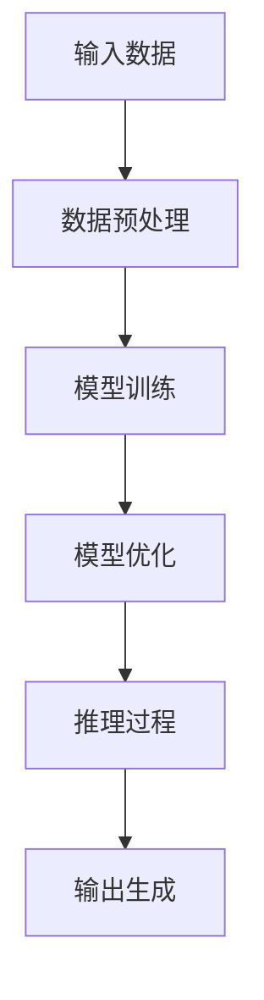
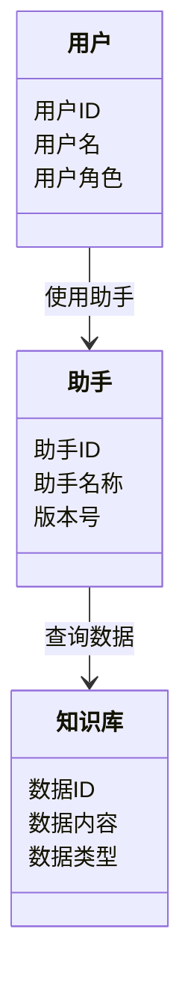
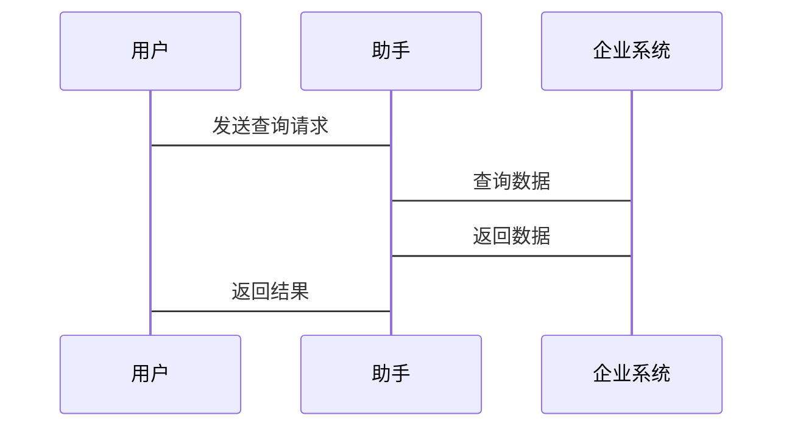

                 


# 《构建AI驱动的企业智能助手：从概念到落地》

**关键词：** AI驱动、企业智能助手、自然语言处理、机器学习、系统架构

**摘要：** 本文将详细介绍如何构建一个AI驱动的企业智能助手，从概念到落地，涵盖背景、核心概念、算法原理、系统架构、项目实战、应用案例和总结。通过逐步分析和详细讲解，帮助读者理解并掌握构建AI驱动企业智能助手的全过程。

---

# 第一部分: 背景与概念

## 第1章: AI驱动的企业智能助手背景介绍

### 1.1 问题背景与描述

#### 1.1.1 传统企业助手的局限性

传统的企业助手通常依赖于固定的规则和预定义的流程，难以应对复杂多变的业务场景。例如，当遇到未预料到的用户需求或系统故障时，传统助手往往无法提供有效的解决方案，导致用户体验下降。

#### 1.1.2 AI技术对企业助手的变革

AI技术，特别是自然语言处理（NLP）和机器学习（ML）的进步，为企业的智能助手带来了革命性的变化。通过深度学习模型，企业助手能够理解用户的意图、上下文和情感，从而提供更智能、更个性化的服务。

#### 1.1.3 当前企业智能助手的发展现状

目前，许多企业已经在使用AI驱动的智能助手，如微软的Cortana、IBM的Watson、Salesforce的Einstein等。这些系统能够处理复杂的查询、自动化任务和提供数据驱动的建议，显著提升了企业的效率和决策能力。

### 1.2 问题解决与边界

#### 1.2.1 AI驱动的企业智能助手的核心目标

AI驱动的企业智能助手的核心目标是通过自然语言处理和机器学习技术，为企业用户提供智能化的交互体验，帮助用户完成信息检索、任务处理、数据分析等任务，并提供实时反馈和建议。

#### 1.2.2 边界与外延

AI驱动的企业智能助手的边界在于其功能和数据处理能力。例如，它不能直接操作企业的核心业务系统（如ERP或CRM），但可以通过调用API与这些系统集成，提供更高级的自动化服务。外延则包括与企业知识库的整合、多语言支持以及跨平台的兼容性。

#### 1.2.3 核心要素与组成结构

AI驱动的企业智能助手的核心要素包括：

1. **自然语言理解（NLU）：** 理解用户的输入，提取意图和实体。
2. **对话管理（DM）：** 维护上下文，生成合理的回复。
3. **知识库：** 包含企业相关的数据和信息。
4. **推理引擎：** 根据上下文进行推理和决策。
5. **反馈机制：** 收集用户反馈，优化模型。

---

## 第2章: 核心概念与联系

### 2.1 核心概念原理

#### 2.1.1 AI驱动的定义与特征

AI驱动的企业智能助手依赖于深度学习模型，能够通过大量数据进行训练，具备自我学习和优化的能力。其主要特征包括：

- **智能化：** 能够理解和生成自然语言。
- **自适应：** 根据用户行为和反馈优化服务。
- **集成性：** 可与企业现有系统无缝集成。

#### 2.1.2 企业智能助手的功能模块

企业智能助手的功能模块包括：

1. **用户界面（UI）：** 提供交互界面，如聊天窗口。
2. **NLU模块：** 解析用户的输入。
3. **推理引擎：** 处理查询并生成响应。
4. **知识库：** 存储企业数据和信息。
5. **反馈机制：** 收集用户反馈，优化系统。

### 2.2 核心概念属性对比

以下是一个对比表格，展示了AI驱动的企业智能助手与传统规则驱动助手的主要区别：

| **特性**             | **AI驱动助手**                     | **规则驱动助手**                 |
|----------------------|-----------------------------------|---------------------------------|
| **理解能力**         | 支持复杂语义理解                 | 仅支持简单关键词匹配             |
| **学习能力**         | 可通过数据自我优化               | 无法学习，依赖人工规则             |
| **响应速度**         | 更快，基于模型推理               | 较慢，依赖预定义流程             |
| **灵活性**           | 高，能够应对未知场景             | 低，仅能处理预定义场景           |

### 2.3 ER实体关系图

以下是一个简单的ER实体关系图，展示了AI驱动的企业智能助手的主要实体及其关系：

```mermaid
erd
title AI助手实体关系图
entity 用户 {
  id 用户ID
  name 用户名
  role 用户角色
}
entity 助手 {
  id 助手ID
  name 助手名称
  version 版本号
}
entity 企业系统 {
  id 系统ID
  name 系统名称
  description 系统描述
}
用户 --> 助手
助手 --> 企业系统
```

---

# 第二部分: 算法原理

## 第3章: 算法原理讲解

### 3.1 大语言模型的训练流程

#### 3.1.1 数据预处理

数据预处理是模型训练的关键步骤，包括：

1. **清洗数据：** 去除噪音数据，如特殊符号、停用词等。
2. **分词：** 将文本分割成词语或短语。
3. **向量化：** 使用词嵌入模型（如Word2Vec）将文本转换为向量表示。

#### 3.1.2 模型训练

训练过程包括：

1. **选择模型架构：** 如Transformer、BERT等。
2. **定义损失函数：** 常用交叉熵损失函数。
3. **优化器选择：** 如Adam、SGD等。
4. **训练数据：** 使用大规模数据进行微调。

#### 3.1.3 调参与优化

调优包括：

1. **超参数调整：** 如学习率、批量大小等。
2. **模型评估：** 使用验证集评估模型性能。
3. **早停策略：** 防止过拟合。

### 3.2 推理过程

#### 3.2.1 输入处理

输入处理包括：

1. **分词：** 将用户输入分割成词语。
2. **向量化：** 将词语转换为向量表示。
3. **上下文理解：** 通过模型理解用户意图。

#### 3.2.2 模型推理

推理过程包括：

1. **生成候选答案：** 模型生成多个可能的回复。
2. **评分：** 根据相关性、逻辑性等标准对候选答案进行评分。
3. **选择最佳回复：** 选择得分最高的回复返回给用户。

#### 3.2.3 输出生成

输出生成包括：

1. **格式化回复：** 将模型生成的文本格式化为用户友好的形式。
2. **反馈收集：** 收集用户对回复的反馈，用于优化模型。

### 3.3 数学模型与公式

#### 3.3.1 损失函数

交叉熵损失函数的公式为：

$$ \text{损失函数} = -\sum_{i=1}^{n} y_i \log(p_i) + (1 - y_i) \log(1 - p_i) $$

其中，\( y_i \) 是真实标签，\( p_i \) 是模型预测的概率。

#### 3.3.2 概率分布

模型生成的候选答案的概率分布可以表示为：

$$ P(y|x) = \frac{\exp(s(x,y))}{\sum_{k} \exp(s(x,k))} $$

其中，\( s(x,y) \) 是模型对候选答案 \( y \) 的评分。

### 3.4 流程图

以下是大语言模型的训练和推理流程图：



---

## 第4章: 系统分析与架构设计

### 4.1 问题场景介绍

企业智能助手需要处理以下场景：

1. **信息查询：** 用户查询企业数据。
2. **任务处理：** 自动化执行任务。
3. **数据分析：** 提供数据驱动的建议。

### 4.2 项目介绍

本项目的目标是构建一个AI驱动的企业智能助手，能够处理以下功能：

1. **自然语言理解：** 理解用户的输入。
2. **知识库查询：** 查询企业知识库。
3. **任务自动化：** 执行预定义的任务。

### 4.3 系统功能设计

以下是系统功能的领域模型：



### 4.4 系统架构设计

以下是系统架构的分层架构图：


### 4.5 系统接口设计

以下是系统接口的序列图：



---

## 第5章: 项目实战

### 5.1 环境安装

安装所需的环境包括：

1. **Python 3.8+**
2. **TensorFlow/PyTorch**
3. **Jupyter Notebook**

### 5.2 核心代码实现

以下是核心代码实现：

```python
import tensorflow as tf
from tensorflow.keras.layers import Input, Dense, LSTM
from tensorflow.keras.models import Model

# 定义模型
input_layer = Input(shape=(max_length,))

lstm_layer = LSTM(128)(input_layer)
dense_layer = Dense(64, activation='relu')(lstm_layer)
output_layer = Dense(num_classes, activation='softmax')(dense_layer)

model = Model(inputs=input_layer, outputs=output_layer)
model.compile(optimizer='adam', loss='sparse_categorical_crossentropy', metrics=['accuracy'])
```

### 5.3 案例分析与详细解读

通过实际案例分析，我们可以看到AI驱动的企业智能助手在以下场景中的应用：

1. **客服支持：** 用户可以通过智能助手查询订单状态。
2. **销售预测：** 助手可以基于历史数据提供销售预测。
3. **数据分析：** 助手可以生成数据可视化报告。

---

## 第6章: 应用案例

### 6.1 智能客服

AI驱动的企业智能助手可以用于智能客服，帮助用户快速解决问题。

### 6.2 销售预测

通过分析销售数据，助手可以提供销售预测和建议。

### 6.3 数据分析

助手可以生成数据可视化报告，帮助企业管理者做出决策。

---

## 第7章: 总结与展望

### 7.1 总结

本文详细介绍了如何构建一个AI驱动的企业智能助手，从背景、核心概念、算法原理、系统架构到项目实战，全面覆盖了构建过程的各个方面。

### 7.2 展望

未来，AI驱动的企业智能助手将更加智能化和个性化，能够处理更复杂的任务，并与企业系统更加紧密地集成。

---

**作者：AI天才研究院 & 禅与计算机程序设计艺术**

---

以上是《构建AI驱动的企业智能助手：从概念到落地》的完整目录大纲和部分章节内容。如果您对某一部分感兴趣，可以继续深入阅读。

