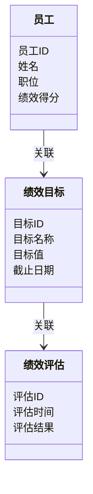
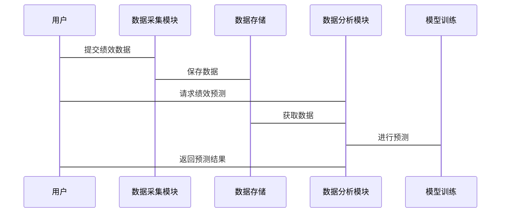

                 


# 构建AI驱动的企业绩效管理系统

> 关键词：企业绩效管理，人工智能，机器学习，算法，系统架构

> 摘要：随着企业数字化转型的深入推进，传统的绩效管理模式逐渐暴露出效率低下、数据处理复杂等弊端。本文旨在探讨如何利用人工智能技术构建一个高效、智能的企业绩效管理系统，通过详细分析系统的构建背景、核心概念、算法原理、系统架构以及实际案例，为读者提供一个全面的构建指南。

---

# 第一部分: AI驱动的企业绩效管理背景与概念

## 第1章: 企业绩效管理的数字化转型

### 1.1 企业绩效管理的背景与挑战

#### 1.1.1 传统企业绩效管理的局限性
传统的企业绩效管理（EPM）主要依赖于人工数据收集和分析，这种方式效率低下、耗时长，且容易受到主观因素的影响。此外，传统方法难以处理海量数据，难以满足现代企业对实时分析和决策的需求。

#### 1.1.2 数字化转型的必然性
随着企业数字化转型的推进，数据量的爆炸式增长和对实时决策的需求，使得传统绩效管理模式难以适应现代企业的复杂需求。引入AI技术，可以实现数据的自动化处理、预测和优化，提升管理效率和决策的准确性。

#### 1.1.3 AI技术在绩效管理中的应用前景
AI技术在绩效管理中的应用前景广阔，包括绩效预测、员工行为分析、目标设定优化等方面。AI可以帮助企业更好地理解员工表现，优化资源分配，提升整体绩效水平。

### 1.2 AI驱动的企业绩效管理的核心概念

#### 1.2.1 绩效管理的定义与目标
绩效管理是指通过设定目标、监控执行、评估结果和优化过程，以提升组织和个人绩效的管理活动。AI驱动的绩效管理通过自动化和智能化手段，实现绩效的实时监控和优化。

#### 1.2.2 AI驱动的绩效管理的特点
AI驱动的绩效管理具有数据驱动、实时性、个性化和自我优化的特点。通过AI技术，企业可以快速处理大量数据，实时监控绩效指标，并根据员工表现提供个性化的反馈和建议。

#### 1.2.3 企业绩效管理的边界与外延
企业绩效管理的边界包括企业内部的员工绩效、团队绩效和组织绩效。外延则涉及与绩效相关的外部因素，如市场环境、客户反馈等。

### 1.3 企业绩效管理的主体与客体分析

#### 1.3.1 绩效管理的主体构成
绩效管理的主体包括企业高层管理者、直线经理、HR部门以及员工本人。每个主体在绩效管理过程中扮演不同的角色，共同推动绩效目标的实现。

#### 1.3.2 绩效管理的客体特征
绩效管理的客体是员工的绩效表现，包括工作成果、工作能力和工作态度等方面。客体具有动态性、多维度和个体差异性的特点。

#### 1.3.3 主体与客体的交互关系
主体与客体之间是动态交互的关系。主体通过设定目标、监控执行、评估结果等方式影响客体（员工绩效），而客体（员工绩效）则通过反馈机制反过来影响主体的管理行为。

### 1.4 本章小结
本章主要介绍了AI驱动的企业绩效管理的背景、核心概念和主体与客体的交互关系。AI技术的应用使得绩效管理更加高效和精准，为企业的绩效提升提供了新的可能性。

---

# 第二部分: AI驱动的企业绩效管理核心概念与原理

## 第2章: 绩效管理模型与AI技术的结合

### 2.1 绩效管理模型的构建

#### 2.1.1 绩效管理模型的层次结构
绩效管理模型通常包括目标设定、监控执行、评估结果和优化改进四个层次。AI技术可以在这四个层次中发挥重要作用，实现自动化和智能化的管理。

#### 2.1.2 模型的输入与输出
模型的输入包括员工的基本信息、工作表现数据、团队协作数据等。输出则是个性化的绩效评估结果、目标优化建议和反馈报告。

#### 2.1.3 模型的评估与优化
通过不断收集和分析绩效数据，AI模型可以自动调整参数，优化模型的准确性。同时，可以通过反馈机制对模型进行持续改进。

### 2.2 AI技术在绩效管理中的应用

#### 2.2.1 机器学习在绩效预测中的应用
机器学习可以通过历史数据，预测员工的未来绩效表现。例如，使用线性回归模型预测员工的销售业绩。

#### 2.2.2 自然语言处理在绩效评估中的应用
自然语言处理技术可以分析员工的述职报告或工作总结，提取关键信息，辅助评估员工的工作表现。

#### 2.2.3 数据挖掘在绩效分析中的应用
数据挖掘技术可以发现隐藏在数据中的模式和趋势，帮助管理者识别绩效低下的原因，并提出改进措施。

### 2.3 绩效管理模型与AI技术的结合案例

#### 2.3.1 某企业绩效管理系统的AI应用实例
某企业通过引入AI技术，实现了员工绩效的实时监控和预测。系统可以根据员工的历史表现和当前任务，自动调整绩效目标，并提供个性化的反馈建议。

#### 2.3.2 案例分析与经验总结
通过该案例，可以发现AI技术在绩效管理中的应用可以显著提高管理效率，同时也能提升员工的满意度和绩效表现。

### 2.4 本章小结
本章重点介绍了绩效管理模型与AI技术的结合方式，通过实例分析展示了AI技术在绩效管理中的实际应用价值。

---

# 第三部分: AI驱动的企业绩效管理算法原理

## 第3章: 绩效预测的机器学习算法

### 3.1 线性回归算法

#### 3.1.1 线性回归的基本原理
线性回归是一种常用的回归分析方法，用于预测连续型变量。其基本假设是因变量与自变量之间存在线性关系。

#### 3.1.2 线性回归的数学模型
线性回归的数学模型可以表示为：
$$ y = \beta_0 + \beta_1x + \epsilon $$
其中，\( y \) 是因变量，\( x \) 是自变量，\( \beta_0 \) 是截距，\( \beta_1 \) 是回归系数，\( \epsilon \) 是误差项。

#### 3.1.3 算法实现与优化
线性回归可以通过最小二乘法进行参数估计，也可以通过正规方程求解。为了提高模型的泛化能力，通常会对数据进行标准化处理，并使用交叉验证选择最优模型。

### 3.2 支持向量机算法

#### 3.2.1 支持向量机的基本原理
支持向量机（SVM）是一种监督学习算法，主要用于分类和回归问题。其基本思想是通过找到一个超平面，使得数据点与超平面之间的距离最大化。

#### 3.2.2 支持向量机的数学模型
支持向量机的数学模型可以表示为：
$$ \text{minimize} \quad \frac{1}{2}\|w\|^2 + C\sum_{i=1}^n \xi_i $$
其中，\( w \) 是法向量，\( C \) 是惩罚参数，\( \xi_i \) 是松弛变量。

#### 3.2.3 算法实现与应用
支持向量机在处理非线性数据时，可以通过核函数将数据映射到高维空间，从而实现线性可分。在绩效管理中，可以用于员工绩效的分类评估。

### 3.3 随机森林算法

#### 3.3.1 随机森林的基本原理
随机森林是一种基于树的集成学习方法，通过构建多棵决策树并进行投票或平均，提高模型的准确性和鲁棒性。

#### 3.3.2 随机森林的数学模型
随机森林的数学模型可以通过集成多棵决策树的预测结果来提高模型的性能。具体来说，随机森林可以表示为：
$$ y = \text{sign}\left(\sum_{i=1}^n \text{tree}_i(x)\right) $$
其中，\( \text{tree}_i \) 表示第 \( i \) 棵决策树的预测结果。

#### 3.3.3 算法实现与优化
随机森林算法的关键在于随机选择特征和样本，以避免过拟合。同时，可以通过调整树的数量和深度来优化模型性能。

### 3.4 算法对比与选择

#### 3.4.1 不同算法的优缺点对比
| 算法 | 优点 | 缺点 |
|------|------|------|
| 线性回归 | 简单、易于解释 | 仅适用于线性关系 |
| 支持向量机 | 高精度、适用于非线性数据 | 参数敏感、计算复杂 |
| 随机森林 | 鲁棒性好、适用于高维数据 | 计算量大、不易解释 |

#### 3.4.2 算法选择的原则
在选择算法时，需要考虑数据的类型、数据量的大小、模型的解释性和计算资源等因素。对于绩效预测问题，随机森林和支持向量机通常是较好的选择。

### 3.5 本章小结
本章详细介绍了几种常用的机器学习算法，包括线性回归、支持向量机和随机森林，并通过对比分析帮助读者选择合适的算法。

---

# 第四部分: AI驱动的企业绩效管理系统架构与设计

## 第4章: 系统架构与设计

### 4.1 问题场景介绍
在企业绩效管理中，通常需要处理大量的数据，包括员工的基本信息、工作表现、团队协作等。这些数据需要实时更新和分析，以支持绩效评估和决策。

### 4.2 项目介绍
本项目旨在构建一个基于AI的企业绩效管理系统，实现绩效数据的自动化收集、分析和优化。系统包括数据采集模块、数据分析模块和决策支持模块。

### 4.3 系统功能设计

#### 4.3.1 领域模型设计
领域模型通过Mermaid类图展示系统的核心实体和它们之间的关系。例如：



#### 4.3.2 系统架构设计
系统架构设计通过Mermaid架构图展示系统的各个模块及其交互关系。例如：

```mermaid
container 数据存储 {
    数据库
}

container 数据处理 {
    数据清洗
    数据转换
}

container 模型训练 {
    特征工程
    模型训练
}

container 应用层 {
    绩效评估
    绩效预测
}

数据存储 --> 数据处理
数据处理 --> 模型训练
模型训练 --> 应用层
```

#### 4.3.3 系统接口设计
系统接口设计需要定义各模块之间的交互接口，例如：

- 数据采集模块提供API接口，接收来自各个渠道的绩效数据。
- 数据分析模块提供预测接口，根据输入的员工信息，返回绩效预测结果。

#### 4.3.4 系统交互设计
系统交互设计通过Mermaid序列图展示用户与系统的交互流程。例如：



### 4.5 本章小结
本章详细介绍了AI驱动的企业绩效管理系统的架构设计，包括系统功能模块、数据流设计和系统交互设计。通过合理的架构设计，可以实现系统的高效运行和功能扩展。

---

# 第五部分: 项目实战

## 第5章: 项目实战

### 5.1 环境搭建

#### 5.1.1 安装开发环境
需要安装Python、Jupyter Notebook、Pandas、Scikit-learn等工具。

#### 5.1.2 数据准备
收集员工的基本信息、工作表现数据、团队协作数据等。

### 5.2 核心代码实现

#### 5.2.1 数据清洗与预处理
```python
import pandas as pd

# 读取数据
df = pd.read_csv('performance_data.csv')

# 查看数据信息
print(df.info())

# 处理缺失值
df.dropna(inplace=True)

# 数据标准化
from sklearn.preprocessing import StandardScaler

scaler = StandardScaler()
scaled_data = scaler.fit_transform(df[['sales', 'attendance']])
```

#### 5.2.2 模型训练与优化
```python
from sklearn.model import LinearRegression
from sklearn.metrics import mean_squared_error

# 训练线性回归模型
model = LinearRegression()
model.fit(scaled_data, df['performance_score'])

# 预测结果
predicted = model.predict(scaled_data)

# 计算均方误差
mse = mean_squared_error(df['performance_score'], predicted)
print(f'均方误差: {mse}')
```

#### 5.2.3 系统部署与测试
将模型部署到云平台，通过API接口提供预测服务，并进行功能测试。

### 5.3 案例分析与详细讲解

#### 5.3.1 案例背景
某企业希望优化员工绩效评估流程，引入AI技术实现绩效预测和目标优化。

#### 5.3.2 实施步骤
1. 数据收集与清洗
2. 模型训练与优化
3. 系统部署与测试
4. 用户反馈与优化

#### 5.3.3 项目小结
通过本项目，读者可以掌握AI驱动的企业绩效管理系统的构建过程，从数据处理到模型训练，再到系统部署，实现一个完整的绩效管理解决方案。

---

# 第六部分: 总结与展望

## 第6章: 总结与展望

### 6.1 本章总结
本文详细探讨了AI驱动的企业绩效管理系统的构建过程，从背景分析到算法实现，再到系统设计和项目实战，为读者提供了一个全面的构建指南。

### 6.2 未来展望
随着AI技术的不断发展，企业绩效管理系统将更加智能化和个性化。未来的挑战包括如何处理更复杂的数据类型，如何提升模型的解释性，以及如何实现系统的实时性和动态性。

### 6.3 最佳实践 Tips

#### 6.3.1 数据质量的重要性
数据质量是系统性能的基础，必须确保数据的完整性、准确性和一致性。

#### 6.3.2 模型解释性的重要性
模型的解释性对于企业决策者来说至关重要，需要选择合适的方法来解释模型的输出。

#### 6.3.3 系统安全性的注意事项
在系统设计中，必须考虑数据的安全性，防止数据泄露和滥用。

### 6.4 本章小结
本文总结了AI驱动的企业绩效管理系统的构建过程，并展望了未来的发展方向，同时提供了一些实用的建议。

---

# 作者信息

作者：AI天才研究院/AI Genius Institute & 禅与计算机程序设计艺术/Zen And The Art of Computer Programming

---

# 结语

通过本文的详细讲解，读者可以全面了解如何构建一个AI驱动的企业绩效管理系统，从理论到实践，从算法到系统设计，为企业的数字化转型提供有力支持。

