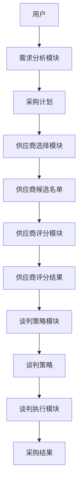
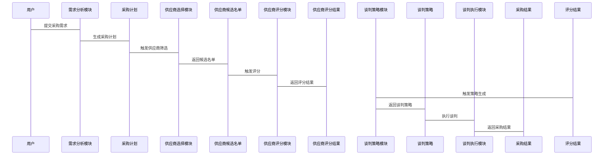

                 


# 构建AI驱动的采购助手：优化供应商选择与谈判

## 关键词：AI驱动采购助手、供应商选择、采购谈判、机器学习、自然语言处理

## 摘要：AI驱动的采购助手通过利用自然语言处理、机器学习和数据挖掘等技术，优化供应商选择和采购谈判过程。本文从采购流程的背景出发，详细探讨AI技术在采购中的应用，分析多目标优化算法和协同过滤推荐算法的实现原理，并结合系统架构设计和项目实战，提供了一套完整的AI驱动采购助手解决方案。

---

# 第一部分：AI驱动采购助手的背景与核心概念

## 第1章：AI驱动采购助手的背景与问题背景

### 1.1 采购管理的数字化转型

#### 1.1.1 传统采购流程的痛点与挑战

- **需求分析的复杂性**：采购需求多样化，涉及成本、质量、交货时间等多个维度。
- **供应商选择的困难性**：供应商数量多，资质复杂，难以快速筛选和评估。
- **谈判过程的不确定性**：谈判结果受主观因素影响大，缺乏数据支持。

#### 1.1.2 数字化采购的兴起

- **技术驱动**：大数据、AI等技术推动采购流程的数字化转型。
- **效率提升**：通过自动化和智能化工具，提高采购效率。
- **成本降低**：通过数据驱动决策，优化采购成本。

#### 1.1.3 AI驱动采购的必要性

- **数据处理能力**：AI能够快速处理海量数据，提供决策支持。
- **智能化推荐**：基于历史数据和机器学习模型，推荐最优供应商。
- **动态调整能力**：实时分析市场变化，优化采购策略。

### 1.2 供应商选择与谈判的核心问题

#### 1.2.1 供应商选择的复杂性

- **多目标优化**：供应商评估涉及成本、质量、交货时间等多个目标，需要权衡取舍。
- **信息不对称**：采购方和供应商之间的信息不透明，影响决策。

#### 1.2.2 谈判中的信息不对称

- **博弈论应用**：谈判过程可以看作是一个博弈过程，需要预测对方的策略。
- **情感分析**：通过分析供应商的语气和态度，判断其合作意愿。

#### 1.2.3 数据驱动决策的重要性

- **数据收集**：通过采购历史数据、供应商评价数据等，构建数据驱动的决策模型。
- **实时监控**：通过实时数据监控，优化采购策略。

### 1.3 AI技术在采购领域的应用潜力

#### 1.3.1 自然语言处理在供应商筛选中的应用

- **文本分类**：自动分类供应商文档，如合同、报价单等。
- **语义理解**：通过语义理解技术，提取供应商资质信息。

#### 1.3.2 机器学习在采购预测中的作用

- **回归分析**：预测采购成本、交货时间等关键指标。
- **聚类分析**：将供应商分为不同类别，便于管理和决策。

#### 1.3.3 数据挖掘在供应商分析中的价值

- **关联规则挖掘**：发现供应商之间的关联关系，优化采购策略。
- **时间序列分析**：分析采购历史数据，预测未来趋势。

## 第2章：采购流程中的关键环节与优化方向

### 2.1 采购需求分析

#### 2.1.1 需求识别与分类

- **需求识别**：通过分析企业需求，识别采购需求的类型和优先级。
- **需求分类**：将需求分为战略采购、战术采购等不同类别。

#### 2.1.2 需求优先级排序

- **优先级排序方法**：基于成本、质量、交货时间等指标，对需求进行排序。
- **动态调整**：根据市场变化和企业战略调整需求优先级。

#### 2.1.3 需求数据的采集与处理

- **数据采集**：通过问卷、访谈等方式采集需求数据。
- **数据清洗**：去除噪声数据，确保数据质量。

### 2.2 供应商选择与评估

#### 2.2.1 供应商资质与能力评估

- **资质评估**：评估供应商的资质，如营业执照、行业认证等。
- **能力评估**：评估供应商的技术能力和生产能力。

#### 2.2.2 供应商历史表现分析

- **历史数据分析**：分析供应商的历史交货记录、质量反馈等数据。
- **评分系统**：基于历史数据，对供应商进行评分。

#### 2.2.3 供应商风险评估

- **风险因素识别**：识别供应商可能面临的各种风险，如财务风险、合规风险等。
- **风险评估模型**：基于机器学习模型，评估供应商的风险等级。

### 2.3 谈判策略与执行

#### 2.3.1 谈判目标设定

- **目标分解**：将总体目标分解为具体可执行的目标。
- **目标优先级**：根据目标的重要性和实现难度，设定目标的优先级。

#### 2.3.2 谈判过程中的信息分析

- **信息收集**：收集供应商的报价、合同条款等信息。
- **信息分析**：分析供应商的报价结构，判断其合理性。

#### 2.3.3 谈判结果的评估与优化

- **结果评估**：评估谈判结果是否达到预期目标。
- **优化策略**：根据评估结果，优化谈判策略，提高谈判成功率。

## 第3章：AI驱动采购的核心技术与实现原理

### 3.1 自然语言处理在采购中的应用

#### 3.1.1 文本分类与信息提取

- **文本分类**：将供应商文档分类为不同类别，如合同、报价单等。
- **信息提取**：从文本中提取关键信息，如供应商名称、地址、联系方式等。

#### 3.1.2 语义理解与意图识别

- **语义理解**：理解供应商文档中的语义，提取关键信息。
- **意图识别**：识别供应商的意图，如报价、请求修改合同等。

#### 3.1.3 基于NLP的供应商信息分析

- **供应商资质分析**：通过NLP技术分析供应商的资质信息，判断其是否符合采购要求。
- **供应商能力分析**：通过NLP技术分析供应商的历史评价和反馈，评估其能力。

### 3.2 机器学习在采购决策中的应用

#### 3.2.1 监督学习与分类算法

- **监督学习**：基于标注数据，训练分类模型，识别供应商的类型。
- **分类算法**：使用决策树、随机森林等算法，对供应商进行分类。

#### 3.2.2 聚类分析与供应商分组

- **聚类分析**：将供应商分为不同组别，便于管理和决策。
- **供应商分组**：根据供应商的特征，将其分为战略供应商、普通供应商等组别。

#### 3.2.3 回归分析与采购成本预测

- **回归分析**：基于历史数据，预测采购成本。
- **采购成本预测**：根据市场变化和供应商情况，预测未来采购成本。

### 3.3 数据挖掘与分析技术

#### 3.3.1 数据清洗与预处理

- **数据清洗**：去除噪声数据，确保数据质量。
- **数据预处理**：对数据进行标准化、归一化等处理，为后续分析做准备。

#### 3.3.2 关联规则挖掘与供应商推荐

- **关联规则挖掘**：发现供应商之间的关联关系，优化采购策略。
- **供应商推荐**：基于关联规则，推荐最优供应商。

#### 3.3.3 时间序列分析与采购趋势预测

- **时间序列分析**：分析采购历史数据，预测未来趋势。
- **趋势预测**：根据历史数据，预测未来采购需求和供应商表现。

## 第4章：供应商选择的多目标优化算法

### 4.1 多目标优化问题的定义

#### 4.1.1 优化目标的设定

- **目标设定**：设定供应商选择的优化目标，如最低成本、最高质量、最短交货时间等。
- **目标权重**：根据企业战略和采购需求，设定各目标的权重。

#### 4.1.2 目标权重的确定

- **权重确定方法**：使用层次分析法（AHP）等方法，确定各目标的权重。
- **权重调整**：根据实际情况，动态调整目标权重。

#### 4.1.3 优化约束条件

- **约束条件设定**：设定供应商选择的约束条件，如供应商资质、交货时间等。
- **约束优化**：通过优化算法，找到最优解。

### 4.2 基于机器学习的供应商评分模型

#### 4.2.1 数据特征提取

- **特征选择**：选择影响供应商评分的关键特征，如历史交货记录、质量反馈等。
- **特征工程**：对特征进行处理，如标准化、归一化等。

#### 4.2.2 模型训练与调优

- **模型选择**：选择合适的机器学习模型，如随机森林、支持向量机等。
- **模型调优**：通过网格搜索等方法，优化模型参数，提高模型性能。

#### 4.2.3 模型评估与验证

- **评估指标**：使用准确率、召回率、F1分数等指标评估模型性能。
- **交叉验证**：通过交叉验证，评估模型的泛化能力。

### 4.3 基于协同过滤的供应商推荐算法

#### 4.3.1 算法原理

- **协同过滤**：基于用户行为和偏好，推荐相似的供应商。
- **基于物品的协同过滤**：基于供应商的历史表现和特征，推荐相似的供应商。

#### 4.3.2 算法实现

- **数据预处理**：对供应商数据进行预处理，提取特征。
- **相似度计算**：使用余弦相似度等方法，计算供应商之间的相似度。
- **推荐结果生成**：根据相似度和目标供应商的需求，生成推荐结果。

## 第5章：系统架构设计与实现

### 5.1 系统功能设计

#### 5.1.1 需求分析模块

- **需求输入**：用户输入采购需求，如采购类型、预算、交货时间等。
- **需求分析**：系统分析需求，生成采购计划。

#### 5.1.2 供应商选择模块

- **供应商筛选**：根据需求筛选供应商，生成供应商候选名单。
- **供应商评分**：基于机器学习模型，对供应商进行评分。

#### 5.1.3 谈判策略模块

- **策略生成**：根据供应商评分和需求，生成谈判策略。
- **策略执行**：指导谈判过程，优化谈判结果。

### 5.2 系统架构设计

#### 5.2.1 系统架构图



#### 5.2.2 系统接口设计

- **API接口**：提供RESTful API接口，供其他系统调用。
- **数据接口**：与企业ERP系统对接，获取采购历史数据。

#### 5.2.3 系统交互流程



## 第6章：项目实战与案例分析

### 6.1 项目环境配置

- **开发环境**：推荐使用Python、Jupyter Notebook进行开发。
- **工具安装**：安装必要的库，如scikit-learn、NLTK、pandas等。

### 6.2 核心代码实现

#### 6.2.1 供应商评分模型

```python
import numpy as np
from sklearn.ensemble import RandomForestClassifier

# 示例数据
X = np.array([[1, 2, 3], [4, 5, 6], [7, 8, 9]])
y = np.array([0, 1, 0])

# 训练模型
model = RandomForestClassifier()
model.fit(X, y)

# 预测新供应商的评分
new_supplier = np.array([[10, 11, 12]])
print(model.predict(new_supplier))
```

#### 6.2.2 谈判策略生成

```python
from sklearn.neighbors import NearestNeighbors

# 示例数据
X = np.array([[1, 2], [3, 4], [5, 6], [7, 8]])
y = np.array([0.5, 1.0, 0.8, 1.2])

# 训练模型
model = NearestNeighbors(n_neighbors=2)
model.fit(X, y)

# 查找最近的邻居
new_point = np.array([[4, 5]])
distances, indices = model.kneighbors(new_point)

print("距离:", distances)
print("索引:", indices)
```

### 6.3 案例分析

#### 6.3.1 案例背景

- **企业背景**：某制造企业需要采购原材料，预算有限，交货时间紧迫。

#### 6.3.2 数据收集

- **采购历史数据**：过去三年的采购记录，包括供应商名称、采购金额、交货时间、质量反馈等。
- **供应商资质数据**：供应商的营业执照、行业认证、企业规模等。

#### 6.3.3 数据分析与建模

- **数据清洗**：去除缺失值和异常值。
- **特征工程**：提取关键特征，如供应商历史交货准时率、质量评分等。
- **模型训练**：使用随机森林模型训练供应商评分模型。

#### 6.3.4 模型评估与优化

- **评估指标**：准确率、召回率、F1分数。
- **模型调优**：通过网格搜索优化模型参数，提高模型性能。

#### 6.3.5 实际应用

- **供应商推荐**：基于模型推荐最优供应商。
- **谈判策略生成**：根据推荐结果生成谈判策略，优化采购成本和交货时间。

## 第7章：系统优化与未来展望

### 7.1 系统优化方向

#### 7.1.1 性能优化

- **算法优化**：优化机器学习算法，提高计算效率。
- **数据存储优化**：使用分布式存储和并行计算技术，提高数据处理效率。

#### 7.1.2 功能扩展

- **智能化推荐**：基于实时数据和市场变化，动态优化采购策略。
- **风险管理**：增加风险管理模块，预测和应对供应商风险。

#### 7.1.3 用户体验优化

- **界面优化**：优化用户界面，提高用户体验。
- **交互优化**：增加交互功能，如语音识别、手势识别等。

### 7.2 未来展望

- **技术进步**：随着AI技术的进步，采购助手将更加智能化和自动化。
- **行业应用**：AI驱动的采购助手将在更多行业得到应用，推动采购管理的数字化转型。
- **发展趋势**：未来的采购助手将更加注重数据驱动和智能化，成为企业采购的核心竞争力。

---

# 作者：AI天才研究院/AI Genius Institute & 禅与计算机程序设计艺术/Zen And The Art of Computer Programming

---

**注**：由于篇幅限制，上述内容为文章的框架和部分章节内容。完整文章将包含详细的代码实现、数学公式推导、系统架构设计图和更多实际案例分析。

