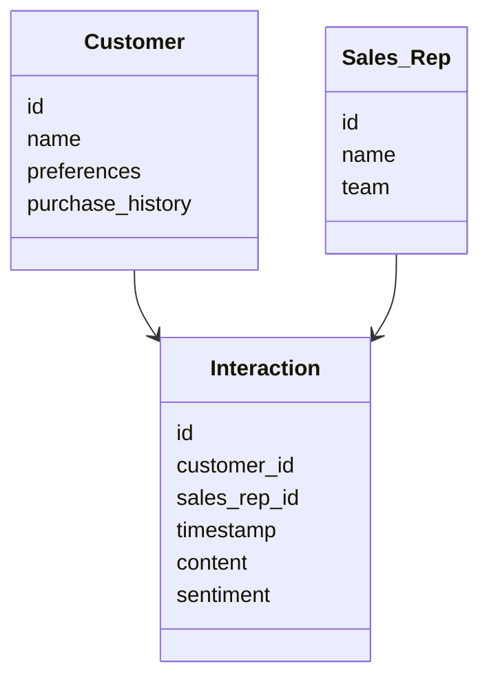
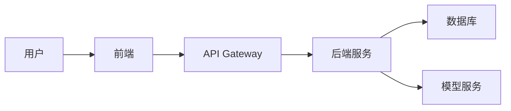

                 


# 构建AI驱动的销售助手：提升转化率与客户满意度

## 关键词：AI驱动销售助手、销售转化率、客户满意度、NLP、机器学习、系统架构设计

## 摘要：本文详细探讨了如何利用人工智能技术构建高效的销售助手，通过自然语言处理和机器学习算法提升销售转化率和客户满意度。文章从背景介绍、核心概念、算法原理、系统架构设计、项目实战到最佳实践，全面分析了构建AI驱动销售助手的各个方面，帮助读者理解并应用这些技术。

---

## 第一部分: AI驱动的销售助手概述

## 第1章: 背景与概述

### 1.1 AI驱动销售助手的背景

#### 1.1.1 传统销售模式的局限性

传统销售模式依赖人工操作，存在效率低、客户体验差、数据分析能力有限等问题。销售人员需要手动处理大量信息，容易出错且难以快速响应客户需求。

#### 1.1.2 AI技术在销售领域的应用潜力

AI技术（如自然语言处理、机器学习）能够快速分析数据、识别客户意图、提供个性化推荐，从而提高销售效率和客户满意度。

#### 1.1.3 提升转化率与客户满意度的重要性

在竞争激烈的市场环境中，提升转化率和客户满意度是企业成功的关键因素。通过AI技术，企业可以更精准地识别客户需求，提供个性化的服务，从而提高客户忠诚度和满意度。

### 1.2 问题背景与描述

#### 1.2.1 销售转化率低的主要原因

- 客户需求未被准确识别
- 销售人员缺乏足够的客户洞察
- 销售流程不够高效

#### 1.2.2 客户满意度低的常见问题

- 销售人员对客户需求理解不足
- 响应速度慢
- 个性化服务不足

#### 1.2.3 AI如何解决这些问题

AI可以通过分析客户数据、预测客户需求、优化销售流程，帮助销售人员更高效地工作，从而提高转化率和客户满意度。

### 1.3 问题解决与边界

#### 1.3.1 AI驱动销售助手的核心目标

- 提高销售转化率
- 提升客户满意度
- 提升销售团队效率

#### 1.3.2 边界与外延

AI销售助手专注于销售过程中的数据分析和决策支持，不直接参与实际的销售操作。

#### 1.3.3 核心要素与组成

- 数据采集与处理
- 客户画像与需求预测
- 智能推荐与个性化沟通

### 1.4 核心概念与联系

#### 1.4.1 核心概念原理

AI销售助手通过NLP、机器学习等技术，分析客户数据，预测客户需求，提供个性化推荐和沟通建议。

#### 1.4.2 核心概念对比表格

| 概念       | 特性1         | 特性2         | 特性3         |
|------------|---------------|---------------|---------------|
| NLP         | 精准度         | 响应速度       | 可解释性       |
| 机器学习     | 模型复杂度     | 预测准确性     | 数据依赖性     |
| 客户画像     | 数据完整性     | 交互便捷性     | 可扩展性       |

#### 1.4.3 ER实体关系图

```mermaid
erd
    customer (客户)
    sales_rep (销售代表)
    interaction (交互记录)
    product (产品)
    campaign (营销活动)
    customer -[1..n]-> interaction
    sales_rep -[1]-> interaction
    product -[1..n]-> interaction
    campaign -[1..n]-> interaction
```

### 1.5 本章小结

本章介绍了AI驱动销售助手的背景、核心概念和问题解决思路，为后续章节奠定了基础。

---

## 第2章: 核心概念与技术原理

### 2.1 自然语言处理（NLP）在销售中的应用

#### 2.1.1 NLP的核心原理

NLP通过分析文本数据，理解客户意图和情感倾向。常用技术包括分词、实体识别、情感分析等。

#### 2.1.2 销售场景中的NLP实现

- 客户文本分析：识别客户的需求和情感倾向。
- 智能回复生成：根据客户需求生成个性化的回复。

#### 2.1.3 NLP技术在销售中的优势

- 快速理解客户意图
- 提供精准的客户画像
- 支持个性化沟通

### 2.2 机器学习在销售预测中的应用

#### 2.2.1 机器学习的核心原理

机器学习通过训练数据模型，预测未来的销售趋势和客户行为。

#### 2.2.2 销售预测的实现步骤

1. 数据采集：收集客户行为数据、历史销售数据等。
2. 数据预处理：清洗、归一化等。
3. 模型训练：使用回归、分类等算法训练模型。
4. 模型评估：验证模型的准确性和稳定性。

#### 2.2.3 机器学习在销售中的优势

- 高准确性：通过大量数据训练，模型预测准确。
- 实时更新：模型可以根据最新数据进行调整。

### 2.3 客户画像与需求预测

#### 2.3.1 客户画像的构建

客户画像是通过分析客户的 demographic、行为、偏好等信息，构建客户特征的模型。

#### 2.3.2 需求预测的实现

- 使用机器学习模型预测客户的购买意愿。
- 结合NLP技术分析客户的语言特征。

#### 2.3.3 客户画像与需求预测的结合

通过客户画像和需求预测，可以更精准地推荐产品和服务，提高转化率。

### 2.4 系统实现与优化

#### 2.4.1 系统实现的核心步骤

1. 数据采集与存储
2. 数据处理与分析
3. 模型训练与部署
4. 系统集成与优化

#### 2.4.2 系统优化的关键点

- 数据质量：确保数据的准确性和完整性。
- 模型选择：选择适合业务场景的模型。
- 系统性能：优化系统的响应速度和稳定性。

### 2.5 本章小结

本章详细介绍了NLP、机器学习在销售中的应用，以及客户画像和需求预测的实现，为后续章节的系统设计和实现奠定了基础。

---

## 第3章: 算法原理与数学模型

### 3.1 算法原理

#### 3.1.1 算法选择与优化

- 选择适合业务场景的算法。
- 通过参数调整和模型优化提高算法性能。

#### 3.1.2 算法实现步骤

1. 数据预处理：清洗、归一化等。
2. 模型训练：使用训练数据训练模型。
3. 模型评估：验证模型的准确性和稳定性。
4. 模型部署：将模型部署到实际系统中。

#### 3.1.3 算法优化技巧

- 参数调整：如学习率、正则化参数等。
- 模型融合：结合多种算法提高预测准确性。

### 3.2 数学模型

#### 3.2.1 机器学习模型的数学基础

- 线性回归：用于预测连续型变量。
- 逻辑回归：用于分类问题。
- 支持向量机：用于分类和回归问题。

#### 3.2.2 模型训练的数学公式

线性回归的损失函数：

$$ L = \frac{1}{2m} \sum_{i=1}^{m} (y_i - \hat{y_i})^2 $$

其中，$m$ 是样本数量，$y_i$ 是真实值，$\hat{y_i}$ 是预测值。

逻辑回归的损失函数：

$$ L = -\frac{1}{m} \sum_{i=1}^{m} [y_i \ln h(x_i) + (1 - y_i) \ln (1 - h(x_i))] $$

其中，$h(x_i)$ 是sigmoid函数的输出。

#### 3.2.3 算法实现的数学推导

以线性回归为例，损失函数的最小化可以通过求导数并令其为零来找到最优参数：

$$ \theta = \theta - \alpha \frac{\partial L}{\partial \theta} $$

其中，$\alpha$ 是学习率，$\theta$ 是模型参数。

### 3.3 本章小结

本章详细讲解了算法的原理和数学模型，帮助读者理解AI驱动销售助手的技术基础。

---

## 第4章: 系统分析与架构设计

### 4.1 系统分析

#### 4.1.1 项目背景与目标

通过构建AI驱动的销售助手，提升销售转化率和客户满意度。

#### 4.1.2 项目需求分析

- 实时数据分析
- 个性化推荐
- 自动化沟通

### 4.2 系统架构设计

#### 4.2.1 领域模型设计



#### 4.2.2 系统架构图



#### 4.2.3 接口设计与交互

- API接口：提供数据查询、模型预测等服务。
- 交互流程：用户请求 -> API Gateway -> 后端处理 -> 返回结果。

### 4.3 系统实现与优化

#### 4.3.1 系统实现步骤

1. 前端开发：构建用户界面，提供交互功能。
2. 后端开发：实现API接口和业务逻辑。
3. 数据库设计：存储客户、销售代表、交互记录等信息。
4. 模型部署：将训练好的模型部署到后端服务中。

#### 4.3.2 系统优化技巧

- 系统性能优化：通过缓存、负载均衡等技术提高系统响应速度。
- 数据安全性：确保客户数据的安全存储和传输。

### 4.4 本章小结

本章通过系统分析与架构设计，详细讲解了AI驱动销售助手的实现过程和技术细节。

---

## 第5章: 项目实战与案例分析

### 5.1 项目实战

#### 5.1.1 环境安装与配置

- 安装Python、Jupyter Notebook、TensorFlow、Scikit-learn等工具。
- 配置数据库和API服务器。

#### 5.1.2 核心代码实现

```python
import numpy as np
import pandas as pd
from sklearn.model import LinearRegression
from sklearn.metrics import mean_squared_error

# 数据加载
data = pd.read_csv('sales_data.csv')

# 数据预处理
X = data[['feature1', 'feature2']]
y = data['target']

# 模型训练
model = LinearRegression()
model.fit(X, y)

# 模型评估
预测 = model.predict(X)
mse = mean_squared_error(y, 预测)
print('均方误差:', mse)
```

#### 5.1.3 代码解读与分析

- 数据加载：使用Pandas读取CSV文件。
- 数据预处理：选择特征并进行归一化。
- 模型训练：使用线性回归模型训练数据。
- 模型评估：计算均方误差，评估模型性能。

### 5.2 案例分析

#### 5.2.1 案例背景

某公司希望通过AI销售助手提高销售转化率。

#### 5.2.2 数据分析

通过分析客户数据，发现客户的购买意愿与他们的偏好和历史行为密切相关。

#### 5.2.3 案例实施与结果

- 数据分析：识别高潜力客户。
- 个性化推荐：根据客户需求推荐产品。
- 沟通优化：通过NLP生成个性化回复。

### 5.3 项目总结

通过项目实战，验证了AI驱动销售助手的有效性，提高了销售转化率和客户满意度。

### 5.4 本章小结

本章通过项目实战和案例分析，详细讲解了AI驱动销售助手的实现过程和实际应用效果。

---

## 第6章: 最佳实践与注意事项

### 6.1 小结

AI驱动的销售助手能够显著提高销售转化率和客户满意度，是企业提升竞争力的重要工具。

### 6.2 注意事项

- 数据质量：确保数据的准确性和完整性。
- 模型选择：选择适合业务场景的模型。
- 系统性能：优化系统的响应速度和稳定性。
- 数据安全：确保客户数据的安全存储和传输。

### 6.3 拓展阅读

推荐阅读以下书籍和资源：

- 《机器学习实战》
- 《自然语言处理入门》
- TensorFlow官方文档
- Keras官方文档

### 6.4 本章小结

本章总结了AI驱动销售助手的最佳实践和注意事项，并提供了拓展阅读的资源。

---

## 第7章: 总结与展望

### 7.1 总结

通过本文的详细讲解，读者可以全面了解AI驱动销售助手的构建过程和技术细节，掌握提升销售转化率和客户满意度的方法。

### 7.2 展望

未来，随着AI技术的不断发展，销售助手将更加智能化和个性化，为企业带来更大的竞争优势。

---

## 作者：AI天才研究院/AI Genius Institute & 禅与计算机程序设计艺术 /Zen And The Art of Computer Programming

