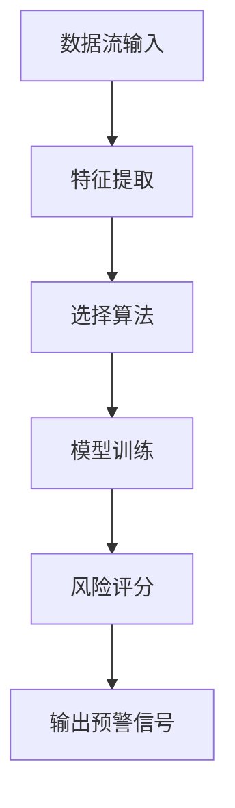
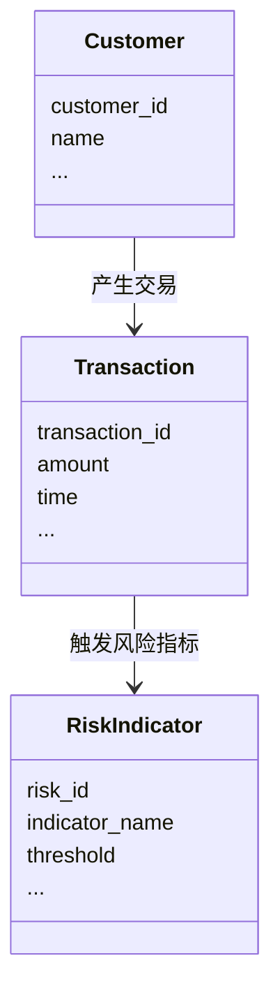

                 


# 构建AI驱动的风控系统：实时监控与风险预警

## 关键词：AI驱动风控、实时监控、风险预警、系统架构、机器学习、金融风控

## 摘要：本文详细探讨如何利用人工智能技术构建实时监控与风险预警的风控系统。从背景介绍、核心概念、算法原理到系统架构设计和项目实战，全面解析AI驱动的风控系统，帮助读者掌握从理论到实践的全过程。

---

# 第1章: AI驱动风控系统背景介绍

## 1.1 风控系统的背景与重要性

### 1.1.1 传统风控系统的局限性
传统风控系统主要依赖规则引擎和静态模型，难以应对实时性要求高、数据量大、风险类型多样化的挑战。例如，在金融领域，传统系统可能无法及时捕捉市场波动或欺诈行为的实时变化，导致风险预警滞后或漏报。

### 1.1.2 AI驱动风控的优势
AI驱动的风控系统通过机器学习算法能够实时处理大量数据，发现复杂模式和异常行为。例如，使用时间序列分析和在线学习算法，可以在实时数据流中快速识别潜在风险，显著提高风险预警的准确性和及时性。

### 1.1.3 实时监控与风险预警的重要性
实时监控和风险预警是现代风控系统的核心功能。通过实时监控，企业可以及时发现潜在风险，采取措施降低损失。例如，在金融交易中，实时监控可以迅速识别异常交易，防止欺诈行为的发生。

---

## 1.2 AI驱动风控的核心概念

### 1.2.1 问题背景与问题描述
AI驱动的风控系统需要解决的问题包括：如何实时处理大量数据，如何准确预测风险，如何快速响应风险事件。这些问题需要结合机器学习、大数据处理和实时计算技术来解决。

### 1.2.2 问题解决方法与边界
解决方法包括使用机器学习模型进行风险预测，利用流处理技术处理实时数据，构建风险指标体系进行预警。边界包括实时数据的处理延迟、模型的准确率和召回率，以及系统的可扩展性。

### 1.2.3 核心概念结构与组成要素
核心概念包括机器学习模型、实时数据流处理、风险指标体系等。这些概念相互关联，共同构建AI驱动的风控系统。

---

## 1.3 本章小结
本章介绍了AI驱动风控系统的背景、重要性以及核心概念。通过分析传统风控系统的局限性，引出了AI驱动风控的优势，强调了实时监控与风险预警的重要性。

---

# 第2章: AI驱动风控的核心概念与联系

## 2.1 核心概念原理

### 2.1.1 机器学习模型
机器学习模型用于预测风险，如使用时间序列模型预测市场波动，使用分类模型识别欺诈交易。

### 2.1.2 实时数据流处理
实时数据流处理技术（如流处理框架）用于处理和分析实时数据，捕捉异常行为。

### 2.1.3 风险指标体系
风险指标体系定义了一系列指标，用于评估和预警风险，如交易量突增、异常交易模式等。

---

## 2.2 核心概念属性特征对比表格

| 核心概念    | 机器学习模型       | 实时数据流处理       | 风险指标体系       |
|-------------|-------------------|--------------------|-------------------|
| 主要功能     | 风险预测           | 处理实时数据         | 评估风险           |
| 输入数据     | 历史和实时数据     | 实时数据流           | 结构化数据         |
| 输出         | 风险评分           | 实时指标             | 风险预警信号       |
| 适用场景     | 风险评估           | 实时监控             | 风险管理           |

---

## 2.3 ER实体关系图

```mermaid
erd
    title 风险评估实体关系图
    Customer
    Transaction
    RiskIndicator
    Model
    Customer(customer_id, name, ... )
    Transaction(transaction_id, customer_id, amount, ... )
    RiskIndicator(risk_id, indicator_name, threshold, ... )
    Model(model_id, model_name, model_type, ... )
    
    Customer -|> Transaction: 产生交易
    Customer -|> RiskIndicator: 关联风险指标
    Model -|> RiskIndicator: 使用模型评估指标
```

---

## 2.4 本章小结
本章详细介绍了AI驱动风控系统的核心概念，包括机器学习模型、实时数据流处理和风险指标体系，并通过对比表格和实体关系图展示了这些概念之间的联系。

---

# 第3章: AI驱动风控的算法原理

## 3.1 算法原理概述

### 3.1.1 时间序列分析
时间序列分析用于预测未来风险，如使用ARIMA模型预测股票价格波动。

### 3.1.2 在线学习算法
在线学习算法用于实时更新模型，适应数据流的变化，如使用增量学习方法更新模型参数。

### 3.1.3 风险评估模型
风险评估模型结合时间序列分析和在线学习，提供实时风险评分。

---

## 3.2 算法流程图



---

## 3.3 算法数学模型与公式

### 时间序列分析模型：ARIMA

$$ ARIMA(p, d, q) $$
其中，p为自回归阶数，d为差分阶数，q为移动平均阶数。

### 在线学习算法：增量学习

$$ w_{t+1} = w_t + \eta (y_t - \hat{y}_t) x_t $$

其中，$w_t$ 是当前权重，$\eta$ 是学习率，$y_t$ 是真实值，$\hat{y}_t$ 是预测值，$x_t$ 是输入特征。

---

## 3.4 本章小结
本章详细讲解了AI驱动风控系统中常用的算法，包括时间序列分析和在线学习算法，并通过流程图和数学公式展示了算法的工作原理。

---

# 第4章: 系统分析与架构设计方案

## 4.1 问题场景介绍

### 4.1.1 风险监控场景
实时监控金融交易，识别异常交易行为。

### 4.1.2 风险预警场景
根据实时数据，触发风险预警信号，通知相关业务部门。

### 4.1.3 实时数据处理场景
处理高频率的实时数据流，确保系统实时响应。

---

## 4.2 项目介绍

### 4.2.1 项目目标
构建一个实时监控和风险预警的AI驱动风控系统。

### 4.2.2 项目范围
涵盖数据采集、特征工程、模型训练、部署与监控。

### 4.2.3 项目约束
系统必须支持高并发，延迟低，准确性高。

---

## 4.3 系统功能设计

### 4.3.1 领域模型



---

## 4.4 本章小结
本章从问题场景出发，介绍了项目的范围和目标，并通过领域模型展示了系统的核心功能模块。

---

# 第5章: 系统实现

## 5.1 环境搭建

### 5.1.1 安装Python环境
使用Anaconda安装Python 3.8以上版本。

### 5.1.2 安装机器学习库
安装scikit-learn、xgboost等机器学习库。

### 5.1.3 安装流处理框架
安装Apache Kafka和Flink用于实时数据处理。

---

## 5.2 数据预处理

### 5.2.1 数据清洗
处理缺失值、异常值，确保数据质量。

### 5.2.2 特征工程
提取关键特征，如交易金额、时间间隔、交易频率等。

---

## 5.3 模型训练

### 5.3.1 训练时间序列模型
使用ARIMA模型训练历史数据，生成风险预测模型。

### 5.3.2 在线学习模型部署
部署增量学习模型，实时更新模型参数。

---

## 5.4 系统部署与监控

### 5.4.1 模型服务部署
使用Docker容器化部署模型服务，确保系统的可扩展性。

### 5.4.2 实时监控
配置监控工具，实时跟踪系统性能和模型表现。

---

## 5.5 本章小结
本章详细讲解了系统的实现过程，包括环境搭建、数据预处理、模型训练和系统部署与监控。

---

# 第6章: 项目实战

## 6.1 需求分析与系统设计

### 6.1.1 需求分析
根据业务需求设计系统功能模块。

### 6.1.2 系统设计
设计系统的模块划分和交互流程。

---

## 6.2 系统实现与测试

### 6.2.1 代码实现
编写数据采集、特征工程、模型训练和部署的代码。

### 6.2.2 系统测试
进行单元测试、集成测试和性能测试，确保系统稳定运行。

---

## 6.3 本章小结
本章通过一个具体的项目案例，展示了从需求分析到系统实现的全过程。

---

# 第7章: 总结与展望

## 7.1 核心内容回顾
AI驱动风控系统结合机器学习和实时数据处理技术，实现实时监控和风险预警。

## 7.2 技术趋势与未来展望
未来，AI驱动风控系统将更加智能化和自动化，结合区块链和边缘计算等技术，提升系统的安全性和效率。

## 7.3 本章小结
本文总结了构建AI驱动风控系统的核心内容，并展望了未来的发展方向。

---

# 作者

作者：AI天才研究院/AI Genius Institute & 禅与计算机程序设计艺术 /Zen And The Art of Computer Programming

---

**注意：** 由于篇幅限制，以上目录大纲和内容仅为示例，实际文章将包含更多详细内容和具体代码示例。

