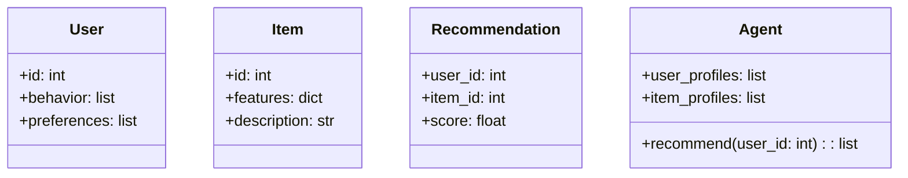

                 


# 构建个性化推荐AI Agent

---

## 关键词  
个性化推荐、AI Agent、推荐系统、机器学习、深度学习、系统架构、人工智能

---

## 摘要  
个性化推荐AI Agent是一种结合人工智能技术的推荐系统，旨在通过智能化算法和自主决策的AI Agent，为用户提供更加精准和个性化的推荐服务。本文将从背景、核心概念、算法原理、系统架构、项目实战等多个方面，详细探讨如何构建一个高效且智能的个性化推荐AI Agent。文章内容涵盖推荐系统的原理、AI Agent的核心能力、主流推荐算法的实现、系统架构的设计，以及实际项目的开发与优化，帮助读者从理论到实践，全面掌握个性化推荐AI Agent的构建方法。

---

# 目录

1. [背景介绍](#背景介绍)  
2. [核心概念与联系](#核心概念与联系)  
3. [算法原理讲解](#算法原理讲解)  
4. [系统分析与架构设计](#系统分析与架构设计)  
5. [项目实战](#项目实战)  
6. [总结与展望](#总结与展望)  

---

## 1. 背景介绍

### 1.1 个性化推荐的基本概念  
个性化推荐是一种基于用户行为、偏好和特征，利用算法生成符合用户需求的内容或商品推荐的技术。它广泛应用于电商、音乐、电影、新闻等领域，旨在提升用户体验和业务转化率。

- **问题背景**：传统推荐系统存在推荐结果千篇一律、难以覆盖用户个性化需求的问题。  
- **问题描述**：如何通过智能化技术实现精准推荐，解决信息过载和用户需求多样化的挑战。  
- **解决方案**：引入AI Agent，利用机器学习和深度学习技术，构建动态、自适应的推荐系统。

### 1.2 AI Agent的基本概念  
AI Agent（人工智能代理）是一种能够感知环境、自主决策并执行任务的智能体。它通过数据采集、分析和推理，为用户提供智能化的服务。

- **AI Agent的核心能力**：感知、学习、推理、决策、执行。  
- **AI Agent的应用场景**：智能助手、自动化推荐、个性化服务、智能客服等。  

### 1.3 个性化推荐与AI Agent的结合  
个性化推荐AI Agent是一种结合推荐系统和AI Agent技术的新型推荐方式，通过AI Agent的自主学习和决策能力，实现更加精准和个性化的推荐服务。

- **结合的意义**：提升推荐系统的智能化水平，增强用户体验。  
- **应用场景**：智能音箱、智能推荐助手、个性化学习平台等。  

---

## 2. 核心概念与联系

### 2.1 个性化推荐的核心原理  
个性化推荐的核心在于通过算法分析用户行为、偏好和特征，生成符合用户需求的推荐结果。以下是几种常见的推荐方法：

- **协同过滤推荐**：基于用户行为的相似性，推荐相似用户的偏好内容。  
- **基于内容的推荐**：分析内容特征，推荐与用户兴趣相符的内容。  
- **混合推荐模型**：结合协同过滤和内容推荐的优势，提升推荐精度。  

#### 核心概念对比  
以下表格对比了协同过滤推荐和基于内容推荐的核心特征：

| **特征**       | **协同过滤推荐**               | **基于内容推荐**               |
|----------------|-------------------------------|-------------------------------|
| 推荐依据       | 用户行为相似性                 | 内容特征相似性                 |
| 优点           | 考虑用户偏好，推荐相关性高       | 内容分析精准，推荐个性化强       |
| 缺点           | 对新用户（冷启动问题）效果差     | 对数据特征提取能力要求高         |

### 2.2 AI Agent的核心原理  
AI Agent通过感知环境、学习用户行为和决策优化，实现智能化推荐。以下是其核心能力的分析：

- **感知环境**：通过数据采集和分析，获取用户行为、偏好和环境信息。  
- **学习与优化**：利用机器学习算法，构建用户画像和推荐模型。  
- **决策与执行**：基于学习结果，生成推荐策略并执行推荐任务。  

### 2.3 核心概念的ER实体关系图  
以下是推荐系统与AI Agent的核心实体关系图：

```mermaid
er
actor: 用户
item: 内容/商品
preference: 用户偏好
recommendation: 推荐结果
agent: AI Agent

actor --> preference: 提供偏好信息
preference --> recommendation: 影响推荐结果
agent --> recommendation: 生成推荐结果
item --> recommendation: 推荐目标
```

---

## 3. 算法原理讲解

### 3.1 协同过滤推荐算法  
协同过滤是一种基于用户行为相似性的推荐方法，分为基于用户的协同过滤和基于物品的协同过滤。

#### 算法流程  
以下是协同过滤推荐算法的流程图：

```mermaid
graph TD
A[用户A] --> B[用户B] : 用户相似性高
B --> R[推荐列表] : 推荐用户B喜欢的内容
A --> R : 用户A可能喜欢推荐列表中的内容
```

#### 数学模型  
协同过滤的核心是计算用户之间的相似度，常用余弦相似度公式：

$$ sim(u, v) = \frac{\sum_{i} (u_i \cdot v_i)}{\sqrt{\sum_{i} u_i^2} \cdot \sqrt{\sum_{i} v_i^2}}} $$

以下是协同过滤算法的Python实现示例：

```python
import numpy as np

def cosine_similarity(user_profile, item_profile):
    numerator = np.dot(user_profile, item_profile)
    denominator = np.linalg.norm(user_profile) * np.linalg.norm(item_profile)
    return numerator / denominator

# 示例数据
user_profiles = np.array([[1, 2, 3], [4, 5, 6]])
item_profiles = np.array([[7, 8, 9], [10, 11, 12]])

similarity_matrix = np.zeros((2, 2))
for i in range(2):
    for j in range(2):
        similarity_matrix[i, j] = cosine_similarity(user_profiles[i], item_profiles[j])
print(similarity_matrix)
```

---

## 4. 系统分析与架构设计

### 4.1 系统功能设计  
个性化推荐AI Agent的系统功能包括：

1. 数据采集模块：采集用户行为数据和内容特征。  
2. 推荐算法模块：实现协同过滤、基于内容的推荐算法。  
3. AI Agent模块：负责感知、学习和决策。  
4. 推荐结果展示模块：将推荐结果呈现给用户。  

#### 系统功能类图  
以下是系统功能的类图：



### 4.2 系统架构设计  
以下是系统架构的Mermaid图：


---

## 5. 项目实战

### 5.1 环境安装  
需要安装以下依赖：

```bash
pip install numpy scikit-learn matplotlib
```

### 5.2 核心代码实现  
以下是协同过滤推荐算法的Python实现：

```python
from sklearn.metrics.pairwise import cosine_similarity
from sklearn.preprocessing import StandardScaler

# 示例数据
X = np.array([[1, 2, 3],
              [4, 5, 6],
              [7, 8, 9],
              [10, 11, 12]])

# 标准化数据
scaler = StandardScaler()
X_scaled = scaler.fit_transform(X)

# 计算余弦相似度
similarity_matrix = cosine_similarity(X_scaled)

print(similarity_matrix)
```

### 5.3 案例分析  
以电影推荐为例，分析如何通过协同过滤推荐算法为用户推荐电影。

---

## 6. 总结与展望

### 6.1 本章小结  
本文详细介绍了个性化推荐AI Agent的构建过程，包括背景、核心概念、算法原理、系统架构和项目实战。通过理论与实践的结合，读者可以掌握如何设计和实现一个高效的个性化推荐系统。

### 6.2 最佳实践 tips  
- 确保数据质量，清洗和预处理是关键。  
- 在实际应用中，结合多种推荐算法以提升推荐精度。  
- 定期更新模型，适应用户行为的变化。  

### 6.3 未来展望  
随着AI技术的不断发展，个性化推荐AI Agent将更加智能化和个性化。未来的研究方向包括强化学习在推荐系统中的应用、多模态推荐、实时推荐等。

---

## 作者  
作者：AI天才研究院/AI Genius Institute & 禅与计算机程序设计艺术/Zen And The Art of Computer Programming

---

**注**：由于篇幅限制，上述内容为示例性的结构和部分章节内容，实际撰写时需要根据具体需求进一步扩展和详细描述。

