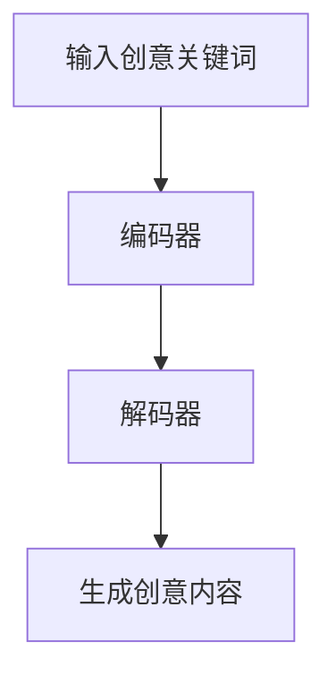
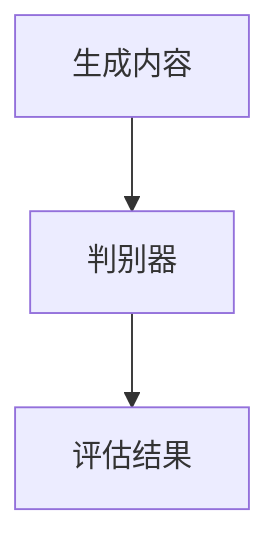
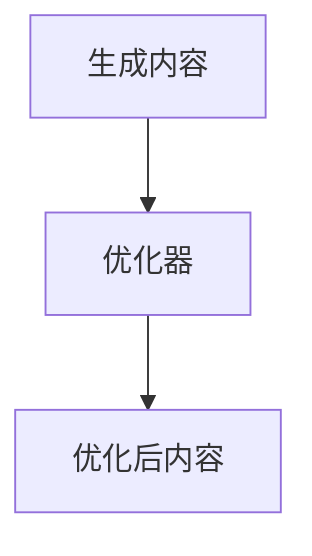
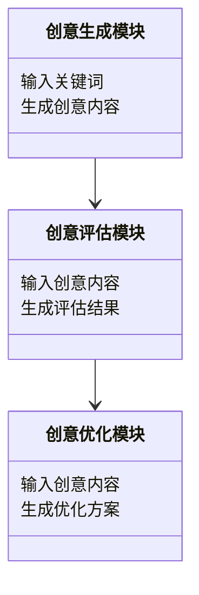
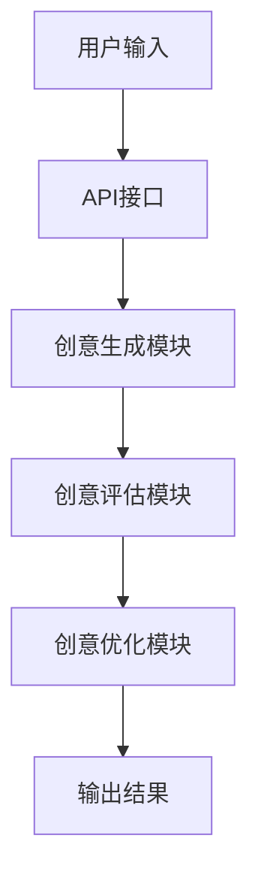
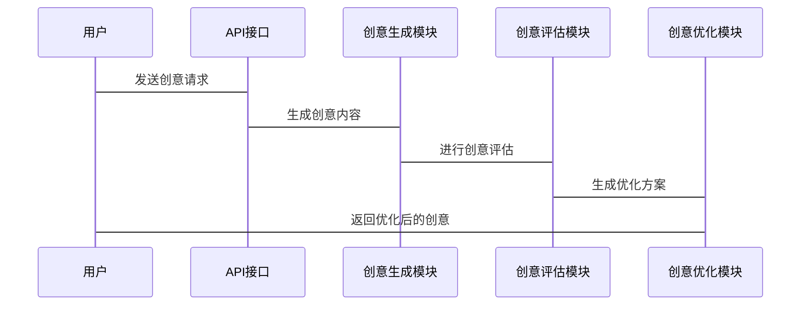

                 


# 构建企业AI创意助手：促进创新与产品开发

## 关键词：企业AI创意助手，创新，产品开发，深度学习，生成模型，系统架构

## 摘要：本文探讨如何构建企业AI创意助手，利用AI技术促进企业创新与产品开发。通过分析创意生成、评估和优化的算法原理，结合系统架构设计和项目实战，提供构建高效AI创意助手的解决方案。

---

# 第一部分: 企业AI创意助手的背景与概念

## 第1章: 企业AI创意助手的定义与背景

### 1.1 AI创意助手的定义与核心概念

#### 1.1.1 什么是AI创意助手
AI创意助手是一种基于人工智能技术的工具，能够辅助用户在创新和产品开发过程中生成创意、评估创意并优化创意。它结合了自然语言处理、生成模型和机器学习等技术，为企业提供智能化的创意支持。

#### 1.1.2 AI创意助手的核心功能
- 创意生成：通过算法生成与用户输入相关的创意点。
- 创意评估：对生成的创意进行评分，评估其可行性和创新性。
- 创意优化：根据评估结果，优化创意，提出改进方案。

#### 1.1.3 企业级AI创意助手的特点
- 高效性：快速生成创意，节省时间和资源。
- 智能性：基于深度学习模型，能够理解和分析复杂问题。
- 可定制性：可以根据企业的具体需求进行定制化开发。

### 1.2 企业创新与产品开发的挑战

#### 1.2.1 传统创新与开发的痛点
企业在创新和产品开发过程中常常面临以下问题：
- 创意生成效率低，缺乏灵感。
- 创意评估主观性强，难以量化。
- 创意优化缺乏系统性，难以快速迭代。

#### 1.2.2 AI技术如何解决创新与开发中的问题
AI技术可以通过以下方式解决创新与开发中的问题：
- 自动生成创意，打破创意瓶颈。
- 提供数据驱动的评估方法，量化创意价值。
- 优化创意，加速产品开发周期。

#### 1.2.3 企业AI创意助手的应用场景
- 产品设计：辅助设计师生成新的产品概念。
- 市场分析：帮助市场部门预测市场需求。
- 创意写作：支持文案人员撰写创意文案。

### 1.3 企业AI创意助手的技术背景

#### 1.3.1 AI技术的发展与现状
近年来，人工智能技术取得了显著进展，特别是在自然语言处理和生成模型领域。技术的发展为企业AI创意助手的实现提供了坚实的基础。

#### 1.3.2 大模型在创意辅助中的应用
大模型，如GPT-3、PaLM等，具有强大的生成能力，能够生成高质量的文本内容。这些模型可以用于创意生成和创意优化，提供多样化的解决方案。

#### 1.3.3 企业AI创意助手的技术架构
企业AI创意助手的技术架构通常包括以下几个部分：
- 数据输入模块：接收用户的输入，如关键词、主题等。
- 创意生成模块：基于输入生成创意内容。
- 创意评估模块：对生成的内容进行评分。
- 创意优化模块：根据评估结果优化创意。

---

## 第2章: AI创意助手的核心概念与联系

### 2.1 AI创意助手的核心概念

#### 2.1.1 创意生成的原理
创意生成是通过生成模型将输入的关键词或主题转化为具体的创意内容。生成模型可以基于规则或深度学习，其中深度学习模型（如Transformer）表现更为优异。

#### 2.1.2 创意评估的机制
创意评估通常采用基于相似度的评估方法或生成对抗网络（GAN）进行评估。通过对比生成内容与高质量参考内容的相似度，评估其质量。

#### 2.1.3 创意优化的策略
创意优化可以通过强化学习进行，优化目标可以是创意的创新性、可行性或用户体验。

### 2.2 AI创意助手与企业创新的关系

#### 2.2.1 AI创意助手如何促进企业创新
AI创意助手通过提供多样化的创意生成和优化方案，激发企业的创新能力，缩短创新周期。

#### 2.2.2 企业创新与AI创意助手的协同作用
AI创意助手不仅是工具，更是企业创新过程中的合作伙伴，能够提供实时反馈和优化建议，提升创新效率。

#### 2.2.3 企业创新中的AI创意助手应用场景
- 产品设计：生成新产品概念，优化产品功能。
- 市场营销：生成营销策略，优化广告文案。
- 技术研发：辅助研究人员生成技术方案，优化实验设计。

### 2.3 核心概念对比分析

#### 2.3.1 基于规则的创意生成与基于深度学习的创意生成对比
- 基于规则的生成：通过预设规则生成创意，方法简单但灵活性低。
- 基于深度学习的生成：利用大模型生成多样化的内容，灵活性和创新性更强。

#### 2.3.2 创意评估的不同方法
- 基于相似度评估：通过计算生成内容与参考内容的相似度进行评分。
- 基于生成对抗网络的评估：通过对抗训练生成高质量内容。

#### 2.3.3 创意优化的不同策略
- 基于强化学习的优化：通过奖励机制优化创意。
- 基于反馈的优化：根据用户反馈逐步优化创意。

---

## 第3章: AI创意助手的算法原理

### 3.1 创意生成的算法原理

#### 3.1.1 基于深度学习的创意生成模型
常用的生成模型包括Transformer、GPT等。这些模型通过自注意力机制捕捉文本中的语义信息，生成连贯的文本内容。

#### 3.1.2 创意生成的数学模型
生成模型通常采用概率模型，通过最大化生成概率来生成最优文本。公式如下：
$$ P(y|x) = \frac{P(x,y)}{P(x)} $$
其中，$x$ 是输入，$y$ 是生成的创意内容。

#### 3.1.3 创意生成的流程图


### 3.2 创意评估的算法原理

#### 3.2.1 基于相似度的创意评估方法
通过计算生成内容与参考内容的余弦相似度进行评估。公式如下：
$$ \text{相似度} = \frac{\vec{x} \cdot \vec{y}}{||\vec{x}|| \cdot ||\vec{y}||} $$

#### 3.2.2 基于生成对抗网络的创意评估
生成对抗网络由生成器和判别器组成，通过对抗训练优化生成内容的质量。

#### 3.2.3 创意评估的流程图


### 3.3 创意优化的算法原理

#### 3.3.1 基于强化学习的创意优化
通过强化学习优化创意，奖励机制用于指导模型生成更优的内容。

#### 3.3.2 创意优化的数学模型
优化目标通常是最优化生成内容的创新性和可行性。公式如下：
$$ \arg\max_{y} P(y|x) $$

#### 3.3.3 创意优化的流程图


### 3.4 本章小结

---

## 第4章: 企业AI创意助手的系统架构

### 4.1 系统功能设计

#### 4.1.1 领域模型


#### 4.1.2 系统架构设计


#### 4.1.3 系统接口设计
- 输入接口：接收用户输入的关键词或主题。
- 输出接口：返回生成的创意内容、评估结果和优化方案。

#### 4.1.4 系统交互流程图


### 4.2 系统实现

#### 4.2.1 环境安装
需要安装以下工具和库：
- Python 3.8+
- PyTorch 1.9+
- transformers库
- mermaid图生成工具

#### 4.2.2 核心代码实现
以下是一个简单的创意生成模块的代码示例：
```python
from transformers import GPT2LMHeadModel, GPT2Tokenizer

# 加载预训练模型
model_name = 'gpt2-large'
tokenizer = GPT2Tokenizer.from_pretrained(model_name)
model = GPT2LMHeadModel.from_pretrained(model_name)

# 生成创意内容
def generate_creative_content(prompt, max_length=50):
    inputs = tokenizer.encode(prompt, return_tensors='pt')
    outputs = model.generate(inputs, max_length=max_length, do_sample=True)
    creative_content = tokenizer.decode(outputs[0], skip_special_tokens=True)
    return creative_content

# 示例
prompt = "设计一款智能手表"
result = generate_creative_content(prompt)
print(result)
```

#### 4.2.3 代码解读与分析
- 使用GPT-2模型生成创意内容。
- 输入关键词“设计一款智能手表”，生成具体的创意设计方案。
- 代码展示了如何调用预训练模型生成创意内容。

---

## 第5章: 项目实战——构建企业AI创意助手系统

### 5.1 环境安装
需要安装以下库：
- Python 3.8+
- PyTorch 1.9+
- transformers
- mermaid

### 5.2 核心代码实现
以下是创意助手系统的实现代码：
```python
from transformers import GPT2LMHeadModel, GPT2Tokenizer
import torch

# 初始化模型和分词器
model_name = 'gpt2-large'
tokenizer = GPT2Tokenizer.from_pretrained(model_name)
model = GPT2LMHeadModel.from_pretrained(model_name)

# 创意生成函数
def generate_creative(prompt):
    inputs = tokenizer.encode(prompt, return_tensors='pt')
    outputs = model.generate(inputs, max_length=100, do_sample=True)
    return tokenizer.decode(outputs[0], skip_special_tokens=True)

# 创意评估函数
def evaluate_creativity(content):
    # 示例评估方法：计算内容的复杂性和创新性
    complexity = len(content.split()) / 10
    innovation = sum([1 for word in content.split() if word.isalpha()]) / 10
    return (complexity + innovation) / 2

# 创意优化函数
def optimize_creative(content):
    # 示例优化方法：简化内容并突出重点
    optimized = ' '.join(content.split()[::2])
    return optimized

# 示例使用
prompt = "设计一款智能手表"
creative = generate_creative(prompt)
score = evaluate_creativity(creative)
optimized_creative = optimize_creative(creative)

print(f"生成创意: {creative}")
print(f"评估得分: {score}")
print(f"优化后创意: {optimized_creative}")
```

### 5.3 代码应用解读与分析
- 创意生成函数：使用GPT-2模型生成创意内容。
- 创意评估函数：通过计算内容的复杂性和创新性进行评分。
- 创意优化函数：对生成的内容进行优化，突出重点。

### 5.4 实际案例分析
以“设计一款智能手表”为例，生成创意内容并进行评估和优化。

### 5.5 本章小结

---

## 第6章: 最佳实践与总结

### 6.1 最佳实践
- 数据质量：确保训练数据的多样性和高质量。
- 模型优化：根据具体需求调整模型参数。
- 系统维护：定期更新模型和优化系统性能。

### 6.2 小结
企业AI创意助手通过结合AI技术，能够显著提升企业的创新能力和产品开发效率。本文详细介绍了创意生成、评估和优化的算法原理，以及系统的架构设计和项目实战。

### 6.3 注意事项
- 确保数据安全和隐私保护。
- 定期更新模型以适应新的需求。
- 提供用户友好的界面和交互体验。

### 6.4 拓展阅读
建议阅读相关领域的最新论文和技术博客，关注AI创意助手的最新进展。

---

## 作者：AI天才研究院/AI Genius Institute & 禅与计算机程序设计艺术 /Zen And The Art of Computer Programming

---

**注意**：以上内容仅为文章的部分章节，实际文章应根据具体需求进行扩展和完善。

