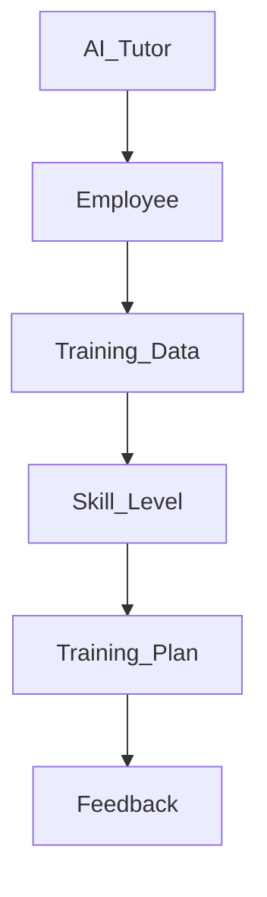
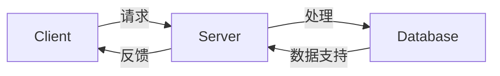

                 


# 构建企业专属AI培训师：员工技能提升助手

## 关键词：AI培训师、员工技能提升、机器学习、自然语言处理、系统架构

## 摘要：  
随着企业对员工技能提升的需求不断增加，传统的培训方式逐渐显现出效率低下、个性化不足等问题。为了解决这些问题，AI技术的应用为企业提供了一种全新的解决方案——构建企业专属的AI培训师。本文将详细探讨如何从背景分析、核心概念、算法原理、系统架构到项目实战，逐步构建一个高效的AI培训师系统，为企业员工技能提升提供智能化支持。

---

## 第一部分：企业专属AI培训师的背景与核心概念

### 第1章：问题背景与需求分析

#### 1.1 问题背景
员工是企业发展的核心，其技能水平直接影响企业的竞争力。然而，传统培训方式存在以下问题：
- **效率低下**：传统培训多为统一课程，难以满足员工个性化需求。
- **资源浪费**：部分员工可能已经具备某些技能，但仍然需要参加不必要的培训。
- **反馈延迟**：传统培训难以实时跟踪员工的学习进度和效果。

#### 1.2 问题描述
- 员工技能提升的需求日益多样化。
- 企业需要一种灵活、高效、个性化的培训方式。
- 基于AI的培训系统能够实时分析员工技能水平，提供个性化建议。

#### 1.3 问题解决思路
引入AI技术，构建企业专属的AI培训师，通过以下方式实现员工技能提升：
- 利用机器学习模型评估员工技能水平。
- 基于自然语言处理技术推荐个性化学习资源。
- 通过实时反馈优化培训计划。

---

### 第2章：核心概念与系统架构

#### 2.1 核心概念
AI培训师是一种基于AI技术的智能系统，能够根据员工的技能水平、学习偏好和工作需求，提供个性化的培训建议和实时反馈。与传统培训系统相比，AI培训师具有以下特点：
- **智能化**：利用机器学习和自然语言处理技术，实现精准的技能评估和个性化推荐。
- **实时性**：能够实时跟踪员工的学习进度，并根据反馈调整培训计划。
- **可扩展性**：支持大规模员工同时使用，且能够根据企业需求进行定制化开发。

#### 2.2 实体关系图


#### 2.3 系统架构设计


---

## 第二部分：AI培训师的核心算法与数学模型

### 第3章：算法原理

#### 3.1 技能评估算法
- **基于机器学习的技能评估**：使用监督学习模型（如随机森林、支持向量机）对员工技能水平进行预测。
- **数据来源**：包括员工的历史考试成绩、项目完成情况、同事评价等。

#### 3.2 个性化推荐算法
- **基于自然语言处理的个性化推荐**：利用文本挖掘技术分析员工的学习需求，并推荐相关的学习资源。
- **推荐算法**：基于协同过滤或内容推荐算法，为员工推荐适合的学习材料。

#### 3.3 反馈优化算法
- **基于强化学习的反馈优化**：根据员工的学习反馈，调整推荐策略，优化培训计划。
- **优化目标**：最大化员工的学习效果和满意度。

#### 3.4 数学模型与公式
- **损失函数**：
  $$ L = \frac{1}{n}\sum_{i=1}^{n}(y_i - \hat{y}_i)^2 $$
- **优化算法**：
  $$ \theta_{new} = \theta_{old} - \eta \cdot \frac{\partial L}{\partial \theta} $$

---

### 第4章：系统功能与架构实现

#### 4.1 系统功能设计
- **员工技能评估模块**：通过机器学习模型评估员工当前技能水平。
- **个性化培训计划模块**：根据评估结果推荐适合的学习资源和计划。
- **培训效果反馈模块**：实时跟踪员工的学习进度，并根据反馈优化培训计划。

#### 4.2 系统架构图


#### 4.3 接口设计与交互流程
- **接口设计**：定义RESTful API接口，实现客户端与服务器之间的数据交互。
- **交互流程**：
  1. 客户端发送员工信息到服务器。
  2. 服务器根据员工信息生成技能评估报告。
  3. 服务器返回个性化培训计划。
  4. 客户端根据反馈优化培训计划。

---

## 第三部分：项目实战与最佳实践

### 第5章：项目实战

#### 5.1 环境安装
- **安装Python环境**：使用Anaconda或virtualenv创建虚拟环境。
- **安装依赖库**：如scikit-learn、spacy、flask等。

#### 5.2 核心功能实现
- **技能评估模块**：
  ```python
  from sklearn.ensemble import RandomForestClassifier

  # 训练模型
  model = RandomForestClassifier()
  model.fit(X_train, y_train)

  # 预测技能水平
  y_pred = model.predict(X_test)
  ```

- **个性化推荐模块**：
  ```python
  import spacy

  nlp = spacy.load("en_core_web_sm")
  doc = nlp("文本内容")
  ```

- **反馈优化模块**：
  ```python
  import tensorflow as tf

  model = tf.keras.Sequential([
      tf.keras.layers.Dense(64, activation='relu'),
      tf.keras.layers.Dense(1, activation='sigmoid')
  ])
  model.compile(optimizer='adam', loss='binary_crossentropy')
  model.fit(X_train, y_train, epochs=10)
  ```

#### 5.3 案例分析与解读
- **案例分析**：以某企业为例，展示AI培训师在实际应用中的效果。
- **数据可视化**：使用Matplotlib或Seaborn展示技能评估结果和学习效果对比。

#### 5.4 项目小结
- 通过项目实战，验证了AI培训师的有效性和可行性。
- 强调了算法选择和数据质量对系统性能的重要影响。

---

### 第6章：最佳实践与注意事项

#### 6.1 小结
- AI培训师为企业员工技能提升提供了高效、个性化的解决方案。
- 系统架构设计和算法选择是实现成功的关键。

#### 6.2 注意事项
- **数据隐私**：确保员工数据的安全性和隐私性。
- **模型优化**：定期更新模型，保持系统的准确性和实时性。
- **用户体验**：注重用户体验设计，提高员工的参与度和满意度。

#### 6.3 拓展阅读
- 推荐阅读《机器学习实战》、《自然语言处理入门》等相关书籍，深入学习AI技术在企业培训中的应用。

---

## 结语

构建企业专属的AI培训师是一个复杂但极具价值的过程。通过本文的详细讲解，读者可以系统地了解AI培训师的构建过程，包括背景分析、核心概念、算法原理、系统架构和项目实战。希望本文能够为企业的员工技能提升提供新的思路和方法，助力企业在数字化转型中取得更大的成功。

---

## 作者：AI天才研究院 & 禅与计算机程序设计艺术

