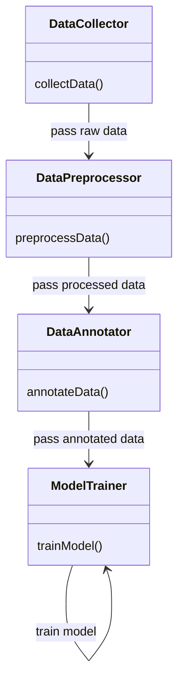

                 


# 构建企业专属训练数据集：确保AI Agent的领域适应性

> 关键词：企业数据集，AI Agent，领域适应性，数据标注，模型微调

> 摘要：本文详细探讨了构建企业专属训练数据集的重要性及其在AI Agent领域适应性中的作用。通过分析数据收集、处理、标注等关键环节，结合算法原理和系统架构设计，提供了从理论到实践的全面指导，帮助企业在AI应用中实现高效、精准的模型训练。

---

## 第一部分: 构建企业专属训练数据集的背景与重要性

### 第1章: 数据集构建的背景与问题背景

#### 1.1 问题背景

- **AI Agent在企业中的应用挑战**  
  AI Agent（智能代理）在企业中的应用日益广泛，但其性能严重依赖于训练数据的质量和多样性。通用数据集难以满足企业的特定需求，导致模型在实际场景中表现不佳。

- **领域适应性的重要性**  
  企业通常面临特定领域的问题，如金融、医疗或制造。AI Agent需要在这些领域内表现出色，而这要求数据集具有高度的领域适应性。

- **数据集构建的必要性**  
  通过构建专属数据集，企业可以确保AI Agent在特定场景下的准确性和可靠性，从而提高业务效率和决策能力。

#### 1.2 数据的重要性

- **数据在AI模型中的作用**  
  数据是AI模型的“燃料”。高质量的数据能够显著提升模型的性能，而低质量的数据可能导致模型失效。

- **企业专属数据集的优势**  
  专属数据集能够更好地反映企业的业务流程和行业特点，使AI Agent更贴近实际应用场景。

- **数据质量对模型性能的影响**  
  数据质量直接影响模型的泛化能力和适应性。高质量的数据集能够减少模型偏差，提高其在特定领域的表现。

---

### 第2章: 企业专属数据集的构建目标

#### 2.1 数据集构建的核心目标

- **提升模型领域适应性**  
  通过收集和标注特定领域的数据，使AI Agent能够更好地理解和处理相关任务。

- **降低模型偏差**  
  专属数据集有助于减少模型在通用数据上的偏差，使其更贴近企业的实际需求。

- **提高模型鲁棒性**  
  通过多样化的数据集，增强模型在不同场景下的稳定性和可靠性。

#### 2.2 数据集构建的边界与外延

- **数据集的适用范围**  
  数据集应聚焦于企业的核心业务场景，避免过于宽泛或无关的数据。

- **数据集的局限性**  
  专属数据集可能无法覆盖所有边缘情况，需要结合其他技术手段进行补充。

- **数据集与其他技术的结合**  
  数据集构建应与模型微调、领域迁移等技术相结合，形成完整的解决方案。

---

## 第二部分: 数据集构建的核心概念与联系

### 第3章: 数据集构建的核心概念

#### 3.1 数据多样性与平衡性

- **数据多样性的定义**  
  数据多样性指数据集包含多种类型、格式和来源的数据，以覆盖所有可能的场景。

- **数据平衡性的实现方法**  
  通过调整数据采集策略或重新采样，确保数据集在各类别或特征上的均衡分布。

- **数据多样性对模型性能的影响**  
  多样化的数据能够提高模型的泛化能力，减少其对特定模式的过度依赖。

#### 3.2 数据标注与清洗

- **数据标注的流程与方法**  
  数据标注通常包括数据预处理、特征提取和人工标注等步骤。标注工具的选择和使用是关键。

- **数据清洗的重要性**  
  清洗数据是确保数据质量的关键步骤，包括去除噪声、填补缺失值和消除重复数据。

- **数据标注的质量控制**  
  通过交叉验证、抽样检查等方式，确保标注数据的准确性和一致性。

---

### 第4章: 数据集构建的关键要素

#### 4.1 数据特征对比

- **数据特征的分类**  
  数据特征可分为文本、图像、结构化数据等类型，每种类型对模型的影响不同。

- **数据特征的对比分析**  
  通过对比分析，确定哪些特征对模型性能影响最大，从而优化数据采集策略。

- **数据特征对模型性能的影响**  
  例如，文本长度、关键词分布等特征对文本生成模型的输出质量有直接影响。

#### 4.2 数据集构建流程

- **数据收集阶段**  
  通过爬取、API调用或用户输入等方式，收集与企业业务相关的数据。

- **数据预处理阶段**  
  对收集到的数据进行清洗、格式转换和特征提取，确保数据的可用性。

- **数据标注阶段**  
  根据任务需求，对数据进行人工或半自动化的标注，如分类、实体识别等。

- **数据验证阶段**  
  通过交叉验证或独立测试集，评估数据集的质量和适用性。

---

## 第三部分: 数据集构建的算法原理

### 第5章: 文本生成模型的工作原理

#### 5.1 自注意力机制

- **自注意力机制的数学模型**  
  自注意力机制通过计算序列中每个位置的权重，生成位置相关的表示。其数学模型如下：

  $$\text{Attention}(Q, K, V) = \text{softmax}\left(\frac{QK^T}{\sqrt{d_k}}\right)V$$

- **自注意力机制的实现步骤**  
  1. 计算查询（Q）、键（K）和值（V）向量。  
  2. 计算注意力权重矩阵。  
  3. 加权求和，生成最终的注意力输出。

- **自注意力机制的优缺点**  
  优点：能够捕捉长距离依赖关系；缺点：计算复杂度较高，对长序列效果不佳。

#### 5.2 损失函数与优化方法

- **损失函数的选择**  
  常用的损失函数包括交叉熵损失和KL散度损失。交叉熵损失广泛应用于文本生成任务。

- **损失函数的数学表达式**  
  交叉熵损失的公式为：

  $$\mathcal{L} = -\sum_{i=1}^{n} y_i \log p_i$$

  其中，\( y_i \) 是真实标签，\( p_i \) 是模型预测的概率。

- **优化方法**  
  使用Adam优化器，设置合适的学习率和参数更新策略，确保模型收敛。

---

### 第6章: 数据集构建的算法实现

#### 6.1 数据处理与预处理

- **数据格式转换**  
  将原始数据转换为模型训练所需的格式，如词向量化或字符级编码。

- **数据增强**  
  通过同义词替换、句式变换等方法，增加数据的多样性和丰富性。

#### 6.2 模型微调

- **模型微调的流程**  
  1. 加载预训练模型权重。  
  2. 对模型进行微调，使用企业的专属数据集进行训练。  
  3. 通过验证集调整超参数，优化模型性能。

- **模型微调的代码示例**  

```python
# 加载预训练模型
model = PretrainedModel.from_pretrained('model_name')

# 定义微调任务
tokenizer = AutoTokenizer.from_pretrained('tokenizer_name')
model = model.to(device)

# 定义微调数据集
def dataloader(batch_size):
    dataset = CustomDataset(tokenizer)
    dataloader = DataLoader(dataset, batch_size=batch_size, shuffle=True)
    return dataloader

# 开始微调训练
for epoch in range(num_epochs):
    for batch in dataloader:
        inputs, labels = batch['input_ids'].to(device), batch['labels'].to(device)
        outputs = model(inputs, labels=labels)
        loss = outputs.loss
        optimizer.zero_grad()
        loss.backward()
        optimizer.step()
```

---

## 第四部分: 系统分析与架构设计方案

### 第7章: 数据采集与处理系统

#### 7.1 数据采集模块

- **数据来源**  
  数据来源包括企业内部数据库、公开数据集和用户输入等。

- **数据采集流程**  
  1. 确定数据采集目标。  
  2. 选择合适的数据采集工具。  
  3. 实施数据采集并存储。

#### 7.2 数据预处理模块

- **数据清洗**  
  去除噪声、填补缺失值和消除重复数据。

- **数据增强**  
  通过同义词替换、句式变换等方法，增加数据的多样性和丰富性。

---

### 第8章: 系统架构设计

#### 8.1 系统功能设计

- **领域模型设计**  
  使用Mermaid类图描述系统的功能模块及其交互。



---

## 第五部分: 项目实战

### 第9章: 项目实战与实现

#### 9.1 环境搭建

- **安装必要的库**  
  安装PyTorch、Hugging Face Transformers等库。

```bash
pip install torch transformers
```

#### 9.2 数据处理与模型微调

- **数据处理代码**  
  加载数据集并进行预处理和标注。

```python
from transformers import AutoTokenizer, AutoModelForMaskedLM
import torch

tokenizer = AutoTokenizer.from_pretrained('roberta-base')
model = AutoModelForMaskedLM.from_pretrained('roberta-base')
```

---

## 第六部分: 最佳实践与总结

### 第10章: 最佳实践

#### 10.1 核心经验总结

- **数据质量优先**  
  数据质量是模型性能的基石，确保数据的准确性和多样性至关重要。

- **结合领域知识**  
  在数据收集和标注过程中，结合企业的领域知识，能够显著提高模型的适应性。

#### 10.2 注意事项

- **数据隐私保护**  
  在处理敏感数据时，需遵守相关法律法规，确保数据安全。

- **模型评估与迭代**  
  定期评估模型性能，根据反馈持续优化数据集和模型。

#### 10.3 拓展阅读

- 推荐阅读《Deep Learning》（Ian Goodfellow）和《Hands-on Machine Learning with Scikit-Learn, Keras, and TensorFlow》（ Aurélien Géron）等书籍，深入理解数据驱动的AI模型构建。

---

## 作者信息

作者：AI天才研究院 & 禅与计算机程序设计艺术

---

本文通过详细探讨构建企业专属训练数据集的背景、核心概念、算法原理和系统架构设计，为读者提供了从理论到实践的全面指导。希望本文能够帮助企业在AI Agent的领域适应性中取得更好的效果。

