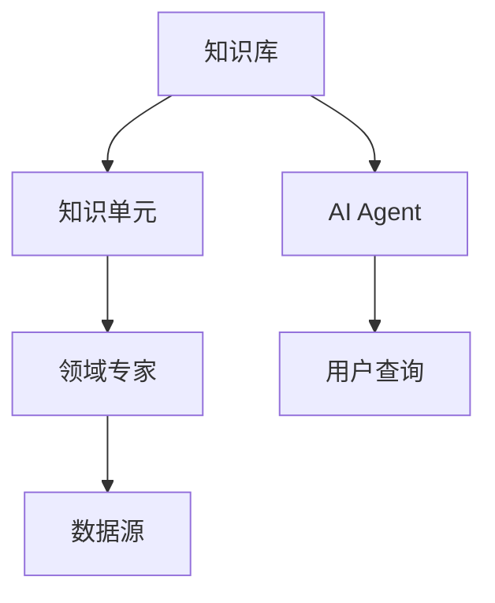
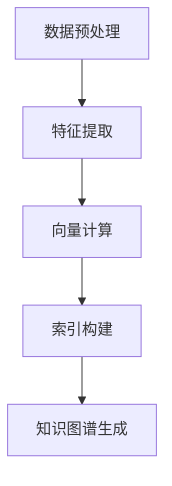
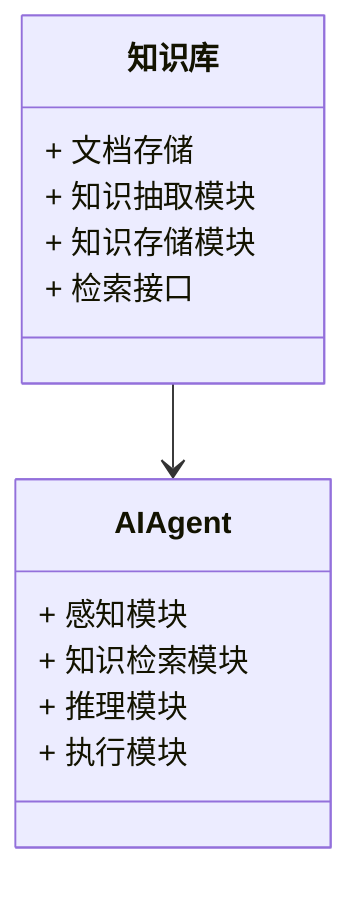
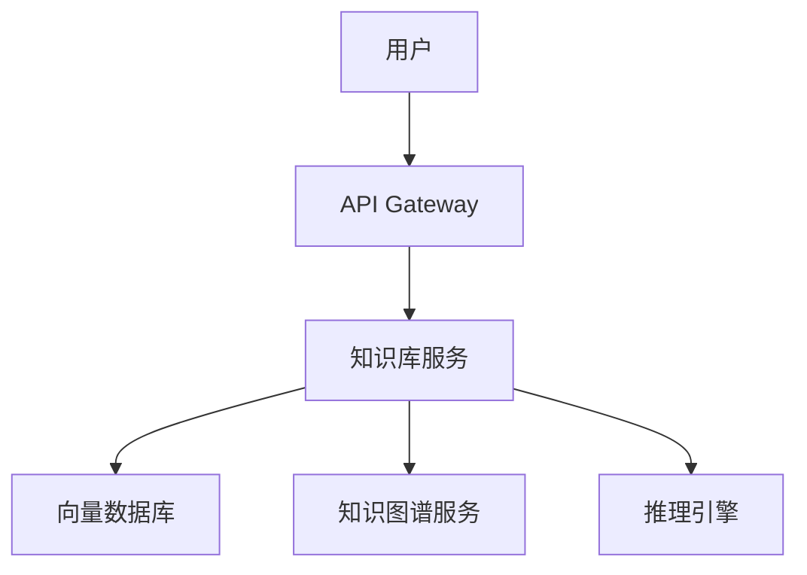

                 


---

# 构建企业知识库：为AI Agent提供专业领域支持

## 关键词：企业知识库, AI Agent, 知识图谱, 向量数据库, 领域支持

## 摘要：
企业知识库是AI Agent在专业领域中高效运作的核心支持系统。本文系统地探讨了企业知识库的构建方法及其与AI Agent的协同工作原理，详细分析了向量数据库和知识图谱的构建算法，并通过实际案例展示了如何在企业场景中应用这些技术。文章最后总结了最佳实践和未来研究方向，为技术从业者提供了宝贵的参考。

---

# 第一部分: 企业知识库与AI Agent概述

## 第1章: 企业知识库与AI Agent的背景介绍

### 1.1 问题背景与问题描述
#### 1.1.1 知识库在企业中的重要性
企业知识库是组织内部知识的集中存储与管理平台，它帮助企业实现知识的高效检索、共享和复用，提升决策效率和创新能力。通过构建企业知识库，企业能够将零散的知识点整合成系统的知识体系，为AI Agent提供可靠的知识基础。

#### 1.1.2 AI Agent的核心需求
AI Agent（人工智能代理）是一种能够感知环境、执行任务并提供智能支持的系统。其核心需求包括：
- **知识检索**：快速获取所需领域知识。
- **智能推理**：基于知识进行逻辑推理和决策。
- **实时更新**：动态适应知识的变化。

#### 1.1.3 企业知识库与AI Agent的结合场景
企业知识库与AI Agent的结合主要体现在以下几个场景：
- **智能客服**：通过知识库快速响应用户查询。
- **决策支持**：基于知识库提供数据驱动的决策建议。
- **流程自动化**：利用知识库实现业务流程的智能化优化。

### 1.2 问题解决与边界定义
#### 1.2.1 知识库构建的目标
- 提供结构化、可检索的知识存储。
- 支持多维度的知识关联与推理。
- 实现知识的动态更新与扩展。

#### 1.2.2 AI Agent的知识需求边界
- 知识的准确性：确保AI Agent获取的知识是可靠且正确的。
- 知识的完整性：覆盖相关领域的核心知识点。
- 知识的可扩展性：支持AI Agent在不同场景下的知识调用。

#### 1.2.3 企业知识库的外延与限制
- **外延**：知识库可以扩展到外部知识源，如行业数据库和公开资料。
- **限制**：知识库的内容需要经过严格的审核和管理，避免错误信息的传播。

---

## 第2章: 核心概念与联系

### 2.1 知识库与AI Agent的核心要素
#### 2.1.1 知识库的组成结构
知识库通常由以下几个部分组成：
- **数据源**：包括文档、数据库、API等。
- **知识抽取**：从数据源中提取结构化的知识。
- **知识存储**：将抽取的知识以合适的形式存储，如向量数据库或知识图谱。
- **知识检索**：通过查询引擎快速获取所需知识。

#### 2.1.2 AI Agent的功能模块
AI Agent的主要功能模块包括：
- **感知模块**：接收输入并解析需求。
- **知识检索模块**：从知识库中获取相关信息。
- **推理模块**：基于知识进行逻辑推理。
- **执行模块**：根据推理结果执行任务。

#### 2.1.3 两者的关系与交互
知识库与AI Agent的关系可以总结为：
- 知识库为AI Agent提供知识支持。
- AI Agent通过知识库实现智能服务。
- 两者协同工作，共同完成复杂的任务。

### 2.2 核心概念原理对比
#### 2.2.1 知识库的存储与检索机制
| 存储方式 | 描述 |
|----------|------|
| 向量存储 | 将知识表示为向量，便于相似度计算 |
| 知识图谱 | 建立实体间的关系，支持语义检索 |

#### 2.2.2 AI Agent的推理与执行流程
| 阶段 | 描述 |
|------|------|
| 感知 | 解析用户需求 |
| 检索 | 从知识库获取相关信息 |
| 推理 | 基于知识进行逻辑推理 |
| 执行 | 根据推理结果执行具体任务 |

#### 2.2.3 两者的协同工作原理


---

# 第二部分: 知识库构建与AI Agent的算法原理

## 第3章: 知识库构建的算法原理

### 3.1 向量数据库的构建
#### 3.1.1 向量空间模型
向量空间模型将文本表示为向量，通过计算向量之间的相似度来进行检索。常用的相似度计算方法包括余弦相似度和欧氏距离。

#### 3.1.2 基于余弦相似度的检索
余弦相似度的计算公式为：
$$ \text{similarity} = \frac{\vec{A} \cdot \vec{B}}{|\vec{A}| |\vec{B}|} $$
其中，$\vec{A}$和$\vec{B}$分别是两个向量。

#### 3.1.3 向量索引优化
向量索引优化的目标是提高检索效率。常用的方法包括：
- **ANN（Approximate Nearest Neighbor）**：使用 locality-sensitive hashing（LSH）等技术进行近似最近邻搜索。
- **层次聚类**：将数据分成多个簇，每个簇内数据点的向量相似度较高。

### 3.2 知识图谱的构建
#### 3.2.1 实体识别与抽取
实体识别是通过自然语言处理技术从文本中提取实体（如人名、地名、组织名等）的过程。

#### 3.2.2 关系抽取与推理
关系抽取是识别文本中实体之间的关系，如“是”、“属于”、“导致”等。关系推理则是基于已有的关系进行推导，例如，如果A是B的一部分，且B是C的一部分，那么A是C的一部分。

#### 3.2.3 知识图谱的存储与查询
知识图谱通常使用图数据库（如Neo4j）进行存储。查询语言可以是SPARQL，例如：
```sparql
SELECT ?x WHERE {
  ?x rdfs:label "AI Agent" .
}
```

### 3.3 算法流程图


---

## 第4章: AI Agent的知识检索与推理

### 4.1 知识检索算法
#### 4.1.1 基于向量的相似度检索
向量检索算法可以通过计算查询向量与知识库中向量的相似度来找到最相关的知识单元。

#### 4.1.2 基于知识图谱的路径推理
路径推理是通过遍历知识图谱中的节点和边来找到最短路径，从而得出推理结果。

#### 4.1.3 结合向量与图的混合检索
混合检索方法结合了向量检索和图检索的优势，首先通过向量相似度缩小范围，然后在缩小后的范围内进行图推理。

### 4.2 知识推理算法
#### 4.2.1 基于规则的推理
基于规则的推理方法通过定义一系列规则来实现推理，例如：
- 如果A是B的子类，且B是C的子类，则A是C的子类。

#### 4.2.2 基于逻辑的推理
基于逻辑的推理方法使用逻辑推理框架（如一阶逻辑）来实现推理，通常需要借助逻辑推理引擎。

#### 4.2.3 基于机器学习的推理
基于机器学习的推理方法通过训练模型来实现，例如使用图神经网络（GNN）进行推理。

---

# 第三部分: 企业知识库与AI Agent的系统架构设计

## 第5章: 系统分析与架构设计方案

### 5.1 项目介绍
本项目旨在构建一个支持AI Agent的企业知识库，涵盖知识抽取、存储、检索和推理四个主要环节。

### 5.2 系统功能设计
#### 5.2.1 领域模型设计


#### 5.2.2 系统架构设计


#### 5.2.3 接口设计与交互流程
- **接口设计**：
  - API Gateway提供统一的接口，供AI Agent调用。
  - 知识库服务负责处理知识的存储、检索和推理。
- **交互流程**：
  1. 用户向AI Agent发送查询请求。
  2. AI Agent通过API Gateway调用知识库服务。
  3. 知识库服务根据请求类型调用相应的模块（向量数据库或知识图谱服务）。
  4. 模块处理完成后，将结果返回给API Gateway。
  5. API Gateway将结果返回给用户。

---

## 第6章: 项目实战

### 6.1 环境安装与配置
- **Python版本**：建议使用Python 3.8及以上。
- **依赖库安装**：
  ```bash
  pip install numpy spacy neo4j
  ```

### 6.2 核心代码实现
#### 6.2.1 知识抽取模块
```python
import spacy

nlp = spacy.load("en_core_web_sm")

def extract_entities(text):
    doc = nlp(text)
    entities = [ent.text for ent in doc.ents]
    return entities
```

#### 6.2.2 向量计算模块
```python
import numpy as np

def compute_cosine_similarity(vector1, vector2):
    return np.dot(vector1, vector2) / (np.linalg.norm(vector1) * np.linalg.norm(vector2))
```

#### 6.2.3 知识图谱构建模块
```python
from neo4j import GraphDatabase

driver = GraphDatabase.driver("neo4j://localhost:7687", auth=("user", "password"))

def create_entity(entity):
    session = driver.session()
    session.run("CREATE (n:{ EntityType } { name: $name })".format(EntityType=entity['type'], name=entity['name']))
    session.close()
```

### 6.3 实际案例分析
#### 6.3.1 案例背景
假设我们有一个关于“公司组织结构”的知识库，需要支持AI Agent进行公司内部人员的查询和推理。

#### 6.3.2 数据准备
- 文本数据：公司组织结构文档。
- 实体抽取：提取公司名称、部门名称、职位名称等。

#### 6.3.3 知识库构建
- 使用spaCy进行实体抽取。
- 使用Neo4j构建知识图谱，建立公司、部门和人员之间的关系。

#### 6.3.4 AI Agent实现
- **感知模块**：接收用户的查询，例如“张三的部门是哪个？”。
- **知识检索模块**：从知识库中检索张三的相关信息。
- **推理模块**：根据检索结果，推理出张三的部门。
- **执行模块**：返回部门信息给用户。

### 6.4 项目小结
通过实际案例分析，我们验证了企业知识库与AI Agent结合的可行性。在实现过程中，需要注意以下几点：
- 数据质量：确保数据的准确性和完整性。
- 知识抽取与构建：选择合适的工具和技术，提高知识抽取的效率和准确性。
- 系统架构：设计合理的架构，确保系统的扩展性和可维护性。

---

# 第四部分: 总结与展望

## 第7章: 总结与展望

### 7.1 最佳实践 Tips
- **数据预处理**：在知识抽取前，对数据进行清洗和预处理，提高抽取效果。
- **模型优化**：根据具体场景，选择合适的模型和算法，进行参数调优。
- **系统监控**：建立完善的监控机制，及时发现和解决系统运行中的问题。

### 7.2 项目小结
本文详细探讨了企业知识库的构建方法及其在AI Agent中的应用。通过理论分析和实际案例，验证了知识库与AI Agent结合的有效性。

### 7.3 未来展望
随着AI技术的不断发展，企业知识库与AI Agent的结合将更加紧密。未来的研究方向包括：
- **更高效的知识检索算法**：如基于深度学习的向量检索方法。
- **更智能的推理引擎**：如结合图神经网络的知识推理模型。
- **多模态知识表示**：将文本、图像、视频等多种数据类型整合到知识库中。

---

# 作者

作者：AI天才研究院/AI Genius Institute & 禅与计算机程序设计艺术 /Zen And The Art of Computer Programming

---

**注**：由于篇幅限制，以上内容为文章的框架和部分章节的详细内容。完整的文章需要根据以上结构进一步扩展每个部分的内容，确保每个章节都有足够的深度和细节。

