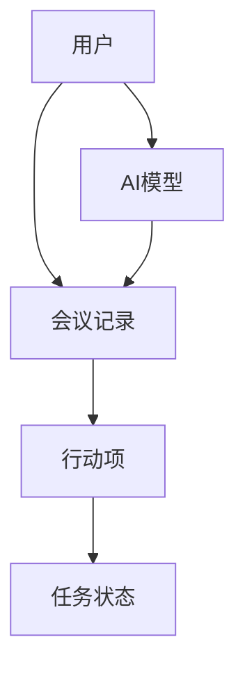
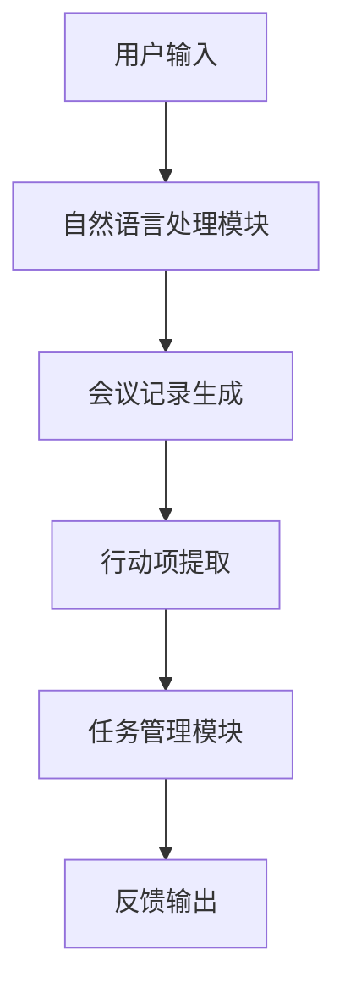
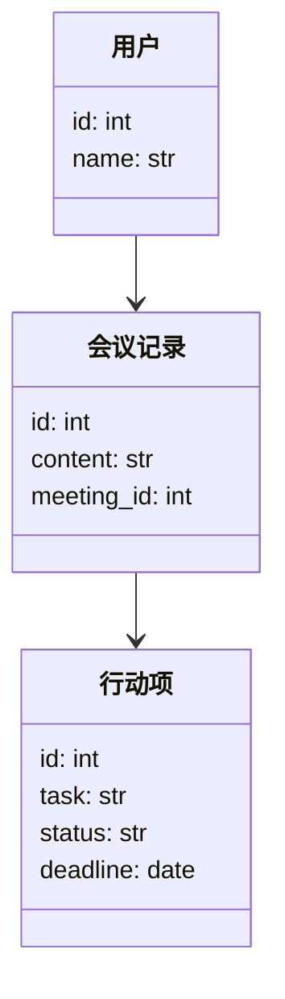
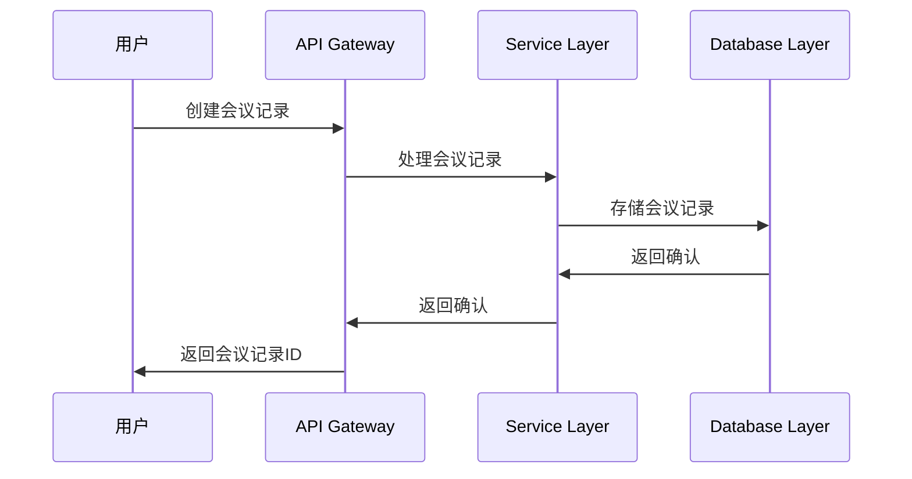

                 


# 构建企业级AI会议助手：会议记录与行动项跟踪

> 关键词：AI会议助手、自然语言处理、任务管理、企业效率、行动项跟踪

> 摘要：本文详细探讨了构建企业级AI会议助手的技术细节，从问题背景到系统实现，全面解析了会议记录与行动项跟踪的核心技术与实现方案。文章结合自然语言处理模型、系统架构设计和项目实战，为企业提供了一套高效、可靠的AI会议管理解决方案。

---

## 第一部分: 企业级AI会议助手的背景与核心概念

### 第1章: 问题背景与需求分析

#### 1.1 问题背景

企业级会议管理是一个复杂且关键的流程，涉及大量的信息交流和任务跟踪。传统的会议记录方式依赖于人工操作，存在以下痛点：

- **会议记录不完整**：人工记录容易遗漏关键点，导致后续行动项跟踪困难。
- **信息孤岛**：会议记录分散在不同的设备或平台上，难以统一管理和查询。
- **效率低下**：会议记录和任务跟踪需要大量时间，影响企业整体效率。

#### 1.2 问题描述

- **会议记录的低效性**：传统记录方式依赖于手动输入，耗时且容易出错。
- **行动项跟踪的不彻底性**：会议中提出的任务可能无法有效跟踪，导致任务完成率低。
- **信息孤岛与数据碎片化问题**：各部门使用的工具和记录格式不统一，增加了数据整合的难度。

#### 1.3 问题解决与边界

- **AI会议助手的目标与范围**：通过AI技术实现自动化会议记录和任务跟踪，提高会议效率和任务完成率。
- **边界与外延**：专注于会议记录和任务管理，不涉及其他企业管理系统。
- **核心要素与组成结构**：包括自然语言处理模块、任务管理模块和用户交互界面。

---

### 第2章: 核心概念与技术要点

#### 2.1 AI会议助手的核心概念

- **自然语言处理在会议记录中的应用**：利用NLP技术自动提取会议内容，生成结构化的会议记录。
- **任务管理与行动项跟踪的实现**：通过AI模型识别任务并跟踪其完成状态。
- **数据结构与信息组织方式**：采用树状结构或图结构组织会议信息，便于检索和管理。

#### 2.2 核心技术对比

- **传统会议记录与AI辅助记录的对比**：AI记录更高效、准确，支持结构化输出。
- **不同AI模型的性能对比**：例如，BERT在文本摘要任务中表现优于GPT。
- **会议助手的功能模块对比**：包括记录生成、任务提取、状态跟踪等核心功能。

#### 2.3 系统架构与实体关系

- **实体关系图（ER图）设计**：展示用户、会议记录、行动项和任务状态之间的关系。


- **核心模块的交互流程**：展示用户输入、自然语言处理模块、会议记录生成和行动项提取的流程。


---

## 第二部分: 算法原理与数学模型

### 第3章: 自然语言处理模型原理

#### 3.1 模型训练流程

- **数据预处理与特征提取**：对会议文本进行分词、去停用词和词向量化处理。
- **模型训练与优化**：使用预训练语言模型（如BERT）进行微调，优化模型在会议记录任务中的性能。
- **模型评估与调优**：通过BLEU、ROUGE等指标评估生成的会议记录质量，并进行超参数调整。

#### 3.2 模型推理与实现

- **文本摘要算法**：基于Seq2Seq模型生成会议摘要，使用beam search优化生成结果。
  ```python
  def text_summarization(model, tokenizer, text):
      inputs = tokenizer(text, return_tensors="pt", truncation=True, padding=True)
      outputs = model.generate(inputs.input_ids, max_length=100, num_beams=5)
      return tokenizer.decode(outputs[0], skip_special_tokens=True)
  ```

- **自动分类算法**：使用预训练的分类模型识别行动项并分类。
  ```python
  def action_classification(model, tokenizer, text):
      inputs = tokenizer(text, return_tensors="pt", truncation=True, padding=True)
      outputs = model(inputs.input_ids)
      predicted = torch.argmax(outputs.logits, dim=1)
      return predicted
  ```

#### 3.3 模型优化与调优

- **超参数优化**：通过网格搜索或贝叶斯优化找到最佳超参数组合。
- **模型压缩与部署**：采用知识蒸馏技术将大模型压缩为更小的模型，提高部署效率。

---

## 第三部分: 系统分析与架构设计方案

### 第4章: 系统架构设计

#### 4.1 问题场景介绍

- **会议管理系统的功能需求**：包括会议记录、任务跟踪、提醒通知等功能。
- **系统目标与范围**：构建一个支持多人协作、实时更新的AI会议管理系统。

#### 4.2 系统功能设计

- **领域模型设计**：展示会议记录、行动项和任务状态之间的关系。


- **系统架构设计**：展示系统的分层架构，包括数据层、业务逻辑层和用户界面层。


- **系统接口设计**：定义RESTful API接口，如`POST /api/meeting`用于创建会议记录。
- **系统交互设计**：展示用户与系统之间的交互流程。


---

## 第四部分: 项目实战

### 第5章: 环境安装与核心代码实现

#### 5.1 环境安装

- 安装Python和相关库：
  ```bash
  pip install transformers torch mermaid4jupyter
  ```

#### 5.2 核心代码实现

- **自然语言处理模块**：
  ```python
  from transformers import AutoTokenizer, AutoModelForSummarization

  tokenizer = AutoTokenizer.from_pretrained("facebook/bart-large-cnn")
  model = AutoModelForSummarization.from_pretrained("facebook/bart-large-cnn")
  def summarize(text):
      inputs = tokenizer(text, max_length=512, truncation=True, padding=True)
      outputs = model.generate(inputs.input_ids, max_length=100, num_beams=5)
      return tokenizer.decode(outputs[0], skip_special_tokens=True)
  ```

- **任务管理模块**：
  ```python
  import sqlite3

  def create_task(task, status, deadline):
      conn = sqlite3.connect('tasks.db')
      cursor = conn.cursor()
      cursor.execute('''CREATE TABLE IF NOT EXISTS tasks 
                        (id INTEGER PRIMARY KEY AUTOINCREMENT,
                         task TEXT,
                         status TEXT,
                         deadline DATE)''')
      cursor.execute('''INSERT INTO tasks(task, status, deadline)
                        VALUES (?, ?, ?)''', (task, status, deadline))
      conn.commit()
      conn.close()
  ```

#### 5.3 代码应用解读与分析

- **文本摘要模块**：使用预训练模型生成会议摘要，减少人工记录的工作量。
- **任务管理模块**：通过数据库存储任务状态，支持任务的动态更新和查询。

#### 5.4 实际案例分析

- **案例1**：公司会议记录的自动化生成与任务跟踪。
- **案例2**：跨部门协作中的任务分配与状态跟踪。

---

## 第五部分: 最佳实践与总结

### 第6章: 最佳实践与经验总结

#### 6.1 小结

- AI会议助手显著提高了企业会议管理的效率，减少了人工错误。
- 系统设计需要考虑数据安全和隐私保护。

#### 6.2 注意事项

- 数据输入的质量直接影响模型的输出，需确保数据的准确性和完整性。
- 模型的可解释性问题需要在实际应用中持续优化。

#### 6.3 未来趋势

- 更智能化的任务跟踪功能，如自动识别任务依赖和优先级。
- 结合知识图谱技术，实现更深度的会议内容理解和分析。

#### 6.4 拓展阅读

- 推荐书籍：《深度学习》（Ian Goodfellow等著）
- 推荐资源：Hugging Face的Transformers库文档

---

## 作者

作者：AI天才研究院/AI Genius Institute & 禅与计算机程序设计艺术 /Zen And The Art of Computer Programming

---

通过本文的详细讲解，读者可以全面理解企业级AI会议助手的构建过程，从理论到实践，掌握核心技术和系统设计方法。

