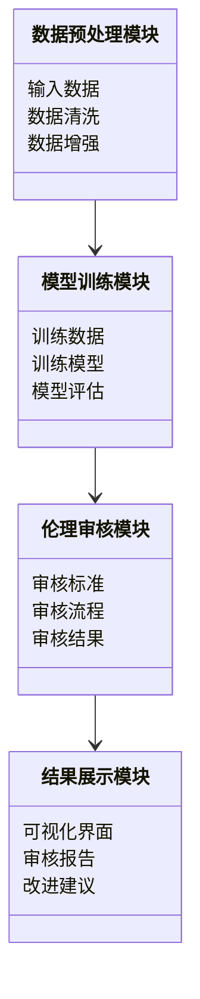
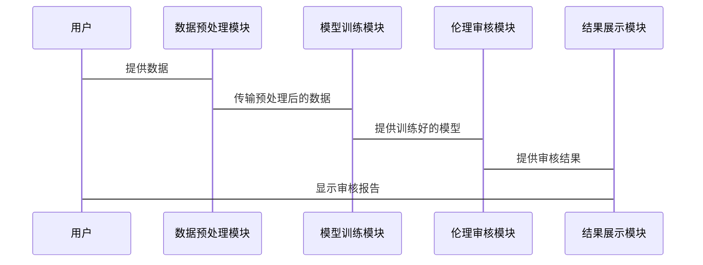

                 


# 构建企业级AI伦理审核框架：确保AI应用的公平性与透明度

> 关键词：AI伦理审核框架、企业级AI、公平性、透明度、算法偏见、伦理标准、可解释性

> 摘要：本文将探讨如何构建企业级AI伦理审核框架，确保AI应用的公平性与透明度。随着AI技术的快速发展，企业在应用AI技术时面临越来越多的伦理问题，如算法偏见、透明度不足等。本文将从AI伦理审核框架的核心概念出发，分析其算法原理，提供系统设计与架构方案，并通过实际案例展示如何构建这样一个框架。文章最后还将总结最佳实践、注意事项和未来研究方向。

---

## # 第1章: AI伦理审核框架的背景与问题背景

### ## 1.1 AI技术的快速发展与伦理挑战

#### ### 1.1.1 AI技术的快速发展概述
AI技术近年来取得了飞速发展，从图像识别、自然语言处理到自动驾驶等领域，AI已经渗透到社会的方方面面。企业也在积极采用AI技术来提升效率、优化决策和改善用户体验。

#### ### 1.1.2 AI技术在企业中的广泛应用
企业利用AI技术进行客户画像、精准营销、风险评估、智能客服等。例如，电商企业通过AI推荐系统为用户提供个性化推荐，金融机构利用AI进行信用评估和欺诈检测。

#### ### 1.1.3 AI技术带来的伦理问题
AI技术的广泛应用也带来了诸多伦理问题。例如，算法偏见可能导致某些群体在招聘、信贷等领域受到不公平对待；AI决策的不透明性使得用户难以理解其背后的原因；AI系统的误用可能导致隐私泄露或社会动荡。

### ## 1.2 AI伦理问题的背景与现状

#### ### 1.2.1 什么是AI伦理
AI伦理是指在设计、开发和应用AI系统时，需要遵循的道德准则和规范。这些准则旨在确保AI系统的公平性、透明性、隐私保护、责任追究等。

#### ### 1.2.2 当前AI伦理问题的主要表现
1. **算法偏见**：AI系统在训练数据中存在偏见，导致决策结果不公平。例如，招聘系统对女性候选人存在性别偏见。
2. **透明度不足**：用户无法理解AI系统的决策过程，导致信任缺失。
3. **隐私问题**：AI系统可能在处理数据时侵犯用户隐私。
4. **责任归属**：当AI系统造成损害时，责任归属不明确。

#### ### 1.2.3 企业级AI应用中的伦理挑战
企业级AI应用涉及的数据量大、场景复杂，伦理问题更为突出。例如，在金融领域的信用评估系统，如果存在算法偏见，可能导致某些群体被错误地拒绝贷款申请。

### ## 1.3 构建AI伦理审核框架的必要性

#### ### 1.3.1 为什么需要AI伦理审核框架
企业需要一个系统化的框架来评估和管理AI系统的伦理风险，确保其决策过程的公平性和透明度。通过框架，可以在AI系统开发和部署的各个环节中进行伦理审核，避免伦理问题的发生。

#### ### 1.3.2 AI伦理审核框架的目标与意义
AI伦理审核框架的目标是为企业提供一套标准化的伦理审核流程和方法，确保AI系统的决策过程符合伦理标准。其意义在于提升企业AI系统的可信度，保护用户权益，降低法律风险。

#### ### 1.3.3 伦理审核框架在企业中的作用
伦理审核框架可以帮助企业在AI系统的开发和部署过程中提前识别和解决伦理问题，提升系统的公平性和透明度，增强用户信任，避免因伦理问题导致的声誉损失和法律纠纷。

---

## # 第2章: AI伦理审核框架的核心概念与定义

### ## 2.1 AI伦理审核框架的定义与组成

#### ### 2.1.1 AI伦理审核框架的定义
AI伦理审核框架是一个用于评估和管理AI系统伦理风险的结构化方法。它包括一系列的流程、标准和工具，用于检测和纠正AI系统中的算法偏见、不透明性等问题。

#### ### 2.1.2 构成AI伦理审核框架的核心要素
1. **数据**：AI系统的输入数据，包括训练数据和测试数据。
2. **模型**：AI系统的算法模型，包括训练好的模型和未训练的模型。
3. **伦理标准**：用于评估AI系统是否符合伦理要求的具体准则。
4. **审核流程**：对AI系统进行伦理审核的具体步骤和方法。
5. **审核结果**：伦理审核的结果，包括是否符合伦理标准、存在的问题及改进建议。

#### ### 2.1.3 AI伦理审核框架的边界与外延
AI伦理审核框架的边界是企业内部的AI系统开发和部署过程，外延则包括与伦理审核相关的工具、流程和标准。

### ## 2.2 AI伦理审核框架的核心要素分析

#### ### 2.2.1 数据来源与处理
数据是AI系统的基石，数据的来源和处理方式直接影响AI系统的公平性。例如，如果训练数据中某一群体的比例过低，可能导致模型对这一群体的预测不准确。

#### ### 2.2.2 模型训练与部署
模型训练是AI系统的核心环节，模型的公平性需要在训练过程中进行评估和调整。模型部署后，需要持续监控其行为，确保其在实际应用中符合伦理标准。

#### ### 2.2.3 伦理审核流程与标准
伦理审核流程需要涵盖从数据预处理到模型部署的各个环节，确保每个环节都符合伦理标准。伦理标准需要根据企业的具体业务场景制定。

### ## 2.3 AI伦理审核框架的实体关系图

```mermaid
er
    actor: 审核人员
    actor: 数据提供者
    actor: 模型开发者
    entity: 数据集
    entity: 模型
    entity: 审核记录
    entity: 伦理标准
    entity: 审核流程
    entity: 审核结果
    relationship: 审核人员 <<---->> 审核记录
    relationship: 数据集 <<---->> 数据提供者
    relationship: 模型 <<---->> 模型开发者
    relationship: 审核流程 <<---->> 审核结果
    relationship: 审核记录 <<---->> 审核标准
```

---

## # 第3章: AI伦理审核框架的算法原理与数学模型

### ## 3.1 偏见检测算法

#### ### 3.1.1 偏见检测的基本原理
偏见检测算法通过分析AI模型的预测结果，发现不同群体之间的预测差异。例如，在招聘场景中，如果女性候选人被拒绝的概率高于男性，可能表明存在性别偏见。

#### ### 3.1.2 基于统计学的偏见检测方法
基于统计学的偏见检测方法包括卡方检验、t检验等。例如，可以使用卡方检验来判断不同群体的拒绝率是否显著不同。

#### ### 3.1.3 基于机器学习的偏见检测方法
基于机器学习的偏见检测方法包括对抗训练、公平约束优化等。例如，可以在模型训练过程中加入公平性约束，确保模型对所有群体的预测公平性。

### ## 3.2 透明度评估算法

#### ### 3.2.1 透明度评估的基本原理
透明度评估算法通过分析AI模型的决策过程，评估其可解释性。例如，可以通过特征重要性分析，了解模型的决策主要依赖哪些特征。

#### ### 3.2.2 透明度评估的指标体系
透明度评估的指标包括可解释性、可追溯性、可验证性等。例如，可以使用SHAP值来解释模型的预测结果。

---

## # 第4章: 系统分析与架构设计方案

### ## 4.1 系统功能设计

#### ### 4.1.1 领域模型设计
领域模型设计包括数据预处理、模型训练、伦理审核和结果展示四个模块。



#### ### 4.1.2 系统架构设计
系统架构设计采用模块化设计，包括数据预处理模块、模型训练模块、伦理审核模块和结果展示模块。


#### ### 4.1.3 系统接口设计
系统接口设计包括数据输入接口、模型训练接口、伦理审核接口和结果展示接口。

#### ### 4.1.4 系统交互设计
系统交互设计通过序列图展示用户与系统的交互流程。



---

## # 第5章: 项目实战

### ## 5.1 项目介绍
本项目旨在构建一个企业级AI伦理审核框架，确保AI应用的公平性与透明度。我们以一个招聘场景为例，展示如何构建这样一个框架。

### ## 5.2 环境安装
需要安装Python、scikit-learn、shap等工具。

### ## 5.3 核心实现

#### ### 5.3.1 数据预处理
```python
import pandas as pd
import numpy as np

# 读取数据
data = pd.read_csv('data.csv')

# 数据清洗
data.dropna(inplace=True)

# 数据增强
from sklearn.preprocessing import StandardScaler
scaler = StandardScaler()
scaled_data = scaler.fit_transform(data)
```

#### ### 5.3.2 模型训练
```python
from sklearn.linear_model import LogisticRegression
model = LogisticRegression()
model.fit(scaled_data, labels)
```

#### ### 5.3.3 偏见检测
```python
from sklearn.metrics import confusion_matrix
from sklearn.metrics import accuracy_score

def compute_bias(X, y_true, model):
    y_pred = model.predict(X)
    cm = confusion_matrix(y_true, y_pred)
    accuracy = accuracy_score(y_true, y_pred)
    return accuracy

# 计算偏见
bias = compute_bias(test_data, test_labels, model)
```

#### ### 5.3.4 透明度评估
```python
import shap

explainer = shap.TreeExplainer(model)
shap_values = explainer.shap_values(X_test)
```

### ## 5.4 案例分析
通过分析招聘场景中的数据，发现模型对女性候选人的拒绝率高于男性。通过框架检测到存在性别偏见，并给出改进建议。

### ## 5.5 项目小结
通过本项目，我们成功构建了一个企业级AI伦理审核框架，能够检测和纠正AI系统中的算法偏见和不透明性问题。

---

## # 第6章: 最佳实践、小结与展望

### ## 6.1 最佳实践
1. 在AI系统的开发和部署过程中，始终关注公平性和透明度。
2. 定期进行伦理审核，确保AI系统的决策过程符合伦理标准。
3. 使用可解释性工具，提升AI系统的透明度。

### ## 6.2 小结
本文详细探讨了构建企业级AI伦理审核框架的背景、核心概念、算法原理和系统设计。通过实际案例展示了如何将理论应用于实践，确保AI应用的公平性和透明度。

### ## 6.3 注意事项
企业在构建AI伦理审核框架时，需要注意数据隐私、模型复杂性和伦理标准的动态变化等问题。

### ## 6.4 拓展阅读
建议阅读《AI伦理：原则与实践》、《机器学习中的公平性与偏见》等书籍，深入了解AI伦理的理论与实践。

---

## 作者：AI天才研究院/AI Genius Institute & 禅与计算机程序设计艺术 /Zen And The Art of Computer Programming

