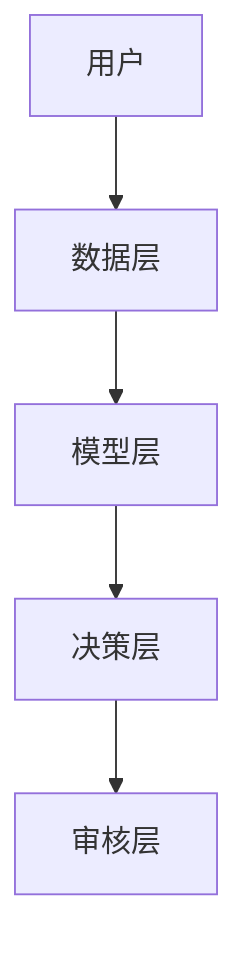
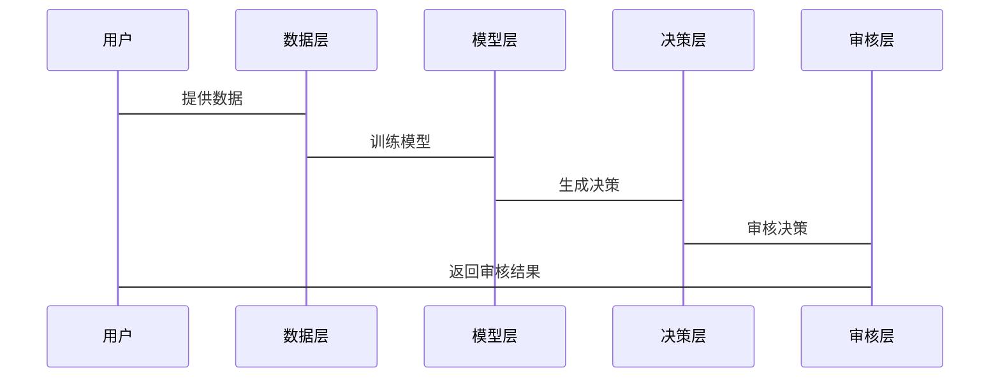

                 


# 构建企业级AI伦理审核框架：确保AI应用的公平性、透明度与可问责性

> 关键词：AI伦理审核框架，公平性，透明度，可问责性，企业级AI应用，伦理审核

> 摘要：随着人工智能技术的快速发展，AI在企业中的应用日益广泛，但随之而来的伦理问题也日益凸显。本文旨在探讨如何构建一个企业级AI伦理审核框架，确保AI应用的公平性、透明度与可问责性。通过分析伦理审核的核心概念、算法原理、系统架构以及实际案例，本文将详细阐述如何在企业中实现AI应用的伦理审核，为企业提供可操作的指导。

---

## 第1章: AI伦理审核框架的背景与问题背景

### 1.1 AI技术的快速发展与伦理挑战

#### 1.1.1 AI技术的快速发展概述
人工智能技术的快速发展为企业的业务创新和技术升级带来了巨大机遇。从自然语言处理到计算机视觉，从机器学习到深度学习，AI技术正在渗透到企业运营的方方面面。然而，这种快速发展的背后也带来了诸多伦理挑战。

#### 1.1.2 AI技术在企业中的广泛应用
AI技术在企业中的应用范围不断扩大。例如：
- **客户服务**：智能客服系统通过自然语言处理技术为用户提供24/7的咨询服务。
- **决策支持**：AI驱动的分析工具帮助企业做出更明智的商业决策。
- **自动化操作**：从生产自动化到供应链管理，AI技术正在改变企业的运作方式。

#### 1.1.3 AI技术带来的伦理问题
随着AI技术的广泛应用，伦理问题逐渐显现：
- **公平性问题**：AI算法可能因为训练数据的偏差而导致不公平的结果，例如招聘系统中的性别歧视。
- **透明度问题**：复杂的AI模型往往缺乏透明度，导致用户难以理解其决策依据。
- **可问责性问题**：当AI系统出现问题时，责任归属往往不明确，导致企业和用户之间产生信任危机。

### 1.2 企业级AI应用的伦理问题

#### 1.2.1 公平性问题
AI系统的公平性问题主要体现在以下几个方面：
- **数据偏差**：训练数据中的历史偏见可能导致AI系统在决策时产生不公平的结果。
- **算法歧视**：某些算法设计可能导致特定群体在AI决策中处于不利地位。

#### 1.2.2 透明度问题
透明度是用户信任AI系统的重要因素。然而，许多AI系统（尤其是复杂的深度学习模型）缺乏透明度，导致用户难以理解系统决策的依据。

#### 1.2.3 可问责性问题
当AI系统出现问题时，责任归属往往不明确。例如，当自动驾驶汽车发生事故时，责任可能涉及制造商、软件开发者和车主等多个方面。

### 1.3 构建AI伦理审核框架的必要性

#### 1.3.1 伦理审核框架的作用
- **确保公平性**：通过检测和消除算法中的偏见，确保AI系统的决策公平。
- **提升透明度**：通过可解释性技术，让用户了解AI系统决策的依据。
- **增强可问责性**：通过记录和追踪AI系统的决策过程，明确责任归属。

#### 1.3.2 伦理审核框架的核心目标
- 实现AI系统的公平性、透明度和可问责性。
- 提供一套系统化的方法和工具，帮助企业评估和改进AI系统的伦理合规性。

#### 1.3.3 伦理审核框架的边界与外延
- **边界**：仅关注AI系统的伦理问题，不涉及其他技术或业务问题。
- **外延**：涵盖从数据收集到模型部署的整个AI生命周期。

---

## 第2章: AI伦理审核框架的核心概念与联系

### 2.1 公平性、透明度与可问责性的定义与特点

#### 2.1.1 公平性的定义与特征
- **定义**：公平性是指AI系统在决策过程中不因种族、性别、年龄等因素对特定群体产生歧视。
- **特征**：可测量性、可解释性、可操作性。

#### 2.1.2 透明度的定义与特征
- **定义**：透明度是指AI系统的决策过程对用户或利益相关者而言是可理解的。
- **特征**：可解释性、可追溯性、可验证性。

#### 2.1.3 可问责性的定义与特征
- **定义**：可问责性是指当AI系统出现问题时，能够明确责任归属并采取相应的补救措施。
- **特征**：可追踪性、可追溯性、可追责性。

### 2.2 公平性、透明度与可问责性的关系

#### 2.2.1 公平性与透明度的关系
- 公平性是透明度的基础，透明度是实现公平性的手段。
- 透明度越高，用户越容易发现和解决公平性问题。

#### 2.2.2 透明度与可问责性的关系
- 透明度为可问责性提供依据，可问责性依赖于透明度。
- 可问责性的实现需要透明度的支持。

#### 2.2.3 公平性与可问责性的关系
- 公平性是可问责性的目标，可问责性是实现公平性的保障。
- 可问责性通过公平性来体现，公平性通过可问责性来保障。

### 2.3 核心概念的ER实体关系图

```
mermaid
    graph TD
        A[用户] --> B[数据]
        B --> C[模型]
        C --> D[决策]
        D --> E[结果]
        E --> F[审核]
        F --> G[伦理问题]
```

---

## 第3章: AI伦理审核框架的算法原理

### 3.1 公平性检测算法

#### 3.1.1 偏见检测算法
- **算法原理**：通过统计学方法检测数据集中是否存在偏见。
- **数学公式**：$$\text{偏见度量} = \frac{\text{正例中被拒绝的比例} - \text{反例中被拒绝的比例}}{\text{正例总数} + \text{反例总数}}$$

#### 3.1.2 基于公平性的数据预处理算法
- **算法原理**：对数据进行重新采样或加权，消除数据中的偏见。
- **数学公式**：$$\text{加权系数} = \frac{\text{目标比例}}{\text{当前比例}}$$

#### 3.1.3 基于公平性的模型优化算法
- **算法原理**：在模型训练过程中引入公平性约束，确保模型决策的公平性。
- **数学公式**：$$\text{损失函数} = \text{原始损失} + \lambda \times \text{公平性损失}$$

### 3.2 透明度增强算法

#### 3.2.1 可解释性模型的构建算法
- **算法原理**：通过构建线性模型或规则集模型，提高AI系统的可解释性。
- **数学公式**：$$\text{解释性分数} = \sum_{i=1}^{n} w_i \times x_i$$

#### 3.2.2 透明度报告生成算法
- **算法原理**：生成包含模型决策依据的报告，供用户参考。
- **流程图**：
  ```mermaid
  graph TD
      A[输入数据] --> B[模型处理]
      B --> C[决策结果]
      C --> D[报告生成]
  ```

#### 3.2.3 透明度评分算法
- **算法原理**：对AI系统的透明度进行评分，评估其可解释性。
- **数学公式**：$$\text{透明度评分} = \sum_{i=1}^{n} \frac{\text{可解释性分数}_i}{n}$$

### 3.3 可问责性增强算法

#### 3.3.1 责任链构建算法
- **算法原理**：构建责任链，明确AI系统出现问题时的责任归属。
- **流程图**：
  ```mermaid
  graph TD
      A[用户] --> B[数据]
      B --> C[模型]
      C --> D[决策]
      D --> E[结果]
      E --> F[责任链]
  ```

#### 3.3.2 责任分配算法
- **算法原理**：根据责任链分配责任，确保每个环节都有明确的责任人。
- **数学公式**：$$\text{责任分配} = \sum_{i=1}^{n} \frac{\text{责任权重}_i}{n}$$

#### 3.3.3 责任追踪算法
- **算法原理**：通过日志记录和追踪，明确AI系统出现问题时的决策过程。
- **流程图**：
  ```mermaid
  graph TD
      A[问题发生] --> B[日志记录]
      B --> C[责任追踪]
      C --> D[责任确定]
  ```

---

## 第4章: AI伦理审核框架的数学模型与公式

### 4.1 公平性检测的数学模型

#### 4.1.1 偏见度量公式
$$\text{偏见度量} = \frac{\text{正例中被拒绝的比例} - \text{反例中被拒绝的比例}}{\text{正例总数} + \text{反例总数}}$$

#### 4.1.2 公平性优化的数学模型
$$\text{损失函数} = \text{原始损失} + \lambda \times \text{公平性损失}$$

### 4.2 透明度增强的数学模型

#### 4.2.1 可解释性模型的构建公式
$$\text{解释性分数} = \sum_{i=1}^{n} w_i \times x_i$$

#### 4.2.2 透明度评分公式
$$\text{透明度评分} = \sum_{i=1}^{n} \frac{\text{可解释性分数}_i}{n}$$

### 4.3 可问责性的数学模型

#### 4.3.1 责任分配公式
$$\text{责任分配} = \sum_{i=1}^{n} \frac{\text{责任权重}_i}{n}$$

#### 4.3.2 责任追踪公式
$$\text{责任追踪} = \sum_{i=1}^{n} \text{日志记录}_i$$

---

## 第5章: AI伦理审核框架的系统架构设计

### 5.1 系统功能设计

#### 5.1.1 领域模型


#### 5.1.2 系统架构


#### 5.1.3 接口设计
- 数据接口：提供数据输入和输出的接口。
- 模型接口：提供模型训练和部署的接口。
- 决策接口：提供决策结果输出和日志记录的接口。

#### 5.1.4 交互流程


### 5.2 系统架构设计

#### 5.2.1 系统架构图


#### 5.2.2 模块交互流程


---

## 第6章: AI伦理审核框架的项目实战

### 6.1 环境安装与配置

#### 6.1.1 环境需求
- 操作系统：Linux/Windows/MacOS
- Python版本：3.6+
- 依赖库：numpy, pandas, scikit-learn, tensorflow

#### 6.1.2 安装命令
```bash
pip install numpy pandas scikit-learn tensorflow
```

### 6.2 核心代码实现

#### 6.2.1 公平性检测代码
```python
import numpy as np
from sklearn.metrics import classification_report

def calculate_bias_metrics(y_true, y_pred, sensitive_feature):
    # 计算正例和反例中的偏见度量
    positive = y_true[y_true == 1]
    negative = y_true[y_true == 0]
    
    positive_predictions = y_pred[positive.index]
    negative_predictions = y_pred[negative.index]
    
    positive_bias = np.mean(positive_predictions != positive)
    negative_bias = np.mean(negative_predictions != negative)
    
    bias_metric = (positive_bias - negative_bias) / (len(positive) + len(negative))
    return bias_metric
```

#### 6.2.2 透明度增强代码
```python
import pandas as pd
from sklearn.tree import DecisionTreeClassifier

def create_interpretable_model(X_train, y_train):
    model = DecisionTreeClassifier(max_depth=3)
    model.fit(X_train, y_train)
    return model
```

#### 6.2.3 可问责性增强代码
```python
import logging

def log_decision-making(process):
    logging.basicConfig(level=logging.INFO)
    logger = logging.getLogger("AI_Ethics_Framework")
    logger.info(f"Decision-making process: {process}")
```

### 6.3 案例分析与代码解读

#### 6.3.1 案例分析
假设我们有一个招聘系统，使用AI算法筛选候选人。为了确保公平性，我们需要检测算法是否存在性别歧视。

#### 6.3.2 代码实现
```python
# 数据准备
X_train = pd.DataFrame({
    '性别': [0, 0, 1, 1, 0],
    '经验': [2, 3, 1, 4, 2],
    '学历': [1, 2, 2, 1, 1],
    '是否录用': [1, 1, 0, 1, 0]
})

y_true = X_train['是否录用'].values
X_train.drop('是否录用', axis=1, inplace=True)

# 公平性检测
sensitive_feature = '性别'
bias_metric = calculate_bias_metrics(y_true, y_pred, sensitive_feature)
print(f"偏见度量: {bias_metric}")
```

### 6.4 项目小结

---

## 第7章: 总结与展望

### 7.1 总结
通过本文的探讨，我们了解了构建企业级AI伦理审核框架的重要性和具体实现方法。从核心概念到算法原理，再到系统架构和项目实战，我们逐步构建了一个完整的伦理审核框架。

### 7.2 展望
未来，随着AI技术的不断发展，AI伦理审核框架也需要不断优化和改进。我们可以进一步研究如何在模型部署阶段持续监控和评估伦理合规性，以及如何在多模态数据中实现更复杂的伦理审核。

---

## 作者信息

作者：AI天才研究院/AI Genius Institute & 禅与计算机程序设计艺术/Zen And The Art of Computer Programming

---

**注**：以上内容为示例性的详细目录和文章结构，实际撰写时可根据具体需求进一步扩展和调整。

