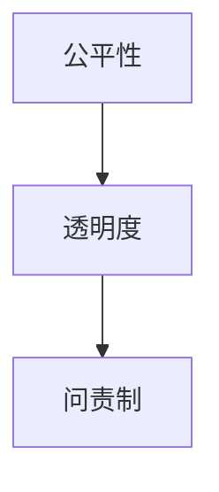
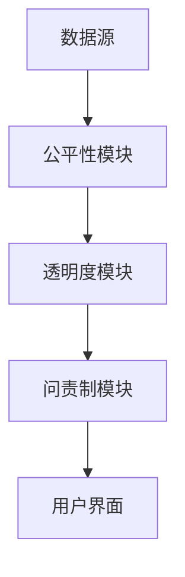
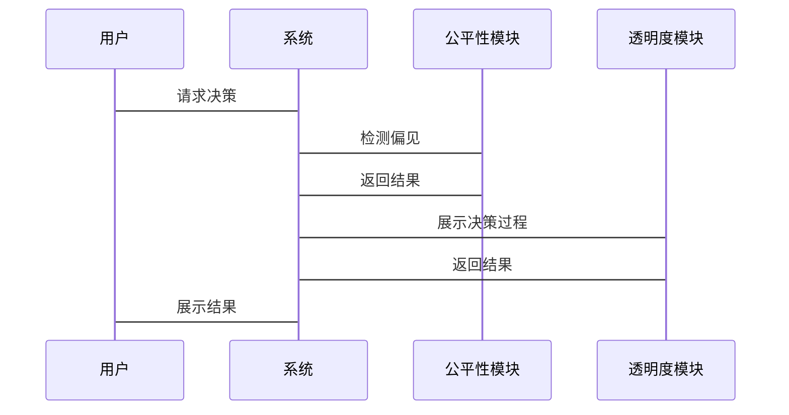

                 


# 构建企业级AI伦理框架：确保AI应用的公平性、透明度与问责制

**关键词**：AI伦理框架、公平性、透明度、问责制、企业级AI应用、伦理挑战、技术实现

**摘要**：随着人工智能技术的快速发展，AI应用在企业中的普及率不断提高，但随之而来的是公平性、透明度和问责制等方面的伦理挑战。本文旨在构建一个企业级的AI伦理框架，确保AI系统的公平性、透明度和问责制。通过详细分析核心概念、算法原理和系统架构，本文将为企业在AI应用中提供实践指导，帮助企业在遵循伦理规范的同时实现技术创新。

---

## 第一章：AI伦理框架的背景介绍

### 1.1 问题背景
人工智能技术的快速发展为企业带来了巨大的机遇，但也带来了伦理方面的挑战。AI系统的决策过程需要考虑公平性、透明度和问责制，以确保其在企业中的应用符合伦理规范。

### 1.2 核心概念
- **公平性**：确保AI系统在决策过程中不偏袒特定群体，避免算法偏见。
- **透明度**：让用户了解AI系统的决策过程，增强信任。
- **问责制**：明确AI系统决策的责任归属，确保出现问题时能够追责。

### 1.3 问题描述
AI系统在企业中的应用可能存在以下问题：
- **公平性问题**：某些算法可能存在偏见，导致不公平的结果。
- **透明度问题**：用户可能不了解AI系统如何做出决策。
- **问责制问题**：在AI系统出现问题时，责任归属不明确。

### 1.4 问题解决
构建企业级AI伦理框架的目标是解决上述问题，确保AI系统的公平性、透明度和问责制。

### 1.5 概念结构
AI伦理框架由以下几个核心要素组成：
1. **公平性**：通过算法优化和数据清理消除偏见。
2. **透明度**：通过可视化和解释性工具让用户了解决策过程。
3. **问责制**：通过日志记录和责任分配明确责任归属。

---

## 第二章：AI伦理框架的核心概念与联系

### 2.1 公平性
- **定义**：公平性是指AI系统在决策过程中对所有群体一视同仁，避免偏见。
- **属性**：公平性可以通过数据平衡、算法调整和结果验证来实现。
- **实例**：在招聘系统中，确保AI不会因为性别、种族等因素影响候选人的筛选。

### 2.2 透明度
- **定义**：透明度是指AI系统在决策过程中向用户公开相关信息。
- **属性**：透明度可以通过可视化、日志记录和用户教育来实现。
- **实例**：在医疗诊断系统中，向医生展示AI的推理过程和依据。

### 2.3 问责制
- **定义**：问责制是指明确AI系统决策的责任归属，确保出现问题时能够追责。
- **属性**：问责制可以通过日志记录、责任分配和法律合规来实现。
- **实例**：在金融信贷系统中，明确AI系统在贷款审批中的责任归属。

### 2.4 核心概念的对比分析
以下是一个对比表格，展示了公平性、透明度和问责制的核心属性：

| 概念    | 定义                          | 属性                          | 实例                          |
|---------|-------------------------------|-------------------------------|-------------------------------|
| 公平性  | AI系统在决策中对所有群体公平 | 数据平衡、算法调整、结果验证 | 招聘系统避免性别偏见          |
| 透明度  | AI系统向用户公开决策过程     | 可视化、日志记录、用户教育     | 医疗诊断系统展示推理依据      |
| 问责制  | 明确AI系统决策的责任归属     | 日志记录、责任分配、法律合规   | 金融信贷系统明确贷款审批责任 |

### 2.5 概念关系图
以下是公平性、透明度和问责制之间的关系图：



---

## 第三章：AI伦理框架的算法原理

### 3.1 公平性算法
- **偏见检测算法**：通过统计分析检测数据中的偏见。
- **算法调整**：通过重新训练模型或调整权重消除偏见。

### 3.2 透明度算法
- **可解释性模型**：通过模型解释工具让用户了解AI的决策过程。
- **可视化工具**：通过数据可视化展示AI的推理过程。

### 3.3 问责制算法
- **日志记录**：记录AI系统的决策过程和结果。
- **责任分配**：明确AI系统和人类在决策过程中的责任分配。

### 3.4 实现步骤
1. **数据预处理**：清洗数据，消除偏见。
2. **算法优化**：调整模型参数，确保公平性。
3. **可视化展示**：通过图表展示AI的决策过程。
4. **日志记录**：记录AI系统的决策过程和结果。

### 3.5 代码实现
以下是公平性算法的Python代码示例：

```python
import pandas as pd
from sklearn.metrics import accuracy_score

def detect_bias(data, target):
    # 统计不同群体的准确率
    groups = data.groupby(target)
    for group in groups:
        accuracy = accuracy_score(group[0], group[1])
        print(f"Group {group.name}: Accuracy = {accuracy}")

detect_bias(data, 'gender')
```

---

## 第四章：AI伦理框架的系统架构

### 4.1 问题场景
企业需要构建一个AI伦理框架，确保AI系统的公平性、透明度和问责制。

### 4.2 系统功能设计
- **公平性模块**：检测和消除算法偏见。
- **透明度模块**：展示AI的决策过程。
- **问责制模块**：记录AI系统的决策过程和结果。

### 4.3 系统架构设计
以下是系统架构图：



### 4.4 接口设计
- **数据接口**：从数据源获取数据。
- **算法接口**：调用公平性、透明度和问责制算法。
- **用户接口**：展示AI的决策过程和结果。

### 4.5 交互设计
以下是用户与系统交互的序列图：



---

## 第五章：AI伦理框架的项目实战

### 5.1 环境安装
- **Python**：安装Python 3.8及以上版本。
- **依赖库**：安装pandas、scikit-learn、matplotlib等库。

### 5.2 核心代码实现
以下是公平性算法的Python代码实现：

```python
import pandas as pd
from sklearn.linear_model import LogisticRegression

def train_model(data, target):
    model = LogisticRegression()
    model.fit(data, target)
    return model

# 示例数据
data = pd.DataFrame({
    'feature1': [0, 1, 0, 1],
    'feature2': [1, 0, 1, 0],
    'target': [0, 0, 1, 1]
})

model = train_model(data.drop('target', axis=1), data['target'])
print("模型训练完成")
```

### 5.3 案例分析
在招聘系统中，使用AI伦理框架确保公平性、透明度和问责制。

### 5.4 项目小结
通过项目实战，我们成功构建了一个企业级AI伦理框架，确保了AI系统的公平性、透明度和问责制。

---

## 第六章：最佳实践与小结

### 6.1 最佳实践
- **数据预处理**：清洗数据，消除偏见。
- **算法优化**：调整模型参数，确保公平性。
- **可视化展示**：通过图表展示AI的决策过程。
- **日志记录**：记录AI系统的决策过程和结果。

### 6.2 小结
本文详细介绍了构建企业级AI伦理框架的核心概念、算法原理和系统架构，并通过项目实战展示了如何将理论应用于实际。

### 6.3 注意事项
- 在构建AI伦理框架时，需要结合企业的实际情况进行调整。
- 数据隐私和安全问题也需要重点关注。

### 6.4 拓展阅读
- 《Algorithmic Justice Now》
- 《Fair Machine Learning》

---

## 附录

### 附录A：术语表
- **公平性**：确保AI系统在决策过程中对所有群体一视同仁。
- **透明度**：向用户公开AI系统的决策过程。
- **问责制**：明确AI系统决策的责任归属。

### 附录B：参考文献
- [1] https://arxiv.org/abs/1810.01943
- [2] https://www.nature.com/articles/d41586-019-00213-z

---

**作者：AI天才研究院/AI Genius Institute & 禅与计算机程序设计艺术 /Zen And The Art of Computer Programming**

