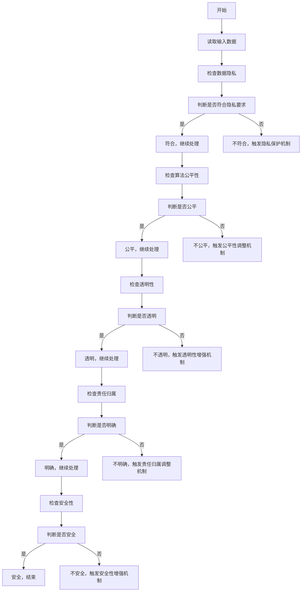
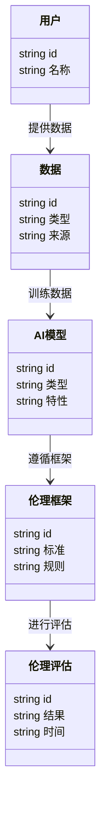
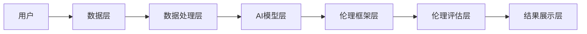
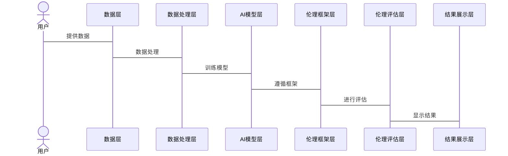

                 


# 《构建企业级AI伦理框架：确保负责任的AI应用》

## 关键词：
企业级AI、伦理框架、负责任AI、AI治理、技术伦理

## 摘要：
随着人工智能技术的快速发展，企业级AI应用在各个领域中越来越普及。然而，AI技术的应用也带来了诸多伦理问题。本文将详细探讨构建企业级AI伦理框架的必要性、核心概念、算法原理、系统架构设计以及实际应用案例。通过分析AI伦理框架的结构与组成，结合具体的算法实现和系统设计，为读者提供一个全面的视角，以确保AI应用的负责任与合规性。

---

# 第一部分: AI伦理框架的背景与核心概念

## 第1章: AI伦理框架的背景与问题背景

### 1.1 AI技术的快速发展与伦理挑战

#### 1.1.1 AI技术的发展现状
人工智能（AI）技术近年来取得了显著的进展，从深度学习到自然语言处理，AI已经渗透到各个行业。企业级AI应用涵盖了从数据分析到自动化决策的各个领域。

#### 1.1.2 AI技术带来的伦理问题
随着AI技术的广泛应用，伦理问题逐渐浮现。例如，算法偏见、数据隐私、透明度等问题，直接影响了AI应用的可信度和社会接受度。

#### 1.1.3 企业级AI应用的特殊性
企业级AI应用通常涉及大量数据和复杂的决策过程。由于其直接影响企业的运营和利益相关者，因此在伦理方面的要求更加严格。

### 1.2 问题背景与问题描述

#### 1.2.1 AI伦理问题的核心要素
AI伦理问题的核心要素包括数据隐私、算法公平性、透明性、责任归属、安全性和伦理治理等方面。

#### 1.2.2 企业级AI应用的伦理挑战
企业级AI应用面临的伦理挑战包括数据滥用、算法偏见、决策不可解释性、用户隐私保护不足等。

#### 1.2.3 问题的边界与外延
AI伦理问题不仅涉及技术本身，还包括数据采集、处理、存储和使用等多个环节。同时，还需要考虑法律、社会和文化等外部因素。

### 1.3 问题解决与核心概念

#### 1.3.1 AI伦理框架的定义
AI伦理框架是一种用于指导和规范AI系统设计、开发和应用的结构化方法，旨在确保AI系统的伦理合规性和社会接受度。

#### 1.3.2 企业级AI伦理框架的目标
企业级AI伦理框架的目标是通过制定明确的伦理准则和规范，确保AI系统的透明性、公平性、安全性和可问责性。

#### 1.3.3 核心概念的结构与组成
AI伦理框架的核心概念包括伦理原则、伦理评估、责任归属、透明性机制和治理结构等。

## 第2章: AI伦理框架的核心概念与联系

### 2.1 核心概念原理

#### 2.1.1 AI伦理框架的核心要素
AI伦理框架的核心要素包括数据隐私、算法公平性、透明性、责任归属和安全性。

#### 2.1.2 各要素之间的关系
各要素之间的关系是相互关联且相互影响的。例如，数据隐私和算法公平性共同影响系统的透明性和可问责性。

#### 2.1.3 核心概念的数学模型
可以通过矩阵分析的方法来表示各核心要素之间的关系。例如，使用矩阵来表示数据隐私、算法公平性和透明性之间的相互作用。

### 2.2 核心概念属性特征对比表

| 核心概念 | 属性特征               | 对比分析                          |
|----------|------------------------|------------------------------------|
| 数据隐私 | 数据采集、存储、使用   | 数据隐私是AI伦理框架的核心要素之一，直接影响系统的透明性和可问责性。 |
| 算法公平性 | 数据分布、模型训练     | 算法公平性是确保AI系统不偏不倚的关键因素，需要通过数据清洗和模型优化来实现。 |
| 透明性 | 信息展示、决策解释       | 透明性是用户信任AI系统的基础，需要通过可视化技术和可解释性算法来实现。 |
| 责任归属 | 决策结果、责任分配       | 责任归属是企业在面对AI系统错误时需要承担的法律责任和社会责任。 |
| 安全性 | 系统防护、数据加密       | 安全性是确保AI系统不被恶意攻击和滥用的基础，需要通过安全技术和规范来实现。 |

### 2.3 ER实体关系图
```mermaid
erDiagram
    actor 用户 {
        string id
        string 名称
    }
    actor 开发者 {
        string id
        string 名称
    }
    actor 企业 {
        string id
        string 名称
    }
    actor 监管机构 {
        string id
        string 名称
    }
    entity 数据 {
        string id
        string 类型
        string 来源
    }
    entity AI模型 {
        string id
        string 类型
        string 特性
    }
    entity 伦理框架 {
        string id
        string 标准
        string 规则
    }
    entity 伦理评估 {
        string id
        string 结果
        string 时间
    }
    actor 用户 --> entity 数据 : 提供数据
    actor 开发者 --> entity AI模型 : 开发模型
    entity 数据 --> entity AI模型 : 训练数据
    entity AI模型 --> entity 伦理框架 : 遵循框架
    entity 伦理框架 --> entity 伦理评估 : 进行评估
```

---

## 第三部分: 算法原理讲解

### 第3章: AI伦理框架的算法原理

#### 3.1 算法原理概述
AI伦理框架的算法原理包括数据预处理、模型训练、伦理评估和结果反馈等步骤。通过这些步骤，确保AI系统的伦理合规性。

#### 3.2 基于规则的伦理判断算法
基于规则的伦理判断算法是一种简单但有效的算法，适用于企业级AI应用的伦理评估。

#### 3.2.1 算法流程图


#### 3.2.2 算法实现代码
```python
def ethical_check(data, framework):
    # 数据隐私检查
    if not privacy_check(data):
        return "隐私问题"
    # 算法公平性检查
    if not fairness_check(data, framework):
        return "公平性问题"
    # 透明性检查
    if not transparency_check(data, framework):
        return "透明性问题"
    # 责任归属检查
    if not accountability_check(data, framework):
        return "责任归属问题"
    # 安全性检查
    if not security_check(data, framework):
        return "安全性问题"
    return "无伦理问题"
```

#### 3.2.3 算法数学模型
基于规则的伦理判断算法可以通过以下数学模型表示：

$$
\text{结果} = \sum_{i=1}^{n} \text{规则}_i \times \text{权重}_i
$$

其中，$\text{规则}_i$ 表示第i个伦理规则，$\text{权重}_i$ 表示规则的重要性。

---

## 第四部分: 系统分析与架构设计方案

### 第4章: 问题场景介绍

#### 4.1 问题场景描述
企业级AI应用通常涉及大量数据和复杂的决策过程，因此在伦理方面需要进行严格的评估和管理。

#### 4.2 系统介绍
本系统旨在通过构建企业级AI伦理框架，确保AI系统的伦理合规性和社会接受度。

### 第5章: 系统功能设计

#### 5.1 领域模型


#### 5.2 系统架构设计


#### 5.3 系统接口设计
系统接口设计包括数据接口、模型接口和评估接口。每个接口都需要定义明确的输入和输出格式。

#### 5.4 系统交互设计


---

## 第五部分: 项目实战

### 第6章: 项目实战

#### 6.1 环境安装
需要安装Python、Pandas、Scikit-learn等库。

#### 6.2 系统核心实现源代码
```python
class EthicalChecker:
    def __init__(self, framework):
        self.framework = framework

    def check(self, data):
        # 数据隐私检查
        if not selfprivacy_check(data):
            return "隐私问题"
        # 算法公平性检查
        if not self.fairness_check(data, self.framework):
            return "公平性问题"
        # 透明性检查
        if not self.transparency_check(data, self.framework):
            return "透明性问题"
        # 责任归属检查
        if not self.accountability_check(data, self.framework):
            return "责任归属问题"
        # 安全性检查
        if not self.security_check(data, self.framework):
            return "安全性问题"
        return "无伦理问题"

    def privacy_check(self, data):
        # 数据隐私检查算法
        pass

    def fairness_check(self, data, framework):
        # 算法公平性检查算法
        pass

    def transparency_check(self, data, framework):
        # 透明性检查算法
        pass

    def accountability_check(self, data, framework):
        # 责任归属检查算法
        pass

    def security_check(self, data, framework):
        # 安全性检查算法
        pass
```

#### 6.3 代码应用解读与分析
通过具体的代码实现，我们可以看到AI伦理框架的各个组成部分是如何协同工作的。每个检查函数都会对数据进行相应的评估，确保AI系统的伦理合规性。

#### 6.4 实际案例分析和详细讲解剖析
通过一个实际案例，分析如何应用上述代码实现企业级AI伦理框架的构建和应用。

#### 6.5 项目小结
总结项目的主要成果和经验教训，为后续的优化和改进提供参考。

---

## 第六部分: 最佳实践

### 第7章: 最佳实践

#### 7.1 小结
总结全文的核心内容和主要观点，强调构建企业级AI伦理框架的重要性。

#### 7.2 注意事项
在实际应用中，需要注意数据隐私、算法公平性、透明性、责任归属和安全性等方面的问题。

#### 7.3 拓展阅读
推荐一些与AI伦理框架相关的书籍和论文，供读者进一步学习和研究。

---

## 作者：AI天才研究院/AI Genius Institute & 禅与计算机程序设计艺术 /Zen And The Art of Computer Programming

---

**本文内容总结：** 本文从背景介绍、核心概念、算法原理、系统架构设计、项目实战到最佳实践，全面详细地探讨了构建企业级AI伦理框架的必要性、方法和实现。通过具体的代码示例和系统设计，帮助读者更好地理解和应用AI伦理框架，确保AI应用的负责任与合规性。

