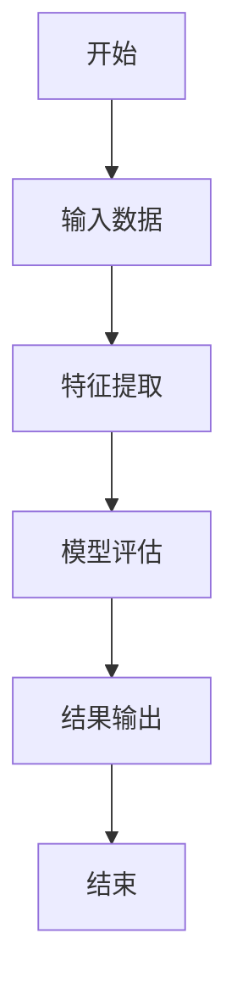

                 


```markdown
# 第三章: 伦理评估算法原理

## 3.1 算法原理概述

### 3.1.1 伦理评分模型

伦理评分模型是一种基于伦理因素的加权评分系统，用于评估AI系统的伦理风险。该模型将多个伦理因素（如隐私、公平性、透明度等）进行量化评估，并根据其权重计算综合评分。评分越高，表示系统的伦理风险越低。

**伦理评分公式：**
$$
\text{伦理评分} = \sum (\text{伦理因素权重} \times \text{伦理因素评分})
$$

### 3.1.2 基于规则的伦理评估

基于规则的伦理评估是一种通过预定义伦理规则来评估AI系统行为的方法。这些规则通常包括明确的条件和行动，例如“如果AI系统收集的数据未获得用户同意，则视为违反隐私原则”。

### 3.1.3 基于学习的伦理评估

基于学习的伦理评估是一种利用机器学习模型来预测AI系统行为的伦理风险。该方法通过训练数据学习伦理评估的模式，并根据输入数据预测伦理评分。

## 3.2 算法实现与流程图

### 3.2.1 算法实现流程

1. **输入数据**：收集AI系统的相关信息，包括数据来源、算法类型、应用场景等。
2. **特征提取**：从输入数据中提取伦理相关特征，例如隐私风险、公平性评分等。
3. **模型评估**：根据预定义的伦理规则或训练好的机器学习模型，对提取的特征进行评估，计算伦理评分。
4. **结果输出**：输出伦理评分和具体建议。

### 3.2.2 算法流程图（Mermaid）



## 3.3 数学模型与公式

### 3.3.1 伦理评分公式

$$
\text{伦理评分} = \sum (\text{伦理因素权重} \times \text{伦理因素评分})
$$

例如，假设隐私、公平性和透明度的权重分别为0.4、0.3和0.3，对应的评分为0.8、0.7和0.6：

$$
\text{伦理评分} = 0.4 \times 0.8 + 0.3 \times 0.7 + 0.3 \times 0.6 = 0.32 + 0.21 + 0.18 = 0.71
$$

评分范围在0到1之间，评分越高，表示系统的伦理风险越低。

## 3.4 伦理评估算法的Python实现

```python
def calculate_ethical_score(factors, weights):
    score = 0
    for factor, weight in zip(factors, weights):
        score += weight * factor
    return score

# 示例：隐私、公平性、透明度评分分别为0.8、0.7、0.6，权重为0.4、0.3、0.3
factors = [0.8, 0.7, 0.6]
weights = [0.4, 0.3, 0.3]
score = calculate_ethical_score(factors, weights)
print("伦理评分:", score)
```

### 3.4.1 代码解读

- `calculate_ethical_score`函数：接受伦理因素评分和权重作为输入，计算综合伦理评分。
- `factors`：伦理因素评分，例如隐私、公平性和透明度的评分。
- `weights`：对应伦理因素的权重。
- 返回值：综合伦理评分。

## 3.5 案例分析

假设某企业的AI推荐系统存在以下问题：
- 隐私风险：用户数据未明确告知用途（评分0.8）。
- 公平性：推荐结果存在算法偏见（评分0.7）。
- 透明度：未向用户解释推荐逻辑（评分0.6）。

计算伦理评分：
$$
\text{伦理评分} = 0.4 \times 0.8 + 0.3 \times 0.7 + 0.3 \times 0.6 = 0.71
$$

评分0.71表示该系统的伦理风险较高，需要进一步优化。

## 3.6 伦理评估的数学模型扩展

可以进一步引入更多的伦理因素，例如：
- 责任归属：评分0.5，权重0.2。
- 社会影响：评分0.4，权重0.1。

扩展后的评分公式：
$$
\text{伦理评分} = 0.4 \times 0.8 + 0.3 \times 0.7 + 0.2 \times 0.5 + 0.1 \times 0.4 = 0.32 + 0.21 + 0.1 + 0.04 = 0.67
$$

评分0.67进一步降低了系统评分，提示需要优化责任归属和社会影响方面。

---

**思考步骤总结：**

1. **问题分析**：确定AI系统的伦理评分模型需要考虑哪些因素。
2. **模型设计**：定义伦理因素及其权重，建立评分公式。
3. **算法实现**：编写函数实现评分计算，并提供代码示例。
4. **案例分析**：通过具体案例验证模型的有效性。
5. **模型扩展**：考虑更多伦理因素，优化评分模型。

通过以上步骤，可以构建一个简单但功能完善的AI伦理评估算法，帮助企业识别和优化AI应用的伦理风险。

---

**下一部分内容：第四章 系统分析与架构设计方案**

