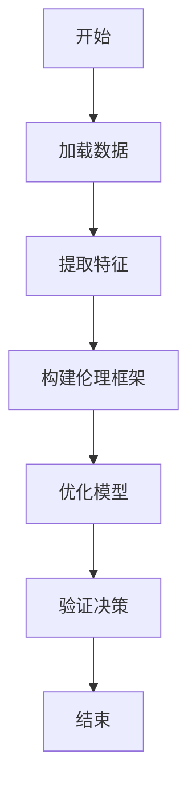
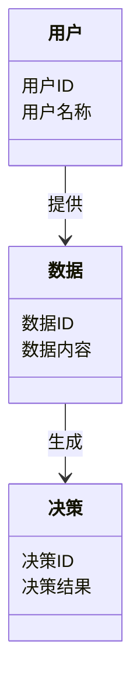
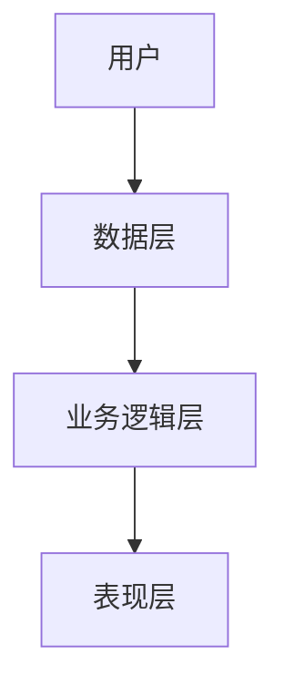
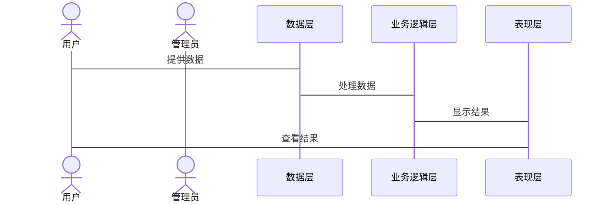

                 


# 构建企业级AI伦理顾问：确保AI应用的道德合规

## 关键词：AI伦理、企业合规、道德算法、可解释性AI、伦理框架、系统架构

## 摘要：随着人工智能技术的快速发展，企业级AI应用日益普及。然而，AI系统的决策过程可能引发伦理和法律问题。本文旨在探讨如何构建企业级AI伦理顾问系统，通过详细分析AI伦理的核心概念、算法原理和系统架构，提供一种确保AI应用道德合规的解决方案。

---

# 第一部分: AI伦理与企业合规背景

## 第1章: AI伦理的基本概念

### 1.1 问题背景与挑战

#### 1.1.1 AI技术的快速发展与伦理问题
人工智能技术的快速发展为企业和社会带来了巨大变革，但也引发了许多伦理问题。例如，AI算法可能存在的偏见、透明度不足以及隐私泄露等问题。这些问题不仅影响用户体验，还可能导致法律风险。

#### 1.1.2 企业AI应用中的伦理风险
企业AI应用中的伦理风险主要体现在以下方面：
- **数据隐私**：AI系统可能收集和处理大量用户数据，存在数据泄露风险。
- **算法偏见**：AI算法可能因为训练数据的偏差而产生不公平的决策。
- **透明度不足**：用户无法理解AI系统的决策过程，导致信任缺失。

#### 1.1.3 伦理合规的重要性与必要性
伦理合规是企业在AI应用中必须遵守的基本原则。合规不仅可以降低法律风险，还能提升用户信任，增强企业的社会形象。

### 1.2 问题描述与解决思路

#### 1.2.1 AI伦理的核心问题
AI伦理的核心问题在于如何在技术实现中融入伦理原则，确保系统决策符合人类价值观。

#### 1.2.2 企业AI应用中的伦理合规需求
企业需要确保AI系统在以下方面符合伦理要求：
- 数据收集与处理的合法性。
- 算法决策的公平性与透明性。
- 用户隐私的保护。

#### 1.2.3 伦理顾问系统的目标与功能
AI伦理顾问系统的目的是为企业的AI应用提供伦理合规的决策支持。其主要功能包括：
- 伦理框架的设计与优化。
- 算法偏见的检测与修复。
- 系统透明度的提升。

### 1.3 问题边界与外延

#### 1.3.1 AI伦理的适用范围
AI伦理适用于所有AI应用场景，包括但不限于：
- 自然语言处理。
- 机器学习模型。
- 数据分析与决策支持。

#### 1.3.2 企业AI应用的边界
企业AI应用的边界包括：
- 数据来源的合法性。
- 算法决策的透明性。
- 用户隐私的保护。

#### 1.3.3 伦理合规的外延与扩展
伦理合规的外延包括：
- 行业标准的制定。
- 政策法规的遵守。
- 社会责任的履行。

### 1.4 概念结构与核心要素

#### 1.4.1 AI伦理的核心要素
AI伦理的核心要素包括：
- 透明性：确保AI系统的决策过程可解释。
- 公平性：消除算法偏见，确保决策公平。
- 隐私保护：保护用户数据安全。

#### 1.4.2 伦理顾问系统的组成
伦理顾问系统主要由以下模块组成：
- 数据采集与处理模块。
- 伦理框架设计模块。
- 算法优化模块。

#### 1.4.3 系统功能与核心模块
系统功能包括：
- 数据采集与预处理。
- 伦理框架的设计与优化。
- 算法决策的可解释性分析。

---

## 第2章: AI伦理的核心概念与联系

### 2.1 核心概念原理

#### 2.1.1 伦理原则与AI系统的关系
伦理原则是AI系统设计的基础，确保系统决策符合人类价值观。

#### 2.1.2 伦理框架的构建方法
构建伦理框架需要考虑以下步骤：
1. 确定核心伦理原则。
2. 设计算法决策规则。
3. 实现伦理框架的验证与优化。

#### 2.1.3 伦理决策的数学模型
伦理决策的数学模型可以用以下公式表示：
$$
\text{Ethical Decision} = \argmax_{a} \sum_{i=1}^{n} w_i \cdot p_i(a)
$$
其中，$w_i$ 是伦理原则 $p_i$ 的权重，$a$ 是决策动作。

### 2.2 概念属性对比表

| 伦理原则 | 定义 | 示例 | 重要性 |
|----------|------|------|--------|
| 透明性   | 决策过程可解释 | 用户能够理解AI决策 | 高      |
| 公平性   | 决策无偏见 | 算法公平对待所有用户 | 高      |
| 隐私保护 | 数据安全 | 用户数据不被滥用 | 高      |

### 2.3 ER实体关系图

```mermaid
erDiagram
    actor 用户 {
        <属性> 用户ID
        <属性> 用户名称
    }
    actor 管理员 {
        <属性> 管理员ID
        <属性> 管理员名称
    }
    entity 数据 {
        <属性> 数据ID
        <属性> 数据内容
    }
    entity 决策 {
        <属性> 决策ID
        <属性> 决策结果
    }
    entity 伦理框架 {
        <属性> 框架ID
        <属性> 框架规则
    }
    用户 --> 数据 : 提供
    管理员 --> 数据 : 管理
    数据 --> 决策 : 生成
    决策 --> 伦理框架 : 验证
```

---

# 第三部分: 算法原理与系统架构

## 第3章: 基于伦理的AI系统框架

### 3.1 算法原理概述

#### 3.1.1 基于规则的伦理框架
基于规则的伦理框架通过预定义的规则来指导AI决策。

#### 3.1.2 基于案例的伦理推理
基于案例的伦理推理通过类似案例的分析来推导决策。

#### 3.1.3 基于模型的伦理决策
基于模型的伦理决策通过数学模型优化伦理目标。

### 3.2 算法流程图



---

## 第4章: 可解释性AI技术

### 4.1 可解释性原理

#### 4.1.1 解释性模型的定义
解释性模型是指能够清晰说明决策过程的AI模型。

#### 4.1.2 解释性模型的分类
解释性模型主要分为：
- 线性模型：如线性回归。
- 树模型：如决策树。

#### 4.1.3 解释性模型的应用
解释性模型可以应用于：
- 金融领域的信用评分。
- 医疗领域的诊断建议。

### 4.2 解释性AI的实现方法

#### 4.2.1 层

---

## 第5章: 系统分析与架构设计

### 5.1 问题场景介绍

#### 5.1.1 企业级AI应用的背景
企业级AI应用通常涉及大量数据处理和复杂决策。

#### 5.1.2 项目介绍
本项目旨在构建一个企业级AI伦理顾问系统，确保AI应用的道德合规。

### 5.2 系统功能设计

#### 5.2.1 领域模型


### 5.3 系统架构设计

#### 5.3.1 系统架构


### 5.4 系统接口设计

#### 5.4.1 接口设计
系统主要接口包括：
- 数据接口：用于数据的采集与处理。
- 决策接口：用于AI决策的验证与优化。

### 5.5 系统交互设计

#### 5.5.1 交互流程图


---

## 第6章: 项目实战

### 6.1 环境安装

#### 6.1.1 安装Python
```bash
python --version
pip install --upgrade pip
```

#### 6.1.2 安装依赖库
```bash
pip install numpy
pip install scikit-learn
```

### 6.2 核心代码实现

#### 6.2.1 伦理框架设计
```python
def ethical_framework(data, rules):
    # 数据预处理
    processed_data = preprocess(data)
    # 应用规则
    for rule in rules:
        processed_data = apply_rule(processed_data, rule)
    return processed_data
```

#### 6.2.2 算法实现
```python
def decision_model(data):
    # 数据处理
    processed_data = data_processor(data)
    # 模型预测
    prediction = model.predict(processed_data)
    return prediction
```

### 6.3 案例分析

#### 6.3.1 案例介绍
假设我们有一个信用评分系统，需要确保算法决策的公平性。

#### 6.3.2 数据处理
```python
import pandas as pd
data = pd.read_csv('data.csv')
```

#### 6.3.3 伦理验证
```python
from sklearn.metrics import fairness_score
score = fairness_score(data, prediction)
```

### 6.4 项目小结
通过本项目，我们成功构建了一个企业级AI伦理顾问系统，确保AI应用的道德合规。

---

## 第7章: 最佳实践与小结

### 7.1 最佳实践 tips
- 定期检查AI系统的伦理合规性。
- 与法律专家合作，确保系统符合法规。

### 7.2 小结
本文详细探讨了构建企业级AI伦理顾问系统的各个方面，包括伦理框架的设计、算法原理和系统架构。

### 7.3 注意事项
- 确保数据来源的合法性。
- 定期更新伦理框架，以应对新的挑战。

### 7.4 拓展阅读
推荐阅读以下书籍和文章：
- 《人工智能：一种现代的方法》
- 《机器学习中的伦理问题》

---

## 作者信息

作者：AI天才研究院/AI Genius Institute & 禅与计算机程序设计艺术 /Zen And The Art of Computer Programming

