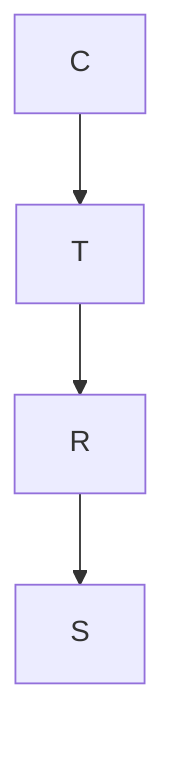
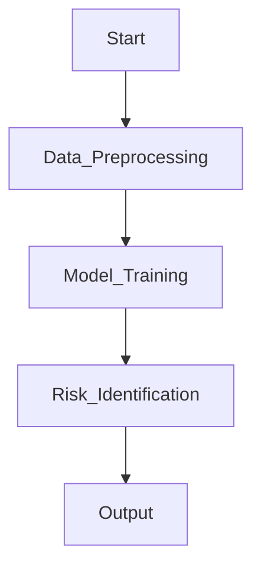
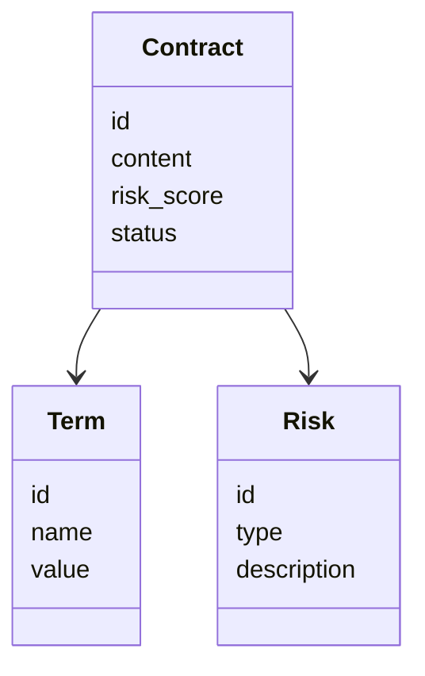

                 


# 构建企业级AI合同管理系统：风险识别与优化

## 关键词：企业级合同管理，AI，风险识别，合同优化，系统架构

## 摘要：  
本文详细探讨了如何利用人工智能技术构建企业级合同管理系统，重点分析了合同风险识别与优化的核心算法与系统架构。通过结合自然语言处理（NLP）技术，本文提出了基于预训练语言模型的合同解析方法，并设计了高效的系统架构，以实现合同风险的智能化识别与优化。文章还通过实际案例分析和代码实现，深入阐述了如何将理论应用于实践，为企业级合同管理系统的建设和优化提供了有价值的参考。

---

## 第1章: 背景与问题背景

### 1.1 问题背景

#### 1.1.1 合同管理的现状与挑战  
合同是企业日常运营中不可或缺的重要文件，涉及供应链管理、客户关系、知识产权等多个方面。然而，传统的合同管理方式存在以下问题：  
- **效率低下**：合同数量庞大，人工审查耗时且易出错。  
- **风险难以识别**：合同中的隐含条款和潜在风险难以快速识别。  
- **缺乏统一标准**：不同部门或业务线的合同格式和条款可能存在差异，增加了管理复杂性。  

#### 1.1.2 传统合同管理的痛点与不足  
传统合同管理主要依赖人工操作，存在以下痛点：  
- **人工审查成本高**：需要大量法律人员逐字审查，效率低且成本高。  
- **风险识别不全面**：难以覆盖所有潜在风险点，容易遗漏重要条款。  
- **数据孤岛问题**：合同数据分散在不同部门，难以实现统一管理和分析。  

#### 1.1.3 企业级合同管理的核心需求  
企业级合同管理系统的核心需求包括：  
- **自动化合同解析**：快速提取合同中的关键信息和条款。  
- **智能化风险识别**：基于AI技术识别合同中的潜在风险。  
- **统一管理平台**：实现合同的统一存储、分类和检索。  

### 1.2 问题描述

#### 1.2.1 合同管理中的风险识别难点  
合同中的风险识别需要考虑以下因素：  
- **条款复杂性**：合同中的法律术语和条款可能晦涩难懂。  
- **上下文依赖性**：某些条款的理解需要结合上下文。  
- **数据多样性**：合同格式和条款可能因业务场景而异。  

#### 1.2.2 合同管理效率的提升需求  
为了提高合同管理效率，企业需要：  
- **自动化处理**：减少人工干预，提高处理速度。  
- **智能辅助工具**：利用AI技术辅助合同审查和风险识别。  
- **实时监控**：对合同状态进行实时跟踪，及时发现潜在问题。  

#### 1.2.3 企业级合同管理的边界与外延  
企业级合同管理系统的边界包括：  
- **输入边界**：合同文本、相关业务数据。  
- **输出边界**：风险评分、优化建议、合同状态报告。  
- **外延**：与企业其他系统（如ERP、CRM）的集成。  

---

## 第2章: 核心概念与联系

### 2.1 核心概念原理

#### 2.1.1 AI在合同管理中的应用原理  
AI技术在合同管理中的应用主要体现在以下方面：  
- **自然语言处理（NLP）**：用于合同文本的分词、实体识别和情感分析。  
- **机器学习（ML）**：用于合同风险的分类和预测。  
- **知识图谱**：用于构建合同相关知识的语义网络。  

#### 2.1.2 风险识别的核心算法与流程  
风险识别的核心算法流程如下：  
1. **合同文本预处理**：包括分词、去除停用词等。  
2. **特征提取**：提取合同中的关键词和关键条款。  
3. **风险分类**：基于机器学习模型对合同风险进行分类。  
4. **风险评分**：根据风险程度对合同进行评分。  

#### 2.1.3 合同优化的数学模型与方法  
合同优化的数学模型可以通过以下步骤实现：  
1. **定义目标函数**：如最小化合同履行风险。  
2. **构建约束条件**：如合同条款的合规性要求。  
3. **优化求解**：通过优化算法找到最优解。  

### 2.2 核心概念属性对比

#### 2.2.1 合同管理与AI技术的属性对比  
| 属性                | 合同管理                 | AI技术                  |  
|---------------------|-------------------------|-------------------------|  
| 核心目标            | 提高管理效率，降低风险 | 辅助合同管理，提高准确性 |  
| 数据来源            | 合同文本                | 合同文本、外部数据      |  
| 处理方式            | 人工审查                | 自动化处理              |  
| 输出结果            | 风险报告                | 风险评分、优化建议       |  

#### 2.2.2 风险识别与合同优化的特征对比  
| 特征                | 风险识别               | 合同优化               |  
|---------------------|-----------------------|-----------------------|  
| 输入                | 合同文本               | 合同文本、风险评分      |  
| 输出                | 风险类别               | 优化后的合同条款       |  
| 方法                | 分类算法               | 优化算法               |  

#### 2.2.3 系统架构与功能模块的属性分析  
企业级合同管理系统的架构属性包括：  
- **模块化设计**：功能模块独立且可扩展。  
- **高可用性**：系统具备容错和冗余机制。  
- **可扩展性**：支持新功能的快速集成。  

### 2.3 ER实体关系图



---

## 第3章: 算法原理与数学模型

### 3.1 预训练语言模型在合同分析中的应用

#### 3.1.1 NLP技术在合同分词中的应用  
NLP技术在合同分词中的应用步骤如下：  
1. **分词**：将合同文本分割成词语或短语。  
2. **实体识别**：识别合同中的关键实体（如公司名称、日期等）。  
3. **关系抽取**：提取实体之间的关系（如“公司A与公司B签订合同”）。  

#### 3.1.2 实体识别与关系抽取算法  
实体识别和关系抽取算法可以采用预训练语言模型（如BERT）进行微调。  

#### 3.1.3 合同情感分析与风险评估  
合同情感分析用于识别合同中的潜在风险，例如违约条款的情感倾向。  

### 3.2 风险识别算法流程



### 3.3 数学模型与公式

#### 3.3.1 风险评分公式  
$$ \text{Risk Score} = \sum_{i=1}^{n} w_i \cdot f_i $$
其中，$w_i$ 是第 $i$ 个特征的权重，$f_i$ 是第 $i$ 个特征的值。  

#### 3.3.2 合同相似度计算公式  
$$ \text{Similarity} = \frac{\sum_{i=1}^{n} \min(f_i, g_i)}{\sum_{i=1}^{n} \max(f_i, g_i)} $$
其中，$f_i$ 和 $g_i$ 是两个合同在第 $i$ 个特征上的值。  

---

## 第4章: 系统分析与架构设计方案

### 4.1 系统功能设计

#### 4.1.1 领域模型设计



#### 4.1.2 系统架构设计

```mermaid
graph TD
    Client --> API Gateway
    API Gateway --> Contract_Management_Service
    Contract_Management_Service --> Database
    Database --> Risk_Engine
    Risk_Engine --> AI_Model_Server
```

### 4.2 接口设计与交互流程

#### 4.2.1 系统交互流程图

```mermaid
graph TD
    Client --> API Gateway
    API Gateway --> Contract_Management_Service
    Contract_Management_Service --> Risk_Engine
    Risk_Engine --> AI_Model_Server
    AI_Model_Server --> Contract_Management_Service
    Contract_Management_Service --> Client
```

---

## 第5章: 项目实战

### 5.1 环境安装

```bash
pip install numpy
pip install transformers
pip install pymermaid
```

### 5.2 核心代码实现

#### 5.2.1 合同解析代码

```python
from transformers import AutoTokenizer, AutoModelForTokenClassification
from sklearn.metrics import accuracy_score

tokenizer = AutoTokenizer.from_pretrained("bert-base-chinese")
model = AutoModelForTokenClassification.from_pretrained("bert-base-chinese")

def contract_analysis(text):
    inputs = tokenizer(text, return_tensors="np")
    outputs = model(**inputs)
    # 解析实体
    # ...
    return result
```

#### 5.2.2 风险评估代码

```python
def risk_assessment(contract_text):
    # 风险评分计算
    risk_score = sum(w * f for w, f in zip(weights, features))
    return risk_score
```

### 5.3 代码解读与案例分析

#### 5.3.1 代码解读  
上述代码展示了如何利用预训练模型进行合同解析和风险评估。  

#### 5.3.2 案例分析  
以一个包含违约条款的合同为例，代码可以自动识别违约风险并生成风险评分。  

---

## 第6章: 最佳实践

### 6.1 小结  
企业级AI合同管理系统通过结合NLP和机器学习技术，可以显著提高合同管理效率并降低风险。  

### 6.2 注意事项  
- **数据隐私**：确保合同数据的安全性。  
- **模型优化**：持续优化AI模型以提高准确率。  
- **系统维护**：定期更新系统以应对新需求。  

### 6.3 拓展阅读  
推荐阅读《自然语言处理实战：基于深度学习的技术》和《机器学习实战》。  

---

## 作者：AI天才研究院/AI Genius Institute & 禅与计算机程序设计艺术 /Zen And The Art of Computer Programming

