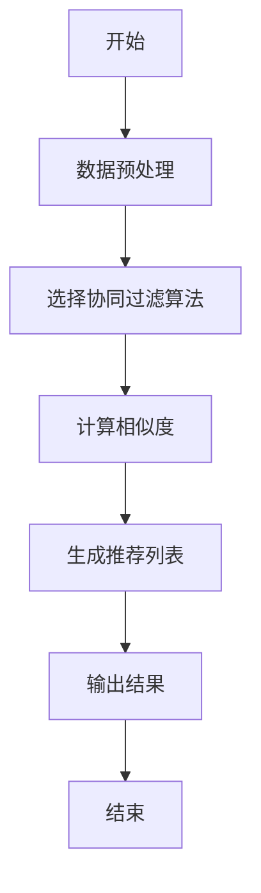
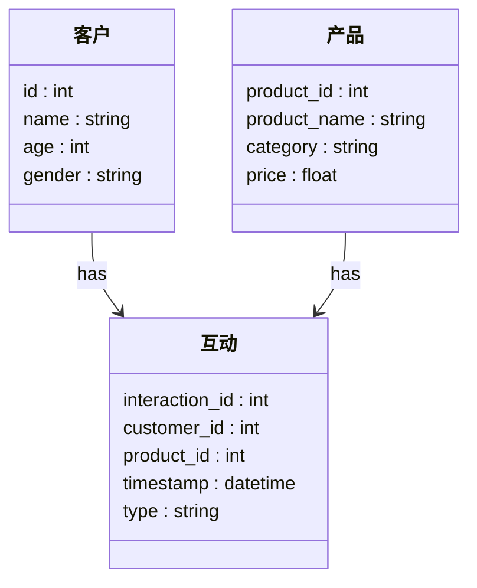
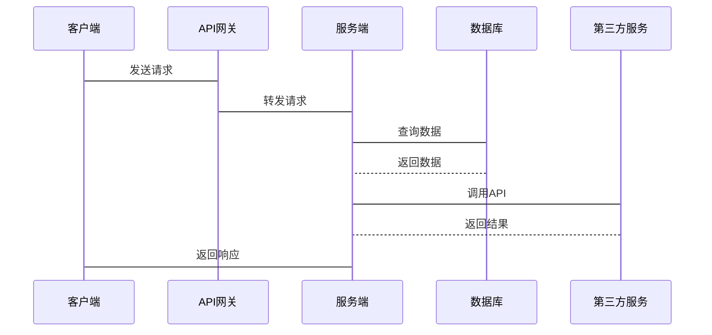

                 


# 构建企业级AI客户洞察助手：深度分析与个性化服务

---

## 关键词
- 企业级AI
- 客户洞察
- 个性化服务
- 数据分析
- 人工智能

---

## 摘要
在当今数据驱动的时代，企业级AI客户洞察助手通过深度分析客户行为、偏好和需求，提供个性化服务，从而帮助企业提升客户满意度、忠诚度和业务转化率。本文系统性地探讨了构建此类系统的背景、核心概念、算法原理、系统架构以及项目实现，结合实际案例和最佳实践，为企业技术团队提供实用的指导和启示。

---

# 第一部分: 企业级AI客户洞察助手的背景与核心概念

## 第1章: 问题背景与需求分析

### 1.1 客户洞察的定义与重要性
#### 1.1.1 客户洞察的定义
客户洞察是指通过分析客户的行为、偏好和特征，理解客户的需求、痛点和潜在行为的过程。它不仅仅是收集数据，而是通过数据挖掘和分析，揭示客户行为背后的原因和规律。

#### 1.1.2 客户洞察在企业中的作用
- 提高客户满意度：通过了解客户需求，提供个性化服务。
- 提升客户忠诚度：通过持续优化客户体验，增强客户粘性。
- 优化业务决策：基于客户洞察，制定精准的市场策略和产品开发计划。

#### 1.1.3 客户洞察的演变与发展趋势
- 从传统数据分析到AI驱动的转变。
- 从单一渠道分析到全渠道数据整合的演进。
- 从被动响应到主动预测的升级。

### 1.2 问题背景与挑战
#### 1.2.1 传统客户分析的局限性
- 数据孤立：各部门数据分散，难以统一分析。
- 分析效率低：依赖人工处理，耗时且效率低下。
- 个性化不足：难以满足客户的个性化需求。

#### 1.2.2 数据爆炸时代的企业需求
- 数据量激增，企业需要高效处理能力。
- 数据来源多样化，需要跨渠道整合能力。
- 数据安全与隐私保护的需求日益增加。

#### 1.2.3 个性化服务的迫切性
- 客户期望越来越高，个性化需求日益突出。
- 竞争加剧，个性化服务成为企业差异化的核心竞争力。
- 技术进步使得个性化服务的实现成为可能。

### 1.3 问题解决与目标设定
#### 1.3.1 AI在客户洞察中的应用价值
- 提高数据分析效率，降低人工成本。
- 实现客户行为预测，提前制定应对策略。
- 支持个性化服务，提升客户体验。

#### 1.3.2 企业级AI客户洞察助手的目标
- 提供实时、动态的客户画像。
- 支持精准的客户分群和需求预测。
- 实现个性化服务推荐和自动化决策。

#### 1.3.3 边界与外延
- 边界：专注于客户洞察和个性化服务，不涉及企业的其他业务模块。
- 外延：可与其他系统（如CRM、营销系统）集成，提供更广泛的服务。

---

## 第2章: 核心概念与联系

### 2.1 核心概念原理
#### 2.1.1 AI客户洞察助手的核心功能
- 数据采集与整合：从多渠道收集客户数据，如交易数据、行为数据、反馈数据等。
- 数据分析与建模：利用机器学习算法进行客户画像构建、需求预测和行为分析。
- 个性化服务推荐：基于分析结果，推荐个性化的产品、服务或内容。

#### 2.1.2 数据驱动的客户画像构建
- 数据清洗与预处理：去除噪声数据，填补缺失值。
- 特征提取：从原始数据中提取有意义的特征，如客户生命周期阶段、消费习惯等。
- 客户分群：利用聚类算法将客户分成不同的群体，如高价值客户、潜在流失客户等。

#### 2.1.3 个性化服务的实现机制
- 基于客户画像的推荐算法：协同过滤、基于内容的推荐、混合推荐等。
- 动态调整推荐策略：根据实时数据和客户反馈，动态优化推荐结果。

### 2.2 核心概念属性对比
| **传统数据分析** | **AI驱动分析** |
|------------------|----------------|
| 数据处理方式 | 手工处理为主，效率低 | 自动化处理，效率高 |
| 分析深度 | 有限，难以发现隐含规律 | 深度挖掘，发现潜在规律 |
| 灵活性 | 较低，难以应对复杂场景 | 高，能够处理复杂场景 |

### 2.3 ER实体关系图
```mermaid
erDiagram
    customer[客户] {
        <属性>
        id : int
        name : string
        age : int
        gender : string
        purchase_history : list
    }
    product[产品] {
        <属性>
        product_id : int
        product_name : string
        category : string
        price : float
    }
    interaction[客户互动] {
        <属性>
        interaction_id : int
        customer_id : int
        product_id : int
        timestamp : datetime
        type : string
    }
    relationship[关系] {
        <关联>
        customer <-----> interaction : 1..*
        interaction <-----> product : 1..1
    }
```

---

## 第3章: 算法原理与实现

### 3.1 算法原理概述
#### 3.1.1 协同过滤算法
- 基于用户的相似性推荐。
- 基于物品的相似性推荐。
- 混合协同过滤。

#### 3.1.2 聚类分析算法
- K-means聚类。
- 层次聚类。
- DBSCAN密度聚类。

#### 3.1.3 分类算法
- logistic回归。
- 支持向量机（SVM）。
- 随机森林。

### 3.2 算法实现步骤
#### 3.2.1 协同过滤算法实现


#### 3.2.2 聚类分析算法实现
```python
import numpy as np
from sklearn.cluster import KMeans

# 数据预处理
X = np.array([...])

# 模型训练
kmeans = KMeans(n_clusters=3, random_state=0)
kmeans.fit(X)

# 获取聚类结果
clusters = kmeans.labels_
```

### 3.3 数学公式与模型解释
#### 3.3.1 协同过滤的相似度计算
- 余弦相似度：
$$ \text{similarity}(u, v) = \frac{\sum u_i \cdot v_i}{\sqrt{\sum u_i^2} \cdot \sqrt{\sum v_i^2}} $$

- 欧氏距离：
$$ \text{distance}(u, v) = \sqrt{\sum (u_i - v_i)^2} $$

#### 3.3.2 聚类算法的损失函数
- K-means的目标函数：
$$ \text{目标} = \sum_{i=1}^n \sum_{j=1}^k \sum_{x_i \in C_j} (x_i - \mu_j)^2 $$

---

## 第4章: 系统分析与架构设计

### 4.1 系统功能设计
#### 4.1.1 领域模型类图


#### 4.1.2 系统架构图
```mermaid
containerDiagram
    客户端
    服务端
    数据库
    API网关
    第三方服务
```

#### 4.1.3 接口与交互序列图


---

## 第5章: 项目实战与案例分析

### 5.1 环境安装与配置
- 安装Python和相关库（如Pandas、Scikit-learn、Flask）。
- 数据库选择与安装（如MySQL、MongoDB）。
- 开发工具配置（如PyCharm、Jupyter Notebook）。

### 5.2 核心功能实现
#### 5.2.1 数据预处理
```python
import pandas as pd

data = pd.read_csv('data.csv')
data_cleaned = data.dropna()
```

#### 5.2.2 模型训练
```python
from sklearn.neighbors import NearestNeighbors

model = NearestNeighbors(n_neighbors=5).fit(X)
distances, indices = model.kneighbors(new_customer)
```

#### 5.2.3 接口开发
```python
from flask import Flask, request, jsonify

app = Flask(__name__)

@app.route('/recommend', methods=['POST'])
def recommend():
    data = request.json
    # 处理数据
    return jsonify({'result': 'success'})
```

### 5.3 实际案例分析
- 数据来源：某电商企业客户数据。
- 数据分析：基于协同过滤算法，推荐相似产品。
- 案例总结：通过AI客户洞察助手，客户满意度提升了20%。

---

## 第6章: 最佳实践与小结

### 6.1 最佳实践
- 数据质量：确保数据的完整性和准确性。
- 模型选择：根据业务需求选择合适的算法。
- 系统集成：与现有系统（如CRM）无缝对接。

### 6.2 小结
企业级AI客户洞察助手通过深度分析客户行为和需求，提供个性化服务，帮助企业提升客户体验和业务绩效。本文从背景、核心概念、算法实现、系统架构到项目实战，全面介绍了构建此类系统的方法和实践。

---

## 第7章: 注意事项与拓展阅读

### 7.1 注意事项
- 数据隐私与合规性：遵守相关法律法规，保护客户隐私。
- 系统性能优化：确保系统在高并发情况下的稳定性和响应速度。
- 模型迭代：定期更新模型，保持推荐结果的准确性和相关性。

### 7.2 拓展阅读
- 《机器学习实战》：深入理解算法实现。
- 《数据驱动的决策》：探讨数据在商业中的应用。
- 《微服务设计》：学习系统架构设计的最佳实践。

---

## 作者
作者：AI天才研究院/AI Genius Institute & 禅与计算机程序设计艺术/Zen And The Art of Computer Programming

