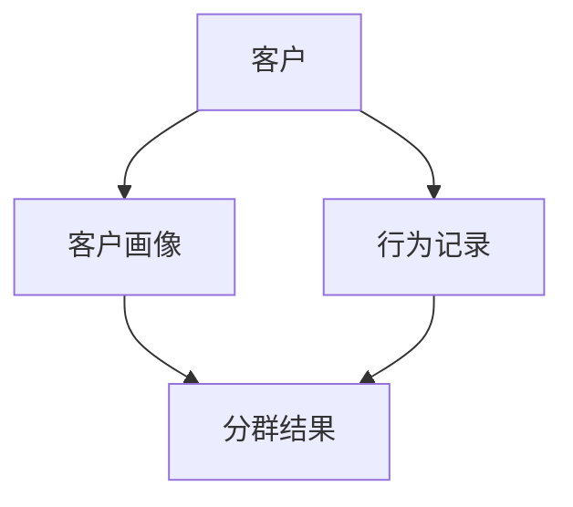
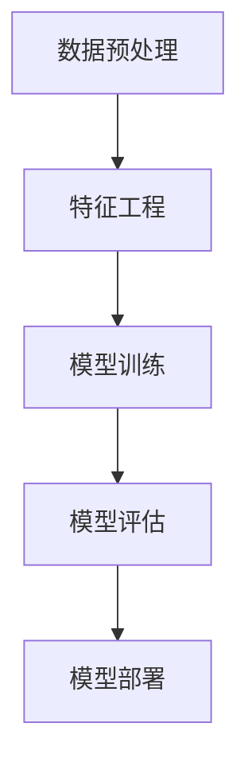
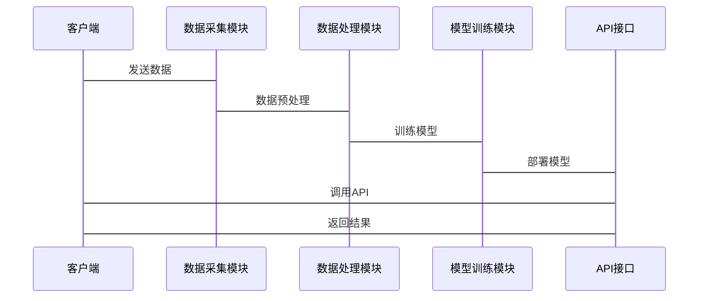

                 


# 构建企业级AI客户生命周期管理助手

> 关键词：企业级AI、客户生命周期管理、客户助手、机器学习、深度学习

> 摘要：本文详细探讨了构建企业级AI客户生命周期管理助手的关键技术与实现方法。通过分析客户生命周期管理的核心概念，结合AI技术的应用背景，提出了基于机器学习和深度学习的算法实现方案，并设计了系统的整体架构。通过实际项目案例的讲解，展示了如何利用AI技术提升客户管理效率，实现客户满意度和业务转化率的双提升。

---

# 第一部分: 企业级AI客户生命周期管理助手的背景与概念

## 第1章: 客户生命周期管理概述

### 1.1 客户生命周期管理的定义与重要性

#### 1.1.1 什么是客户生命周期管理
客户生命周期管理（Customer Lifecycle Management, CLM）是一种企业通过分析和管理客户在其生命周期中的不同阶段（获取、转化、 retention、流失）的行为和需求，以实现客户价值最大化和企业收益最大化的管理方法。

#### 1.1.2 客户生命周期管理的重要性
- 提高客户满意度：通过个性化服务和精准触达，增强客户对品牌的忠诚度。
- 优化客户 retention 率：通过预测客户流失风险，提前采取措施，降低客户流失率。
- 提升业务转化效率：通过精准营销和个性化推荐，提升销售转化率和客单价。

#### 1.1.3 企业级管理的核心目标
- 实现客户全生命周期的数字化管理。
- 提供实时、动态的客户洞察和决策支持。
- 最大化客户生命周期价值（CLV）。

---

### 1.2 AI在客户生命周期管理中的应用背景

#### 1.2.1 传统客户管理的局限性
- 数据分散：客户信息分布在不同的系统中，难以实现统一管理。
- 分析滞后：传统报表分析通常基于历史数据，难以实时指导业务决策。
- 个性化不足：基于规则的营销策略难以满足客户的个性化需求。

#### 1.2.2 AI技术如何提升客户管理效率
- 数据处理能力：AI能够快速处理海量数据，提取有价值的信息。
- 实时分析：通过实时数据流处理技术，实现动态客户画像和预测。
- 智能决策：基于机器学习模型，提供个性化推荐和预测性洞察。

#### 1.2.3 企业级AI助手的市场需求
- 企业需要通过智能化工具提升客户管理效率。
- 客户对个性化服务的需求日益增长，推动企业采用AI技术。
- 数字化转型的背景下，AI客户助手成为企业竞争力的重要组成部分。

---

### 1.3 企业级AI客户助手的核心价值

#### 1.3.1 提高客户满意度
- 通过实时数据分析和个性化推荐，提供客户所需的服务。
- 通过智能客服系统，实现快速响应和问题解决。

#### 1.3.2 优化客户 retention 率
- 通过预测客户流失风险，提前制定挽回策略。
- 通过客户分群和画像，针对性地制定 retention 活动。

#### 1.3.3 提升业务转化效率
- 通过精准营销和个性化推荐，提升销售转化率。
- 通过动态定价和促销策略，优化业务收益。

---

## 第2章: AI客户助手的核心概念与联系

### 2.1 数据采集与处理

#### 2.1.1 数据来源与类型
- 数据来源：客户互动数据（如聊天记录、点击行为）、客户属性数据（如年龄、性别）、交易数据（如购买记录、订单金额）。
- 数据类型：结构化数据（如表格数据）、半结构化数据（如JSON格式）、非结构化数据（如文本、图像）。

#### 2.1.2 数据清洗与预处理
- 数据清洗：去除重复数据、处理缺失值、去除异常值。
- 数据标准化：对数据进行归一化处理，使其适合模型输入。
- 数据增强：通过数据扩展技术（如数据合成、特征衍生）增加数据多样性。

#### 2.1.3 数据特征工程
- 特征选择：通过相关性分析、主成分分析（PCA）选择重要特征。
- 特征组合：将多个特征进行组合，生成更有代表性的新特征。
- 特征标准化：对特征进行标准化或归一化处理，确保模型输入的均匀性。

---

### 2.2 客户行为分析与预测

#### 2.2.1 客户行为特征提取
- 行为特征：点击频率、页面停留时间、购买频率、购买间隔。
- 行为模式：通过聚类分析发现客户行为的相似性。
- 行为趋势：通过时间序列分析预测未来的客户行为。

#### 2.2.2 客户行为预测模型
- 线性回归模型：用于预测连续型变量（如客户购买金额）。
- 分类模型：如逻辑回归、决策树、随机森林，用于预测客户是否会流失、是否会购买。
- 时间序列模型：如ARIMA、LSTM，用于预测未来的客户行为。

#### 2.2.3 行为预测与实际业务的结合
- 通过预测客户流失风险，制定针对性的 retention 策略。
- 通过预测客户购买概率，优化营销策略和资源分配。

---

### 2.3 客户分群与画像

#### 2.3.1 客户分群方法
- 聚类分析：如K-means、DBSCAN，用于将客户分成不同的群体。
- 分类分析：如决策树、随机森林，用于将客户分成不同的类别。
- 主成分分析（PCA）：用于降维和提取客户群体的关键特征。

#### 2.3.2 客户画像构建
- 画像特征：客户的基本信息（如年龄、性别）、行为特征（如购买频率）、偏好特征（如喜欢的产品类别）。
- 画像应用场景：精准营销、个性化推荐、客户服务。

#### 2.3.3 分群结果的应用场景
- 针对不同群体制定不同的营销策略。
- 根据客户画像提供个性化服务。

---

### 2.4 核心概念对比与ER图

#### 2.4.1 核心概念对比表
| 概念       | 特征             | 描述                                         |
|------------|------------------|----------------------------------------------|
| 数据采集   | 实时性           | 数据来源是否实时                             |
| 行为预测   | 准确性           | 预测模型的准确性                             |
| 客户分群   | 细粒度           | 分群的颗粒度                                 |

#### 2.4.2 ER实体关系图


---

## 第3章: AI客户助手的算法原理与实现

### 3.1 算法原理概述

#### 3.1.1 机器学习基础
- 机器学习的基本概念：监督学习、无监督学习、半监督学习。
- 监督学习：通过标签数据训练模型，预测新数据的标签。
- 无监督学习：通过数据的内在结构发现隐藏模式。

#### 3.1.2 深度学习在客户管理中的应用
- 深度学习模型：如神经网络、LSTM（长短期记忆网络）。
- 应用场景：客户画像、行为预测、情感分析。

#### 3.1.3 混合模型的优势
- 混合模型：结合传统机器学习和深度学习的优势，提升模型性能。

---

### 3.2 核心算法实现

#### 3.2.1 线性回归模型
- 模型公式：$$ y = \beta_0 + \beta_1x_1 + \beta_2x_2 + \dots + \beta_nx_n $$
- 损失函数：$$ L = \sum_{i=1}^{m} (y_i - \hat{y_i})^2 $$
- 优化方法：最小二乘法、梯度下降。

#### 3.2.2 决策树模型
- 模型结构：通过特征分裂构建树状结构。
- 特点：易于解释、适用于分类和回归问题。

#### 3.2.3 神经网络模型
- 模型结构：输入层、隐藏层、输出层。
- 激活函数：如ReLU、Sigmoid。
- 优化算法：随机梯度下降（SGD）、Adam优化器。

---

### 3.3 算法流程图


---

## 第4章: 系统架构设计

### 4.1 系统整体架构

#### 4.1.1 分层架构
- 数据层：存储原始数据和处理后的数据。
- 模型层：部署机器学习模型和深度学习模型。
- 服务层：提供API接口，供前端调用。
- 接口层：与企业现有系统（如CRM、营销系统）对接。

#### 4.1.2 功能模块划分
- 数据采集模块：负责采集客户数据。
- 数据处理模块：负责数据清洗和特征工程。
- 模型训练模块：负责模型训练和优化。
- 接口服务模块：负责与企业系统的对接。

---

### 4.2 系统交互流程

#### 4.2.1 客户数据采集
- 数据来源：API接口、数据库、日志文件。
- 数据格式：JSON、CSV、XML。

#### 4.2.2 数据处理
- 数据清洗：去除重复数据、处理缺失值。
- 特征工程：提取特征、标准化特征。

#### 4.2.3 模型调用
- 通过API接口调用模型，获取预测结果。
- 返回结果：如客户流失概率、客户分群结果。

#### 4.2.4 结果展示
- 在企业CRM系统中展示客户画像和预测结果。
- 提供可视化界面，便于业务人员查看和分析。

---

### 4.3 系统交互序列图


---

## 第5章: 项目实战——电商客户流失预测

### 5.1 环境配置

#### 5.1.1 安装依赖
- Python环境：Python 3.8+
- 机器学习库：scikit-learn、xgboost、keras。
- 数据处理库：pandas、numpy。
- 可视化库：matplotlib、seaborn。

#### 5.1.2 数据准备
- 数据集来源：电商客户数据，包括购买记录、点击行为、客户属性。
- 数据格式：CSV文件，字段包括客户ID、购买金额、购买频率、页面停留时间等。

---

### 5.2 特征工程

#### 5.2.1 数据清洗
```python
import pandas as pd
import numpy as np

data = pd.read_csv('customer_data.csv')
# 去除重复数据
data = data.drop_duplicates()
# 处理缺失值
data = data.dropna()
```

#### 5.2.2 特征选择
```python
# 使用相关性分析选择重要特征
correlation = data.corr()
# 选择相关性较高的特征
selected_features = correlation['流失'].abs().sort_values(ascending=False).index[:10]
```

#### 5.2.3 特征标准化
```python
from sklearn.preprocessing import StandardScaler

scaler = StandardScaler()
data_selected = scaler.fit_transform(data[selected_features])
```

---

### 5.3 模型训练

#### 5.3.1 模型选择
- 选择逻辑回归模型进行分类预测。

#### 5.3.2 模型训练
```python
from sklearn.linear_model import LogisticRegression
from sklearn.model_selection import train_test_split

X_train, X_test, y_train, y_test = train_test_split(data_selected, data['流失'], test_size=0.2, random_state=42)
model = LogisticRegression()
model.fit(X_train, y_train)
```

#### 5.3.3 模型评估
```python
from sklearn.metrics import accuracy_score, precision_score, recall_score

y_pred = model.predict(X_test)
print(f"Accuracy: {accuracy_score(y_test, y_pred)}")
print(f"Precision: {precision_score(y_test, y_pred)}")
print(f"Recall: {recall_score(y_test, y_pred)}")
```

---

### 5.4 模型部署

#### 5.4.1 接口开发
```python
from flask import Flask, request, jsonify

app = Flask(__name__)
model = LogisticRegression()
model.load_weights('model.pkl')

@app.route('/predict', methods=['POST'])
def predict():
    data = request.json
    # 数据处理
    processed_data = preprocess(data)
    # 预测结果
    result = model.predict(processed_data)
    return jsonify({'result': result.tolist()})
```

#### 5.4.2 调用示例
```python
import requests

response = requests.post('http://localhost:5000/predict', json=data)
print(response.json())
```

---

## 第6章: 最佳实践与总结

### 6.1 最佳实践

#### 6.1.1 数据质量管理
- 确保数据的准确性和完整性。
- 定期更新数据，避免过时数据的影响。

#### 6.1.2 模型选择与优化
- 根据业务需求选择合适的模型。
- 定期重新训练模型，更新特征，优化性能。

#### 6.1.3 系统性能优化
- 通过分布式计算提升数据处理效率。
- 使用缓存技术减少重复计算。

#### 6.1.4 安全与合规
- 确保客户数据的安全性，遵守相关法律法规。
- 加强权限管理，避免数据泄露。

---

### 6.2 小结与展望

#### 6.2.1 小结
- 本文详细探讨了构建企业级AI客户生命周期管理助手的关键技术与实现方法。
- 通过实际项目案例，展示了如何利用AI技术提升客户管理效率。

#### 6.2.2 未来展望
- 结合边缘计算和物联网技术，实现客户管理的实时性和智能化。
- 针对数据隐私保护，探索联邦学习等新技术的应用。
- 在模型优化方面，探索自动化机器学习（AutoML）的应用。

---

## 作者

作者：AI天才研究院/AI Genius Institute & 禅与计算机程序设计艺术/Zen And The Art of Computer Programming

---

通过以上思考和逐步分析，我们可以系统地构建一个企业级AI客户生命周期管理助手，结合理论与实践，为企业提供高效、智能的客户管理解决方案。

