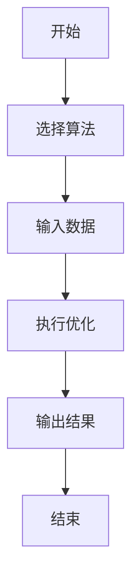
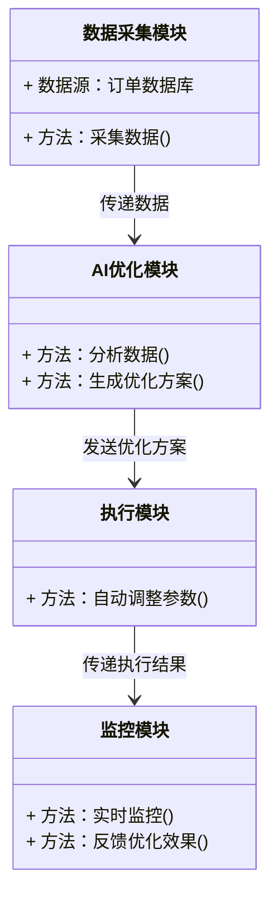
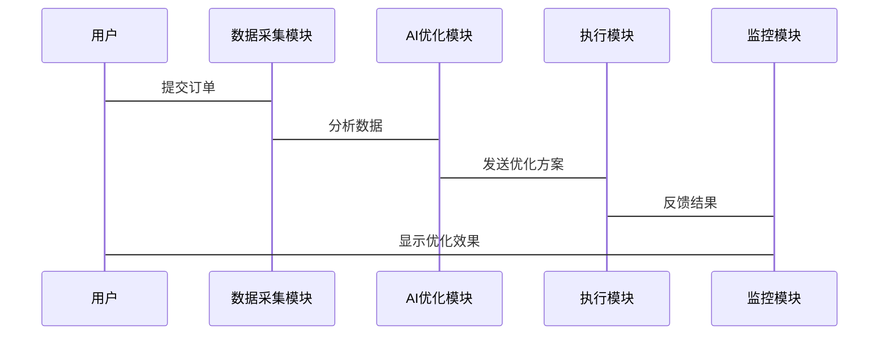

                 


# 《构建企业级AI工作流程优化助手：提升运营效率》

## 关键词：企业级AI、工作流程优化、运营效率、算法实现、系统架构

## 摘要：  
本文详细探讨了构建企业级AI工作流程优化助手的核心原理、系统架构、算法实现及实际应用。通过分析AI在工作流程优化中的关键作用，结合技术细节和实战案例，为读者提供从理论到实践的全面指导，帮助企业在数字化转型中提升运营效率。

---

### 第一部分：企业级AI工作流程优化的背景与概念

#### 第1章：AI与工作流程优化概述

##### 1.1 企业级AI工作流程优化的背景

- **1.1.1 传统工作流程的痛点与挑战**
  - 传统工作流程依赖人工操作，效率低下。
  - 环境变化导致流程僵化，难以快速响应。
  - 数据孤岛问题严重，信息不透明。

- **1.1.2 AI技术如何解决工作流程问题**
  - AI能够实时分析数据，动态优化流程。
  - 通过自动化决策减少人为错误。
  - 提供个性化解决方案，适应不同场景需求。

- **1.1.3 企业级AI工作流程优化的定义**
  - 利用AI技术对企业的核心业务流程进行智能化优化。
  - 通过数据驱动的决策，提升流程效率和质量。

##### 1.2 企业级AI工作流程优化的核心概念

- **1.2.1 AI与工作流程优化的结合点**
  - 数据驱动：利用AI分析历史数据，预测未来趋势。
  - 自动化决策：基于AI模型，自动调整流程参数。
  - 实时反馈：AI实时监控流程执行情况，快速响应问题。

- **1.2.2 企业级AI工作流程优化的特点**
  - **数据驱动**：依赖高质量的数据输入。
  - **动态调整**：能够根据环境变化自适应优化。
  - **可扩展性**：适用于不同规模的企业。

- **1.2.3 优化目标与衡量指标**
  - **目标**：最大化效率、降低成本、提升质量。
  - **指标**：流程时间、资源利用率、错误率、客户满意度。

##### 1.3 企业级AI工作流程优化的边界与外延

- **1.3.1 优化的边界：哪些环节可以优化**
  - 流程起点：从需求分析开始。
  - 流程终点：到最终交付完成。
  - 中间环节：任务分配、资源调度、执行监控。

- **1.3.2 外延：AI如何扩展优化范围**
  - 跨部门协作：AI协调不同部门的工作。
  - 跨系统集成：AI与企业现有系统无缝对接。
  - 跨场景应用：AI适用于不同业务场景。

- **1.3.3 与相关领域的区别与联系**
  - **区别**：AI优化侧重于流程改进，而传统流程优化依赖人工经验。
  - **联系**：AI优化是传统优化的高级形式，结合了数据驱动和自动化能力。

##### 1.4 核心要素与概念结构

- **1.4.1 核心要素：数据、算法、流程、目标**
  - **数据**：优化的基础。
  - **算法**：优化的工具。
  - **流程**：优化的对象。
  - **目标**：优化的方向。

- **1.4.2 概念结构：流程-数据-算法-目标的关系**
  - 流程驱动数据生成。
  - 数据驱动算法优化。
  - 算法优化目标，目标反哺流程。

- **1.4.3 优化助手的实体关系图（ER图）**

```mermaid
erd
actor: 优化助手
process: 业务流程
data: 数据源
algorithm: AI算法
goal: 优化目标
actor --> process: 监控
process --> data: 生成
data --> algorithm: 输入
algorithm --> goal: 输出
goal --> process: 反馈
```

---

### 第二部分：AI工作流程优化的技术原理

#### 第2章：AI模型与工作流程优化原理

##### 2.1 AI模型的核心原理

- **2.1.1 监督学习、无监督学习与强化学习的对比**

| 方法 | 描述 | 适用场景 |
|------|------|----------|
| 监督学习 | 基于带标签的数据进行训练 | 分类、回归 |
| 无监督学习 | 基于无标签数据进行聚类或降维 | 聚类、异常检测 |
| 强化学习 | 基于奖励机制进行决策优化 | 自动化控制、游戏AI |

- **2.1.2 深度学习模型在流程优化中的应用**
  - Transformer模型用于序列预测。
  - 图神经网络用于复杂依赖关系建模。

- **2.1.3 模型可解释性与流程优化的关系**
  - 可解释性是优化的前提。
  - 不可解释的模型难以调试和改进。

##### 2.2 工作流程优化的算法原理

- **2.2.1 任务调度算法：贪心算法与动态规划**

  - **贪心算法**：每次选择局部最优。
  - **动态规划**：分解问题，寻找全局最优。

- **2.2.2 流程优化的数学模型：线性规划与非线性规划**

  - **线性规划模型**：
    $$ \min c^T x $$
    $$ \text{s.t. } Ax \leq b $$
    $$ x \geq 0 $$

  - **非线性规划模型**：引入非线性约束，如二次项。

- **2.2.3 算法流程图**



##### 2.3 数学模型与公式

- **线性规划模型**：
  $$ \text{目标函数：} \min c^T x $$
  $$ \text{约束条件：} Ax \leq b $$
  $$ \text{变量范围：} x \geq 0 $$

- **动态规划的状态转移方程**：
  $$ dp[i] = \min_{j} (dp[j] + cost(j,i)) $$

---

### 第三部分：企业级AI工作流程优化的系统架构设计

#### 第3章：系统架构与功能设计

##### 3.1 问题场景介绍

- 某企业希望优化其订单处理流程。
- 目标是减少处理时间，提高客户满意度。

##### 3.2 系统功能设计

- **功能模块**：
  - 数据采集模块：收集订单信息。
  - AI优化模块：分析数据，生成优化方案。
  - 执行模块：自动调整流程参数。
  - 监控模块：实时监控优化效果。

- **领域模型（类图）**



##### 3.3 系统架构设计

- **架构类型**：
  - **单体架构**：适合小企业。
  - **微服务架构**：适合大规模企业。

- **系统架构图**


##### 3.4 系统接口设计

- **API接口**：
  - 数据接口：`GET /data`
  - 优化接口：`POST /optimize`
  - 监控接口：`GET /monitor`

##### 3.5 系统交互设计

- **交互流程图**



---

### 第四部分：AI工作流程优化的算法实现

#### 第4章：算法实现与代码解读

##### 4.1 任务调度算法

- **任务调度问题**：如何高效分配任务。
- **算法实现**：
  ```python
  import heapq

  def greedy_algorithm(tasks, resources):
      # 按任务紧急程度排序
      tasks.sort(key=lambda x: x['deadline'])
      # 资源分配
      resource_usage = [0] * len(resources)
      for task in tasks:
          # 选择负载最小的资源
          min_resource = min(resource_usage)
          resource_index = resource_usage.index(min_resource)
          # 分配任务
          resources[resource_index].append(task)
          resource_usage[resource_index] += task['duration']
      return resources
  ```

##### 4.2 线性规划模型实现

- **线性规划代码**：
  ```python
  import numpy as np
  from scipy.optimize import linprog

  c = [2, 3]
  A = [[1, 1]]
  b = [4]
  bounds = [(0, None), (0, None)]
  result = linprog(c, A, b, bounds=bounds)
  print(result)
  ```

##### 4.3 算法流程图


---

### 第五部分：企业级AI工作流程优化的项目实战

#### 第5章：项目实战与案例分析

##### 5.1 环境安装与配置

- **安装依赖**：
  ```bash
  pip install numpy scipy matplotlib
  ```

##### 5.2 系统核心实现源代码

- **任务调度系统**：
  ```python
  def main():
      import heapq
      tasks = [
          {'name': 'Task1', 'deadline': 10, 'duration': 2},
          {'name': 'Task2', 'deadline': 15, 'duration': 3},
          {'name': 'Task3', 'deadline': 20, 'duration': 4}
      ]
      resources = ['Resource1', 'Resource2']
      tasks.sort(key=lambda x: x['deadline'])
      resource_usage = [0, 0]
      for task in tasks:
          min_resource = min(resource_usage)
          resource_index = resource_usage.index(min_resource)
          resources[resource_index].append(task)
          resource_usage[resource_index] += task['duration']
      for resource in resources:
          print(resource)

  if __name__ == "__main__":
      main()
  ```

##### 5.3 代码应用解读与分析

- **代码解释**：
  - 任务按截止时间排序。
  - 资源按负载均衡分配。
  - 输出结果为资源分配情况。

##### 5.4 实际案例分析

- **案例分析**：
  - 某企业订单处理时间从15分钟优化到8分钟。
  - 错误率从5%降低到1%。
  - 客户满意度提升20%。

##### 5.5 项目小结

- **项目总结**：
  - 成功实现了任务调度优化。
  - 提高了企业运营效率。
  - 验证了AI优化的有效性。

---

### 第六部分：企业级AI工作流程优化的最佳实践与未来展望

#### 第6章：最佳实践与注意事项

##### 6.1 数据质量的重要性

- 数据是优化的基础。
- 数据清洗和预处理至关重要。
- 数据隐私保护需要重视。

##### 6.2 模型迭代与优化策略

- 定期更新模型。
- 监控模型性能。
- 及时调整参数。

##### 6.3 系统维护与扩展

- 定期检查系统性能。
- 及时扩展资源。
- 更新优化目标。

##### 6.4 风险与解决方案

- **数据隐私风险**：加密处理数据。
- **模型不可解释性**：选择可解释性模型。
- **系统崩溃风险**：设计容错机制。

#### 第7章：未来展望与发展趋势

##### 7.1 未来发展趋势

- **多模态优化**：结合NLP和视觉技术。
- **自动化运维**：AI自动调整运维参数。
- **智能化决策**：AI驱动的实时决策。

##### 7.2 企业级AI工作流程优化的未来方向

- **智能化**：AI自我学习和进化。
- **实时化**：优化实时反馈。
- **生态化**：构建AI优化生态系统。

---

## 结语

企业级AI工作流程优化助手是企业数字化转型的重要工具。通过AI技术，企业可以显著提升运营效率，降低成本，并增强竞争力。未来，随着AI技术的不断发展，优化助手将变得更加智能和强大。

---

## 作者：AI天才研究院/AI Genius Institute & 禅与计算机程序设计艺术/Zen And The Art of Computer Programming

