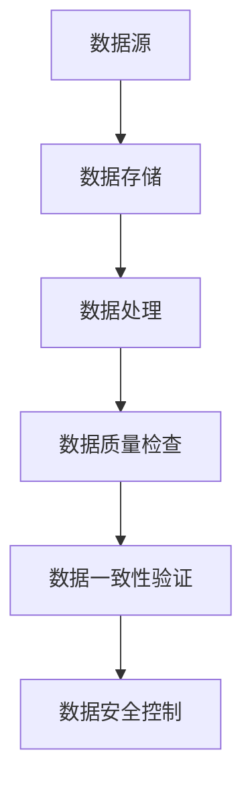
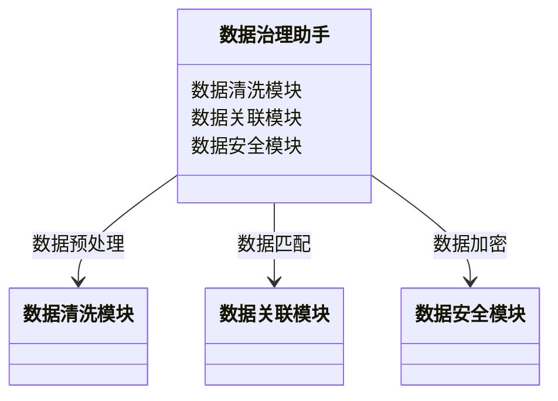
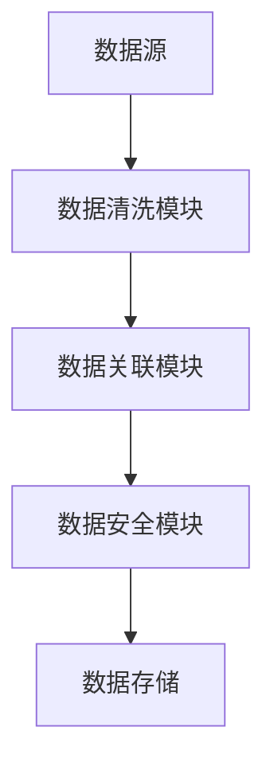
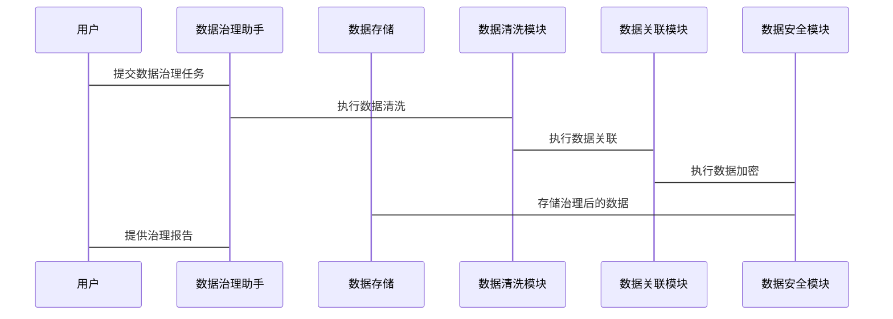

                 


# 构建企业级AI数据治理助手：确保数据质量与一致性

## 关键词：
数据治理，人工智能，数据质量，数据一致性，企业级系统，数据安全，AI算法

## 摘要：
在数字化转型的浪潮中，数据成为企业的核心资产。然而，数据的多样性和分布性使得数据治理变得尤为重要。本文详细探讨如何利用人工智能技术构建企业级数据治理助手，确保数据质量与一致性。通过分析数据治理的核心概念、AI算法的原理、系统架构的设计以及实际案例的应用，本文为读者提供全面的指导，帮助企业在数据驱动的时代中立于不败之地。

---

## 第一部分: 数据治理与AI的结合基础

### 第1章: 数据治理概述

#### 1.1 数据治理的基本概念
- **数据治理的定义**：数据治理是指通过制定政策、流程和工具，对数据的全生命周期进行管理，以确保数据的准确性、完整性和一致性。
- **数据治理的核心目标**：
  - 提高数据质量
  - 确保数据一致性
  - 保障数据安全
  - 实现数据的可追溯性
- **数据治理的范围与边界**：
  - 数据的采集、存储、处理、分析和应用
  - 数据的生命周期管理

#### 1.2 数据治理的挑战与问题背景
- **数据孤岛与不一致性的挑战**：
  - 数据分散在不同的系统中，导致数据重复和不一致
  - 数据格式和标准不统一，影响数据分析的准确性
- **数据质量与数据安全的矛盾**：
  - 数据清洗可能破坏数据的原始性，影响数据安全
  - 数据隐私保护与数据可用性之间的平衡
- **企业级数据治理的痛点**：
  - 数据量大，治理难度高
  - 数据分布复杂，难以统一管理
  - 数据治理成本高，资源有限

#### 1.3 AI在数据治理中的作用
- **AI技术如何提升数据治理效率**：
  - 通过机器学习算法自动识别数据中的异常值和重复数据
  - 利用自然语言处理技术解决数据中的语义不一致问题
- **数据治理中AI的应用场景**：
  - 数据清洗与标准化
  - 数据关联与匹配
  - 数据安全与隐私保护
- **未来趋势与潜在价值**：
  - AI将推动数据治理的自动化和智能化
  - 数据治理将成为企业竞争优势的重要来源

### 第2章: 数据治理的核心概念与联系

#### 2.1 数据治理的核心要素
- **数据质量**：
  - 数据的准确性、完整性、一致性
  - 数据清洗与标准化
- **数据一致性**：
  - 数据在不同系统中的统一性
  - 数据关联与匹配
- **数据安全**：
  - 数据隐私保护
  - 数据访问控制

#### 2.2 核心概念对比分析
| 概念          | 特征               |
|---------------|--------------------|
| 数据质量      | 准确性、完整性、一致性 |
| 数据一致性    | 数据在系统中的统一性 |
| 数据安全      | 隐私保护、访问控制 |

#### 2.3 实体关系图（ER图）


### 第3章: 数据治理中的AI算法原理

#### 3.1 数据清洗算法
- **数据清洗的定义**：通过算法识别和处理数据中的错误、重复或不完整数据。
- **基于机器学习的自动数据清洗流程**：
  1. 数据预处理：去除噪声数据
  2. 异常检测：识别异常值
  3. 数据填充：处理缺失值
  4. 数据标准化：统一数据格式

#### 3.2 数据匹配算法
- **数据关联与匹配的原理**：
  - 使用字符串匹配算法（如Jaccard相似度）进行数据关联
  - 基于机器学习模型预测数据的匹配关系
- **数据匹配的实现步骤**：
  1. 特征提取：从数据中提取关键特征
  2. 相似度计算：计算数据之间的相似度
  3. 匹配决策：根据相似度判断是否匹配

#### 3.3 数据安全与隐私保护算法
- **数据匿名化技术**：
  - 使用差分隐私技术保护数据隐私
  - 数据脱敏处理
- **数据访问控制**：
  - 基于角色的访问控制（RBAC）
  - 基于属性的访问控制（ABAC）

---

## 第二部分: 系统架构与AI数据治理助手设计

### 第4章: 系统架构设计

#### 4.1 问题场景介绍
- **数据源多样化**：企业数据来自多个系统，格式和标准不统一
- **数据量大**：企业级数据量通常在PB级别
- **数据治理需求高**：需要实时监控数据质量

#### 4.2 项目介绍
- **项目目标**：构建一个AI驱动的数据治理助手，实现数据的自动清洗、关联与安全保护
- **项目范围**：覆盖数据全生命周期，支持多种数据源和格式

#### 4.3 系统功能设计


#### 4.4 系统架构设计


#### 4.5 系统接口设计
- **数据输入接口**：支持多种数据源的接入
- **数据输出接口**：提供清洗后的数据和治理报告
- **用户接口**：提供可视化界面，方便用户监控数据治理状态

#### 4.6 系统交互流程


### 第5章: 项目实战

#### 5.1 环境安装
- **安装Python环境**：建议使用Anaconda
- **安装依赖库**：
  - `pandas`：数据处理
  - `numpy`：数值计算
  - `scikit-learn`：机器学习算法

#### 5.2 核心代码实现
```python
import pandas as pd
from sklearn.impute import SimpleImputer
from sklearn.preprocessing import StandardScaler

# 数据清洗示例
def data_cleaning(data):
    # 处理缺失值
    imputer = SimpleImputer(strategy='mean')
    data_imputed = pd.DataFrame(imputer.fit_transform(data), columns=data.columns)
    return data_imputed

# 数据关联示例
def data_matching(data1, data2):
    # 提取关键特征
    features = ['id', 'name']
    data1_features = data1[features]
    data2_features = data2[features]
    
    # 计算相似度
    from sklearn.metrics.pairwise import cosine_similarity
    similarity_matrix = cosine_similarity(data1_features, data2_features)
    
    # 匹配决策
    threshold = 0.8
    matches = []
    for i in range(len(data1)):
        for j in range(len(data2)):
            if similarity_matrix[i][j] > threshold:
                matches.append((data1.iloc[i], data2.iloc[j]))
    return matches
```

#### 5.3 案例分析
- **案例背景**：某企业有多个部门的数据，格式不统一，需要进行数据清洗和关联
- **解决方案**：
  1. 使用数据清洗算法处理缺失值和重复数据
  2. 使用数据关联算法匹配不同部门的数据
  3. 使用数据安全算法保护敏感信息

---

## 第三部分: 最佳实践与总结

### 第6章: 最佳实践

#### 6.1 小结
- 数据治理是企业数字化转型的关键
- AI技术为数据治理提供了新的可能性
- 数据治理助手将数据治理推向自动化和智能化

#### 6.2 注意事项
- 数据治理需要全企业范围的协作
- 数据隐私保护是数据治理的重要组成部分
- 数据治理需要持续优化和迭代

#### 6.3 拓展阅读
- 《Data Governance: A Practical Guide to Getting It Right》
- 《Applied Machine Learning in Python》

### 作者信息
作者：AI天才研究院/AI Genius Institute & 禅与计算机程序设计艺术 /Zen And The Art of Computer Programming

---

通过本文的详细讲解，读者可以深入了解如何利用人工智能技术构建企业级数据治理助手，确保数据质量与一致性。希望本文能为企业的数据治理实践提供有价值的参考和指导。

