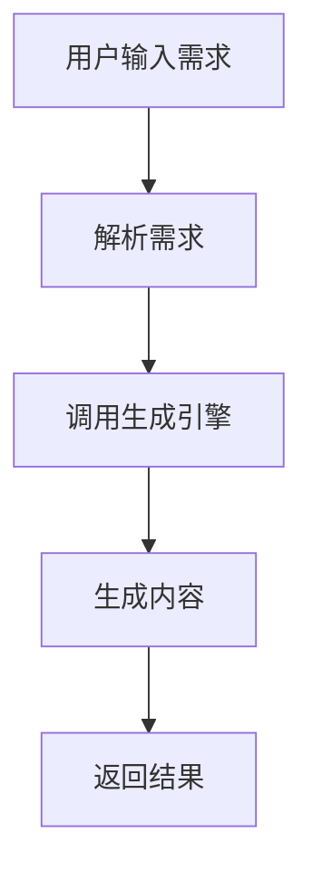

                 


# 构建企业级AI文档助手：自动化报告与提案生成

> 关键词：AI文档助手，企业级应用，自动化报告，提案生成，NLP技术，大语言模型，文本生成

> 摘要：本文详细探讨了如何利用AI技术构建企业级文档助手，实现自动化报告与提案生成。通过分析NLP技术的核心原理，结合大语言模型的应用场景，本文详细阐述了系统架构设计、算法实现和项目实战，为企业提升文档处理效率提供了有效解决方案。

---

# 第一部分：AI文档助手的背景与核心概念

## 第1章：AI文档助手的概念与背景

### 1.1 问题背景与需求分析

#### 1.1.1 传统文档生成的痛点
在企业运营中，文档生成是一个高频且耗时的过程，尤其是在报告撰写、提案制作等领域。传统文档生成依赖人工操作，存在以下痛点：
- **效率低下**：手动撰写文档需要大量时间和精力。
- **一致性差**：不同人员的撰写风格可能导致文档不一致。
- **可扩展性差**：面对大量文档需求时，人工效率难以满足。

#### 1.1.2 企业对自动化文档生成的需求
企业对自动化文档生成的需求主要体现在以下方面：
- **提升效率**：通过自动化工具快速生成标准化文档。
- **降低成本**：减少人工干预，降低人力资源成本。
- **提高一致性**：确保所有文档遵循统一的格式和风格。

#### 1.1.3 AI技术在文档生成中的应用潜力
AI技术，尤其是自然语言处理（NLP）和大语言模型（如GPT系列），为文档生成提供了新的可能性。AI文档助手能够：
- **自动生成文本**：根据输入的关键词或模板生成高质量的文本内容。
- **智能化推荐**：基于上下文提供内容建议，帮助用户快速完成文档。
- **多语言支持**：支持多种语言的文档生成，满足国际化需求。

### 1.2 问题描述与目标

#### 1.2.1 文档生成的自动化需求
自动化文档生成的目标是将文档撰写过程中的重复性工作交给AI完成，减少人工干预。具体需求包括：
- **模板化生成**：基于预定义模板生成标准化文档。
- **动态内容填充**：根据输入参数自动生成相关内容。
- **智能校对与优化**：对生成的文档进行语法检查和优化建议。

#### 1.2.2 企业级文档生成的目标
企业级文档生成的目标是构建一个高效、可靠、可扩展的文档生成系统，满足企业内部各种场景的需求。具体目标包括：
- **支持多场景应用**：适用于报告、提案、邮件等多种文档类型。
- **高可定制性**：支持不同部门的个性化需求。
- **高可靠性**：确保生成文档的准确性和专业性。

#### 1.2.3 边界与外延
AI文档助手的边界在于其功能范围。它专注于文档生成，不涉及文档存储、协作编辑等功能。外延则包括与文档相关的其他工具，如内容管理系统（CMS）和协作平台。

### 1.3 核心概念与组成要素

#### 1.3.1 AI文档助手的核心概念
AI文档助手通过NLP技术实现文本生成，核心概念包括：
- **输入处理**：接收用户输入的关键词、模板或上下文。
- **内容生成**：基于输入生成符合要求的文本内容。
- **输出优化**：对生成的内容进行润色和校对。

#### 1.3.2 关键组成要素与功能模块
AI文档助手的关键组成要素包括：
- **NLP模型**：用于文本生成的核心算法。
- **模板引擎**：支持基于模板的文档生成。
- **API接口**：与其他系统进行交互。
- **用户界面**：供用户输入需求和查看生成内容。

#### 1.3.3 系统架构的核心要素对比表
下表对比了传统文档生成系统与AI文档助手在功能、效率和成本方面的差异：

| 特性                | 传统文档生成 | AI文档助手 |
|---------------------|--------------|------------|
| **效率**            | 低           | 高         |
| **一致性**          | 差           | 好         |
| **可扩展性**        | 低           | 高         |
| **成本**            | 高           | 低         |

---

# 第二部分：AI大模型的核心原理与技术

## 第2章：AI大模型的原理与技术基础

### 2.1 NLP基础与文本生成原理

#### 2.1.1 自然语言处理的基本概念
自然语言处理（NLP）是AI技术的核心领域之一，旨在让计算机理解和生成人类语言。文本生成是NLP的重要任务，广泛应用于机器翻译、对话系统和内容生成。

#### 2.1.2 文本生成的数学模型
文本生成的数学模型基于概率分布，目标是为每个词生成条件概率最高的序列。常见的模型包括马尔可夫链和循环神经网络（RNN）。

#### 2.1.3 Transformer架构的原理
Transformer架构通过自注意力机制（Self-Attention）实现长距离依赖关系的捕捉，显著提升了文本生成的质量。其核心公式为：
$$
\text{Attention}(Q, K, V) = \text{softmax}\left(\frac{QK^T}{\sqrt{d_k}}\right)V
$$

### 2.2 大模型的训练与优化

#### 2.2.1 预训练目标与损失函数
大模型的预训练目标是通过大量未标注数据学习语言表示。常用的预训练目标包括：
- **掩码语言模型（MLM）**：预测句子中的遮蔽词。
- **Next Sentence Prediction（NSP）**：判断两个句子是否相邻。

损失函数通常采用交叉熵损失：
$$
\text{Loss} = -\sum_{i=1}^{n} \log p(y_i|x_i)
$$

#### 2.2.2 模型调优与参数优化
模型调优包括微调（Fine-tuning）和超参数优化。微调过程如下：
1. 预训练模型在大规模数据上进行初始化。
2. 在特定任务数据上进行微调，调整输出层以适应任务需求。

#### 2.2.3 多任务学习与模型泛化能力
多任务学习通过共享特征提取部分，提升模型的泛化能力。例如，模型可以在文本生成和文本分类任务上同时训练。

### 2.3 模型的可解释性与鲁棒性

#### 2.3.1 模型解释性的实现方法
通过注意力权重可视化等方法，可以解释模型的决策过程。例如，生成“猫”的时候，模型可能更关注“猫”的相关特征。

#### 2.3.2 模型鲁棒性的评估指标
鲁棒性评估包括：
- **对抗测试**：模型在对抗样本下的表现。
- **多样性评估**：生成内容的多样性。

#### 2.3.3 模型安全性的保障措施
模型安全性包括防止攻击和滥用，例如通过输入过滤和输出监控来防止恶意内容生成。

---

# 第三部分：企业级AI文档助手的系统架构与设计

## 第3章：系统分析与架构设计

### 3.1 项目背景与目标

#### 3.1.1 项目背景
随着企业对自动化需求的增加，构建高效的AI文档助手成为企业数字化转型的重要一步。

#### 3.1.2 项目目标
- 实现基于AI的文档生成系统。
- 提供模板化和智能化的文档生成功能。

### 3.2 系统功能设计

#### 3.2.1 领域模型设计
领域模型通过抽象用户需求，定义系统的核心功能模块，包括：
- 输入模块：接收用户的生成需求。
- 处理模块：解析需求并生成文本。
- 输出模块：展示生成的文档。

#### 3.2.2 功能模块划分
系统功能模块包括：
- **用户界面**：供用户输入需求和查看结果。
- **模板管理**：支持模板的上传、管理和调用。
- **生成引擎**：基于输入生成文档内容。
- **校对模块**：对生成内容进行语法检查和优化。

### 3.3 系统架构设计

#### 3.3.1 分层架构设计
系统采用分层架构，包括：
- **表现层**：用户界面。
- **业务逻辑层**：处理用户请求和生成文档。
- **数据访问层**：与模板库和模型服务交互。

#### 3.3.2 微服务架构设计
微服务架构将系统功能拆分为独立的服务，例如：
- **模板服务**：管理模板数据。
- **生成服务**：负责文本生成。
- **校对服务**：提供语法检查功能。

#### 3.3.3 数据流与服务交互设计
数据流如下：
1. 用户通过表现层提交生成请求。
2. 业务逻辑层解析请求并调用模板服务获取模板。
3. 生成服务根据模板和输入生成文本。
4. 校对服务对生成内容进行优化。
5. 结果返回到表现层展示给用户。

### 3.4 系统接口设计

#### 3.4.1 API接口定义
系统提供RESTful API接口，例如：
- `/api/templates`：获取模板列表。
- `/api/generate`：生成文档内容。
- `/api/check`：校对生成内容。

#### 3.4.2 接口调用流程
1. 用户通过API提交生成请求。
2. 服务端解析请求并调用相关服务。
3. 返回结果到客户端。

#### 3.4.3 接口安全设计
通过JWT（JSON Web Token）实现身份验证，确保API的安全性。

### 3.5 系统交互设计

#### 3.5.1 用户交互流程
1. 用户选择模板或输入自定义内容。
2. 系统解析需求并调用生成引擎。
3. 生成内容返回并展示给用户。
4. 用户可选择下载或进一步编辑。

#### 3.5.2 界面设计与用户体验
界面设计注重简洁性和易用性，提供直观的操作流程和反馈提示。

#### 3.5.3 交互流程图
以下是系统交互流程的Mermaid图：



---

# 第四部分：项目实战与优化

## 第4章：项目实战

### 4.1 环境安装

#### 4.1.1 安装Python与相关库
安装Python 3.8及以上版本，并通过pip安装以下库：
- `transformers`
- `torch`
- `sentencepiece`

#### 4.1.2 安装框架与工具
安装FastAPI框架用于构建API，命令如下：
```bash
pip install fastapi uvicorn
```

### 4.2 系统核心实现源代码

#### 4.2.1 模型加载与初始化
```python
from transformers import AutoTokenizer, AutoModelForCausalLM
import torch

model_name = "gpt2"
tokenizer = AutoTokenizer.from_pretrained(model_name)
model = AutoModelForCausalLM.from_pretrained(model_name)
```

#### 4.2.2 文本生成函数
```python
def generate_document(prompt, max_length=500):
    inputs = tokenizer.encode(prompt, return_tensors='pt')
    outputs = model.generate(inputs, max_length=max_length, do_sample=True)
    return tokenizer.decode(outputs[0], skip_special_tokens=True)
```

### 4.3 代码应用解读与分析

#### 4.3.1 模型加载过程
- 使用Hugging Face的`transformers`库加载预训练模型。
- `AutoTokenizer`用于文本的分词和编码。

#### 4.3.2 文本生成过程
- 通过`generate()`方法生成文本序列。
- `do_sample=True`启用采样生成，增加内容多样性。

### 4.4 实际案例分析

#### 4.4.1 案例一：报告生成
输入：公司财务状况分析
输出：生成一份包含财务数据和分析的报告。

#### 4.4.2 案例二：提案生成
输入：产品功能需求
输出：生成详细的产品提案文档。

### 4.5 项目小结

#### 4.5.1 核心代码总结
通过代码实现模型加载、文本生成和API调用，构建了一个基本的AI文档助手系统。

#### 4.5.2 系统功能总结
系统实现了模板化生成、智能推荐和校对功能，显著提升了文档生成效率。

---

# 第五部分：总结与展望

## 第5章：总结与展望

### 5.1 最佳实践 tips
- **模型选择**：根据任务需求选择合适的模型。
- **数据质量**：确保训练数据的多样性和高质量。
- **用户体验**：注重界面设计和交互流程优化。

### 5.2 小结
本文详细探讨了企业级AI文档助手的构建过程，从核心概念到系统设计，再到项目实战，全面展示了如何利用AI技术提升文档生成效率。

### 5.3 注意事项
- **模型调优**：根据实际需求进行微调，提升生成质量。
- **安全性**：确保生成内容符合企业规范和法律法规。

### 5.4 拓展阅读
建议读者深入学习以下内容：
- 大语言模型的最新进展。
- 文本生成的高级算法和优化技巧。

---

作者：AI天才研究院/AI Genius Institute & 禅与计算机程序设计艺术/Zen And The Art of Computer Programming

