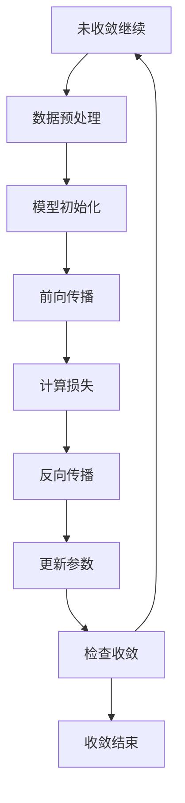
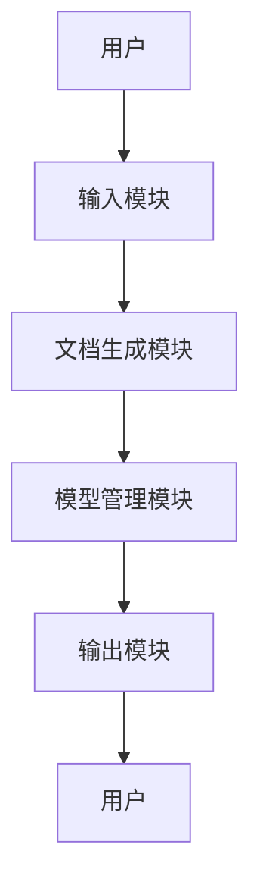
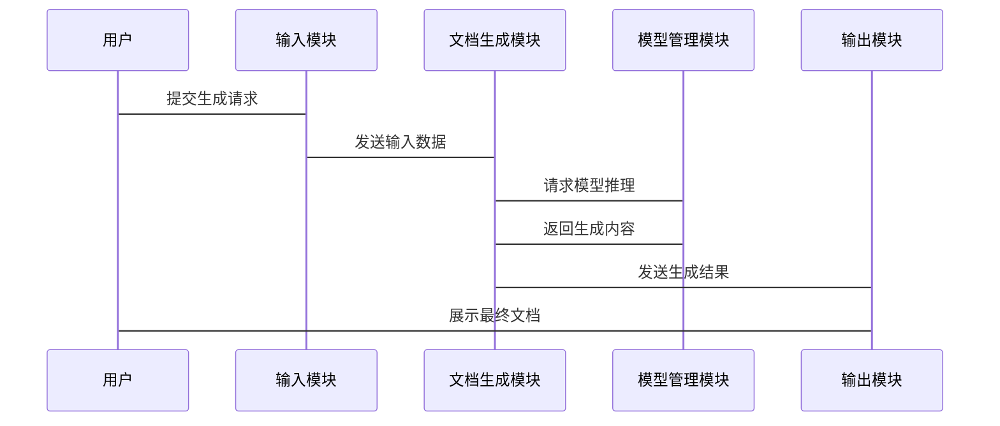

                 

# 《构建企业级AI文档助手：自动生成报告与提案》

> 关键词：企业级AI文档助手，自然语言处理，文本生成，预训练语言模型，深度学习，报告自动生成

> 摘要：本文将详细介绍如何构建一个企业级AI文档助手，重点探讨其核心算法原理、系统架构设计及实际应用场景。通过自然语言处理技术，结合预训练语言模型，实现高效的文档自动生成与优化。文章内容涵盖从背景介绍到系统实现的完整流程，适合技术开发者、项目经理及企业决策者阅读。

---

# 第1章: 企业级AI文档助手的背景与目标

## 1.1 问题背景与目标
### 1.1.1 传统文档生成的痛点
- 手动撰写文档耗时耗力，效率低下。
- 内容重复性高，难以保证一致性。
- 知识更新慢，难以适应快速变化的业务需求。

### 1.1.2 AI文档助手的核心目标
- 提供自动化、智能化的文档生成能力。
- 实现文档内容的快速迭代与优化。
- 支持多种语言和格式，满足企业多样化需求。

### 1.1.3 企业级应用的特殊需求
- 高可用性与稳定性。
- 数据安全与隐私保护。
- 易用性与可定制性。

## 1.2 企业级AI文档助手的定义
### 1.2.1 核心概念与属性
| 核心概念 | 属性 |
|----------|------|
| 输入方式 | 文本文档、结构化数据 |
| 输出方式 | 自然语言文本、结构化报告 |
| 模型能力 | 文本生成、文本摘要、文本分类 |

### 1.2.2 与传统文档生成工具的区别
| 特性 | 传统工具 | AI文档助手 |
|------|----------|------------|
| 内容生成 | 预定义模板 | 自动生成内容 |
| 知识更新 | 手动维护 | 自动学习优化 |

### 1.2.3 企业级应用的边界与外延
- 边界：专注于文档生成，不涉及其他业务功能。
- 外延：支持多种文档类型，如报告、提案、邮件等。

## 1.3 应用场景与价值
### 1.3.1 企业内部报告生成
- 项目进展报告。
- 业务分析报告。
- 内部通知与公告。

### 1.3.2 商业提案自动撰写
- 市场分析报告。
- 产品推广方案。
- 客户提案书。

### 1.3.3 其他相关应用领域
- 教育领域：课程大纲自动生成。
- 医疗领域：病历摘要生成。
- 政府领域：政策文件解读。

## 1.4 本章小结
- 企业级AI文档助手的核心目标是实现高效、智能的文档生成。
- 其价值在于提升企业效率，降低人工成本，同时支持多样化的应用场景。

---

# 第2章: 自然语言处理基础

## 2.1 NLP核心概念
### 2.1.1 词法分析
- 分词：将文本分割成词语。
- 词性标注：给每个词语标注词性（名词、动词等）。

### 2.1.2 句法分析
- 句法树构建：分析句子的语法结构。
- 依存关系分析：分析词语之间的依存关系。

### 2.1.3 文本表示
- 词袋模型：将文本表示为词语的集合。
- 词嵌入：通过词向量表示词语语义。

## 2.2 预训练语言模型简介
### 2.2.1 BERT模型
- 基于Transformer的双向编码器。
- 预训练目标： masked language modeling 和 next sentence prediction。

### 2.2.2 GPT模型
- 基于Transformer的解码器。
- 预训练目标：预测下一个词。

### 2.2.3 其他主流模型
- RoBERTa：优化的BERT变体。
- ALBERT：轻量级的BERT变体。

## 2.3 NLP任务与应用
### 2.3.1 文本生成
- 基于GPT的生成模型。
- 生成策略：贪心搜索、随机采样、温度调节。

### 2.3.2 文本摘要
- 基于Transformer的摘要模型。
- 摘要策略：抽取式、生成式。

### 2.3.3 文本分类
- 文本 sentiment 分析。
- 文本主题分类。

## 2.4 本章小结
- 自然语言处理是AI文档助手的核心技术。
- 预训练语言模型为文本生成提供了强大的基础。

---

# 第3章: 大模型的结构与训练

## 3.1 模型结构
### 3.1.1 Transformer架构
- 基于自注意力机制。
- 包含编码器和解码器。

### 3.1.2 编码器与解码器
- 编码器：将输入文本编码为向量。
- 解码器：根据编码向量生成输出文本。

### 3.1.3 多层感知机
- 多层神经网络用于特征提取。

## 3.2 训练方法
### 3.2.1 预训练策略
- 无监督预训练：使用大规模文本数据。
- 监督微调：针对特定任务进行微调。

### 3.2.2 微调策略
- 使用特定领域的数据进行微调。
- 保持预训练权重，仅微调部分层。

### 3.2.3 模型压缩
- 通过剪枝、量化等技术减少模型大小。

## 3.3 模型评估
### 3.3.1 生成评估指标
- BLEU：衡量生成文本与参考文本的相似性。
- ROUGE：基于召回率的评估指标。

### 3.3.2 分类评估指标
- 准确率、召回率、F1值。

### 3.3.3 实际应用中的评估
- 通过用户反馈进行评估。
- 定期更新模型以适应新数据。

## 3.4 本章小结
- 大模型的结构和训练方法是AI文档助手的关键。
- 预训练和微调策略可以有效提升模型性能。

---

# 第4章: AI文档生成的算法原理

## 4.1 分词与编码
### 4.1.1 分词算法
- 基于字的分词：将文本分割成单个字或词。
- 使用jieba等分词工具。

### 4.1.2 词向量表示
- 使用Word2Vec、GloVe等模型生成词向量。

### 4.1.3 编码器网络
- Transformer编码器将输入序列编码为向量。

## 4.2 解码与生成
### 4.2.1 解码器网络
- Transformer解码器生成输出序列。

### 4.2.2 注意力机制
- 自注意力机制：捕捉文本中的长距离依赖关系。

### 4.2.3 生成策略
- 贪心搜索：逐词生成。
- 随机采样：生成多个候选答案，选择最优解。

## 4.3 模型训练流程
### 4.3.1 数据预处理
- 分词、去除停用词、构建训练样本。

### 4.3.2 损失函数计算
- 使用交叉熵损失函数。
$$ \text{loss} = -\sum_{i=1}^{n} \log p(y_i|x_{\text{input}}) $$

### 4.3.3 优化器选择
- 使用Adam优化器。
$$ \text{Adam} = \text{优化器}(\text{学习率}, \beta_1, \beta_2, \epsilon) $$

## 4.4 算法流程图

## 4.5 本章小结
- 文本生成的算法流程包括分词、编码、解码和生成策略。
- 通过优化器和损失函数可以有效训练模型。

---

# 第5章: 系统架构设计

## 5.1 系统功能设计
### 5.1.1 用户界面
- 提供简洁的输入界面。
- 支持多种文档格式输出。

### 5.1.2 文档生成模块
- 基于预训练模型的生成模块。
- 支持多种生成策略。

### 5.1.3 模型管理模块
- 模型版本管理。
- 模型性能监控。

## 5.2 系统架构图

## 5.3 系统接口设计
- 输入接口：接收用户输入的文本或数据。
- 输出接口：返回生成的文档内容。

## 5.4 系统交互流程

## 5.5 本章小结
- 系统架构设计决定了AI文档助手的可扩展性和稳定性。
- 通过模块化设计可以实现高效的文档生成与管理。

---

作者：AI天才研究院 & 禅与计算机程序设计艺术

