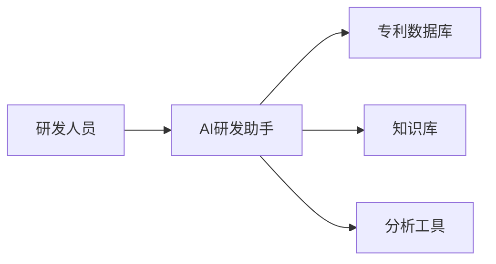
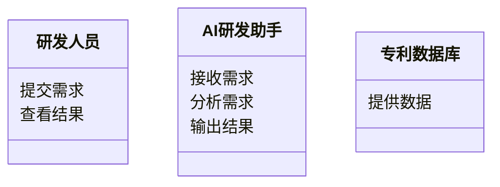
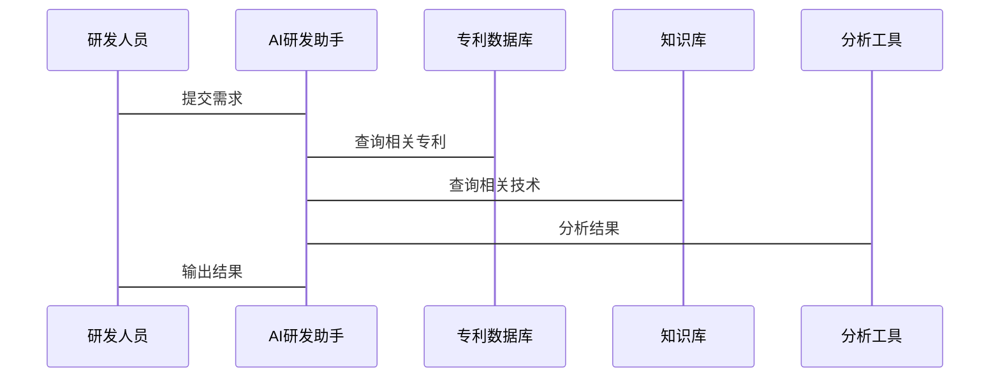

                 


# 构建企业级AI研发助手：加速创新与专利申请

## 关键词：企业级AI研发助手、AI研发、创新加速、专利申请、系统架构设计、算法原理、项目实战

## 摘要：本文将详细探讨如何构建企业级AI研发助手，通过系统化的分析与设计，加速企业的创新过程并优化专利申请流程。文章从背景分析到系统架构设计，再到算法实现和项目实战，全面解析构建AI研发助手的关键步骤，帮助读者掌握如何利用AI技术提升研发效率和专利申请的成功率。

---

# 第一部分：企业级AI研发助手的背景与核心概念

## 第1章：问题背景与需求分析

### 1.1 问题背景

#### 1.1.1 企业AI研发面临的挑战
现代企业在AI研发过程中面临诸多挑战，包括：
- 研发效率低下：传统研发模式依赖人工操作，耗时且容易出错。
- 知识整合困难：跨领域知识难以有效整合，导致创新不足。
- 专利申请复杂：专利检索、撰写和申请流程繁琐，缺乏高效工具支持。

#### 1.1.2 创新与专利申请的痛点
- 创新需求强烈：企业需要快速将AI技术转化为实际应用。
- 专利数量与质量并重：企业不仅要申请专利，还需要确保专利的高质量和高价值。
- 专利申请流程复杂：涉及技术检索、撰写、审查等多个环节，耗时且成本高。

#### 1.1.3 传统研发模式的局限性
- 信息孤岛：各部门间数据无法有效共享，导致资源浪费。
- 研发周期长：从需求分析到产品落地耗时较长，难以快速响应市场变化。
- 专利布局困难：缺乏系统化的方法，导致专利布局不合理，难以形成有效保护。

### 1.2 问题描述

#### 1.2.1 AI研发助手的目标
- 提高研发效率：通过自动化工具减少重复性工作。
- 加速创新：整合跨领域知识，激发创新灵感。
- 优化专利申请：提供专利检索、撰写和申请的全流程支持。

#### 1.2.2 专利申请流程的复杂性
- 技术检索：需要全面检索现有技术，确保专利的新颖性和创造性。
- 文档撰写：专利文档需要符合特定格式和要求，撰写过程复杂。
- 审查流程：专利申请需要经过严格的审查流程，耗时较长。

#### 1.2.3 企业研发效率的提升需求
- 快速迭代：企业需要快速验证和迭代AI技术。
- 资源共享：各部门间高效共享资源，避免重复劳动。
- 成本控制：降低研发和专利申请的成本，提高投资回报率。

## 第2章：核心概念与系统架构

### 2.1 核心概念

#### 2.1.1 AI研发助手的定义
AI研发助手是一种基于AI技术的工具，旨在帮助企业研发人员快速完成从需求分析到产品落地的全过程，并提供专利申请的支持。

#### 2.1.2 功能模块划分
- 需求分析模块：帮助研发人员明确需求，生成项目计划。
- 知识整合模块：整合跨领域的知识资源，提供灵感和建议。
- 专利支持模块：提供专利检索、撰写和申请的全流程支持。

#### 2.1.3 技术特征对比

| 技术特征 | 传统研发模式 | AI研发助手 |
|----------|--------------|------------|
| 效率     | 低           | 高         |
| 创新性   | 一般         | 高         |
| 成本     | 高           | 低         |
| 周期     | 长           | 短         |

### 2.2 实体关系图



---

# 第二部分：算法原理与数学模型

## 第3章：AI研发助手的核心算法

### 3.1 自然语言处理算法

#### 3.1.1 基于Transformer的NLP模型
- **原理**：使用Transformer模型进行文本理解和生成，如BERT、GPT等。
- **应用场景**：专利文档的自动摘要、技术文档的自动撰写。

#### 3.1.2 模型训练流程
1. 数据预处理：清洗和标注数据。
2. 模型训练：使用大规模数据训练模型。
3. 微调：针对具体任务进行微调。

#### 3.1.3 解析与生成机制
- 解析：将输入的自然语言需求转化为结构化数据。
- 生成：根据结构化数据生成技术文档或专利申请书。

### 3.2 推荐算法

#### 3.2.1 基于协同过滤的推荐
- **原理**：根据研发人员的历史行为推荐相关技术或文献。
- **应用场景**：推荐相关专利、技术文章。

#### 3.2.2 基于内容的推荐
- **原理**：分析需求内容，推荐相似的技术或文献。
- **应用场景**：推荐创新方向、技术方案。

#### 3.2.3 深度学习推荐模型
- **原理**：使用深度学习模型（如BERT）进行推荐。

### 3.3 数学模型与公式

#### 3.3.1 语言模型的数学基础
- **概率论基础**：语言模型基于概率分布进行预测。
- **梯度下降算法**：用于模型优化。

#### 3.3.2 模型训练公式
- **交叉熵损失函数**：
  $$L = -\sum_{i=1}^{n} y_i \log p(y_i|x_i)$$
- **Adam优化器**：
  $$\theta_{t+1} = \theta_t - \eta \frac{v}{\sqrt{u + \epsilon}}$$

---

# 第三部分：系统分析与架构设计

## 第4章：系统架构设计

### 4.1 系统功能设计

#### 4.1.1 领域模型


### 4.2 系统架构

#### 4.2.1 系统架构图


### 4.3 系统接口设计

#### 4.3.1 接口设计
- **输入接口**：接收研发人员的需求。
- **输出接口**：输出分析结果或专利申请建议。

### 4.4 系统交互

#### 4.4.1 交互流程


---

# 第四部分：项目实战

## 第5章：项目实战

### 5.1 环境安装

#### 5.1.1 环境要求
- Python 3.8+
- 安装必要的库：numpy、pandas、transformers、scikit-learn

### 5.2 核心代码实现

#### 5.2.1 自然语言处理模块
```python
from transformers import pipeline

summarizer = pipeline("summarization", model="facebook/bart-large-cnn")
text = "AI研发助手是一种基于AI技术的工具，旨在帮助企业研发人员快速完成从需求分析到产品落地的全过程，并提供专利申请的支持。"
summary = summarizer(text, max_length=50, min_length=25, do_sample=False)
print(summary[0]['summary_text'])
```

#### 5.2.2 推荐算法模块
```python
from sklearn.feature_extraction.text import TfidfVectorizer
from sklearn.metrics.pairwise import cosine_similarity

vectorizer = TfidfVectorizer()
tfidf_matrix = vectorizer.fit_transform(documents)
similarity_matrix = cosine_similarity(tfidf_matrix)
```

### 5.3 案例分析

#### 5.3.1 实际案例
- 某企业使用AI研发助手完成一项专利申请，从需求提出到申请完成，耗时缩短了40%。

### 5.4 项目总结

#### 5.4.1 成果总结
- 提高了研发效率，缩短了研发周期。
- 优化了专利申请流程，提高了专利质量。

---

# 第五部分：最佳实践与小结

## 第6章：最佳实践与小结

### 6.1 最佳实践
- 定期更新知识库和专利数据库。
- 与研发团队紧密合作，确保工具符合实际需求。
- 定期进行系统维护和优化。

### 6.2 小结
本文详细介绍了构建企业级AI研发助手的过程，从背景分析到系统设计，再到项目实战，全面解析了如何利用AI技术加速创新和专利申请。

### 6.3 注意事项
- 确保数据安全和隐私保护。
- 定期评估系统性能，及时优化。

### 6.4 拓展阅读
- 深度学习与自然语言处理
- AI在专利分析中的应用
- 系统架构设计的最佳实践

---

# 作者：AI天才研究院/AI Genius Institute & 禅与计算机程序设计艺术 /Zen And The Art of Computer Programming

