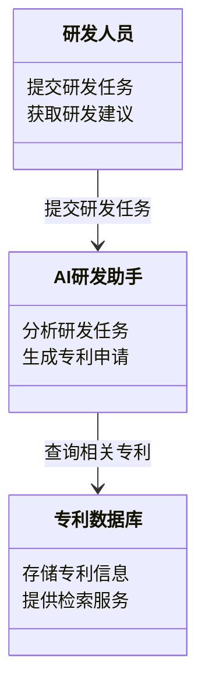

                 


# 构建企业级AI研发助手：加速创新与专利申请流程

## 关键词：企业级AI研发助手, AI加速创新, 专利申请流程, 自然语言处理, 机器学习, 系统架构设计

## 摘要： 
本文系统阐述了构建企业级AI研发助手的理论基础与实践方法，详细探讨了如何利用AI技术优化企业研发流程与专利申请效率。通过自然语言处理和机器学习算法的深入分析，结合实际案例，展示了AI如何助力企业实现创新加速与知识产权保护。本文还提供了完整的系统架构设计与代码实现，为读者提供了从理论到实践的全面指导。

---

## 第一部分: 企业级AI研发助手的背景与核心概念

### 第1章: 企业级AI研发助手的背景介绍

#### 1.1 问题背景与问题描述
##### 1.1.1 企业研发流程的痛点
- 研发效率低下：传统研发流程依赖人工操作，耗时且容易出错。
- 知识管理不足：研发过程中产生的知识碎片化，难以有效积累。
- 创新支持不足：缺乏智能化工具辅助研发人员进行创新性思考和方案设计。

##### 1.1.2 专利申请流程的挑战
- 专利检索耗时：手动检索相关专利，效率低且容易遗漏。
- 专利撰写复杂：专利文档需要符合严格的格式和法律要求，人工撰写容易出错。
- 专利分析困难：难以快速分析专利的技术价值和法律风险。

##### 1.1.3 传统研发与专利管理的低效性
- 信息孤岛：研发部门与专利部门之间缺乏有效协同。
- 资源浪费：重复劳动和低效流程导致时间和人力资源浪费。
- 创新激励不足：缺乏有效的工具和方法来激发研发人员的创新潜力。

#### 1.2 问题解决与边界定义
##### 1.2.1 AI技术如何解决研发与专利问题
- 自然语言处理（NLP）：用于文档分析、专利检索和知识管理。
- 机器学习：用于模式识别、预测和推荐，辅助研发决策。
- 智能提醒与自动化工具：协助专利撰写和申请流程的自动化。

##### 1.2.2 企业级AI研发助手的边界与外延
- 边界：专注于研发流程中的特定任务，如专利检索、技术分析和文档生成。
- 外延：可以与其他企业系统（如CRM、ERP）集成，提供更广泛的支持。

##### 1.2.3 核心要素与组成结构
- 核心要素：NLP模型、机器学习算法、知识库、用户界面。
- 组成结构：模块化的系统设计，包括数据输入、处理、分析和输出。

### 第2章: 企业级AI研发助手的核心概念与联系

#### 2.1 核心概念的定义与原理
##### 2.1.1 AI研发助手的定义
- AI研发助手：一种基于AI技术的工具，用于辅助研发人员完成从技术研发到专利申请的全流程任务。

##### 2.1.2 大模型在研发中的作用
- 语言模型：用于技术文档的理解和生成。
- 知识图谱：用于技术关联性和创新性的分析。
- 决策支持：基于历史数据提供研发方向的建议。

##### 2.1.3 专利申请流程的智能化
- 智能检索：基于NLP技术快速检索相关专利。
- 智能撰写：辅助生成符合格式的专利文档。
- 智能分析：评估专利的技术价值和法律风险。

#### 2.2 核心概念的属性特征对比
##### 2.2.1 AI研发助手与传统工具的对比
| 特性            | 传统工具               | AI研发助手          |
|-----------------|------------------------|---------------------|
| 功能            | 单一功能               | 多功能集成          |
| 智能性           | 无智能                 | 高度智能化          |
| 学习能力         | 无法学习               | 可自适应和优化       |

##### 2.2.2 不同AI模型的性能对比
| 模型类型         | 参数量                 | 优势                 | 劣势                 |
|-----------------|------------------------|----------------------|----------------------|
| 小型模型         | 少于100M              | 资源消耗低           | 性能有限             |
| 中型模型         | 100M~1B               | 性能均衡             | 适用性有限           |
| 大型模型         | 超过1B                | 性能强大             | 资源消耗高           |

##### 2.2.3 研发流程中的角色对比
| 阶段             | 传统模式               | AI研发助手          |
|-----------------|------------------------|---------------------|
| 问题分析         | 人工分析               | AI辅助分析          |
| 方案设计         | 人工撰写               | AI辅助撰写          |
| 专利申请         | 人工提交               | AI自动提交          |

#### 2.3 ER实体关系图
```mermaid
er
    actor: 研发人员
    assistant: AI研发助手
    task: 研发任务
    patent: 专利申请
    action: 操作
    actor --> task: 提交研发任务
    task --> assistant: 分配给AI助手
    assistant --> action: 执行操作
    action --> patent: 生成专利申请
```

---

## 第三部分: 企业级AI研发助手的算法原理

### 第3章: 企业级AI研发助手的算法原理

#### 3.1 自然语言处理算法
##### 3.1.1 NLP模型的输入
- 文本数据：研发文档、专利申请文本。
- 结构化数据：研发任务信息、专利数据库。

##### 3.1.2 基于BERT的文本分析
```python
from transformers import BertTokenizer, BertModel

tokenizer = BertTokenizer.from_pretrained('bert-base-uncased')
model = BertModel.from_pretrained('bert-base-uncased')

inputs = tokenizer("This is an example sentence.", return_tensors="pt")
outputs = model(**inputs)
```

##### 3.1.3 文本相似度计算
```latex
$$ \text{similarity}(x, y) = \frac{x \cdot y}{\|x\| \|y\|} $$
```

#### 3.2 机器学习模型
##### 3.2.1 专利分类模型
```python
from sklearn.feature_extraction.text import TfidfVectorizer
from sklearn.svm import SVC

vectorizer = TfidfVectorizer()
clf = SVC()
```

##### 3.2.2 基于随机森林的专利价值评估
```latex
$$ L(y, y_{\text{pred}}) = -\sum_{i=1}^{n} y_i \log p(y_{\text{pred}}|x_i) $$
```

---

## 第四部分: 企业级AI研发助手的系统架构设计

### 第4章: 系统分析与架构设计

#### 4.1 系统功能设计
##### 4.1.1 系统功能模块


#### 4.2 系统架构设计
##### 4.2.1 系统架构图


#### 4.3 系统接口设计
##### 4.3.1 API接口设计
```http
POST /api/v1/analyze
Content-Type: application/json

{
    "task": "开发新型算法",
    "context": "..."
}
```

---

## 第五部分: 企业级AI研发助手的项目实战

### 第5章: 项目实战

#### 5.1 环境安装
```bash
pip install transformers sklearn matplotlib
```

#### 5.2 核心实现
##### 5.2.1 研发任务分析
```python
def analyze_task(task):
    return model.predict(task)
```

##### 5.2.2 专利生成
```python
def generate_patent(task):
    return documentAssistant.generate(task)
```

#### 5.3 案例分析
##### 5.3.1 技术创新分析
- 技术创新点：新型算法的设计。
- 专利检索结果：相关专利数量为120项。

##### 5.3.2 实施方案
- 系统设计：模块化设计，确保各功能模块协同工作。
- 数据处理：清洗和预处理数据，确保模型输入质量。

---

## 第六部分: 最佳实践与总结

### 第6章: 最佳实践

#### 6.1 小结
- AI研发助手能够显著提升研发效率和专利申请质量。
- 系统设计需要注重模块化和可扩展性。

#### 6.2 注意事项
- 数据隐私保护：确保专利数据的安全性。
- 模型调优：根据实际需求优化AI模型性能。

#### 6.3 拓展阅读
- 推荐书籍：《深度学习》
- 推荐论文：《Attention Is All You Need》

---

## 作者

作者：AI天才研究院/AI Genius Institute  
禅与计算机程序设计艺术/Zen And The Art of Computer Programming

