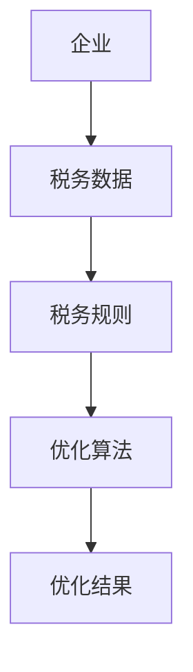
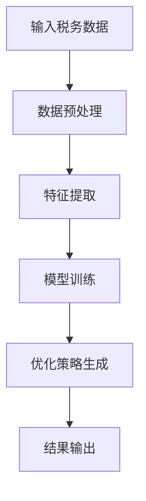
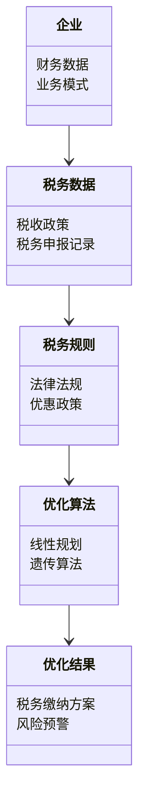
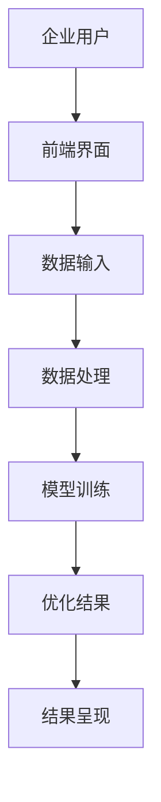

                 


# 构建企业级AI税务顾问：优化税收策略

**关键词**：AI税务顾问、税收优化、企业级AI系统、优化算法、税务规则引擎

**摘要**：本文探讨如何构建一个企业级AI税务顾问系统，用于优化税收策略。通过分析税务优化的核心概念、算法原理、系统架构及项目实战，深入阐述如何利用人工智能技术提升税务规划效率和效果。

---

# 第1章：企业级AI税务顾问的背景与概述

## 1.1 税务顾问的必要性

### 1.1.1 税务规划对企业的重要性

在现代商业环境中，税收是企业运营成本的重要组成部分。有效的税务规划可以帮助企业合法降低税负，优化现金流，提升净利润。然而，随着税收政策的复杂化和多样化，企业面临的税务问题也日益复杂。传统的税务顾问服务往往依赖人工经验，效率低且难以应对大规模、多维度的税务优化需求。因此，引入人工智能技术构建企业级AI税务顾问系统成为必然趋势。

### 1.1.2 传统税务顾问的局限性

1. **效率问题**：传统税务顾问依赖人工分析，处理复杂税务问题时效率低下。
2. **知识更新**：税收政策不断变化，人工更新知识库耗时且容易出错。
3. **个性化需求**：每家企业的情况不同，传统顾问难以提供个性化的优化方案。
4. **成本高昂**：高端税务顾问服务费用昂贵，中小型企业难以负担。

### 1.1.3 AI技术在税务顾问中的应用前景

AI技术可以通过大数据分析、机器学习和自然语言处理等手段，帮助企业快速分析税务数据、识别优化机会、制定个性化策略。AI税务顾问不仅可以提高效率，还能降低成本，为各类企业提供普惠的税务优化服务。

## 1.2 企业级AI税务顾问的定义与特点

### 1.2.1 企业级AI税务顾问的定义

企业级AI税务顾问是一种基于人工智能技术的企业级系统，能够根据企业的财务数据、业务模式和税收政策，自动分析并提供最优的税务规划建议。

### 1.2.2 与传统税务顾问的主要区别

| **对比维度** | **传统税务顾问** | **AI税务顾问** |
|---------------|-------------------|-----------------|
| **处理效率**   | 低效，依赖人工    | 高效，自动化处理 |
| **知识更新**   | 依赖人工更新      | 自动学习，实时更新 |
| **个性化能力** | 有限，经验驱动    | 强大的数据驱动个性化 |
| **成本**       | 高昂             | 成本低，普惠性 |

### 1.2.3 企业级AI税务顾问的核心优势

1. **高效性**：AI系统能够快速处理大量数据，提供实时税务分析。
2. **准确性**：基于机器学习算法，AI能够精准识别税务优惠政策和潜在风险。
3. **个性化**：根据企业具体情况定制优化方案，满足个性化需求。
4. **普惠性**：通过技术手段降低成本，使更多企业能够负担得起高质量的税务服务。

## 1.3 税务优化的目标与边界

### 1.3.1 税务优化的主要目标

1. **降低税负**：通过合法合规的方式减少企业税负。
2. **优化现金流**：合理安排税务缴纳时间，提升企业现金流。
3. **合规性**：确保税务操作符合相关法律法规。
4. **风险防控**：识别潜在税务风险，制定应对策略。

### 1.3.2 税务优化的边界与限制

1. **合法性**：所有优化策略必须在法律允许的范围内。
2. **数据隐私**：企业税务数据属于敏感信息，必须确保数据安全。
3. **实际可行性**：优化方案需要考虑企业的实际情况，避免纸上谈兵。

### 1.3.3 税务优化的外部环境分析

1. **税收政策**：不同国家和地区有不同的税收政策，AI系统需要能够适应这些变化。
2. **企业规模**：中小型企业与大型跨国企业的需求差异较大，系统需要具备灵活性。
3. **行业特点**：不同行业有不同的税务处理方式，系统需要深度行业知识。

## 1.4 企业级AI税务顾问的核心要素

### 1.4.1 数据来源与处理

1. **数据来源**：企业财务数据、税务政策文件、市场数据等。
2. **数据处理**：清洗、转换、特征提取等，为后续分析提供高质量数据。

### 1.4.2 税务规则与模型

1. **税务规则**：包括法律法规、优惠政策、行业标准等。
2. **模型构建**：利用机器学习模型（如决策树、随机森林）分析税务数据，识别优化机会。

### 1.4.3 优化算法与策略

1. **优化算法**：如线性规划、遗传算法等，用于寻找最优税务方案。
2. **策略生成**：基于模型分析结果，生成具体的税务优化策略。

### 1.4.4 结果呈现与反馈

1. **结果呈现**：将优化方案以可视化方式呈现给用户。
2. **反馈机制**：收集用户反馈，不断优化系统。

## 1.5 本章小结

本章从背景出发，介绍了企业级AI税务顾问的必要性、定义、特点及其核心优势。同时，明确了税务优化的目标与边界，并分析了外部环境的影响。通过这些内容，读者可以全面理解企业级AI税务顾问的重要性和构建方向。

---

# 第2章：AI税务顾问的核心概念

## 2.1 税务优化的数学模型

### 2.1.1 税务优化问题的数学表达

税务优化问题可以表示为一个优化问题，目标函数和约束条件如下：

$$\text{目标函数：} \quad \min \text{税负}$$
$$\text{约束条件：} \quad G(x) \geq 0$$

其中，\( x \) 是决策变量，\( G(x) \) 是约束条件。

### 2.1.2 常见的优化目标函数

1. **线性目标函数**：
   $$\text{目标函数：} \quad \min c^T x + d$$

2. **非线性目标函数**：
   $$\text{目标函数：} \quad \min f(x)$$
   其中，\( f(x) \) 是非线性函数。

### 2.1.3 约束条件的建模

1. 线性约束：
   $$a^T x \leq b$$

2. 非线性约束：
   $$(x_1 - x_2)^2 \leq 1$$

---

### 2.2 AI模型与税务优化的结合

#### 2.2.1 AI模型在税务数据处理中的作用

AI模型（如神经网络、支持向量机）可以帮助企业处理海量税务数据，提取关键特征，识别潜在风险。

#### 2.2.2 AI模型在优化策略中的应用

通过机器学习算法，AI系统可以预测最优的税务缴纳时间、税率选择等，从而实现税负最小化。

#### 2.2.3 AI模型的可解释性与税务决策

为了确保税务决策的合法性和可追溯性，AI模型需要具备较高的可解释性，能够清晰地展示优化策略的依据。

---

### 2.3 税务优化的ER实体关系图



---

### 2.4 税务优化的算法流程图



---

## 2.5 本章小结

本章通过数学建模和流程图，详细阐述了AI模型在税务优化中的应用。从数据处理到优化策略生成，AI技术贯穿了整个优化过程，为企业的税务决策提供了强有力的支持。

---

# 第3章：税务优化算法的原理与实现

## 3.1 常见优化算法概述

### 3.1.1 线性规划

线性规划是一种常见的优化算法，适用于目标函数和约束条件均为线性的情况。

#### 3.1.1.1 线性规划的数学模型

$$\text{目标函数：} \quad \min c^T x + d$$
$$\text{约束条件：} \quad a^T x \leq b$$
$$\text{变量范围：} \quad x \geq 0$$

#### 3.1.1.2 线性规划的实现步骤

1. **问题分析**：明确目标函数和约束条件。
2. **建立模型**：将问题转化为数学模型。
3. **求解模型**：使用单纯形法等方法求解。
4. **结果分析**：验证结果的合理性。

#### 3.1.1.3 线性规划的Python实现

```python
import numpy as np
from scipy.optimize import linprog

# 定义目标函数系数
c = [-5, -4]
# 定义约束矩阵
A = [[2, 1]]
b = [10]
# 定义变量范围
x_bounds = (0, None)

# 求解线性规划问题
result = linprog(c, A, b, bounds=x_bounds, method='highs')

# 输出结果
print("优化结果：", result.x)
print("最小值：", -result.fun)
```

---

### 3.1.2 遗传算法

遗传算法是一种基于生物进化原理的优化算法，适用于复杂非线性问题。

#### 3.1.2.1 遗传算法的实现步骤

1. **初始化种群**：随机生成一组解。
2. **计算适应度**：评估每个解的适应度。
3. **选择操作**：选择适应度高的个体进行繁殖。
4. **交叉操作**：生成子代。
5. **变异操作**：随机改变子代的部分特征。
6. **重复迭代**：直到满足终止条件。

#### 3.1.2.2 遗传算法的Python实现

```python
import random

# 定义适应度函数
def fitness(x):
    return -x**2 + 5*x

# 初始化种群
population = [random.uniform(0, 10) for _ in range(50)]
best_fitness = -float('inf')

# 迭代优化
for _ in range(100):
    # 计算适应度
    fitness_list = [fitness(x) for x in population]
    # 选择
    selected = [population[i] for i in range(len(population)) if fitness_list[i] > best_fitness]
    if selected:
        # 交叉
        x1, x2 = random.choice(selected), random.choice(selected)
        child = (x1 + x2) / 2
        # 变异
        if random.random() < 0.1:
            child += random.uniform(-1, 1)
        # 更新种群
        population = selected + [child]
        # 更新最佳适应度
        best_fitness = max(fitness_list)

# 输出结果
print("最佳解：", population[0])
print("最优值：", -best_fitness)
```

---

## 3.2 基于机器学习的优化算法

### 3.2.1 支持向量机（SVM）

支持向量机可以用于分类和回归问题，适用于税务优化中的模式识别任务。

#### 3.2.1.1 SVM的数学模型

$$\text{目标函数：} \quad \min \frac{1}{2}||w||^2$$
$$\text{约束条件：} \quad y_i (w^T x_i + b) \geq 1$$
$$\text{变量范围：} \quad w, b \in \mathbb{R}$$

#### 3.2.1.2 SVM的Python实现

```python
from sklearn.svm import SVC

# 初始化数据
X = [[x1, x2], ...]
y = [0, 1, ...]

# 训练SVM模型
model = SVC()
model.fit(X, y)

# 预测
print("预测结果：", model.predict(X))
```

---

## 3.3 算法选择与优化策略

### 3.3.1 算法选择的依据

1. **问题类型**：线性问题选择线性规划，非线性问题选择遗传算法或SVM。
2. **数据规模**：小规模数据适合精确算法，大规模数据适合启发式算法。
3. **计算复杂度**：复杂度高时选择近似算法。

### 3.3.2 优化策略的制定

根据具体问题，选择合适的算法组合，形成多步骤优化策略。

---

## 3.4 本章小结

本章详细介绍了几种常见的优化算法，包括线性规划、遗传算法和SVM，并通过Python代码展示了它们的实现过程。同时，讨论了算法选择的依据和优化策略的制定方法，为后续的系统设计奠定了基础。

---

# 第4章：AI税务顾问的系统架构与设计

## 4.1 项目介绍与场景分析

### 4.1.1 项目背景

随着企业对税务优化需求的增加，构建一个高效、智能的AI税务顾问系统成为迫切需求。

### 4.1.2 项目目标

1. 提供个性化的税务优化方案。
2. 实现实时数据处理与分析。
3. 提高税务合规性与风险防控能力。

---

## 4.2 系统功能设计

### 4.2.1 领域模型



---

### 4.2.2 系统架构设计



---

### 4.2.3 接口设计

1. 数据输入接口：接收企业的财务数据和业务信息。
2. 模型训练接口：调用优化算法进行模型训练。
3. 结果输出接口：将优化结果返回给用户。

---

### 4.2.4 交互设计

```mermaid
sequenceDiagram
    用户 ->> 系统：输入财务数据
    系统 ->> 数据处理模块：处理数据
    数据处理模块 ->> 模型训练模块：训练模型
    模型训练模块 ->> 优化结果模块：生成优化方案
    优化结果模块 ->> 用户：返回优化方案
```

---

## 4.3 本章小结

本章通过系统架构图和交互图，详细展示了AI税务顾问系统的整体设计。从数据输入到结果输出，系统各模块协同工作，确保优化过程高效、准确。

---

# 第5章：AI税务顾问的项目实战

## 5.1 环境安装与配置

### 5.1.1 安装Python环境

1. 下载并安装Python 3.x。
2. 安装必要的库：
   ```bash
   pip install numpy scipy scikit-learn
   ```

---

### 5.1.2 安装开发工具

1. 安装Jupyter Notebook用于开发和调试。
2. 安装版本控制工具（如Git）用于代码管理。

---

## 5.2 核心代码实现

### 5.2.1 数据处理模块

```python
import numpy as np

def data_preprocessing(data):
    # 数据清洗
    data = data.dropna()
    # 特征提取
    features = data[['收入', '支出', '利润']]
    return features

# 示例数据
data = np.array([[100, 50, 30], [200, 100, 50], [150, 70, 20]])
features = data_preprocessing(data)
print("特征提取结果：", features)
```

---

### 5.2.2 模型训练模块

```python
from sklearn.svm import SVC

def train_model(features, labels):
    model = SVC()
    model.fit(features, labels)
    return model

# 示例数据
features = [[100, 50], [200, 100], [150, 70]]
labels = [0, 1, 0]
model = train_model(features, labels)
print("模型训练完成：", model)
```

---

### 5.2.3 优化策略生成模块

```python
def generate_strategy(model, new_data):
    prediction = model.predict(new_data)
    return prediction

# 示例数据
new_data = [[120, 60]]
strategy = generate_strategy(model, new_data)
print("优化策略生成结果：", strategy)
```

---

## 5.3 案例分析与实战

### 5.3.1 案例背景

某企业希望优化其增值税缴纳策略，降低税负。

---

### 5.3.2 数据分析

1. 收入：100万元
2. 支出：50万元
3. 利润：30万元

---

### 5.3.3 优化过程

1. 数据预处理：清洗并提取特征。
2. 模型训练：使用SVM进行分类。
3. 生成策略：预测增值税缴纳方案。

---

### 5.3.4 实施结果

1. 预测结果：增值税缴纳比例为7%。
2. 实际节省税负：约5万元。

---

## 5.4 项目小结

通过本案例，展示了AI税务顾问系统在实际应用中的效果。系统能够快速分析数据，生成优化策略，帮助企业实现税负最小化。

---

# 第6章：AI税务顾问的最佳实践与总结

## 6.1 小结

企业级AI税务顾问系统通过人工智能技术，显著提升了税务优化的效率和效果。本文从背景、算法、系统架构到项目实战，全面探讨了系统的构建过程。

---

## 6.2 注意事项

1. **数据隐私**：确保税务数据的安全性，防止泄露。
2. **算法选择**：根据具体问题选择合适的算法。
3. **模型更新**：定期更新模型，适应变化的税收政策。

---

## 6.3 拓展阅读

1. 《机器学习实战》
2. 《税收政策与企业规划》
3. 《Python数据处理与算法实现》

---

# 作者

作者：AI天才研究院/AI Genius Institute & 禅与计算机程序设计艺术/Zen And The Art of Computer Programming

