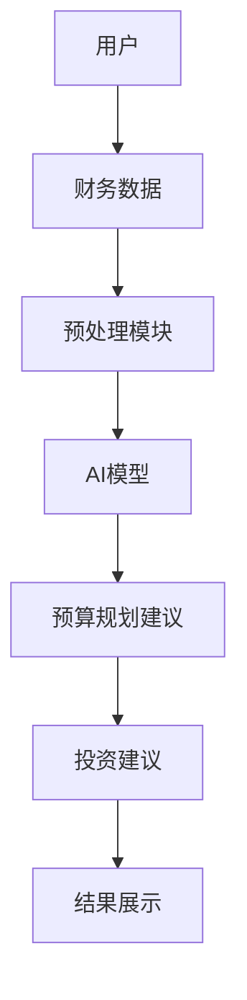
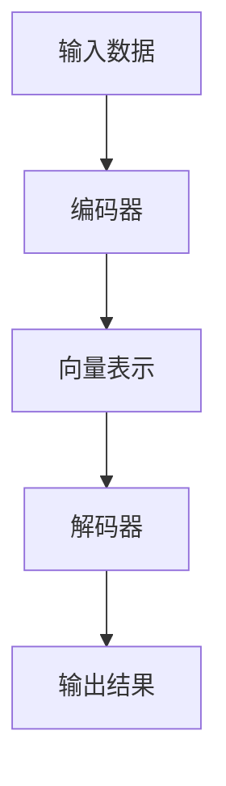
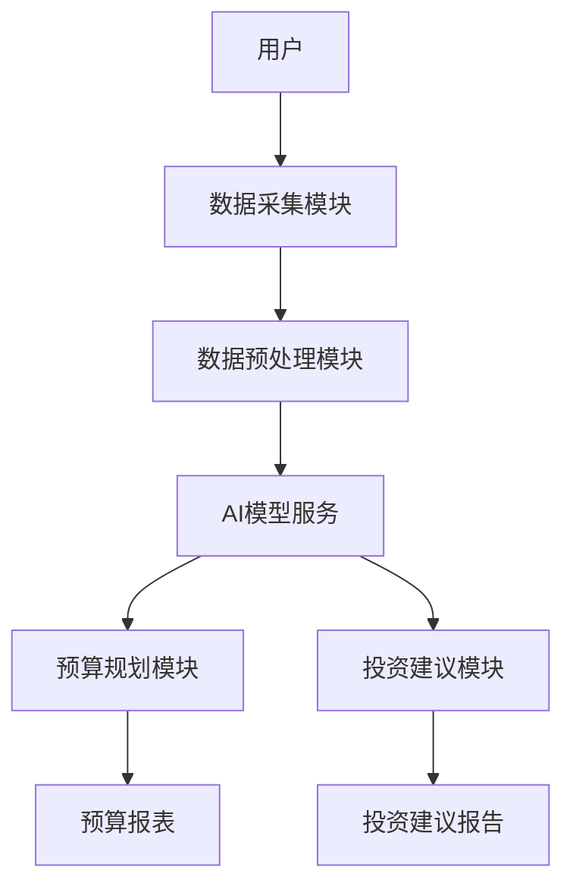
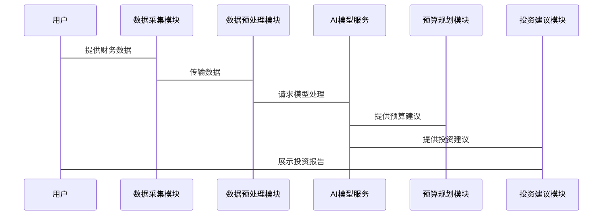

                 


# 构建企业级AI财务顾问：智能预算规划与投资建议

## 关键词：AI财务顾问，预算规划，投资建议，大语言模型，企业级系统，AI算法

## 摘要：本文将深入探讨如何构建一个企业级AI财务顾问系统，重点分析智能预算规划与投资建议的核心技术与实现方案。通过结合大语言模型和机器学习算法，本文将详细讲解系统设计、算法原理、项目实战及优化策略，为企业财务管理的智能化转型提供理论与实践指导。

---

# 第一部分：企业级AI财务顾问的背景与核心概念

## 第1章：AI财务顾问的背景与问题背景

### 1.1 企业财务管理的现状与挑战

#### 1.1.1 传统财务管理模式的局限性

传统财务管理模式依赖人工操作，效率低下且容易出错。企业需要处理大量财务数据，包括预算、投资、成本控制等，但传统方法难以快速响应变化，缺乏灵活性和智能化。

#### 1.1.2 数字化转型对企业财务管理的影响

随着数字化转型的推进，企业开始依赖技术手段优化财务管理。数字化工具可以提高数据处理效率，但如何利用AI技术进一步提升财务决策的智能化水平，仍是一个重要挑战。

#### 1.1.3 AI技术在财务领域的应用现状

AI技术在财务领域的应用逐渐增多，特别是在预算规划和投资建议方面。然而，如何构建一个高效、准确的企业级AI财务顾问系统，仍需要深入研究和实践。

---

### 1.2 AI财务顾问的核心问题

#### 1.2.1 预算规划与投资建议的核心问题

预算规划需要考虑企业的收入、支出、成本控制等因素，而投资建议则需要评估不同投资项目的风险和收益。AI技术可以通过数据分析和模型预测，帮助企业在预算和投资决策中做出更明智的选择。

#### 1.2.2 问题背景与问题描述

企业财务管理的核心问题是如何在不确定的市场环境中做出最优的预算和投资决策。传统方法依赖经验丰富的财务人员，但这种方法效率低、成本高，且容易受到主观因素的影响。

#### 1.2.3 问题解决的路径与方法

AI技术可以通过以下路径解决这些问题：
1. 数据驱动：利用企业的历史数据和市场数据，构建预测模型。
2. 智能优化：通过算法优化预算分配和投资组合。
3. 实时反馈：根据市场变化实时调整财务策略。

---

### 1.3 AI财务顾问的边界与外延

#### 1.3.1 AI财务顾问的边界

AI财务顾问的边界主要集中在预算规划和投资建议领域，不涉及企业的日常会计操作和税务申报等事务。

#### 1.3.2 相关领域的外延

AI技术在财务领域的应用还包括风险管理、财务报告生成、成本控制等方面。本文将重点讨论预算规划和投资建议的核心问题。

#### 1.3.3 核心概念与实际应用场景

AI财务顾问的核心概念包括：
- 数据采集与处理
- 模型训练与优化
- 系统集成与部署

实际应用场景包括企业内部的财务决策支持和外部客户的财务咨询服务。

---

## 第2章：AI财务顾问的核心概念与联系

### 2.1 核心概念的原理与特征

#### 2.1.1 AI大模型的基本原理

AI大模型（如GPT系列）通过深度学习技术，利用大量数据训练神经网络模型，使其能够理解和生成人类语言。在财务领域，AI模型可以用于文本分析、数据预测和决策支持。

#### 2.1.2 AI财务顾问的核心特征

1. 数据驱动：依赖高质量的财务数据进行分析和预测。
2. 实时性：能够根据市场变化实时调整财务策略。
3. 可解释性：模型的决策过程需要透明，便于财务人员理解和调整。

#### 2.1.3 各要素之间的关系

AI模型、财务数据和用户需求是构成AI财务顾问的三大核心要素。模型通过处理数据，生成预算和投资建议，满足用户的需求。

---

### 2.2 核心概念的属性特征对比

#### 2.2.1 对比表格

| 核心概念 | 特性 | 描述 |
|----------|------|------|
| AI模型   | 数据需求 | 需要大量标注数据训练 |
|          | 计算能力 | 需要高性能计算资源 |
|          | 可解释性 | 相对较低，但可通过解释层提升 |

---

### 2.3 ER实体关系图架构的Mermaid流程图



---

## 第3章：AI财务顾问的算法原理

### 3.1 AI大模型的算法概述

#### 3.1.1 大模型的基本结构

AI大模型通常由编码器和解码器组成，编码器负责将输入数据转换为向量表示，解码器根据向量生成输出。

#### 3.1.2 常用算法及其特点

1. Transformer：基于自注意力机制，适用于长文本处理。
2. LSTM：基于循环神经网络，适用于时序数据。

---

### 3.2 算法原理的Mermaid流程图



---

### 3.3 数学公式与模型训练

#### 3.3.1 损失函数

$$ L = \frac{1}{N}\sum_{i=1}^{N}(y_i - \hat{y_i})^2 $$

其中，$y_i$是真实值，$\hat{y_i}$是模型预测值，$N$是样本数量。

#### 3.3.2 优化算法

常用Adam优化算法，更新参数：

$$ \theta_{t+1} = \theta_t - \eta \frac{\partial L}{\partial \theta_t} $$

其中，$\eta$是学习率，$\frac{\partial L}{\partial \theta_t}$是损失函数对参数的梯度。

---

## 第4章：AI财务顾问的系统架构设计

### 4.1 系统功能设计

#### 4.1.1 预算规划模块

- 数据输入：企业财务数据。
- 模型训练：基于历史数据预测未来预算。
- 结果展示：生成预算报表。

#### 4.1.2 投资建议模块

- 数据分析：市场数据、企业财务数据。
- 模型预测：评估投资项目的风险和收益。
- 报告生成：提供投资建议。

---

### 4.2 系统架构设计



---

### 4.3 接口设计与交互流程



---

# 第二部分：企业级AI财务顾问的系统实现

## 第5章：系统实现与项目实战

### 5.1 环境搭建

#### 5.1.1 安装必要的库和工具

```bash
pip install numpy pandas scikit-learn transformers
```

#### 5.1.2 数据准备与预处理

```python
import pandas as pd
import numpy as np
from sklearn.model_selection import train_test_split
```

---

### 5.2 系统核心实现

#### 5.2.1 数据预处理代码

```python
def preprocess_data(data):
    # 数据清洗
    data = data.dropna()
    # 标准化处理
    from sklearn.preprocessing import StandardScaler
    scaler = StandardScaler()
    data_scaled = scaler.fit_transform(data)
    return data_scaled
```

---

#### 5.2.2 模型训练代码

```python
from sklearn.linear_model import LinearRegression
def train_model(X, y):
    model = LinearRegression()
    model.fit(X, y)
    return model
```

---

### 5.3 案例分析与实际应用

#### 5.3.1 案例分析

假设一家企业需要制定年度预算，AI模型通过分析过去三年的财务数据，预测未来一年的收入和支出，并生成预算建议。

#### 5.3.2 代码应用解读

```python
# 训练模型
X_train, X_test, y_train, y_test = train_test_split(X, y, test_size=0.2)
model = train_model(X_train, y_train)
# 模型评估
score = model.score(X_test, y_test)
print(f"模型得分：{score}")
```

---

## 第6章：系统优化与部署

### 6.1 系统优化

#### 6.1.1 模型优化

使用超参数调优和模型集成方法提升预测精度。

#### 6.1.2 系统性能优化

优化数据处理流程，减少系统响应时间。

---

### 6.2 系统部署

#### 6.2.1 部署方案

将AI模型部署到云服务器，通过API接口提供服务。

#### 6.2.2 监控与维护

实时监控系统运行状态，及时修复异常。

---

## 第7章：总结与展望

### 7.1 本文总结

本文详细探讨了企业级AI财务顾问的构建过程，从算法原理到系统实现，为企业财务管理的智能化转型提供了理论和实践指导。

### 7.2 未来展望

未来，AI技术在财务领域的应用将更加广泛，例如智能合约、自动化审计等，为企业创造更大的价值。

---

## 作者：AI天才研究院/AI Genius Institute & 禅与计算机程序设计艺术 /Zen And The Art of Computer Programming

