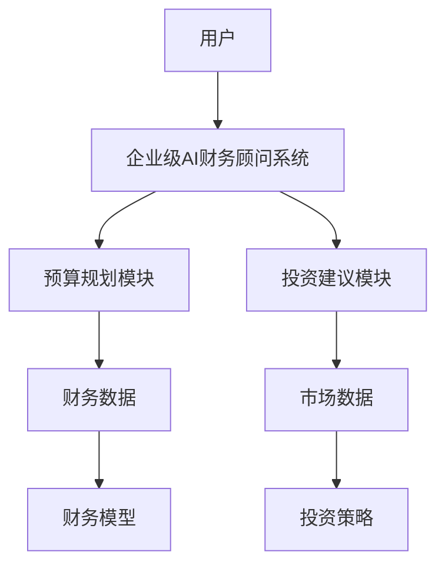
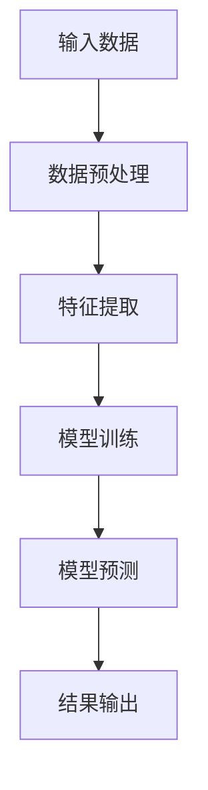
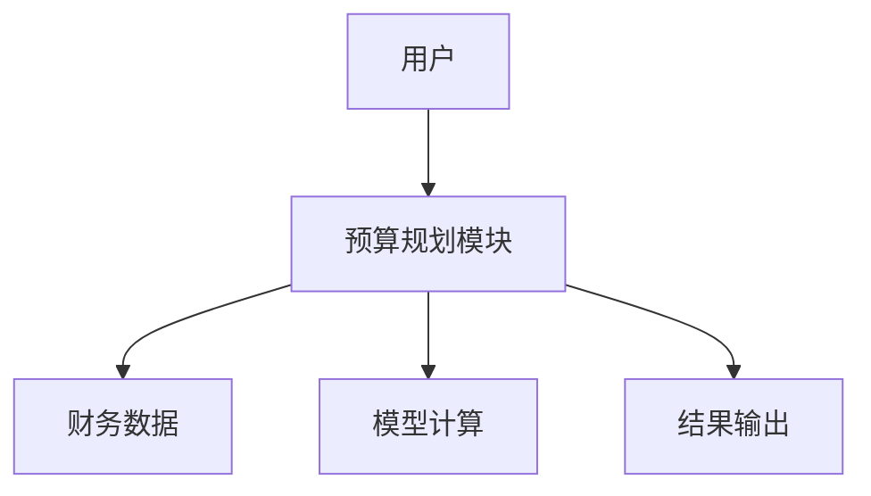

                 


# 构建企业级AI财务顾问：预算规划与投资建议

> 关键词：企业级AI财务顾问，预算规划，投资建议，AI大模型，财务数据分析，系统架构设计

> 摘要：本文将详细探讨如何利用AI技术构建企业级财务顾问系统，涵盖预算规划与投资建议的核心功能。通过分析传统财务顾问的局限性，介绍AI大模型在财务管理中的应用，详细讲解算法原理、系统架构设计以及项目实战，为读者提供全面的技术指导。

---

# 第一部分: 企业级AI财务顾问背景与核心概念

## 第1章: 企业级AI财务顾问的背景与问题背景

### 1.1 问题背景

#### 1.1.1 传统财务顾问的局限性
传统财务顾问服务依赖于人工分析和经验判断，存在效率低、覆盖面有限的问题。企业财务数据复杂多样，人工处理容易出错，且难以快速响应市场变化。

#### 1.1.2 企业财务管理的痛点
企业在预算规划和投资决策过程中，常常面临数据量大、复杂度高、人工成本高等问题，导致决策效率低下，难以应对快速变化的市场环境。

#### 1.1.3 AI技术在财务管理中的潜力
AI技术能够快速处理海量数据，提供精准的预测和建议，帮助企业在预算规划和投资决策中提高效率和准确性。

### 1.2 问题描述

#### 1.2.1 预算规划中的常见问题
预算规划需要考虑多种因素，如市场变化、企业内部资源分配等，传统方法难以全面覆盖。

#### 1.2.2 投资决策中的关键挑战
投资决策需要对市场趋势、财务数据进行深度分析，传统方法难以快速提供有效建议。

#### 1.2.3 传统财务工具的不足
传统财务工具功能单一，难以满足企业复杂多变的财务管理需求。

### 1.3 问题解决

#### 1.3.1 AI技术如何解决预算规划问题
AI技术能够通过历史数据和市场趋势，提供精准的预算预测和优化建议。

#### 1.3.2 AI技术如何优化投资决策
AI技术可以分析市场数据和企业财务状况，提供个性化的投资建议和风险评估。

#### 1.3.3 企业级AI财务顾问的核心价值
通过AI技术，企业可以实现高效、精准的财务管理，提升决策效率和企业竞争力。

### 1.4 边界与外延

#### 1.4.1 企业级AI财务顾问的边界
明确系统的核心功能和非核心功能，避免功能过于复杂。

#### 1.4.2 相关概念的外延
讨论与企业级AI财务顾问相关的其他概念，如数据分析工具、投资策略等。

#### 1.4.3 核心功能与非核心功能的区分
区分系统的核心功能和辅助功能，确保系统设计合理。

### 1.5 概念结构与核心要素

#### 1.5.1 核心概念的层次结构
从宏观到微观，逐步分解企业的财务管理需求。

#### 1.5.2 核心要素的对比分析
通过对比分析，明确系统设计的关键点。

#### 1.5.3 系统架构的核心要素组成
详细描述系统架构的核心组成部分，确保设计合理。

---

## 第2章: AI大模型在财务顾问中的核心概念与联系

### 2.1 AI大模型的核心原理

#### 2.1.1 大模型的基本原理
介绍AI大模型的基本工作原理，如数据输入、特征提取、模型训练等。

#### 2.1.2 大模型在财务分析中的应用
通过实例说明AI大模型如何在财务分析中发挥作用。

#### 2.1.3 大模型与财务数据的关系
分析AI大模型如何与财务数据交互，提供有效的分析结果。

### 2.2 核心概念的联系

#### 2.2.1 AI大模型与财务数据的关联
通过表格和流程图展示AI大模型与财务数据的关联关系。

#### 2.2.2 大模型与财务专家的协同作用
探讨AI大模型与财务专家如何协同工作，提升财务管理效率。

#### 2.2.3 大模型在预算规划与投资建议中的具体应用
详细说明AI大模型在预算规划和投资建议中的具体应用场景。

### 2.3 实体关系图



---

## 第3章: 企业级AI财务顾问的算法原理

### 3.1 算法原理概述

#### 3.1.1 大模型的基本算法框架
介绍AI大模型的基本算法框架，包括数据预处理、特征提取、模型训练等步骤。

#### 3.1.2 预测模型的构建过程
详细说明预测模型的构建过程，从数据输入到结果输出的每一步骤。

#### 3.1.3 算法的核心优势
总结AI算法在财务顾问中的核心优势，如高效性、准确性等。

### 3.2 算法流程图



### 3.3 核心算法实现

#### 3.3.1 算法的数学模型
$$y = f(x)$$

#### 3.3.2 算法的实现代码
```python
def model_predict(x):
    # 简单的线性回归模型预测
    return x * w + b
```

---

## 第4章: 企业级AI财务顾问系统分析与架构设计

### 4.1 系统功能设计

#### 4.1.1 预算规划模块
详细描述预算规划模块的功能，包括数据输入、模型计算、结果输出等。

#### 4.1.2 投资建议模块
详细描述投资建议模块的功能，包括市场数据分析、投资策略生成等。

### 4.2 系统架构设计



### 4.3 系统接口设计

#### 4.3.1 API接口设计
定义系统提供的API接口，如数据接口、计算接口等。

#### 4.3.2 数据格式规范
规定接口的数据格式，确保数据交互的准确性和一致性。

### 4.4 系统交互设计


---

## 第5章: 项目实战

### 5.1 环境安装

#### 5.1.1 安装Python
安装Python编程环境，确保版本兼容性。

#### 5.1.2 安装相关库
安装所需的Python库，如TensorFlow、Pandas等。

### 5.2 核心功能实现

#### 5.2.1 数据预处理
对财务数据进行清洗和转换，确保数据质量。

#### 5.2.2 模型训练
基于预处理后的数据，训练AI模型，优化模型参数。

#### 5.2.3 模型预测
使用训练好的模型，进行预算规划和投资建议的预测。

### 5.3 代码实现

#### 5.3.1 数据预处理代码
```python
import pandas as pd

# 读取数据
data = pd.read_csv('financial_data.csv')

# 清洗数据
data.dropna(inplace=True)
data = data[['revenue', 'expenses', 'profit']]
```

#### 5.3.2 模型训练代码
```python
import tensorflow as tf
from tensorflow import keras

# 构建模型
model = keras.Sequential([
    keras.layers.Dense(64, activation='relu'),
    keras.layers.Dense(1, activation='linear')
])

# 编译模型
model.compile(optimizer='adam', loss='mean_squared_error')
```

### 5.4 案例分析

#### 5.4.1 数据分析
对实际数据进行分析，展示AI模型的预测结果。

#### 5.4.2 模型优化
根据实际效果，优化模型结构和参数，提升预测精度。

---

## 第6章: 最佳实践与总结

### 6.1 小结
总结本文的核心内容和关键点，强调AI技术在企业财务管理中的重要性。

### 6.2 注意事项
提醒读者在实际应用中需要注意的事项，如数据隐私、模型维护等。

### 6.3 拓展阅读
推荐相关的阅读资料，帮助读者进一步深入学习。

---

# 作者：AI天才研究院/AI Genius Institute & 禅与计算机程序设计艺术 /Zen And The Art of Computer Programming

