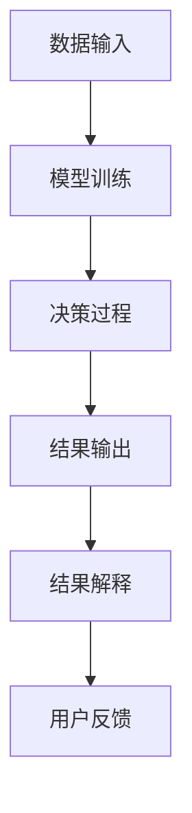

                 


# 构建企业级AI道德决策框架：确保AI系统的公平性与透明度

---

## 关键词：
企业级AI、道德决策框架、公平性、透明度、AI伦理、决策系统

---

## 摘要：
随着人工智能技术的快速发展，企业级AI系统的应用日益广泛，但其决策过程中的公平性和透明度问题也随之凸显。本文旨在构建一个企业级AI道德决策框架，通过分析公平性与透明度的核心概念、算法原理和系统架构，提出实现AI系统公平性和透明度的具体方法。文章结合实际案例，详细阐述了从数据预处理到模型训练、从决策引擎到结果解释的全过程，并通过代码实现和流程图展示，帮助读者全面理解如何在企业级AI系统中确保公平性和透明度。

---

# 第一部分: 企业级AI道德决策框架的背景与核心概念

## 第1章: AI与道德决策的背景介绍

### 1.1 人工智能的发展与挑战
#### 1.1.1 人工智能技术的演进历程
- 人工智能的定义与分类
- 从规则驱动到数据驱动：AI技术的演变
- 当前AI技术的核心驱动力：大数据与深度学习

#### 1.1.2 企业级AI应用的现状与趋势
- 企业级AI系统的应用场景：医疗、金融、司法、教育等
- 当前AI系统的局限性：黑箱模型、数据偏差、伦理问题
- 未来AI发展的趋势：人机协作、可解释性、伦理合规

#### 1.1.3 道德决策在AI系统中的重要性
- 道德决策的核心作用：确保AI系统符合人类价值观
- 道德决策的缺失带来的风险：偏见、歧视、信任危机
- 道德决策的实现：技术与伦理的结合

### 1.2 道德决策框架的核心概念与联系
#### 1.2.1 问题背景与问题描述
- 公平性与透明度的定义
- 公平性与透明度的关系
- 构建企业级AI道德决策框架的目标

#### 1.2.2 问题解决的目标与边界
- 公平性目标：消除数据偏差，确保决策的公平性
- 透明度目标：揭示AI决策过程，增强用户信任
- 边界与外延：明确框架的应用范围与限制

#### 1.2.3 核心概念的结构与组成要素
- 公平性：数据预处理、模型训练、决策过程
- 透明度：模型解释、决策日志、用户反馈
- 两者的协同效应：通过透明度提升公平性，通过公平性增强透明度

---

## 第2章: 公平性与透明度的核心概念与联系

### 2.1 公平性与透明度的定义与特征
#### 2.1.1 公平性的多维度定义
- 统计公平性：确保不同群体在决策中受到公平对待
- 实体公平性：确保个体在决策中不受歧视
- 程序公平性：确保决策过程的公正性

#### 2.1.2 透明度的层次划分
- 数据透明：数据来源、收集方式的公开
- 模型透明：模型结构、训练过程的公开
- 决策透明：决策依据、推理过程的公开

#### 2.1.3 公平性与透明度的对比分析
- 公平性关注结果的公平性
- 透明度关注过程的可解释性
- 两者共同目标：构建可信的AI系统

### 2.2 公平性与透明度的关系
#### 2.2.1 公平性对透明度的影响
- 公平性增强透明度的信任度
- 公平性缺失可能导致透明度的质疑

#### 2.2.2 透明度对公平性的作用
- 透明度是实现公平性的基础
- 透明度是检验公平性的工具

#### 2.2.3 两者的协同效应与权衡
- 协同效应：透明度促进公平性，公平性提升透明度
- 权衡：在某些情况下，透明度可能泄露敏感信息，公平性可能需要牺牲部分效率

---

## 第3章: 企业级AI道德决策框架的构建原理

### 3.1 公平性与透明度的实现机制
#### 3.1.1 数据预处理的公平性保障
- 数据清洗：去除偏见数据
- 数据平衡：平衡数据分布
- 数据增强：通过数据生成技术消除偏差

#### 3.1.2 模型训练的透明度优化
- 模型可解释性：通过模型解释技术揭示决策逻辑
- 模型日志：记录模型训练过程中的关键参数
- 模型验证：通过交叉验证确保模型的公平性

#### 3.1.3 决策过程的可解释性增强
- 决策日志：记录每次决策的依据和结果
- 决策解释：通过规则引擎或决策树解释决策过程
- 决策审计：定期审查决策过程，确保公平性

### 3.2 基于伦理框架的决策模型
#### 3.2.1 伦理框架的构建方法
- 伦理原则：定义AI系统必须遵循的伦理原则
- 伦理规则：将伦理原则转化为具体规则
- 伦理评估：评估AI系统的决策是否符合伦理框架

#### 3.2.2 决策模型的伦理评估
- 伦理评估指标：公平性指标、透明度指标、可解释性指标
- 伦理评估工具：通过自动化工具评估AI决策的伦理合规性
- 伦理评估报告：记录评估结果并提出改进建议

#### 3.2.3 伦理框架的动态调整
- 动态调整机制：根据反馈动态调整伦理框架
- 反馈机制：用户对AI决策的反馈作为伦理框架调整的依据
- 持续优化：通过持续优化伦理框架提升AI系统的公平性和透明度

---

## 第4章: 公平性与透明度的数学模型与算法原理

### 4.1 公平性评估的数学模型
#### 4.1.1 偏差度量公式
$$ \text{偏差} = \frac{\text{实际负面结果} - \text{期望负面结果}}{\text{期望负面结果}} $$

#### 4.1.2 差异度量公式
$$ \text{差异} = \sum_{i=1}^{n} |p_i - q_i| $$

#### 4.1.3 公平性优化的数学表达
$$ \min_{\theta} \mathbb{E}[f(x)] \text{ subject to } \mathbb{E}[f(x)|y=0] = \mathbb{E}[f(x)|y=1] $$

### 4.2 透明度增强的算法流程
#### 4.2.1 透明度评估的流程图


---

# 第二部分: 企业级AI道德决策框架的技术实现

## 第5章: 数据预处理与模型训练的公平性保障

### 5.1 数据预处理的公平性保障
#### 5.1.1 数据清洗
- 去除敏感字段：避免基于种族、性别等敏感属性的决策
- 去除偏见数据：通过数据清洗消除数据中的偏见

#### 5.1.2 数据平衡
- 通过过采样或欠采样平衡数据分布
- 使用SMOTE算法解决类别不平衡问题

#### 5.1.3 数据增强
- 使用数据生成技术（如GAN）生成更多样化的数据
- 对数据进行扰动，增强模型的鲁棒性

### 5.2 模型训练的透明度优化
#### 5.2.1 模型可解释性
- 使用线性模型（如线性回归）而非黑箱模型
- 通过特征重要性分析揭示关键特征

#### 5.2.2 模型日志
- 记录模型训练过程中的参数设置
- 记录模型的训练数据分布
- 记录模型的评估指标

#### 5.2.3 模型验证
- 通过交叉验证评估模型的公平性
- 使用验证集评估模型的透明度
- 通过A/B测试验证模型的公平性和透明度

---

## 第6章: 决策过程的可解释性增强与公平性检测

### 6.1 决策过程的可解释性增强
#### 6.1.1 决策日志
- 记录每次决策的依据
- 记录决策结果
- 记录决策时间

#### 6.1.2 决策解释
- 通过规则引擎解释决策过程
- 通过决策树解释决策逻辑
- 通过反向推理解释决策结果

#### 6.1.3 决策审计
- 定期审查决策日志
- 分析决策结果的公平性
- 识别潜在的偏见和歧视

### 6.2 公平性检测与缓解
#### 6.2.1 公平性检测
- 使用偏差度量公式检测数据偏见
- 使用差异度量公式检测模型偏见
- 通过A/B测试检测决策偏见

#### 6.2.2 偏见缓解
- 通过重新采样消除数据偏见
- 通过调整模型参数消除模型偏见
- 通过后处理消除决策偏见

#### 6.2.3 偏见消除的数学表达
$$ \text{公平性优化} = \min_{\theta} \sum_{i=1}^{n} (y_i - \hat{y}_i) $$

---

## 第7章: 企业级AI道德决策框架的系统架构设计

### 7.1 系统功能设计
#### 7.1.1 数据预处理模块
- 数据清洗
- 数据平衡
- 数据增强

#### 7.1.2 模型训练模块
- 模型可解释性优化
- 模型日志记录
- 模型验证

#### 7.1.3 决策引擎模块
- 决策日志记录
- 决策解释
- 决策审计

### 7.2 系统架构设计
#### 7.2.1 模块化架构
- 数据预处理模块、模型训练模块、决策引擎模块的划分
- 各模块之间的交互关系
- 模块化架构的Mermaid图展示

#### 7.2.2 系统交互设计
- 用户与系统交互的流程
- 系统内部各模块的协作流程
- 系统交互的Mermaid序列图展示

### 7.3 系统接口设计
#### 7.3.1 数据接口
- 数据输入接口
- 数据输出接口
- 数据日志接口

#### 7.3.2 模型接口
- 模型训练接口
- 模型预测接口
- 模型日志接口

#### 7.3.3 决策接口
- 决策请求接口
- 决策结果接口
- 决策日志接口

---

## 第8章: 企业级AI道德决策框架的项目实战

### 8.1 环境配置
#### 8.1.1 系统环境
- 操作系统：Linux/Windows/MacOS
- 语言：Python
- 开发工具：Jupyter Notebook/PyCharm
- 依赖库：numpy、pandas、scikit-learn、xgboost、lightgbm

#### 8.1.2 数据准备
- 数据集获取与预处理
- 数据清洗与特征工程
- 数据分割与训练集、测试集划分

### 8.2 核心代码实现
#### 8.2.1 数据预处理
```python
import pandas as pd
from imblearn.over_sampling import SMOTE

# 数据清洗
data = pd.read_csv('data.csv')
data.drop(columns=['race', 'gender'], inplace=True)

# 数据平衡
sampler = SMOTE(random_state=42)
data_resampled, y_resampled = sampler.fit_resample(data.drop(columns='label'), data['label'])
```

#### 8.2.2 模型训练
```python
from sklearn.ensemble import RandomForestClassifier
from sklearn.metrics import classification_report

# 模型训练
model = RandomForestClassifier(random_state=42)
model.fit(data_resampled, y_resampled)

# 模型评估
y_pred = model.predict(data_resampled)
print(classification_report(y_resampled, y_pred))
```

#### 8.2.3 决策过程的可解释性增强
```python
from sklearn.tree import DecisionTreeClassifier
from sklearn.tree import plot_tree

# 可解释性模型训练
model_explainable = DecisionTreeClassifier(random_state=42)
model_explainable.fit(data_resampled, y_resampled)

# 模型解释
plot_tree(model_explainable, filled=True)
```

### 8.3 实际案例分析
#### 8.3.1 案例背景
- 某金融企业的信用评分系统
- 系统存在的性别歧视问题
- 构建道德决策框架的目标

#### 8.3.2 数据预处理
- 清洗性别相关的偏见数据
- 平衡不同性别用户的信用评分数据
- 通过数据增强技术生成更多样化的数据

#### 8.3.3 模型训练与优化
- 使用可解释性模型（如决策树）替代黑箱模型（如随机森林）
- 通过特征重要性分析识别关键特征
- 通过A/B测试验证模型的公平性与透明度

#### 8.3.4 决策过程的可解释性增强
- 记录每次决策的依据和结果
- 通过决策树解释决策过程
- 定期审查决策日志，识别潜在的偏见和歧视

### 8.4 项目小结
#### 8.4.1 核心成果
- 数据预处理模块实现性别数据的清洗与平衡
- 模型训练模块实现信用评分系统的公平性优化
- 决策引擎模块实现决策过程的可解释性增强

#### 8.4.2 经验总结
- 数据预处理是实现公平性的基础
- 模型可解释性是实现透明度的关键
- 决策过程的可解释性增强是实现公平性与透明度的保障

---

## 第9章: 企业级AI道德决策框架的最佳实践与未来展望

### 9.1 最佳实践
#### 9.1.1 数据层面
- 定期审查数据集，消除偏见
- 使用数据增强技术生成更多样化的数据
- 通过数据清洗消除敏感字段

#### 9.1.2 模型层面
- 使用可解释性模型，确保透明度
- 通过模型日志记录关键参数
- 定期验证模型的公平性与透明度

#### 9.1.3 决策层面
- 记录决策日志，增强可追溯性
- 通过决策解释增强用户信任
- 定期审查决策结果，识别潜在的偏见和歧视

### 9.2 小结与展望
#### 9.2.1 小结
- 企业级AI道德决策框架的核心要素：公平性与透明度
- 实现公平性的关键：数据预处理、模型训练、决策过程的可解释性增强
- 实现透明度的关键：模型可解释性、决策过程的可追溯性、用户反馈

#### 9.2.2 未来展望
- 随着AI技术的不断发展，企业级AI系统的公平性与透明度要求将越来越高
- 未来的研究方向：更高效的公平性检测算法、更透明的模型解释方法、更智能的决策框架
- 未来的发展趋势：人机协作、可解释性AI、伦理驱动的AI系统

---

## 作者：
AI天才研究院/AI Genius Institute & 禅与计算机程序设计艺术/Zen And The Art of Computer Programming

---

**（以上是完整的书籍目录大纲，涵盖了从理论到实践的各个方面，包括背景、核心概念、算法原理、系统架构、项目实战等。）**

