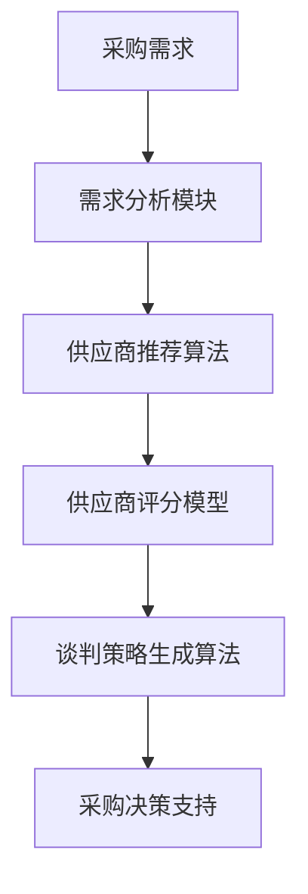
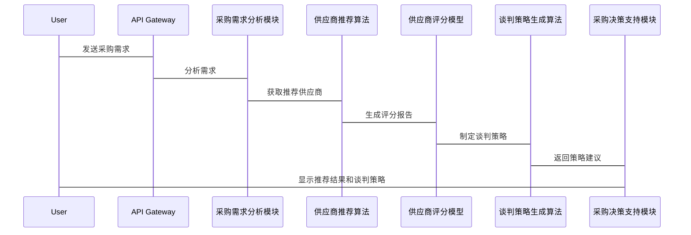
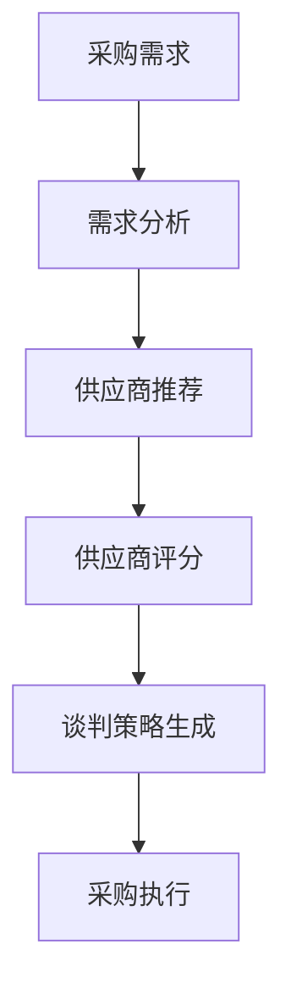

                 


# 构建企业级AI采购助手：优化供应商选择与谈判

## 关键词：企业采购、人工智能、供应商选择、谈判策略、采购优化

## 摘要：本文将详细探讨如何利用人工智能技术构建企业级采购助手，优化供应商选择与谈判过程。通过分析采购管理的现状与挑战，介绍AI采购助手的核心概念与算法原理，设计系统架构与功能模块，并通过实际案例展示如何实现企业采购效率的提升。文章内容涵盖从理论到实践的各个方面，帮助读者全面理解并应用AI技术于采购管理领域。

---

## 第1章: 企业采购与AI技术的结合

### 1.1 企业采购管理的现状与挑战

#### 1.1.1 传统采购管理的痛点
- 人工成本高：传统采购流程依赖大量人工操作，效率低下。
- 信息不透明：供应商选择缺乏数据支持，存在主观性。
- 谈判复杂：缺乏系统化的策略，谈判结果不稳定。

#### 1.1.2 数字化采购的趋势
- 数据驱动的决策：利用数据分析优化采购策略。
- 自动化工具的应用：通过AI技术提高采购效率。
- 供应链透明化：实现供应商信息的实时监控与管理。

#### 1.1.3 AI技术在采购中的应用潜力
- 供应商推荐：基于历史数据和市场趋势，推荐优质供应商。
- 谈判策略生成：根据供应商行为和市场动态，制定最优谈判方案。
- 风险预测：预测供应链中的潜在风险，提前制定应对措施。

### 1.2 供应商选择与谈判的核心问题

#### 1.2.1 供应商选择的复杂性
- 多维度评估：质量、价格、交货时间、信誉等多因素需综合考虑。
- 数据分散：供应商信息分布在不同系统中，难以整合。
- 动态变化：市场环境和供应商状况不断变化，需实时更新评估。

#### 1.2.2 谈判的关键因素
- 供应商的议价能力：供应商的市场地位和成本结构影响谈判结果。
- 市场供需关系：供需关系的变化直接影响采购价格和条款。
- 内部采购策略：企业的预算、采购目标和风险偏好影响谈判策略。

#### 1.2.3 数据驱动的采购决策
- 数据来源：供应商的历史交易数据、市场行情、行业趋势等。
- 数据分析：通过数据挖掘和机器学习，提取有价值的信息。
- 数据应用：基于数据分析结果，制定科学的采购策略。

### 1.3 AI采购助手的目标与价值

#### 1.3.1 提高采购效率
- 自动化处理：AI技术可以自动筛选供应商，减少人工干预。
- 实时监控：实时跟踪市场动态，快速响应采购需求。

#### 1.3.2 优化供应商选择
- 多维度评估：基于数据和算法，提供全面的供应商评分。
- 动态调整：根据市场变化，实时更新供应商评估结果。

#### 1.3.3 强化谈判策略
- 策略生成：AI根据供应商信息和市场趋势，生成最优谈判策略。
- 模拟谈判：通过模拟谈判过程，预测结果并优化策略。

#### 1.3.4 数据可视化：通过图表和仪表盘，直观展示采购数据，帮助决策者快速理解问题。

---

## 第2章: AI采购助手的核心概念与原理

### 2.1 数据驱动的采购决策

#### 2.1.1 数据来源与类型
- 内部数据：企业的采购历史、供应商合同、成本数据等。
- 外部数据：市场行情、行业报告、供应商信用评级等。
- 结构化与非结构化数据：文本、图像等非结构化数据需预处理。

#### 2.1.2 数据预处理与清洗
- 数据清洗：去除重复、错误或无效数据。
- 数据转换：将非结构化数据转化为结构化数据，便于分析。
- 数据增强：通过数据扩充技术，增加数据多样性。

#### 2.1.3 数据分析与洞察
- 数据可视化：通过图表展示数据分布和趋势。
- 数据挖掘：利用聚类、分类等算法发现数据中的模式和规律。
- 数据驱动的决策：基于分析结果，制定采购策略。

### 2.2 供应商评分模型

#### 2.2.1 供应商评分维度
- 质量：产品或服务的质量是否符合企业要求。
- 成本：供应商的价格是否具有竞争力。
- 交货时间：供应商的交货是否及时可靠。
- 信誉：供应商的信用评级和历史表现。
- 售后服务：供应商提供的售后服务是否完善。

#### 2.2.2 评分指标权重
- 根据企业的采购目标和行业特点，确定各维度的权重。
- 例如：质量占40%，成本占30%，交货时间占20%，信誉占10%。

#### 2.2.3 评分计算方法
- 加权平均法：基于各维度权重计算综合评分。
- $$\text{综合评分} = \sum_{i=1}^{n} w_i \times s_i$$，其中$w_i$是第$i$个维度的权重，$s_i$是第$i$个维度的评分。
- 动态调整：根据市场变化和企业需求，动态调整权重和评分标准。

### 2.3 谈判策略生成算法

#### 2.3.1 策略生成逻辑
- 基于供应商的历史报价和市场趋势，预测供应商的最低接受价格。
- 结合企业的预算和采购目标，制定最优谈判方案。

#### 2.3.2 策略优化方法
- 线性规划：通过数学模型优化谈判目标，如最小化采购成本或最大化采购质量。
- $$\text{目标函数} = \min \sum_{i=1}^{n} c_i x_i$$，其中$c_i$是第$i$个供应商的单位成本，$x_i$是采购量。
- 约束条件：满足企业需求和供应商能力。

#### 2.3.3 策略执行效果评估
- 策略效果：对比实际采购结果与预测结果，评估策略的有效性。
- 持续优化：根据实际效果反馈，调整策略参数和权重。

### 2.4 本章小结

---

## 第3章: 供应商推荐算法

### 3.1 基于协同过滤的推荐算法

#### 3.1.1 算法原理
- 基于用户行为数据，找到与当前用户需求相似的供应商。
- $$\text{相似度} = \frac{\sum_{i=1}^{n} (x_i - \mu)(y_i - \mu)}{\sqrt{\sum_{i=1}^{n} (x_i - \mu)^2} \times \sqrt{\sum_{i=1}^{n} (y_i - \mu)^2}}$$，其中$x_i$和$y_i$是用户$i$对供应商的评分，$\mu$是平均评分。

#### 3.1.2 算法实现
```python
def collaborative_filtering(user_id, user_ratings, k=3):
    # 计算用户相似度
    similarities = []
    for other_user in user_ratings:
        if other_user != user_id:
            similarity = calculate_similarity(user_ratings[user_id], user_ratings[other_user])
            similarities.append((other_user, similarity))
    # 选择相似度最高的k个用户
    similarities.sort(key=lambda x: -x[1])
    top_users = [user[0] for user in similarities[:k]]
    # 推荐供应商
    recommended_suppliers = set()
    for user in top_users:
        recommended_suppliers.update(user_ratings[user].keys())
    return list(recommended_suppliers)
```

#### 3.1.3 算法优缺点
- 优点：推荐结果准确，适用于数据充分的情况。
- 缺点：计算复杂度高，难以处理大规模数据。

### 3.2 基于聚类分析的供应商分组

#### 3.2.1 聚类算法原理
- 将供应商按特征相似性分成若干组。
- 使用K-means算法实现聚类。
- $$\text{目标函数} = \min \sum_{i=1}^{n} \sum_{j=1}^{k} (x_{ij} - c_j)^2$$，其中$x_{ij}$是第$i$个供应商的第$j$个特征值，$c_j$是第$j$个聚类的中心。

#### 3.2.2 聚类实现步骤
1. 初始化聚类中心。
2. 计算每个供应商到聚类中心的距离。
3. 将供应商分配到最近的聚类中心。
4. 重新计算聚类中心，直到收敛。

#### 3.2.3 聚类结果分析
- 分析各聚类的特征，如价格敏感型供应商、质量优先型供应商等。
- 根据企业需求选择合适的供应商组。

### 3.3 基于决策树的供应商筛选

#### 3.3.1 决策树算法原理
- 通过特征重要性构建决策树，筛选出最优供应商。
- 使用ID3或C4.5算法实现决策树。

#### 3.3.2 决策树构建过程
1. 选择信息增益最大的特征作为根节点。
2. 递归构建子树，直到叶子节点。
3. 剪枝处理，避免过拟合。

#### 3.3.3 决策树应用案例
- 根据供应商的历史表现，预测其在未来的表现。
- 通过决策树分类，筛选出高潜力供应商。

### 3.4 本章小结

---

## 第4章: 企业级AI采购助手的系统架构与设计

### 4.1 系统功能设计

#### 4.1.1 采购需求分析模块
- 需求收集与整理：通过问卷或系统录入收集采购需求。
- 需求优先级排序：根据企业目标和预算，确定需求优先级。
- 需求匹配算法：将需求与供应商能力进行匹配。

#### 4.1.2 供应商信息管理模块
- 供应商数据库设计：建立供应商信息数据库，包含供应商的基本信息、历史交易数据等。
- 供应商信息录入与更新：通过API或人工录入，保持供应商信息的实时更新。
- 供应商信息查询与筛选：根据采购需求，筛选符合条件的供应商。

#### 4.1.3 采购决策支持模块
- 数据可视化界面设计：通过图表展示供应商评分、市场趋势等信息。
- 决策支持算法集：集成多种AI算法，提供全面的决策支持。

### 4.2 系统架构设计

#### 4.2.1 系统架构图


#### 4.2.2 系统功能模块
- 采购需求分析模块：需求收集、分析、匹配。
- 供应商信息管理模块：供应商数据库、信息录入、查询。
- 采购决策支持模块：数据可视化、决策支持、策略生成。

### 4.3 系统接口设计

#### 4.3.1 API接口设计
- 接口名称：`/api/procurement/analyze`
- 请求参数：采购需求、预算、时间要求等。
- 返回值：供应商推荐列表、谈判策略建议。

#### 4.3.2 接口交互流程图


### 4.4 系统交互流程图

#### 4.4.1 采购流程图


---

## 第5章: 项目实战

### 5.1 环境安装与配置

#### 5.1.1 安装Python环境
- 安装Python 3.8或更高版本。
- 安装必要的库：pandas、numpy、scikit-learn、matplotlib。

#### 5.1.2 安装AI框架
- 安装TensorFlow或Keras，用于深度学习模型的训练。
- 安装Scikit-learn，用于机器学习算法的实现。

### 5.2 系统核心实现

#### 5.2.1 数据预处理代码
```python
import pandas as pd
import numpy as np

# 读取数据
data = pd.read_csv('procurement.csv')

# 数据清洗
data = data.dropna()
data = data.drop_duplicates()

# 数据转换
data['price'] = data['price'].astype(float)
data['quality'] = data['quality'].astype(int)
```

#### 5.2.2 供应商推荐算法实现
```python
from sklearn.neighbors import NearestNeighbors

# 训练模型
model = NearestNeighbors(n_neighbors=5).fit(data[['price', 'quality']])

# 查询推荐供应商
query = data.iloc[0:1][['price', 'quality']]
distances, indices = model.kneighbors(query)

# 获取推荐供应商ID
recommended_suppliers = data.iloc[indices[0], :]['supplier_id']
```

#### 5.2.3 谈判策略生成代码
```python
import numpy as np

# 定义目标函数
def objective(x):
    return np.sum(x)

# 约束条件
def constraint1(x):
    return np.sum(x) <= budget

# 使用线性规划求解
from scipy.optimize import minimize

result = minimize(objective, x0=np.zeros(n), 
                 constraints=[{'type': 'ineq', 'fun': constraint1}])
```

### 5.3 实际案例分析

#### 5.3.1 案例背景
- 企业需要采购一批电子元器件。
- 预算为10万元，交货时间为2周。
- 供应商A：价格低，质量一般。
- 供应商B：价格高，质量优秀。

#### 5.3.2 分析与决策
- 通过供应商评分模型，供应商B的质量评分为90，供应商A的价格评分为85。
- 综合评分：供应商B > 供应商A。
- 谈判策略：与供应商B协商价格，与供应商A比较交货时间。

### 5.4 项目小结

---

## 第6章: 总结与展望

### 6.1 本章总结
- 本文详细介绍了如何利用AI技术构建企业级采购助手。
- 从供应商选择到谈判策略生成，AI技术能够显著提高采购效率和决策质量。

### 6.2 未来展望
- 更智能的采购助手：结合自然语言处理技术，实现自动合同分析和条款优化。
- 更高效的供应链管理：通过AI技术实现供应链的智能化监控和预测。

### 6.3 最佳实践Tips
- 数据是关键：确保数据的准确性和完整性。
- 算法选择：根据具体需求选择合适的算法。
- 持续优化：根据实际效果反馈，不断优化采购策略。

### 6.4 注意事项
- 数据隐私：确保供应商数据的安全性和隐私性。
- 系统稳定性：保证系统的高可用性和数据的实时性。
- 团队协作：采购、技术、数据分析团队需紧密合作。

### 6.5 拓展阅读
- 《机器学习实战》：深入理解机器学习算法的实现。
- 《数据挖掘导论》：掌握数据挖掘的核心技术。
- 《采购与供应链管理》：了解采购管理的行业知识。

---

## 作者：AI天才研究院/AI Genius Institute & 禅与计算机程序设计艺术 /Zen And The Art of Computer Programming

