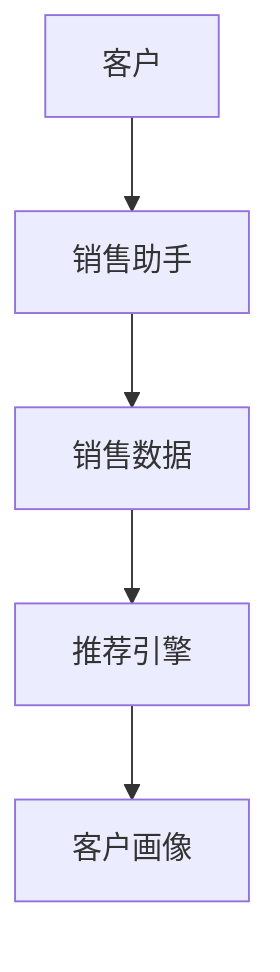
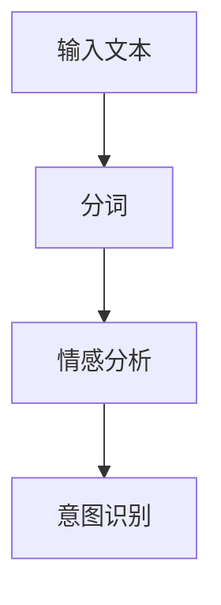
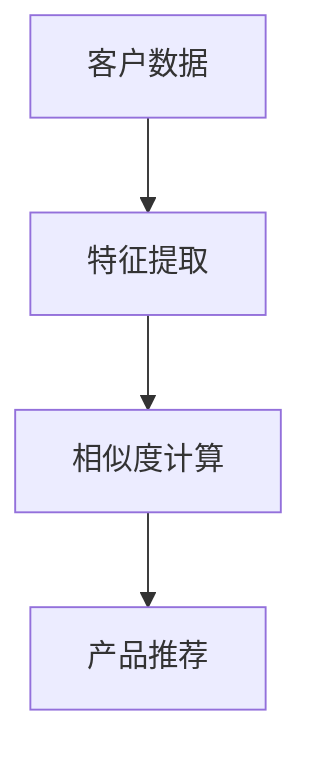
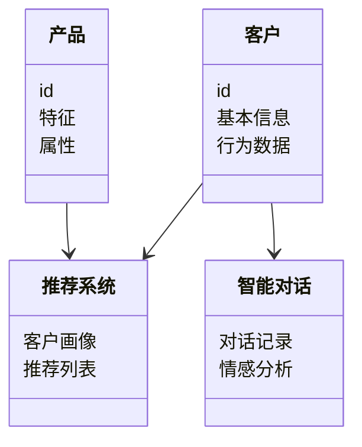
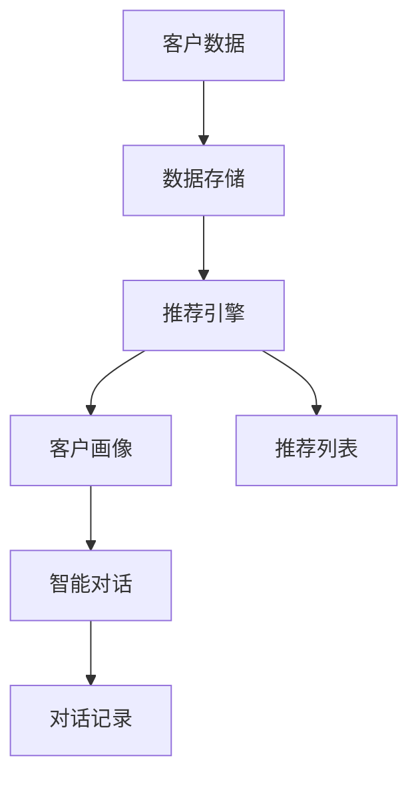
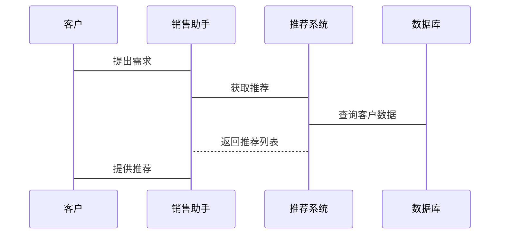

                 


```markdown
# 构建企业级AI销售助手：提升转化率与客户满意度

> 关键词：企业级AI销售助手、AI技术、销售效率、客户满意度、推荐算法、NLP、机器学习

> 摘要：本文将详细探讨如何构建一个高效的企业级AI销售助手，通过结合自然语言处理和机器学习技术，提升销售转化率和客户满意度。文章将从背景分析、核心概念、算法原理、系统架构设计到项目实战，逐步解析构建AI销售助手的全过程，涵盖技术原理、数学模型和实际案例分析，为读者提供深入的技术指导。

---

# 第一部分: 企业级AI销售助手的背景与需求

## 第1章: 问题背景与目标

### 1.1 问题背景

#### 1.1.1 销售效率与客户体验的挑战

在当今竞争激烈的市场环境中，企业面临着提升销售效率和客户满意度的双重压力。传统销售模式依赖人工操作，效率低下且难以个性化满足客户需求。客户期望通过智能化工具获得高效、个性化的服务，这推动了AI销售助手的应用。

#### 1.1.2 传统销售模式的局限性

- **低效率**：人工操作耗时长，难以快速响应客户需求。
- **个性化不足**：难以根据客户需求提供个性化推荐。
- **数据孤岛**：客户数据分散，难以充分利用。

#### 1.1.3 AI技术在销售领域的潜力

- **自动化处理**：AI能够快速处理大量数据，提供实时反馈。
- **个性化推荐**：通过机器学习和NLP技术，实现精准客户画像和产品推荐。
- **数据驱动决策**：利用数据分析优化销售策略。

### 1.2 问题描述

#### 1.2.1 转化率低的原因分析

- **客户需求未匹配**：推荐的产品与客户实际需求不符。
- **缺乏个性化沟通**：统一的营销策略难以打动客户。
- **信息传递不畅**：销售人员与客户需求之间存在信息不对称。

#### 1.2.2 客户满意度下降的现状

- **客户体验差**：传统销售模式难以提供高效、个性化的服务。
- **信任缺失**：客户对销售推荐缺乏信任，导致购买意愿下降。
- **沟通效率低**：销售人员能力参差不齐，难以满足客户需求。

#### 1.2.3 数据驱动销售的必要性

- **数据的重要性**：通过数据挖掘和分析，发现客户行为模式和偏好。
- **精准营销**：基于数据的个性化推荐能够提高转化率。
- **持续优化**：通过数据反馈不断优化销售策略和流程。

### 1.3 解决方案概述

#### 1.3.1 AI销售助手的核心目标

- **提高销售转化率**：通过个性化推荐和精准营销，提升客户购买意愿。
- **提升客户满意度**：通过高效、个性化的服务，增强客户信任和满意度。
- **降低销售成本**：通过自动化处理和数据驱动决策，减少人工干预，降低成本。

#### 1.3.2 技术实现路径

1. **数据收集与预处理**：收集客户数据和销售数据，进行清洗和标准化。
2. **客户画像构建**：利用机器学习和NLP技术，分析客户行为和偏好，构建客户画像。
3. **推荐算法设计**：基于客户画像和产品特征，设计推荐算法，实现个性化推荐。
4. **销售流程优化**：通过AI销售助手自动化处理销售流程，提高效率。

#### 1.3.3 业务价值与预期成果

- **提升销售效率**：通过自动化处理和数据驱动决策，缩短销售周期。
- **提高客户满意度**：通过个性化服务和精准推荐，增强客户信任和满意度。
- **降低销售成本**：通过自动化和数据优化，减少人工干预，降低成本。

---

## 第2章: 核心概念与联系

### 2.1 核心概念解析

#### 2.1.1 AI销售助手的定义

AI销售助手是一种基于人工智能技术的工具，通过自然语言处理、机器学习和大数据分析等技术，帮助销售人员提高销售效率、优化客户体验并提升销售转化率。

#### 2.1.2 关键技术组成

- **自然语言处理（NLP）**：用于理解和生成自然语言文本，实现与客户的智能对话和信息提取。
- **机器学习**：用于构建客户画像和推荐系统，实现个性化推荐。
- **大数据分析**：用于数据挖掘和分析，发现客户行为模式和偏好。

#### 2.1.3 核心功能模块

- **客户画像**：基于客户数据和行为，构建客户画像，分析客户偏好和需求。
- **推荐系统**：根据客户画像和产品特征，推荐个性化的产品和服务。
- **智能对话**：通过NLP技术，实现与客户的智能对话，提供实时反馈和建议。
- **销售流程优化**：通过自动化处理和数据驱动决策，优化销售流程，提高效率。

### 2.2 核心概念的属性对比

#### 2.2.1 功能模块对比表

| 功能模块         | 描述                                   |
|------------------|--------------------------------------|
| 客户画像         | 基于客户数据和行为，构建客户画像       |
| 推荐系统         | 根据客户画像和产品特征，推荐个性化产品   |
| 智能对话         | 通过NLP技术，实现与客户的智能对话       |
| 销售流程优化     | 优化销售流程，提高销售效率和客户满意度   |

#### 2.2.2 技术实现对比表

| 技术         | 描述                                   |
|--------------|--------------------------------------|
| NLP          | 自然语言处理，用于智能对话和信息提取     |
| 机器学习     | 用于客户画像构建和推荐系统设计         |
| 大数据分析   | 用于数据挖掘和分析，发现客户行为模式     |

### 2.3 实体关系图



---

## 第3章: 算法原理与实现

### 3.1 算法原理

#### 3.1.1 自然语言处理(NLP)流程



#### 3.1.2 推荐算法流程



### 3.2 核心代码实现

#### 3.2.1 NLP模型训练

```python
import numpy as np
from sklearn.feature_extraction.text import TfidfVectorizer

# 示例代码
vectorizer = TfidfVectorizer()
X = vectorizer.fit_transform(corpus)
```

#### 3.2.2 推荐算法实现

```python
def recommend_products(customers, products, similarity_matrix):
    recommendations = []
    for customer in customers:
        # 找出与该客户相似度最高的k个客户
        top_k_customers = np.argsort(similarity_matrix[customer])[-k:]
        # 收集这些客户的推荐产品
        recommended_products = []
        for c in top_k_customers:
            recommended_products.extend(train_data[c])
        recommendations.append(recommended_products)
    return recommendations
```

---

## 第4章: 系统分析与架构设计方案

### 4.1 问题场景介绍

在构建企业级AI销售助手的过程中，需要考虑以下问题：

- **数据收集与管理**：如何高效地收集和管理客户数据和销售数据。
- **系统设计与优化**：如何设计高效的系统架构，确保系统的可扩展性和可维护性。
- **算法实现与优化**：如何实现高效的推荐算法，并进行优化以提高推荐准确性。

### 4.2 项目介绍

本项目旨在构建一个基于AI的销售助手，通过自然语言处理和机器学习技术，实现客户画像构建、个性化推荐和智能对话，从而提高销售转化率和客户满意度。

### 4.3 系统功能设计

#### 4.3.1 领域模型



#### 4.3.2 系统架构设计



#### 4.3.3 系统接口设计

- **客户数据接口**：用于获取客户数据和行为数据。
- **推荐系统接口**：用于获取客户画像和推荐列表。
- **智能对话接口**：用于与客户进行智能对话，获取对话记录和情感分析结果。

#### 4.3.4 系统交互设计



---

## 第5章: 项目实战

### 5.1 环境安装

- **Python 3.8+**
- **Scikit-learn**
- **NLTK**
- **Mermaid**
- **Jupyter Notebook**

### 5.2 核心代码实现

#### 5.2.1 数据收集与预处理

```python
import pandas as pd
from sklearn.preprocessing import StandardScaler

# 示例代码
data = pd.read_csv('sales_data.csv')
data = data.dropna()
scaled_data = StandardScaler().fit_transform(data)
```

#### 5.2.2 推荐系统实现

```python
from sklearn.neighbors import NearestNeighbors

# 示例代码
model = NearestNeighbors(n_neighbors=5, algorithm='ball_tree').fit(scaled_data)
distances, indices = model.kneighbors(new_customer_data)
```

#### 5.2.3 智能对话实现

```python
from nltk.chat import Chat, reflections

# 示例代码
pairs = [
    (r'hello', ['hello! how can I help you today?']),
    (r'help', ['I can help you with recommendations.']),
]
chat = Chat(pairs)
chat_response = chat.respond('hello')
```

### 5.3 案例分析

#### 5.3.1 数据分析

- **客户数据**：通过数据分析，发现客户的购买偏好和行为模式。
- **推荐系统效果**：通过A/B测试，验证推荐系统的有效性。
- **对话记录分析**：通过分析对话记录，优化智能对话模块。

#### 5.3.2 实际应用

- **客户画像**：基于客户数据，构建详细的客户画像，用于个性化推荐。
- **推荐结果**：根据客户画像和产品特征，推荐个性化的产品和服务。
- **对话记录**：通过智能对话模块，记录客户与销售助手的对话，优化销售流程。

---

## 第6章: 最佳实践、小结与展望

### 6.1 最佳实践

- **数据质量管理**：确保数据的准确性和完整性，避免数据偏差。
- **模型优化**：通过不断优化推荐算法和对话模块，提高推荐准确性和客户满意度。
- **用户体验优化**：通过用户反馈不断优化销售助手的功能和性能，提高用户体验。

### 6.2 小结

本文详细探讨了构建企业级AI销售助手的全过程，从背景分析到系统设计，再到项目实战，为读者提供了全面的技术指导。通过结合自然语言处理和机器学习技术，AI销售助手能够有效提升销售转化率和客户满意度，为企业带来显著的业务价值。

### 6.3 展望

未来，随着AI技术的不断发展，企业级AI销售助手将更加智能化和个性化，能够更好地满足客户需求，提升销售效率和客户满意度。同时，随着大数据和云计算技术的结合，销售助手的功能将更加丰富，为企业提供更强大的销售支持。

---

## 作者：AI天才研究院/AI Genius Institute & 禅与计算机程序设计艺术 /Zen And The Art of Computer Programming
```

