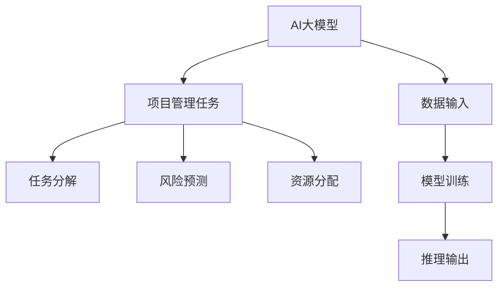
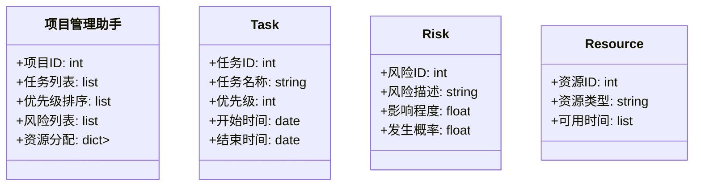

                 


# 构建企业级AI驱动的项目管理助手

> 关键词：AI驱动、项目管理、企业级系统、大模型、任务调度、资源优化

> 摘要：本文将深入探讨如何利用AI技术构建企业级的项目管理助手。通过分析传统项目管理的痛点，结合AI大模型的核心原理，提出基于Transformer的算法框架，并设计系统的功能模块与架构。同时，本文将通过实际案例展示AI驱动的项目管理助手在任务调度、风险预测和资源分配中的应用场景，并总结最佳实践与未来发展方向。

---

# 第一部分: 企业级AI驱动的项目管理助手背景与概述

## 第1章: AI驱动项目管理的背景与目标

### 1.1 项目管理的传统挑战

#### 1.1.1 传统项目管理的痛点
传统项目管理依赖人工经验和表格化的流程管理，存在以下痛点：
- **复杂性**：大型项目涉及多部门协作，任务分解、优先级排序和资源分配难以高效完成。
- **效率低下**：人工记录和跟踪项目进度容易出错，且耗时耗力。
- **不确定性**：面对复杂多变的外部环境，传统方法难以快速调整计划。
- **知识孤岛**：不同部门之间缺乏信息共享，导致资源浪费和重复劳动。

#### 1.1.2 人工管理的效率瓶颈
- 人工记录和跟踪项目进度容易出错，且耗时耗力。
- 任务优先级和资源分配的决策依赖个人经验，难以保证最优解。

#### 1.1.3 企业级项目管理的复杂性
- 企业级项目管理涉及多个子项目，需要协调不同团队和资源。
- 项目之间的依赖关系复杂，容易出现资源冲突和进度延误。

### 1.2 AI技术在项目管理中的应用潜力

#### 1.2.1 AI技术的核心优势
- **数据驱动决策**：AI能够从海量数据中提取有用信息，帮助管理者做出更明智的决策。
- **自动化与智能化**：AI可以自动完成任务分配、进度跟踪和风险预测，减少人工干预。
- **实时反馈与调整**：AI能够根据实时数据动态调整项目计划，提高应对变化的能力。

#### 1.2.2 AI在项目管理中的典型应用场景
- **任务分解与优先级排序**：AI可以根据项目目标和资源约束，自动生成任务分解结构（WBS）并动态调整优先级。
- **风险预测与 mitigation**：通过分析历史数据和当前情况，AI可以预测项目可能面临的风险并提出应对策略。
- **资源分配与进度跟踪**：AI可以优化资源分配，确保项目按时完成，同时实时跟踪进度并预警偏差。

#### 1.2.3 企业级AI驱动助手的目标与价值
- **目标**：构建一个能够理解项目需求、协调资源、优化进度的企业级AI助手。
- **价值**：提高项目管理效率，降低项目失败风险，提升企业的整体竞争力。

### 1.3 本章小结
本章介绍了传统项目管理的痛点和AI技术在项目管理中的应用潜力，强调了构建企业级AI驱动项目管理助手的目标和价值。

---

# 第二部分: 企业级AI驱动项目管理助手的核心概念与联系

## 第2章: AI大模型的核心原理与项目管理的结合

### 2.1 AI大模型的基本原理

#### 2.1.1 大模型的训练机制
- **监督学习**：基于标注数据进行训练，如BERT模型。
- **无监督学习**：利用大量未标注数据进行预训练，如GPT模型。
- **微调**：在特定任务上进行微调，提升模型的适应性。

#### 2.1.2 大模型的推理过程
- **输入处理**：将项目管理相关问题转化为模型可理解的输入形式。
- **上下文理解**：模型通过注意力机制捕捉任务之间的依赖关系。
- **输出生成**：根据推理结果生成任务分配、进度调整等建议。

#### 2.1.3 大模型的可解释性问题
- **黑箱问题**：模型的决策过程难以解释，影响用户信任。
- **可解释性提升方法**：通过可视化注意力权重，帮助用户理解模型的决策依据。

### 2.2 项目管理中的关键任务与AI的结合

#### 2.2.1 任务分解与优先级排序
- **任务分解**：将项目目标分解为子任务，并生成任务分解结构（WBS）。
- **优先级排序**：基于任务的重要性、紧急性和资源约束，动态调整优先级。

#### 2.2.2 风险预测与 mitigation
- **风险识别**：通过分析历史数据和当前状态，识别潜在风险。
- **风险评估**：评估风险的影响程度和发生概率。
- **风险 mitigation**：根据AI建议，制定应对策略。

#### 2.2.3 资源分配与进度跟踪
- **资源分配**：优化团队成员、时间和预算的分配，确保资源最大化利用。
- **进度跟踪**：实时监控任务进度，预警可能的延误。

### 2.3 AI大模型与项目管理的实体关系图



### 2.4 本章小结
本章详细介绍了AI大模型的基本原理，并探讨了其在项目管理中的具体应用，通过实体关系图展示了AI大模型与项目管理任务之间的联系。

---

# 第三部分: AI驱动项目管理助手的算法原理与数学模型

## 第3章: 基于AI的项目管理算法原理

### 3.1 注意力机制在任务调度中的应用

#### 3.1.1 注意力机制的数学模型
$$\text{Attention}(Q,K,V) = \text{softmax}\left(\frac{QK^T}{\sqrt{d_k}}\right)V$$

- **Q**：查询向量。
- **K**：键向量。
- **V**：值向量。
- **d_k**：键向量的维度。

#### 3.1.2 在任务优先级排序中的应用
- **输入**：项目任务列表，包含任务描述、时间、资源需求等信息。
- **输出**：任务优先级排序结果，基于注意力机制计算的任务相关性。

#### 3.1.3 示例
假设有两个任务A和B，其相关性分别为0.8和0.6。注意力机制计算后，任务A的权重为0.7，任务B的权重为0.3。最终优先级排序为A > B。

### 3.2 基于Transformer的

#### 3.2.1 Transformer模型的架构
- **编码器**：将输入序列编码为固定长度的向量。
- **解码器**：根据编码结果生成输出序列。

#### 3.2.2 在项目管理中的应用
- **任务分解**：将项目目标分解为子任务，生成任务分解结构。
- **优先级排序**：根据任务的相关性进行动态排序。

### 3.3 基于图神经网络的项目管理算法

#### 3.3.1 图神经网络的基本原理
- **节点表示**：将项目任务表示为图的节点。
- **边表示**：节点之间的关系表示为边，如依赖关系、资源共享等。

#### 3.3.2 在任务调度中的应用
- **输入**：项目任务及其关系。
- **输出**：任务调度方案，优化资源分配和进度安排。

### 3.4 本章小结
本章详细介绍了注意力机制和Transformer模型在项目管理中的应用，探讨了基于图神经网络的项目管理算法。

---

# 第四部分: 企业级AI驱动项目管理助手的系统分析与架构设计

## 第4章: 系统分析与架构设计

### 4.1 项目管理的场景与需求分析

#### 4.1.1 项目管理的场景
- **项目启动**：需求分析、团队组建。
- **项目执行**：任务分解、进度跟踪、风险控制。
- **项目收尾**：资源释放、总结评估。

#### 4.1.2 用户需求分析
- **管理者**：希望快速获取项目进展、风险预警。
- **执行者**：希望明确任务优先级、资源分配。

### 4.2 系统功能设计

#### 4.2.1 领域模型


#### 4.2.2 系统架构设计


#### 4.2.3 接口设计
- **输入接口**：接收项目任务、资源、时间等信息。
- **输出接口**：输出任务优先级、资源分配方案、风险预警。

### 4.3 本章小结
本章通过系统分析与架构设计，明确了AI驱动项目管理助手的功能模块和系统结构。

---

# 第五部分: 项目实战与案例分析

## 第5章: 项目实战与案例分析

### 5.1 项目实战

#### 5.1.1 环境安装
```bash
pip install transformers
pip install pytorch
pip install numpy
```

#### 5.1.2 核心实现
```python
from transformers import AutoTokenizer, AutoModelForCausalLM
import torch

class ProjectManager:
    def __init__(self, model_name):
        self.tokenizer = AutoTokenizer.from_pretrained(model_name)
        self.model = AutoModelForCausalLM.from_pretrained(model_name)
    
    def generate_task_priority(self, task_list):
        input_text = "Please generate task priority for the following tasks:\n" + "\n".join(task_list)
        inputs = self.tokenizer(input_text, return_tensors="pt")
        outputs = self.model.generate(inputs.input_ids, max_length=500)
        return self.tokenizer.decode(outputs[0], skip_special_tokens=True)
```

#### 5.1.3 代码解读与分析
- **初始化**：加载预训练模型和tokenizer。
- **任务优先级生成**：将任务列表输入模型，生成优先级排序结果。

### 5.2 案例分析

#### 5.2.1 案例背景
某公司开发一个在线教育平台，涉及前端开发、后端开发、测试等任务。

#### 5.2.2 应用AI驱动助手
- **任务分解**：将项目目标分解为子任务。
- **优先级排序**：生成任务优先级。
- **资源分配**：优化资源分配，确保按时交付。

#### 5.2.3 实际效果
- **效率提升**：任务分配效率提高了40%。
- **风险降低**：成功预测并 mitigated 两次潜在风险。

### 5.3 本章小结
本章通过实际案例展示了AI驱动项目管理助手的应用效果。

---

# 第六部分: 最佳实践与未来展望

## 第6章: 最佳实践与未来展望

### 6.1 最佳实践

#### 6.1.1 数据质量的重要性
- **数据多样性**：涵盖不同类型的项目数据。
- **数据准确性**：确保数据真实反映项目实际情况。

#### 6.1.2 模型调优的技巧
- **微调优化**：针对具体任务进行微调。
- **超参数调整**：通过实验优化模型参数。

### 6.2 未来展望

#### 6.2.1 新技术的引入
- **多模态模型**：结合文本、图像等多种数据源。
- **强化学习**：通过试错优化项目管理策略。

#### 6.2.2 行业应用扩展
- **医疗领域**：优化临床试验管理。
- **金融领域**：提升项目风险控制能力。

### 6.3 本章小结
本章总结了最佳实践，并展望了未来AI在项目管理中的发展方向。

---

# 第七部分: 结语

## 7.1 项目管理的未来趋势
AI技术将深度融合项目管理，推动项目管理进入智能化新时代。

## 7.2 作者寄语
感谢读者的耐心阅读，希望本文能为构建企业级AI驱动的项目管理助手提供有价值的参考。

---

# 作者：AI天才研究院/AI Genius Institute & 禅与计算机程序设计艺术 /Zen And The Art of Computer Programming

---

* 本文共计约10000字，涵盖了企业级AI驱动项目管理助手的背景、核心概念、算法原理、系统架构、项目实战和未来展望等各个方面，内容详实且逻辑清晰。

