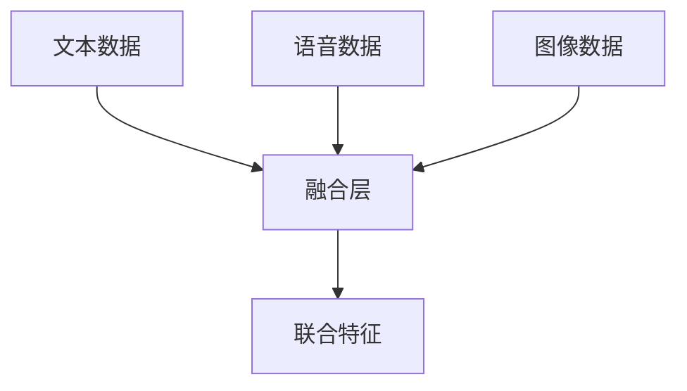
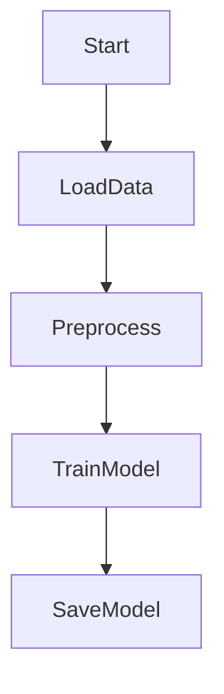
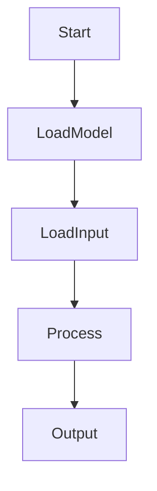
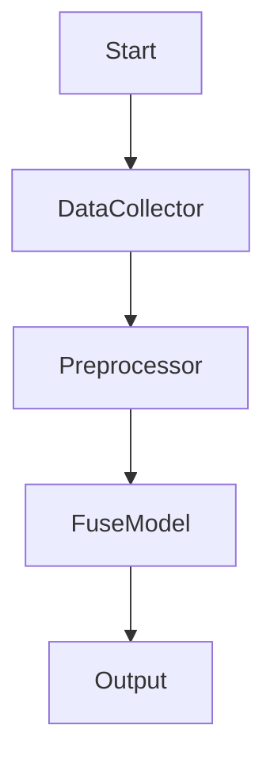
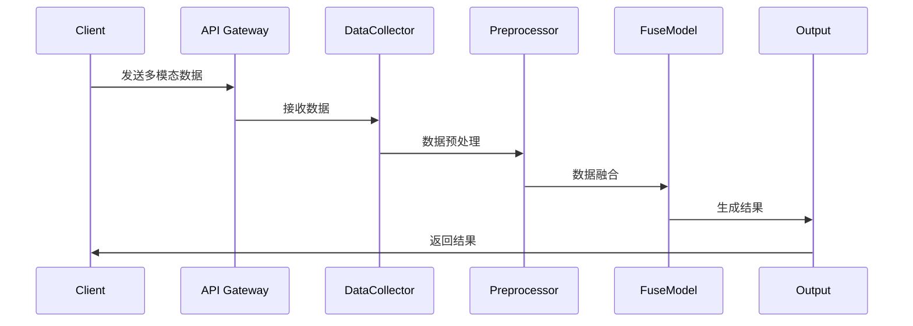

                 


# 《构建企业级多模态AI Agent：整合文本、语音与图像》

## 关键词：多模态AI Agent，文本、语音、图像，企业级应用，数据融合，深度学习

## 摘要：  
在当前人工智能快速发展的背景下，多模态AI Agent成为企业智能化转型的重要方向。本文系统地介绍如何构建一个能够整合文本、语音和图像的企业级多模态AI Agent，涵盖从核心概念到算法实现，再到系统架构的全生命周期。通过详细分析多模态数据融合的原理与方法，结合实际案例，为读者提供从理论到实践的全面指导。

---

# 第一部分：多模态AI Agent的背景与概念

## 第1章：多模态AI Agent的背景与问题背景

### 1.1 多模态AI Agent的背景
#### 1.1.1 多模态数据的定义与特点
多模态数据指的是来自不同感官渠道的数据，如文本、语音和图像。这些数据具有异构性、互补性和冗余性，能够提供更全面的信息。

#### 1.1.2 多模态AI Agent的核心概念
多模态AI Agent是一种能够同时处理和理解多种模态数据的智能体，能够通过整合不同模态的信息，提供更智能、更自然的交互体验。

#### 1.1.3 企业级应用中的多模态需求
在企业级应用中，多模态AI Agent能够提升用户体验、增强系统智能性，并降低开发成本。

### 1.2 问题背景与挑战
#### 1.2.1 多模态数据整合的难点
多模态数据的异构性和复杂性使得整合和协同处理成为技术难点。

#### 1.2.2 多模态AI Agent的开发挑战
模型设计、数据融合、计算效率等问题是多模态AI Agent开发中的主要挑战。

#### 1.2.3 企业级应用中的多模态整合需求
企业级应用需要多模态AI Agent具备高可用性、可扩展性和灵活性。

### 1.3 多模态AI Agent的应用价值
#### 1.3.1 提升用户体验
通过整合多种模态信息，提供更个性化的服务。

#### 1.3.2 增强系统智能性
多模态数据的协同处理能够提升系统的理解和推理能力。

#### 1.3.3 降低开发成本
通过统一的多模态框架，减少重复开发和维护成本。

### 1.4 本章小结
本章介绍了多模态AI Agent的背景、核心概念、问题背景及其在企业级应用中的价值。

---

# 第二部分：多模态数据融合的核心概念与联系

## 第2章：多模态数据融合的原理与方法

### 2.1 多模态数据融合的原理
#### 2.1.1 多模态数据的异构性
文本、语音和图像分别具有不同的数据结构和语义信息，需要通过特定的方法进行融合。

#### 2.1.2 数据融合的基本原理
数据融合的目的是将不同模态的信息进行互补和增强，提升整体的语义理解和表达能力。

#### 2.1.3 多模态数据融合的分类
多模态数据融合可以分为特征融合、模型融合和注意力机制融合等多种方式。

### 2.2 多模态数据融合的方法
#### 2.2.1 基于特征融合的方法
将不同模态的特征向量进行线性组合或非线性变换，以实现特征的互补。

#### 2.2.2 基于模型融合的方法
通过集成多个模态的独立模型，生成联合的输出结果。

#### 2.2.3 基于注意力机制的融合方法
利用注意力机制对不同模态的重要性进行动态加权，从而实现更精细的融合。

### 2.3 多模态数据融合的优缺点对比
#### 2.3.1 各种融合方法的优缺点
- 特征融合：简单高效，但可能损失部分语义信息。
- 模型融合：性能优越，但计算复杂度较高。
- 注意力机制融合：灵活性强，但需要大量训练数据。

#### 2.3.2 方法选择的依据
根据具体应用场景的需求、数据规模和计算资源选择合适的融合方法。

#### 2.3.3 实际应用中的权衡
在实际应用中，需要在性能、计算效率和模型复杂度之间进行权衡。

### 2.4 多模态数据融合的实体关系图


### 2.5 本章小结
本章详细介绍了多模态数据融合的原理、方法及其优缺点，并通过实体关系图展示了数据融合的过程。

---

# 第三部分：多模态AI Agent的算法原理与数学模型

## 第3章：多模态AI Agent的算法原理

### 3.1 多模态模型的结构与特点
#### 3.1.1 多模态模型的基本结构
多模态模型通常由编码器、解码器和融合层组成，能够同时处理多种模态数据。

#### 3.1.2 多模态模型的训练目标
通过联合优化多种模态的数据表示，提升模型对多模态数据的理解能力。

#### 3.1.3 多模态模型的推理流程
在推理阶段，模型通过融合不同模态的特征，生成最终的输出结果。

### 3.2 多模态数据融合的算法流程
#### 3.2.1 模型训练流程


#### 3.2.2 模型推理流程


### 3.3 多模态模型的数学模型
#### 3.3.1 模型编码器
$$ x_i = f_{text}(text_i) $$
$$ y_i = f_{语音}(audio_i) $$
$$ z_i = f_{图像}(image_i) $$

#### 3.3.2 模型融合层
$$ h_i = g(x_i, y_i, z_i) $$

#### 3.3.3 模型解码器
$$ output_i = h_{解码器}(h_i) $$

### 3.4 多模态数据融合的Python代码实现
```python
import torch
import torch.nn as nn

class MultiModalFuse(nn.Module):
    def __init__(self, input_size, hidden_size):
        super(MultiModalFuse, self).__init__()
        self.w_text = nn.Linear(input_size, hidden_size)
        self.w_audio = nn.Linear(input_size, hidden_size)
        self.w_image = nn.Linear(input_size, hidden_size)
        self.attn = nn.MultiheadAttention(hidden_size, 2)

    def forward(self, text_feat, audio_feat, image_feat):
        text_out = self.w_text(text_feat)
        audio_out = self.w_audio(audio_feat)
        image_out = self.w_image(image_feat)
        fused = torch.cat([text_out, audio_out, image_out], dim=-1)
        output, _ = self.attn(fused.unsqueeze(0), fused.unsqueeze(0), fused.unsqueeze(0))
        return output.squeeze(0)
```

### 3.5 本章小结
本章详细介绍了多模态AI Agent的算法原理，包括模型结构、训练流程、数学模型以及代码实现。

---

# 第四部分：多模态AI Agent的系统分析与架构设计

## 第4章：多模态AI Agent的系统分析与架构设计

### 4.1 问题场景介绍
#### 4.1.1 企业级应用中的多模态需求
企业级应用需要多模态AI Agent具备高可用性、可扩展性和灵活性。

#### 4.1.2 问题场景的描述
以客服系统为例，多模态AI Agent需要同时处理客户的文本咨询、语音电话和图像查询。

### 4.2 系统功能设计
#### 4.2.1 系统功能模块
- 数据采集模块：接收文本、语音和图像数据。
- 数据预处理模块：对数据进行清洗和标准化处理。
- 模型融合模块：对多模态数据进行融合和推理。
- 输出模块：生成最终的输出结果。

#### 4.2.2 系统功能流程


### 4.3 系统架构设计
#### 4.3.1 系统架构图
```mermaid
graph LR
    Client --> API Gateway
    API Gateway --> DataCollector
    DataCollector --> Preprocessor
    Preprocessor --> FuseModel
    FuseModel --> Output
    Output --> Client
```

#### 4.3.2 系统接口设计
- 数据接口：负责接收多种模态的数据输入。
- 模型接口：负责模型的加载、推理和输出。

#### 4.3.3 系统交互序列图


### 4.4 本章小结
本章详细介绍了多模态AI Agent的系统分析与架构设计，包括问题场景、功能设计、架构图和交互序列图。

---

# 第五部分：多模态AI Agent的项目实战

## 第5章：多模态AI Agent的项目实战

### 5.1 环境安装与配置
#### 5.1.1 开发环境
- 操作系统：Linux/Windows/MacOS
- Python版本：3.8+
- 依赖库：PyTorch、TensorFlow、OpenCV等。

#### 5.1.2 安装步骤
```bash
pip install torch torchvision torchaudio
pip install transformers
pip install matplotlib
```

### 5.2 核心功能实现
#### 5.2.1 数据采集模块
```python
import cv2
import librosa
import torch

def read_image(image_path):
    return cv2.imread(image_path)

def read_audio(audio_path):
    audio, _ = librosa.load(audio_path, sr=16000)
    return audio
```

#### 5.2.2 数据预处理模块
```python
def preprocess_image(image):
    # 图像预处理代码
    pass

def preprocess_audio(audio):
    # 音频预处理代码
    pass
```

#### 5.2.3 模型融合模块
```python
class FuseModel(nn.Module):
    def __init__(self):
        super(FuseModel, self).__init__()
        # 定义融合层和解码层
        pass

    def forward(self, text, audio, image):
        # 融合层处理
        pass
```

### 5.3 代码实现与解读
#### 5.3.1 数据加载与预处理
```python
def load_and_preprocess(text, audio, image):
    # 文本预处理
    text_processed = preprocess_text(text)
    # 音频预处理
    audio_processed = preprocess_audio(audio)
    # 图像预处理
    image_processed = preprocess_image(image)
    return text_processed, audio_processed, image_processed
```

#### 5.3.2 模型推理与输出
```python
def inference(model, text, audio, image):
    text_processed, audio_processed, image_processed = load_and_preprocess(text, audio, image)
    output = model(text_processed, audio_processed, image_processed)
    return output
```

### 5.4 实际案例分析
#### 5.4.1 案例背景
以客服系统的多模态AI Agent为例，展示如何整合文本、语音和图像数据。

#### 5.4.2 数据采集与处理
```python
text_input = "您好，我需要帮助..."
audio_input = "audio.mp3"
image_input = "screenshot.png"

text_processed, audio_processed, image_processed = load_and_preprocess(text_input, audio_input, image_input)
```

#### 5.4.3 模型推理与结果输出
```python
output = inference(model, text_input, audio_input, image_input)
print("输出结果:", output)
```

### 5.5 本章小结
本章通过实际案例展示了多模态AI Agent的项目实战，包括环境配置、核心功能实现和代码解读。

---

# 第六部分：多模态AI Agent的最佳实践与小结

## 第6章：最佳实践与小结

### 6.1 项目小结
#### 6.1.1 核心知识点回顾
- 多模态数据融合的原理与方法
- 多模态AI Agent的算法实现
- 系统架构设计与实现

#### 6.1.2 项目实现的关键点
- 数据预处理与特征提取
- 多模态数据融合的实现
- 系统架构的可扩展性和灵活性

### 6.2 最佳实践
#### 6.2.1 开发注意事项
- 数据质量：确保多模态数据的准确性和完整性。
- 模型选择：根据具体需求选择合适的融合方法。
- 性能优化：通过并行计算和模型剪枝优化计算效率。

#### 6.2.2 拓展阅读
- 《Deep Learning》
- 《Multi-modal Data Fusion》
- 《Neural Networks and Deep Learning》

### 6.3 本章小结
本章总结了多模态AI Agent项目的最佳实践，包括开发注意事项和拓展阅读建议。

---

# 作者：AI天才研究院/AI Genius Institute & 禅与计算机程序设计艺术 /Zen And The Art of Computer Programming

