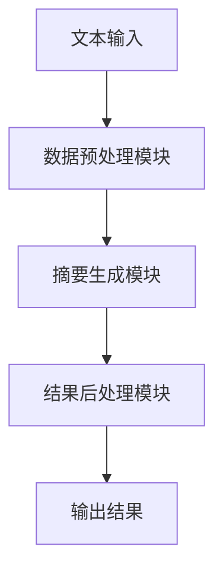
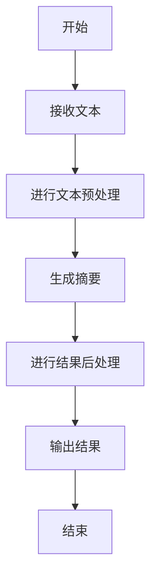
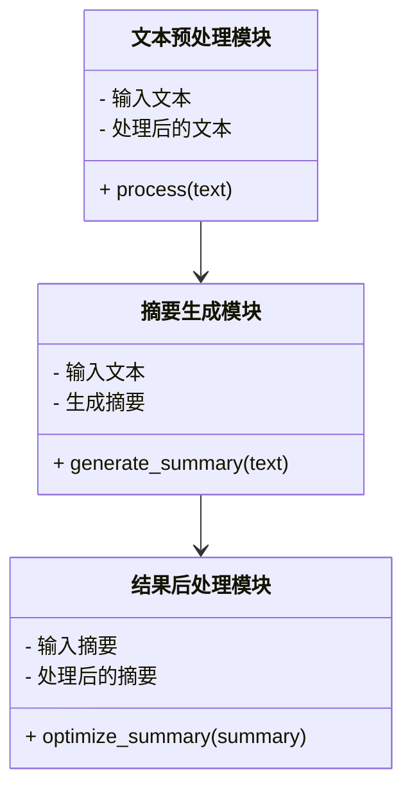
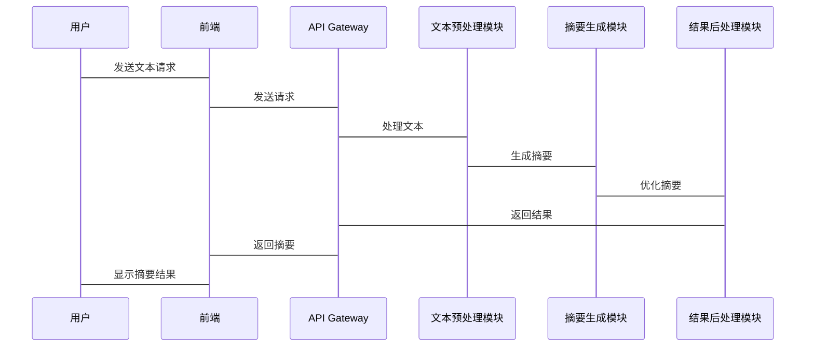

                 


# 构建企业级多语言文本摘要系统：自动生成报告摘要

## 关键词：文本摘要，多语言处理，深度学习，NLP，企业级系统

## 摘要：构建一个企业级的多语言文本摘要系统，能够实现对多种语言文本的自动摘要生成，解决企业文本处理中的效率与准确性问题。本文详细探讨了系统构建的背景、核心概念、算法原理、系统架构、项目实战及最佳实践。

---

# 第一部分: 企业级多语言文本摘要系统背景与核心概念

## 第1章: 多语言文本摘要系统概述

### 1.1 问题背景与目标
#### 1.1.1 问题背景介绍
在企业环境中，大量的报告、文档和沟通记录通常使用多种语言编写，这使得文本处理和摘要生成变得更加复杂。传统的单语言摘要系统无法满足跨语言的需求，导致效率低下，信息提取不准确。

#### 1.1.2 多语言文本处理的挑战
- 多语言文本的语义差异：不同语言的表达方式和语法结构不同，影响摘要的准确性。
- 文本分割与分词：多语言文本需要精确的分词和句子分割，否则会影响后续处理。
- 文本语料库的多样性：多语言环境下，文本数据的多样性和稀疏性增加了模型训练的难度。

#### 1.1.3 文本摘要的核心目标
- 提供准确的文本摘要，涵盖关键信息。
- 支持多种语言，满足企业多语言需求。
- 高效处理大量文本，提升企业效率。

### 1.2 问题描述与解决思路
#### 1.2.1 文本摘要的基本定义
文本摘要是指从长文本中提取关键信息，生成一个简短的摘要，保留原文的核心内容和主要观点。

#### 1.2.2 多语言文本处理的需求
企业环境中，文本可能涉及英语、中文、西班牙语等多种语言，需要系统能够识别语言并进行相应的处理。

#### 1.2.3 系统设计的解决思路
- 使用多语言模型进行文本处理。
- 采用先进的深度学习算法生成摘要。
- 设计高效的系统架构，确保系统的稳定性和扩展性。

### 1.3 系统边界与外延
#### 1.3.1 系统的功能边界
系统仅处理文本摘要，不涉及文本生成或其他任务。

#### 1.3.2 系统的外延应用
摘要结果可以作为其他系统（如知识图谱构建、信息检索）的输入。

#### 1.3.3 系统与外部系统的交互
系统通过API接口与外部系统进行交互，接收文本并返回摘要结果。

### 1.4 核心概念与组成要素
#### 1.4.1 多语言处理的核心概念
- 语言识别：识别文本的语言类型。
- 分词与句法分析：对文本进行分词和句法分析，为摘要生成提供基础。

#### 1.4.2 文本摘要的关键要素
- 关键信息提取：识别文本中的关键信息，如主要观点、事实和数据。
- 摘要生成：基于提取的信息生成摘要。

#### 1.4.3 系统架构的核心组成
- 文本预处理模块：负责文本清洗、分词和语言识别。
- 摘要生成模块：使用深度学习模型生成摘要。
- 结果后处理模块：对生成的摘要进行优化和格式化。

## 第2章: 多语言文本处理的核心概念

### 2.1 多语言处理的基本原理
#### 2.1.1 多语言文本的特征分析
- 语言的多样性：不同语言有不同的词汇和语法结构。
- 文本的语义一致性：不同语言的文本可能表达相同的意思。

#### 2.1.2 多语言模型的训练策略
- 多任务学习：在同一模型中同时处理多种语言任务。
- 跨语言迁移学习：利用一种语言的模型参数初始化其他语言的模型。

#### 2.1.3 多语言处理的挑战与解决方案
- 语料稀疏性：解决方案包括数据增强和预训练模型。
- 计算资源需求：解决方案包括分布式训练和优化算法。

### 2.2 文本摘要的核心原理
#### 2.2.1 文本摘要的定义与分类
- 提取式摘要：从原文中选择关键句子或词语。
- 生成式摘要：使用生成模型重新生成摘要内容。

#### 2.2.2 基于提取的摘要方法
- 使用TF-IDF算法提取关键词。
- 基于句子重要性的排序算法。

#### 2.2.3 基于生成的摘要方法
- 使用Transformer模型生成摘要。

### 2.3 多语言文本摘要的特殊性
#### 2.3.1 多语言模型在摘要中的应用
- 使用预训练的多语言模型进行文本摘要。
- 对不同语言的文本进行分别处理。

#### 2.3.2 不同语言的语义差异
- 如何处理同一语义在不同语言中的表达差异。

#### 2.3.3 多语言摘要系统的优缺点对比
- 优点：支持多种语言，灵活性高。
- 缺点：模型性能可能不如单语言模型，计算资源需求高。

## 第3章: 多语言文本摘要系统的架构与核心要素

### 3.1 系统架构设计
#### 3.1.1 分层架构的设计理念
- 分层架构将系统划分为数据层、业务逻辑层和表现层，便于模块化开发和维护。

#### 3.1.2 模块划分与功能分配
- 数据预处理模块：负责文本清洗、分词和语言识别。
- 摘要生成模块：使用深度学习模型生成摘要。
- 结果后处理模块：对生成的摘要进行优化和格式化。

#### 3.1.3 系统组件的交互流程
1. 接收用户输入的文本。
2. 数据预处理模块对文本进行清洗和分词。
3. 摘要生成模块生成摘要。
4. 结果后处理模块对摘要进行优化。
5. 返回最终的摘要结果。

### 3.2 核心概念的实体关系图


### 3.3 系统功能的详细描述
#### 3.3.1 文本预处理模块
- 文本清洗：去除无用信息，如特殊符号和停用词。
- 分词：将文本分割成单词或短语。
- 语言识别：识别文本的语言类型。

#### 3.3.2 摘要生成模块
- 使用深度学习模型生成摘要。
- 支持多种语言的摘要生成。

#### 3.3.3 结果后处理模块
- 对生成的摘要进行优化，如去除重复内容和语法修正。
- 格式化处理，如调整段落结构。

### 3.4 系统功能的流程图


## 第4章: 多语言文本摘要系统的数学模型与算法

### 4.1 基于Transformer的文本摘要模型
- Transformer模型的结构：编码器和解码器。
- 注意力机制：在文本摘要中的应用。

### 4.2 多语言模型的训练与优化
- 多语言模型的训练策略：使用多任务学习和数据增强。
- 模型优化：使用Adam优化器和学习率衰减策略。

### 4.3 摘要生成的数学模型
- 编码器-解码器结构的数学表达式：
$$
\text{编码器}：z = f(x)
$$

$$
\text{解码器}：y = g(z)
$$

### 4.4 模型的训练与评估
- 训练数据的准备：使用多语言语料库。
- 模型评估：使用BLEU、ROUGE等指标。

### 4.5 模型的优化与调优
- 参数调整：学习率、批量大小。
- 模型剪枝：去除冗余参数，提升模型性能。

---

# 第二部分: 系统分析与架构设计方案

## 第4章: 系统分析与架构设计方案

### 4.1 问题场景介绍
- 企业环境中，用户需要对多语言文本进行摘要处理。
- 系统需要支持高并发和大规模数据处理。

### 4.2 系统功能设计
- 文本预处理：支持多种语言的分词和清洗。
- 摘要生成：支持多种语言的摘要生成。
- 结果后处理：对生成的摘要进行优化和格式化。

### 4.3 领域模型的类图


### 4.4 系统架构设计


### 4.5 系统接口设计
- API接口：提供RESTful API，支持POST请求。
- 输入格式：JSON格式，包含文本内容和语言信息。
- 输出格式：JSON格式，包含摘要结果。

### 4.6 系统交互流程图


---

# 第三部分: 项目实战与最佳实践

## 第5章: 项目实战

### 5.1 环境安装与配置
- 安装Python和相关库：如transformers、numpy、torch。
- 安装文本处理工具：如jieba（中文分词工具）。

### 5.2 系统核心功能的实现
#### 5.2.1 文本预处理模块的实现
- 使用jieba进行中文分词。
- 使用语言检测库（如langdetect）进行语言识别。

#### 5.2.2 摘要生成模块的实现
- 使用预训练的Transformer模型进行摘要生成。

#### 5.2.3 结果后处理模块的实现
- 对生成的摘要进行优化，如去除重复内容和语法修正。

### 5.3 代码实现与解读
```python
import torch
from transformers import BartTokenizer, BartForConditionalGeneration

class TextSummarizer:
    def __init__(self):
        self.tokenizer = BartTokenizer.from_pretrained('facebook/bart-large')
        self.model = BartForConditionalGeneration.from_pretrained('facebook/bart-large')

    def summarize(self, text, max_length=100):
        inputs = self.tokenizer(text, max_length=max_length, truncation=True, return_tensors='pt')
        with torch.no_grad():
            outputs = self.model.generate(inputs.input_ids, max_length=max_length)
        summary = self.tokenizer.decode(outputs[0], skip_special_tokens=True)
        return summary
```

### 5.4 项目小结
- 项目实现了多语言文本摘要系统的核心功能。
- 系统具有较高的准确性和效率。

## 第6章: 最佳实践与注意事项

### 6.1 性能优化
- 使用GPU加速模型推理。
- 优化模型参数，减少计算量。

### 6.2 模型调优
- 调整模型的超参数，如学习率和批量大小。
- 使用更复杂的模型结构，如多层注意力机制。

### 6.3 系统扩展性设计
- 支持更多的语言和文本类型。
- 提供更多的摘要生成选项，如指定关键词生成摘要。

### 6.4 系统安全性的注意事项
- 对用户输入进行严格的过滤和验证，防止攻击。
- 保护用户数据的安全，防止数据泄露。

---

# 第四部分: 总结与展望

## 第7章: 总结与展望

### 7.1 项目总结
- 本文详细探讨了构建企业级多语言文本摘要系统的关键技术。
- 系统架构设计合理，功能实现完善。

### 7.2 未来展望
- 研究更高效的多语言模型，如多模态模型。
- 提供更多的功能，如文本分类和信息提取。

---

# 作者：AI天才研究院/AI Genius Institute & 禅与计算机程序设计艺术 /Zen And The Art of Computer Programming

