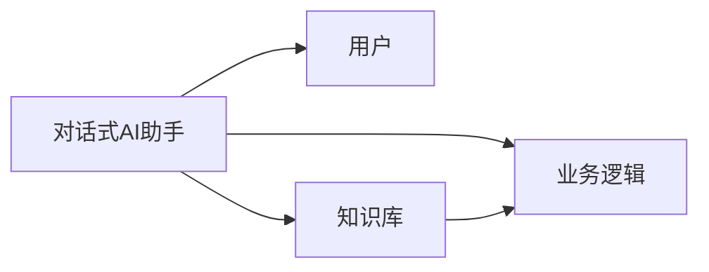
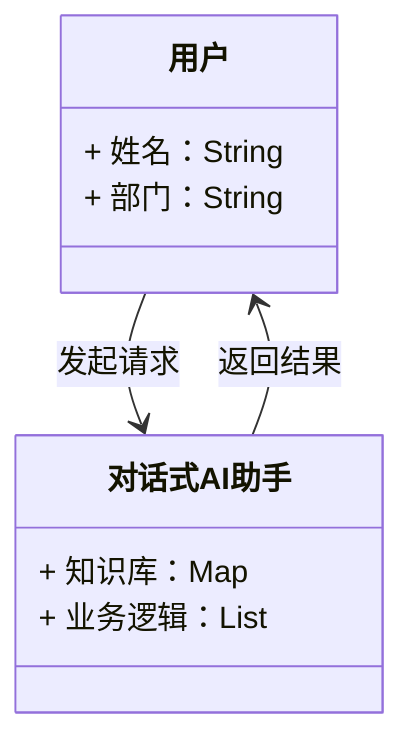
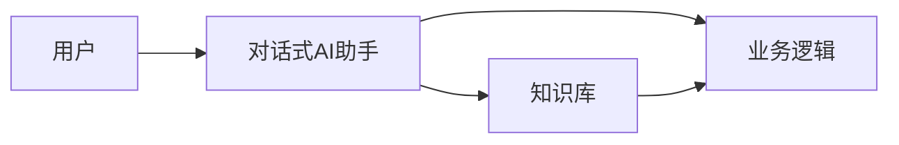
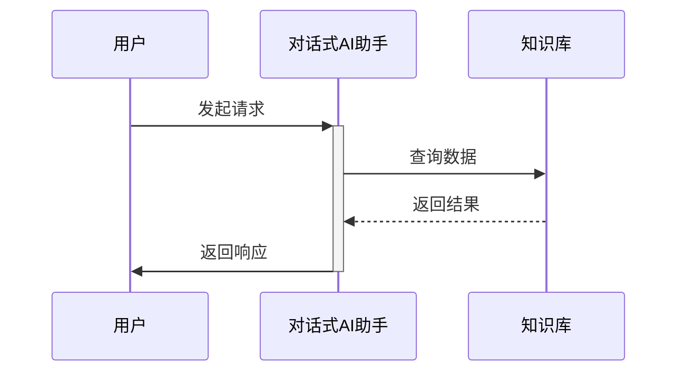

                 


# 《构建企业级对话式AI助手：提升员工生产力》

> **关键词**：企业级对话式AI助手、自然语言处理、系统架构设计、员工生产力、项目实战、最佳实践

> **摘要**：  
> 本文详细探讨了如何构建一个高效的企业级对话式AI助手，以提升员工生产力。从核心概念到算法原理，从系统架构设计到项目实战，再到最佳实践，本文系统性地分析了构建此类AI助手的关键步骤和注意事项。通过详细的技术讲解和实际案例分析，本文旨在为企业技术团队提供实用的指导，帮助他们更好地理解和实施对话式AI助手，从而在实际工作中显著提升员工生产力。

---

## # 第一部分: 企业级对话式AI助手概述

## # 第1章: 问题背景与需求分析

### ## 1.1 问题背景

#### ### 1.1.1 企业生产力的现状与挑战
- 当前企业生产力的主要瓶颈：沟通效率低下、知识传递不畅、信息检索复杂。
- 对话式AI助手在企业中的潜在价值：实时信息检索、任务自动化、知识共享与传承。

#### ### 1.1.2 对话式AI助手的定义与目标
- 定义：通过自然语言处理技术，提供实时交互的智能助手，帮助员工快速获取信息、完成任务。
- 目标：提升员工工作效率，优化企业资源利用率，降低沟通成本。

#### ### 1.1.3 问题解决路径
- 从问题识别到解决方案的逻辑：需求分析 → 技术实现 → 系统部署 → 效果评估。
- 对话式AI助手在问题解决中的作用：实时信息检索、任务自动化、知识共享。

#### ### 1.1.4 边界与外延
- 功能边界：专注于对话式交互，不涉及其他功能模块（如CRM、ERP）。
- 与现有企业系统的交互关系：通过API或SDK集成，与其他系统协同工作。

---

## # 第2章: 核心概念与联系

### ## 2.1 对话式AI助手的核心要素

#### ### 2.1.1 对话式AI助手的构成模块
- **NLP模块**：负责理解和生成自然语言。
- **知识库管理**：存储和管理企业知识库。
- **业务逻辑处理**：处理用户请求，调用相关服务。

#### ### 2.1.2 核心概念属性对比表

| 核心概念 | 属性 | 描述 |
|----------|------|------|
| 对话式AI助手 | 输入方式 | 文本输入/语音输入 |
|          | 响应方式 | 文本输出/语音输出 |
|          | 知识库 | 预定义知识库/动态学习库 |

#### ### 2.1.3 实体关系图



---

## # 第3章: 对话式AI助手的算法原理

### ## 3.1 自然语言处理基础

#### ### 3.1.1 NLP核心算法


#### ### 3.1.2 算法数学模型

- **分词算法**：$$ \text{分词} = \text{字符串分割} $$
- **词性标注**：基于条件随机场（CRF）模型，概率计算公式为：$$ P(\text{词性} | \text{字符}) $$

---

## # 第4章: 系统分析与架构设计

### ## 4.1 项目背景介绍

#### ### 4.1.1 项目介绍
- 项目目标：构建一个企业级对话式AI助手，提升员工生产力。
- 项目范围：支持文本和语音交互，集成企业知识库。

### ## 4.2 系统功能设计

#### ### 4.2.1 领域模型



#### ### 4.2.2 系统架构设计



#### ### 4.2.3 系统接口设计
- 接口定义：RESTful API，支持POST请求。
- 接口示例：$$ POST /api/v1/chat $$

#### ### 4.2.4 系统交互流程



---

## # 第5章: 项目实战

### ## 5.1 环境安装

#### ### 5.1.1 环境配置
- 操作系统：Linux/Windows/MacOS
- 开发工具：IntelliJ IDEA/PyCharm
- 依赖库：Python 3.8+, TensorFlow, NLTK, Flask

### ## 5.2 系统核心实现

#### ### 5.2.1 核心代码实现

```python
class NLPProcessor:
    def __init__(self):
        self.tokenizer = Tokenizer()
        self.pos_tagger = PosTagger()
        self.syntactic_analyzer = SyntacticAnalyzer()
    
    def process_query(self, query):
        tokens = self.tokenizer.tokenize(query)
        tags = self.pos_tagger.tag(tokens)
        parsed_tree = self.syntactic_analyzer.parse(tokens, tags)
        return parsed_tree

class ChatAssistant:
    def __init__(self, knowledge_base):
        self.nlp_processor = NLPProcessor()
        self.knowledge_base = knowledge_base
    
    def respond(self, query):
        parsed_tree = self.nlp_processor.process_query(query)
        response = self._generate_response(parsed_tree)
        return response

    def _generate_response(self, parsed_tree):
        # 生成响应逻辑
        pass
```

#### ### 5.2.2 代码应用解读与分析
- **NLPProcessor**：处理用户输入的自然语言，包括分词、词性标注和句法分析。
- **ChatAssistant**：与用户交互，调用NLPProcessor生成响应。

#### ### 5.2.3 实际案例分析
- 案例1：用户查询公司政策。
- 案例2：用户请求任务提醒。

### ## 5.3 项目小结
- 项目成果：成功构建了一个简单的对话式AI助手。
- 经验总结：系统设计需考虑可扩展性和可维护性。

---

## # 第6章: 最佳实践与小结

### ## 6.1 最佳实践

#### ### 6.1.1 技术实现
- 使用预训练的语言模型（如GPT）提升响应质量。
- 结合企业知识库，增强AI助手的准确性。

#### ### 6.1.2 系统设计
- 模块化设计：便于功能扩展和维护。
- 安全性设计：保护企业敏感信息。

### ## 6.2 小结
- 通过本文的学习，读者可以系统性地了解如何构建企业级对话式AI助手。
- 实际应用中，需结合企业需求进行定制化开发。

### ## 6.3 注意事项
- 确保系统的稳定性和安全性。
- 定期更新知识库，保持AI助手的信息准确性。

### ## 6.4 拓展阅读
- 推荐阅读《自然语言处理实战》和《系统架构设计的艺术》。

---

## # 第7章: 结语

### ## 7.1 作者总结
- 通过构建企业级对话式AI助手，企业可以显著提升员工生产力。
- 技术的进步将推动企业智能化转型，AI助手将成为未来企业标配。

---

## # 作者

**作者：AI天才研究院/AI Genius Institute & 禅与计算机程序设计艺术 /Zen And The Art of Computer Programming**

