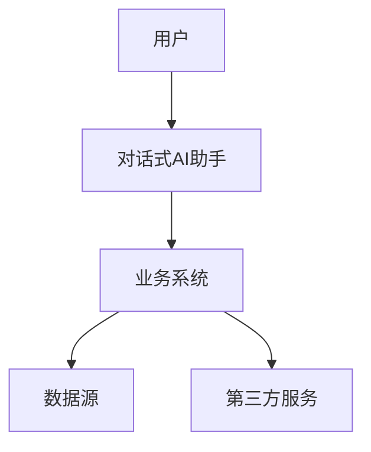
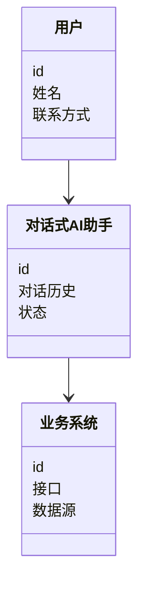
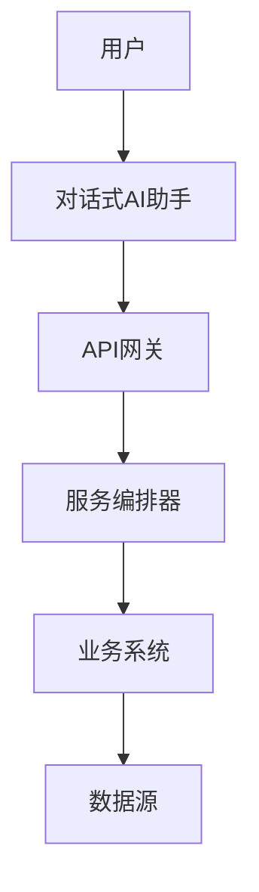
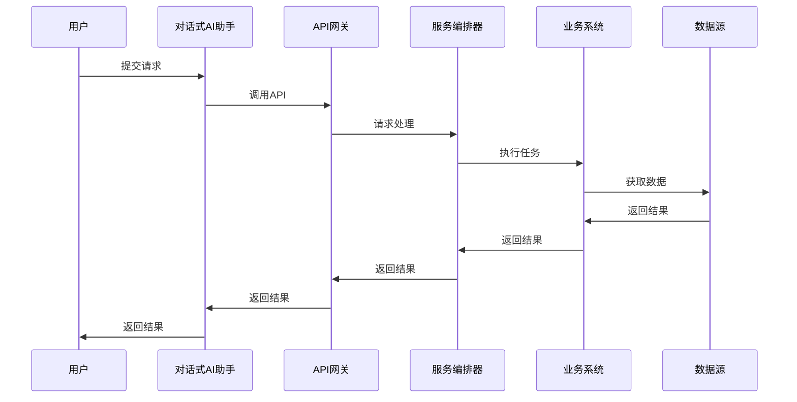

                 


# 构建企业级对话式AI助手：跨系统业务流程自动化与协调

**关键词：对话式AI、跨系统协调、业务流程自动化、自然语言处理、系统架构设计**

**摘要：**  
本文详细探讨了构建企业级对话式AI助手的各个方面，包括问题背景、核心概念、算法原理、系统架构设计、项目实战以及最佳实践。通过分析传统业务流程的痛点，提出对话式AI在企业中的需求，详细讲解了跨系统业务流程协调的核心挑战，并通过具体的算法和系统架构设计，展示了如何实现高效的业务流程自动化。本文还提供了实际项目案例，帮助读者理解如何将理论应用于实践。

---

# 第一部分: 企业级对话式AI助手的背景与概念

# 第1章: 问题背景与描述

## 1.1 问题背景

### 1.1.1 传统业务流程的痛点
传统业务流程通常依赖于人工操作，存在效率低、错误率高、成本高等问题。例如，客户在处理订单、咨询问题或反馈意见时，需要通过多个渠道（如电话、邮件、在线表单）与企业交互，体验较差。此外，不同系统之间的数据孤岛问题严重，导致流程协调困难。

### 1.1.2 对话式AI在企业中的需求
随着AI技术的快速发展，企业开始采用对话式AI助手来优化客户体验和提高效率。对话式AI助手可以24/7为客户提供服务，快速响应需求，并通过自然语言处理技术简化复杂的业务流程。

### 1.1.3 跨系统业务流程自动化的重要性
在企业中，不同部门和系统之间的协作通常是手动完成的，这会导致效率低下。通过自动化跨系统的业务流程，企业可以实现更快的响应、更高的准确性和更低的成本。

## 1.2 问题描述

### 1.2.1 对话式AI助手的目标
对话式AI助手的目标是通过自然语言处理技术，理解用户需求，并协调企业内部系统完成业务流程。例如，用户可以通过与AI助手对话来完成订单查询、问题反馈、服务预约等操作。

### 1.2.2 跨系统协调的核心挑战
跨系统协调的核心挑战包括：
- 不同系统之间的数据格式和接口不统一。
- 系统之间的通信延迟和可靠性问题。
- 如何处理异常情况（如系统故障、数据丢失等）。

### 1.2.3 业务流程自动化的关键点
业务流程自动化的关键点包括：
- 确保系统之间的通信安全可靠。
- 实现高效的任务分配和资源调度。
- 提供灵活的配置和扩展能力。

## 1.3 问题解决

### 1.3.1 对话式AI的解决方案
对话式AI的解决方案包括：
- 基于自然语言处理技术的意图识别和对话生成。
- 引入对话管理模块，确保上下文理解和任务协调。

### 1.3.2 跨系统协调的技术路径
跨系统协调的技术路径包括：
- 使用API网关统一接口。
- 引入服务编排器协调不同系统的任务。
- 通过消息队列实现系统之间的异步通信。

### 1.3.3 业务流程自动化的实现方法
业务流程自动化的实现方法包括：
- 使用流程引擎（如BPM）定义和管理业务流程。
- 引入自动化工具（如RPA）实现系统之间的任务自动化。

## 1.4 概念结构与核心要素

### 1.4.1 对话式AI助手的构成要素
对话式AI助手的构成要素包括：
- 自然语言处理模块：负责理解和生成对话内容。
- 对话管理模块：负责维护对话状态和任务协调。
- 业务系统接口：负责与企业内部系统进行数据交互。

### 1.4.2 跨系统协调的核心组件
跨系统协调的核心组件包括：
- API网关：统一接口访问。
- 服务编排器：协调不同系统的任务。
- 消息队列：实现系统之间的异步通信。

### 1.4.3 业务流程自动化的关键环节
业务流程自动化的关键环节包括：
- 任务分配：将用户需求分配给相应的系统处理。
- 任务执行：协调各系统完成任务。
- 任务反馈：将结果返回给用户。

## 1.5 本章小结
本章通过分析传统业务流程的痛点，提出了对话式AI助手的需求和目标。同时，详细探讨了跨系统业务流程协调的核心挑战，并提出了相应的解决方案和技术路径。

---

# 第二部分: 对话式AI的核心概念与联系

# 第2章: 对话式AI的核心原理

## 2.1 自然语言处理基础

### 2.1.1 NLP的基本概念
自然语言处理（NLP）是研究如何让计算机理解和生成人类语言的科学。其核心任务包括文本分类、实体识别、情感分析等。

### 2.1.2 语言模型的原理
语言模型通过统计方法或深度学习模型（如LSTM、Transformer）来预测下一个词的概率分布，从而实现文本生成和理解。

### 2.1.3 对话生成的机制
对话生成的机制包括基于规则的方法、模板方法和预训练模型（如GPT）的微调方法。

## 2.2 对话管理与上下文理解

### 2.2.1 对话状态的表示
对话状态通常由当前对话的上下文信息和用户需求组成，可以表示为一个状态向量或JSON对象。

### 2.2.2 上下文关联的处理
上下文关联的处理包括通过对话历史记录维护当前对话的状态，并根据上下文信息生成合适的回复。

### 2.2.3 对话策略的制定
对话策略的制定包括确定对话的目标、选择合适的回复策略（如规则驱动或模型驱动）。

## 2.3 跨系统业务流程协调

### 2.3.1 跨系统协调的定义
跨系统协调是指通过对话式AI助手，协调多个异构系统完成复杂业务流程的能力。

### 2.3.2 跨系统业务流程的特点
跨系统业务流程的特点包括：
- 分布式：任务分布在多个系统中。
- 异步性：系统之间的通信通常是异步的。
- 复杂性：涉及多个系统的协作。

### 2.3.3 跨系统协调的实现方法
跨系统协调的实现方法包括：
- 使用API网关统一接口。
- 引入服务编排器协调任务。
- 通过消息队列实现异步通信。

## 2.4 核心概念对比表

| 对比维度 | 对话式AI | 传统客服 |
|----------|----------|----------|
| 交互方式 | 自然语言对话 | 人工接听或表单填写 |
| 响应速度 | 实时或近实时 | 较慢 |
| 成本 | 低 | 高 |

## 2.5 ER实体关系图



## 2.6 本章小结
本章详细讲解了对话式AI的核心原理，包括自然语言处理、对话管理与上下文理解，以及跨系统业务流程协调的实现方法。

---

# 第三部分: 对话式AI的算法原理

# 第3章: 意图识别与对话生成算法

## 3.1 意图识别算法

### 3.1.1 基于统计的意图识别
基于统计的意图识别方法包括词袋模型和TF-IDF，通过统计词语频率来分类用户的意图。

### 3.1.2 深度学习的意图识别
深度学习的意图识别方法包括使用LSTM和Transformer模型，通过端到端的训练来提高准确率。

### 3.1.3 意图识别的评价指标
常用的评价指标包括准确率、召回率和F1值。

## 3.2 对话生成算法

### 3.2.1 基于规则的对话生成
基于规则的对话生成方法通过预定义的规则和模板生成回复。

### 3.2.2 基于模板的对话生成
基于模板的对话生成方法通过匹配用户输入到预定义的模板中，生成合适的回复。

### 3.2.3 基于预训练模型的对话生成
基于预训练模型的对话生成方法通过对模型进行微调，使其适应特定领域的对话生成任务。

## 3.3 跨系统协调算法

### 3.3.1 跨系统任务分配算法
跨系统任务分配算法包括基于负载均衡的任务分配和基于优先级的任务分配。

### 3.3.2 跨系统信息同步算法
跨系统信息同步算法包括基于消息队列的异步同步和基于数据库的同步。

## 3.4 算法实现

### 3.4.1 意图识别算法的Python代码示例

```python
from sklearn.feature_extraction.text import TfidfVectorizer
from sklearn.naive_bayes import MultinomialNB

# 数据预处理
vectorizer = TfidfVectorizer()
X = vectorizer.fit_transform(corpus)

# 模型训练
model = MultinomialNB()
model.fit(X, y)

# 预测
test_text = "退款申请"
test_vec = vectorizer.transform([test_text])
predicted = model.predict(test_vec)
print(predicted)
```

### 3.4.2 对话生成算法的Python代码示例

```python
def generate_response(user_input, context):
    # 使用预训练模型生成回复
    response = model.generate(user_input, context)
    return response
```

## 3.5 本章小结
本章详细讲解了意图识别和对话生成的算法原理，并通过Python代码示例展示了如何实现这些算法。

---

# 第四部分: 系统分析与架构设计

# 第4章: 系统分析与架构设计

## 4.1 项目介绍

### 4.1.1 项目背景
本项目旨在构建一个企业级对话式AI助手，实现跨系统业务流程的自动化与协调。

### 4.1.2 项目目标
项目的总体目标是提高客户体验和业务效率，降低运营成本。

## 4.2 系统功能设计

### 4.2.1 领域模型


### 4.2.2 系统架构设计


### 4.2.3 系统接口设计
系统接口设计包括：
- 对话式AI助手与API网关的接口。
- API网关与服务编排器的接口。
- 服务编排器与业务系统的接口。

### 4.2.4 系统交互流程


## 4.3 本章小结
本章通过系统分析与架构设计，展示了如何实现企业级对话式AI助手的跨系统业务流程自动化与协调。

---

# 第五部分: 项目实战

# 第5章: 项目实战

## 5.1 环境安装

### 5.1.1 安装Python
```bash
python --version
pip install --upgrade pip
```

### 5.1.2 安装必要的库
```bash
pip install numpy pandas scikit-learn transformers
```

## 5.2 核心实现

### 5.2.1 对话式AI助手的核心代码

```python
class DialogAssistant:
    def __init__(self):
        self.dialog_history = []
        self.current_state = None

    def process_input(self, user_input):
        # 处理用户输入
        pass

    def generate_response(self):
        # 生成回复
        pass
```

### 5.2.2 API网关的实现

```python
from fastapi import FastAPI

app = FastAPI()

@app.post("/api/execute_task")
async def execute_task(request: dict):
    # 处理请求
    pass
```

## 5.3 代码应用解读与分析
通过上述代码，我们可以看到对话式AI助手和API网关的核心实现。对话式AI助手负责处理用户的输入并生成回复，而API网关负责协调不同系统之间的任务。

## 5.4 实际案例分析
通过一个具体的案例，展示了如何通过对话式AI助手实现跨系统业务流程的自动化。

## 5.5 本章小结
本章通过实际项目案例，展示了如何将理论应用于实践。

---

# 第六部分: 总结与展望

# 第6章: 总结与展望

## 6.1 最佳实践

### 6.1.1 系统设计
系统设计时，应注重模块化和可扩展性。

### 6.1.2 安全性
确保系统之间的通信安全可靠。

### 6.1.3 可维护性
保持代码的清晰和可维护性。

## 6.2 小结
通过本文的探讨，我们了解了构建企业级对话式AI助手的各个方面，包括问题背景、核心概念、算法原理、系统架构设计以及项目实战。

## 6.3 注意事项
在实际应用中，应注重系统的健壮性和可扩展性。

## 6.4 拓展阅读
建议读者进一步学习自然语言处理、系统架构设计等领域的知识。

## 6.5 本章小结
本章总结了全文，并提出了未来的发展方向。

---

**作者：AI天才研究院/AI Genius Institute & 禅与计算机程序设计艺术 /Zen And The Art of Computer Programming**

