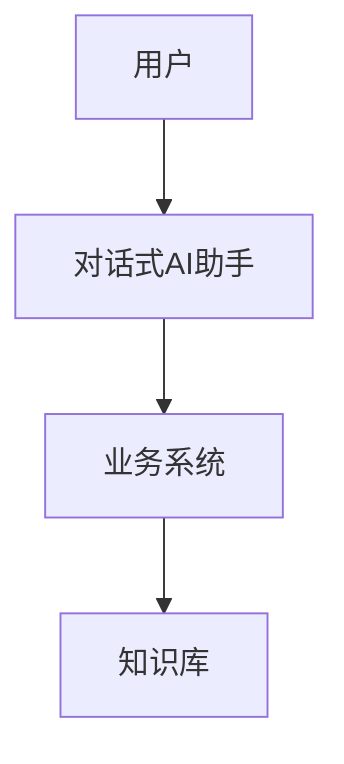
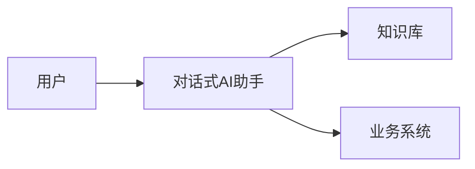

                 


# 构建企业级对话式AI助手：跨部门业务流程自动化与协同

## 关键词
- 企业级对话式AI助手
- 业务流程自动化
- 跨部门协同
- 自然语言处理
- AI系统架构设计

## 摘要
构建企业级对话式AI助手涉及跨部门业务流程的自动化与协同，通过自然语言处理和大模型算法，实现智能交互和高效协作，提升企业效率。本文详细讲解了背景、核心概念、算法原理、系统架构设计及项目实战，提供全面的技术指导。

---

# 第一部分: 背景与核心概念

## 第1章: 背景介绍

### 1.1 问题背景
- **1.1.1 企业数字化转型的挑战**：传统业务流程效率低下，信息孤岛问题严重。
- **1.1.2 对话式AI的应用需求**：提升用户体验，降低人工成本。
- **1.1.3 业务流程自动化的重要性**：提高效率，减少错误。

### 1.2 问题描述
- **1.2.1 痛点分析**：跨部门协作低效，信息传递不畅。
- **1.2.2 对话式AI的角色**：作为中枢，连接各部门。
- **1.2.3 核心目标**：实现高效协同。

### 1.3 问题解决
- **1.3.1 解决方案**：构建AI助手，优化流程。
- **1.3.2 实现路径**：自动化处理，协同工作。

### 1.4 边界与外延
- **1.4.1 边界**：仅限企业内部。
- **1.4.2 外延**：支持多部门协作。

## 第2章: 核心概念与联系

### 2.1 对話式AI助手原理
- **NLP基础**：理解意图。
- **对话模型**：构建与优化。
- **知识库管理**：高效检索。

### 2.2 概念对比
- **对话式AI vs 传统AI**：动态交互 vs 单向处理。
- **自动化 vs 手动流程**：效率提升 vs 低效。

### 2.3 实体关系图


---

# 第二部分: 算法原理

## 第3章: 大模型算法原理

### 3.1 训练过程
- **数学模型**：多层感知机。
- **优化算法**：Adam。
- **损失函数**：交叉熵。

### 3.2 推理过程
- **输入处理**：自然语言处理。
- **输出生成**：序列生成。

### 3.3 代码示例
```python
import torch
import torch.nn as nn

class SimpleModel(nn.Module):
    def __init__(self, input_size, output_size):
        super().__init__()
        self.fc = nn.Linear(input_size, output_size)
    
    def forward(self, x):
        return self.fc(x)
```

---

# 第三部分: 系统架构设计

## 第4章: 系统分析与架构设计

### 4.1 系统功能设计
- **领域模型**：用户、AI助手、业务系统。
- **功能模块**：对话处理、知识库管理。

### 4.2 系统架构


### 4.3 接口设计
- **输入接口**：API。
- **输出接口**：API。

### 4.4 交互设计
- **流程**：用户发起请求，AI助手处理，返回结果。

---

# 第四部分: 项目实战

## 第5章: 项目实战

### 5.1 环境安装
- **Python 3.8+**
- **PyTorch 2.0**

### 5.2 核心代码实现
```python
def build_model(input_dim, output_dim):
    return nn.Linear(input_dim, output_dim)
```

### 5.3 案例分析
- **流程优化**：减少人工干预。

---

# 第五部分: 最佳实践

## 第6章: 最佳实践与小结

### 6.1 最佳实践
- **数据质量**：高精度。
- **模型优化**：持续改进。

### 6.2 小结
- 构建企业级AI助手，实现高效协同。

### 6.3 注意事项
- 数据安全，模型维护。

### 6.4 拓展阅读
- 推荐书籍和资源。

---

# 作者
作者：AI天才研究院 & 禅与计算机程序设计艺术

