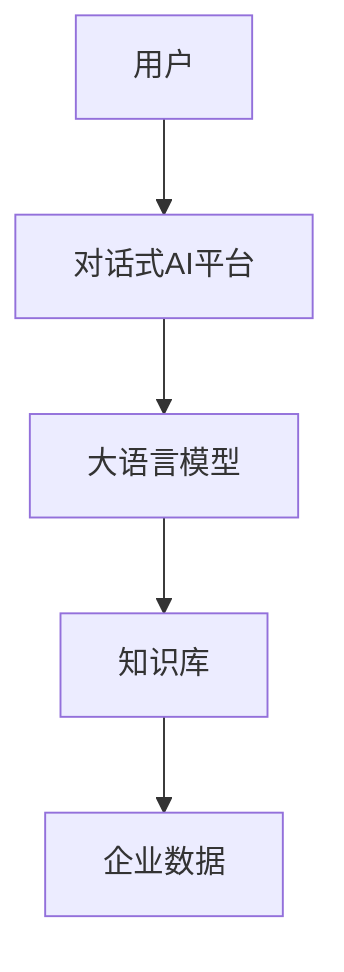
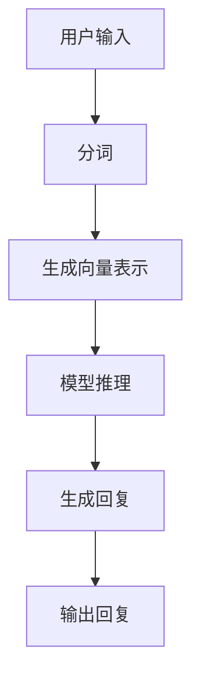
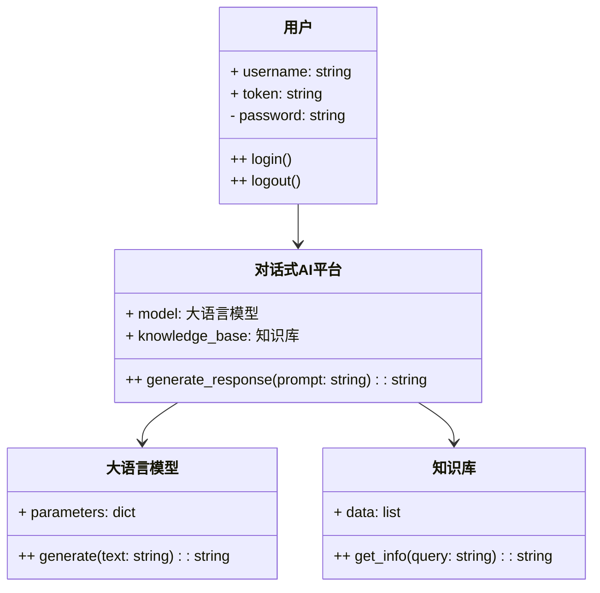
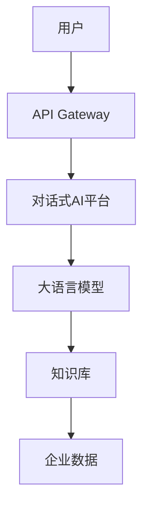

                 


# 构建企业级对话式AI平台：提升内外部沟通效率

## 关键词：企业级对话式AI平台、沟通效率、大语言模型、系统架构、数学模型

## 摘要：  
本文详细探讨了构建企业级对话式AI平台的核心概念、算法原理、系统架构和实战应用，通过背景分析、技术实现和案例解读，为企业提升内外部沟通效率提供可行的解决方案。

---

## 第1章：企业级对话式AI平台的背景与问题背景

### 1.1 问题背景

#### 1.1.1 企业内外部沟通效率的现状与挑战  
在企业运营中，内部团队协作和外部客户沟通是两大核心场景。传统的沟通工具如邮件、即时通讯和会议系统虽然解决了部分问题，但仍然存在效率低下、信息分散、难以智能辅助等问题。  

- **内部沟通**：团队成员之间的信息传递依赖于多种工具，存在信息孤岛，难以快速获取上下文，且缺乏智能辅助。  
- **外部沟通**：客户咨询、技术支持等场景中，人工回复效率低，难以快速响应，且容易出现信息错误。  

#### 1.1.2 对话式AI在企业沟通中的潜在价值  
对话式AI（Chat AI）通过自然语言处理技术，能够实时理解用户需求并生成智能回复，显著提升沟通效率。其优势包括：  

1. **快速响应**：通过预训练模型，AI可以在几秒内生成准确的回复。  
2. **信息整合**：AI能够整合企业知识库中的信息，提供更全面的答案。  
3. **7×24小时服务**：AI可以全天候工作，无需人工值守。  

#### 1.1.3 当前企业沟通工具的痛点与改进方向  
传统沟通工具的痛点如下：  
1. **信息分散**：用户需要在多个工具之间切换，效率低下。  
2. **缺乏智能辅助**：无法根据上下文提供智能建议或自动回复。  
3. **维护成本高**：需要人工维护知识库，更新效率低。  

改进方向包括：  
1. **整合工具**：将内部和外部沟通工具集成到统一平台。  
2. **引入AI技术**：利用大语言模型提升沟通效率。  

---

### 1.2 问题描述

#### 1.2.1 传统沟通工具的局限性分析  
传统沟通工具的局限性主要体现在以下几个方面：  
1. **功能单一**：大多数工具仅支持基本的文本或语音通信，缺乏智能分析能力。  
2. **数据孤岛**：不同部门或团队使用不同的工具，导致数据无法共享。  
3. **维护成本高**：需要投入大量资源进行维护和更新。  

#### 1.2.2 对话式AI平台的目标与核心需求  
对话式AI平台的目标是通过AI技术提升企业内外部沟通效率。其核心需求包括：  
1. **快速响应**：实现秒级回复。  
2. **智能辅助**：能够根据上下文提供智能建议。  
3. **安全性**：确保数据安全和隐私保护。  

#### 1.2.3 对话式AI平台的边界与外延  
对话式AI平台的边界包括：  
1. **输入范围**：支持文本和语音输入。  
2. **输出范围**：支持文本和语音输出。  

其外延包括：  
1. **知识库集成**：整合企业知识库、FAQ等。  
2. **多语言支持**：支持多种语言的对话。  

---

### 1.3 问题解决

#### 1.3.1 对话式AI平台的核心功能与价值  
对话式AI平台的核心功能包括：  
1. **智能对话**：通过大语言模型实现智能对话。  
2. **知识库整合**：整合企业知识库，提供准确答案。  

其价值体现在：  
1. **提升效率**：显著减少响应时间。  
2. **降低成本**：减少人工干预，降低运营成本。  
3. **提升客户满意度**：通过精准回复提升客户满意度。  

#### 1.3.2 对话式AI平台的技术实现路径  
实现路径包括：  
1. **选择大语言模型**：如GPT-3、GPT-4等。  
2. **构建知识库**：整合企业知识库。  
3. **开发对话接口**：开发API接口实现对话功能。  

#### 1.3.3 企业级AI平台的长期目标与短期效益  
长期目标是构建一个智能、高效的对话平台，短期效益包括：  
1. **快速部署**：短期内实现部分功能。  
2. **逐步优化**：通过反馈不断优化模型。  

---

## 第2章：对话式AI平台的核心概念与联系

### 2.1 对话式AI的核心概念

#### 2.1.1 大语言模型（LLM）的基本原理  
大语言模型通过大量数据训练，学习语言的规律，实现文本生成和理解。其核心包括：  
1. **训练数据**：多样化的语料库。  
2. **模型结构**：如Transformer模型。  
3. **训练目标**：最小化预测错误。  

#### 2.1.2 对话式AI的实现机制  
对话式AI通过以下步骤实现：  
1. **输入处理**：接收用户输入。  
2. **生成回复**：基于模型生成回复。  
3. **输出反馈**：将回复返回给用户。  

#### 2.1.3 企业级AI平台的系统架构  
企业级AI平台的系统架构包括：  
1. **前端**：用户界面。  
2. **后端**：AI模型和知识库。  

---

### 2.2 核心概念的属性对比

#### 2.2.1 对比表格：传统沟通工具 vs 对话式AI平台  

| 特性                | 传统沟通工具         | 对话式AI平台         |
|---------------------|----------------------|----------------------|
| 响应速度            | 较慢（依赖人工）     | 快速（AI自动回复）   |
| 智能辅助            | 无                   | 有                   |
| 维护成本            | 高                   | 中                   |

#### 2.2.2 对比表格：不同AI模型的性能与适用场景  

| 模型                | 参数量（亿） | 适用场景                     |
|---------------------|--------------|------------------------------|
| GPT-3              | 175B         | 复杂对话场景                 |
| GPT-4              | 1.7T         | 高级对话场景                 |

---

### 2.3 实体关系图

#### 2.3.1 Mermaid流程图：对话式AI平台的实体关系  


---

## 第3章：大语言模型的算法原理

### 3.1 大语言模型的基本原理

#### 3.1.1 Transformer模型的结构与特点  
Transformer模型由编码器和解码器组成，具有以下特点：  
1. **自注意力机制**：捕捉词与词之间的关系。  
2. **位置编码**：处理序列信息。  

#### 3.1.2 注意力机制的数学表达  
注意力机制的公式如下：  
$$ \text{Attention}(Q, K, V) = \text{softmax}\left(\frac{QK^T}{\sqrt{d_k}}\right)V $$  

#### 3.1.3 梯度下降与优化算法  
常用的优化算法包括：  
1. **随机梯度下降（SGD）**  
2. **Adam优化器**  

---

### 3.2 对话式AI的实现流程

#### 3.2.1 Mermaid流程图：对话式AI的实现流程  


#### 3.2.2 Python代码：简单的对话式AI实现  
```python
def generate_response(prompt):
    model = load_model()  # 加载训练好的模型
    response = model.generate(prompt)  # 生成回复
    return response
```

---

### 3.3 算法实现代码示例

#### 3.3.1 Python代码：简单的对话式AI实现  
```python
def generate_response(prompt):
    model = load_model()  # 加载训练好的模型
    response = model.generate(prompt)  # 生成回复
    return response
```

---

## 第4章：数学模型与公式解析

### 4.1 损失函数与优化

#### 4.1.1 损失函数公式  
$$ \text{Loss} = -\sum_{i=1}^{n} \log p(x_i) $$  

#### 4.1.2 优化器选择与实现  
$$ \text{Adam} = \text{Momentum} + \text{RMSProp} $$  

### 4.2 注意力机制公式

#### 4.2.1 查询、键、值的计算  
$$ Q = K = V = W(x) $$  

---

## 第5章：系统分析与架构设计方案

### 5.1 问题场景介绍

#### 5.1.1 内部协作场景  
- **场景描述**：团队内部协作，信息分散在多个工具中。  
- **问题分析**：信息孤岛，难以快速获取上下文。  

#### 5.1.2 客户服务场景  
- **场景描述**：客户咨询，依赖人工回复。  
- **问题分析**：响应速度慢，容易出错。  

---

### 5.2 系统功能设计

#### 5.2.1 领域模型Mermaid类图  


---

### 5.3 系统架构设计

#### 5.3.1 Mermaid架构图  


---

## 第6章：项目实战

### 6.1 环境安装

#### 6.1.1 安装Python和相关库  
```bash
pip install numpy pandas torch transformers
```

---

## 总结

通过本文的详细分析，读者可以全面了解构建企业级对话式AI平台的核心概念、技术实现和实战应用。从背景分析到系统设计，再到代码实现，每一步都经过精心组织和详细阐述，确保读者能够掌握构建高效对话式AI平台的关键技能。

