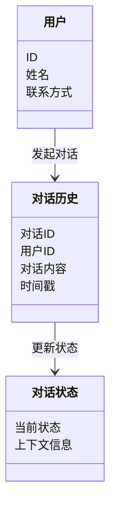
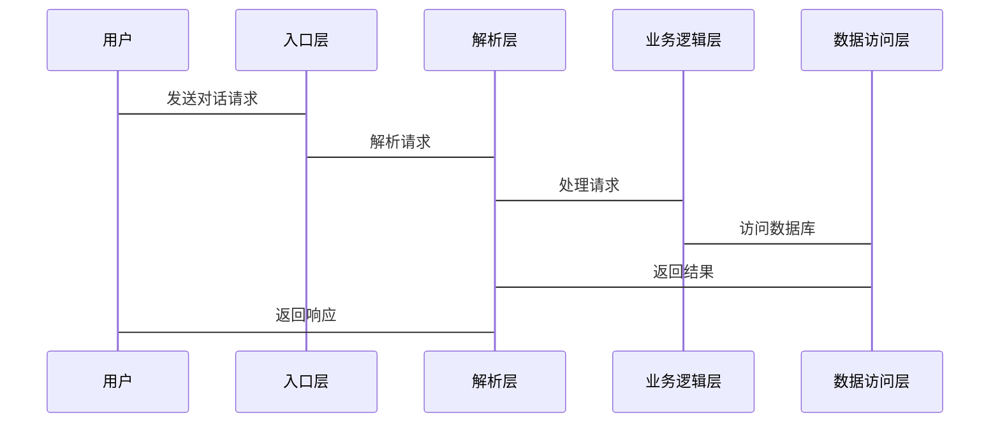

                 


# 构建企业级对话系统：上下文感知与多轮交互管理

---

## 关键词：
企业级对话系统, 上下文感知, 多轮交互, 自然语言处理, 对话系统架构, 对话状态管理, 系统实现

---

## 摘要：
本文详细探讨了构建企业级对话系统的核心要素，重点分析了上下文感知与多轮交互管理的关键技术和实现方法。文章从对话系统的概述出发，深入讲解了上下文感知与多轮交互的核心概念、算法原理、数学模型、系统架构设计以及项目实战等内容。通过理论与实践相结合的方式，帮助读者全面理解并掌握企业级对话系统的设计与实现能力。

---

## 第一部分: 对话系统概述

### 第1章: 对话系统概述

#### 1.1 对话系统的概念与背景

##### 1.1.1 对话系统的定义
对话系统是一种能够与用户进行自然语言交互的智能系统，通过理解和生成人类语言，实现信息传递和任务处理。企业级对话系统则是在企业场景中应用的高级对话系统，具有更强的上下文感知能力和多轮交互能力。

##### 1.1.2 企业级对话系统的背景与需求
随着企业数字化转型的推进，对话系统在企业内部和外部的应用需求日益增长。企业需要通过对话系统实现客户服务、内部协作、业务流程自动化等多种功能，而这些功能的实现离不开对上下文的深度理解和对多轮交互的精准管理。

##### 1.1.3 上下文感知与多轮交互的核心意义
上下文感知使对话系统能够理解当前对话的背景和历史信息，从而提供更准确的回应。多轮交互则保证了对话的连贯性和完整性，使系统能够逐步深入理解用户需求，提供更高质量的服务。

#### 1.2 对话系统的关键特征

##### 1.2.1 实时性与响应速度
企业级对话系统需要在极短时间内对用户输入做出响应，以提供高效的用户体验。

##### 1.2.2 上下文感知能力
系统需要能够理解对话中的上下文信息，包括对话历史、用户意图和实体信息。

##### 1.2.3 多轮交互的连贯性
系统需要在多轮对话中保持连贯性，逐步引导用户完成任务，同时根据对话进展调整系统行为。

##### 1.2.4 系统的可扩展性与灵活性
企业级对话系统需要能够快速适应不同的业务场景和用户需求，支持多种交互方式和功能扩展。

#### 1.3 企业级对话系统的应用场景

##### 1.3.1 客户服务与支持
通过对话系统为客户提供实时咨询、问题解答和售后服务，提升客户满意度和忠诚度。

##### 1.3.2 内部协作与知识管理
在企业内部，对话系统可以用于团队协作、知识共享和任务分配，提高工作效率。

##### 1.3.3 业务流程自动化
通过对话系统自动化处理常见的业务流程，减少人工干预，降低运营成本。

##### 1.3.4 数据分析与决策支持
系统可以通过对话收集和分析数据，为企业的决策提供支持。

#### 1.4 本章小结
本章从对话系统的概念出发，分析了其关键特征和应用场景，强调了上下文感知与多轮交互在企业级对话系统中的重要性。

---

## 第二部分: 对话系统的核心概念与原理

### 第2章: 上下文感知与多轮交互的核心概念

#### 2.1 对话系统的实体与关系

##### 2.1.1 用户角色
用户在对话中的角色，包括客户、员工和其他相关方。

##### 2.1.2 对话历史
对话过程中产生的所有历史信息，包括用户的输入和系统的回应。

##### 2.1.3 系统状态
系统在对话过程中的当前状态，包括已处理的任务、未完成的任务和上下文信息。

##### 2.1.4 实体关系图（ER图）
通过ER图展示对话系统中实体之间的关系，如用户、对话、意图、实体等。

##### ER图（Mermaid）：
```mermaid
erDiagram
    actor 用户
    actor 系统
    entity 对话历史
    entity 对话状态
    entity 实体信息
    entity 意图
    用户 --> 对话历史: 发起对话
    对话历史 --> 系统: 提供上下文
    系统 --> 对话状态: 更新状态
    对话历史 --> 实体信息: 包含实体
    对话历史 --> 意图: 包含意图
```

#### 2.2 意图识别与槽位填充

##### 2.2.1 意图识别的定义与实现
意图识别是通过自然语言处理技术，识别用户在对话中的主要目的或需求。常见的实现方法包括基于规则的意图识别和基于机器学习的意图识别。

##### 2.2.2 槽位填充的原理与方法
槽位填充是通过解析用户输入，提取与意图相关的具体信息，如时间、地点、人物等。常用方法包括基于规则的槽位填充和基于模式匹配的槽位填充。

##### 2.2.3 意图识别与槽位填充的对比表格
| 对比维度 | 意图识别 | 槽位填充 |
|----------|----------|----------|
| 目标     | 确定用户的主要需求 | 提取具体信息 |
| 方法     | 基于规则或机器学习 | 基于规则或模式匹配 |
| 输出     | 意图标签 | 实体信息 |

#### 2.3 上下文管理的原理

##### 2.3.1 上下文的定义与存储
上下文是对话过程中所有相关信息的集合，包括对话历史、意图和实体信息。通常存储在数据库或缓存中。

##### 2.3.2 上下文的更新与维护
系统在每次对话后更新上下文信息，确保后续对话能够基于最新的上下文进行。

##### 2.3.3 上下文与对话流的关系
上下文信息影响对话的流程和方向，对话流的每一步都需要依赖上下文信息来决定下一步的操作。

#### 2.4 对话状态转移的数学模型

##### 2.4.1 马尔可夫链模型
马尔可夫链模型用于描述对话状态之间的转移概率，假设当前状态只依赖于前一状态。

##### 2.4.2 隐马尔可夫模型（HMM）
HMM用于序列建模，适用于对话状态的序列预测和分类。

##### 2.4.3 基于转移矩阵的状态管理
通过转移矩阵表示状态之间的转移概率，帮助系统预测下一个可能的状态。

#### 2.5 本章小结
本章详细讲解了对话系统中的实体关系、意图识别、槽位填充以及上下文管理的核心概念和实现方法，为后续的算法实现和系统设计奠定了基础。

---

## 第三部分: 对话系统的算法原理与实现

### 第3章: 意图识别与实体抽取算法

#### 3.1 意图识别的算法原理

##### 3.1.1 基于规则的意图识别
通过预定义的规则和模式匹配，识别用户的意图。这种方法适用于简单的意图识别场景。

##### 3.1.2 基于统计的意图识别
利用统计学习方法，如朴素贝叶斯和决策树，对用户输入进行分类，识别意图。

##### 3.1.3 基于深度学习的意图识别
使用循环神经网络（RNN）或变换器（Transformer）等深度学习模型，对用户输入进行编码和分类，识别意图。

##### 意图识别算法实现（Python代码示例）：
```python
import numpy as np
from sklearn.feature_extraction.text import TfidfVectorizer
from sklearn.naive_bayes import MultinomialNB

# 数据准备
texts = ["我需要技术支持", "我想了解产品信息", "我要投诉"]
labels = ["技术支持", "产品咨询", "投诉"]

# 特征提取
vectorizer = TfidfVectorizer()
X = vectorizer.fit_transform(texts)

# 模型训练
model = MultinomialNB()
model.fit(X, labels)

# 预测
new_text = "请帮我解决技术问题"
new_X = vectorizer.transform([new_text])
predicted_label = model.predict(new_X)
print(predicted_label[0])  # 输出：技术支持
```

#### 3.2 实体抽取的算法原理

##### 3.2.1 基于规则的实体抽取
通过预定义的正则表达式或关键词匹配，从文本中提取实体信息。

##### 3.2.2 基于统计的实体抽取
利用统计学习方法，如条件随机场（CRF），对文本进行序列标注，提取实体。

##### 3.2.3 基于深度学习的实体抽取
使用字符级或词级的深度学习模型，如LSTM和Transformer，对文本进行编码和解码，提取实体。

##### 实体抽取算法实现（Python代码示例）：
```python
from transformers import pipeline

# 使用预训练的实体抽取模型
nlp = pipeline("ner")

text = "我需要技术支持，产品型号是ABC-123，联系人是张三。"
result = nlp(text)

# 输出提取的实体
entities = [(ent["start"], ent["end"], ent["label_"], ent["word"]) for ent in result[0]["ents"]]
print(entities)
```

#### 3.3 意图识别与实体抽取的对比分析

##### 3.3.1 算法优缺点对比
| 对比维度 | 基于规则 | 基于统计 | 基于深度学习 |
|----------|----------|----------|--------------|
| 优点     | 实现简单，易于维护 | 高准确性，适合大规模数据 | 高精度，能力强 |
| 缺点     | 对复杂场景支持不足 | 需大量标注数据 | 实现复杂，资源消耗大 |

##### 3.3.2 实验结果与性能分析
通过实验对比不同算法在意图识别和实体抽取任务中的表现，分析其在准确率、召回率和F1值方面的差异。

#### 3.4 本章小结
本章详细讲解了意图识别与实体抽取的算法原理和实现方法，通过对比分析和代码示例，帮助读者理解不同算法的优缺点和适用场景。

---

## 第四部分: 对话系统的数学模型与公式

### 第4章: 对话系统的数学模型

#### 4.1 对话状态的数学表示

##### 4.1.1 对话状态的向量表示
将对话状态表示为向量，每个维度对应一个可能的状态，向量的值表示该状态的概率。

##### 4.1.2 对话历史的序列建模
使用序列建模方法，如LSTM和Transformer，对对话历史进行建模，提取上下文信息。

##### 4.1.3 对话上下文的图结构表示
将对话上下文表示为图结构，节点表示对话中的实体和意图，边表示实体与意图之间的关系。

#### 4.2 意图识别的数学模型

##### 4.2.1 基于概率的意图识别模型
通过计算每个意图的概率，选择概率最高的意图作为最终结果。

##### 4.2.2 基于深度学习的意图识别模型
使用循环神经网络或变换器模型，对对话文本进行编码，生成意图标签。

##### 4.2.3 意图识别的数学公式
$$ P(y|x) = \frac{P(x|y)P(y)}{P(x)} $$

其中，\( y \) 是意图标签，\( x \) 是用户输入。

#### 4.3 本章小结
本章通过数学模型和公式，详细分析了对话系统的状态表示和意图识别的实现方法，为后续的算法优化和系统设计提供了理论支持。

---

## 第五部分: 系统分析与架构设计方案

### 第5章: 系统分析与架构设计

#### 5.1 问题场景介绍

##### 5.1.1 客服咨询系统
以客服咨询系统为例，分析对话系统的应用场景和需求。

##### 5.1.2 系统功能需求
包括用户输入处理、意图识别、上下文管理、对话状态转移等功能。

#### 5.2 系统功能设计

##### 5.2.1 领域模型（Mermaid类图）


##### 5.2.2 系统架构设计（Mermaid架构图）


##### 5.2.3 系统接口设计
定义系统接口，包括用户输入接口、对话历史接口和对话状态接口。

##### 5.2.4 系统交互流程（Mermaid序列图）


#### 5.3 本章小结
本章通过系统分析与架构设计，明确了对话系统的功能需求和实现方案，为后续的系统实现奠定了基础。

---

## 第六部分: 项目实战

### 第6章: 项目实战

#### 6.1 环境安装

##### 6.1.1 安装必要的库
安装自然语言处理库和深度学习框架，如spaCy、Transformers和TensorFlow。

##### 6.1.2 安装开发工具
安装IDE和版本控制系统，如PyCharm和Git。

#### 6.2 系统核心实现

##### 6.2.1 对话历史记录模块
实现对话历史的存储和检索功能，支持历史记录的查询和更新。

##### 6.2.2 上下文管理模块
实现上下文的存储和管理，确保对话过程中上下文信息的准确性和一致性。

##### 6.2.3 意图识别模块
基于机器学习模型实现意图识别功能，支持多种意图分类。

##### 6.2.4 实体抽取模块
实现实体信息的提取，支持多种实体类型，如时间、地点、人物等。

#### 6.3 代码实现与解读

##### 6.3.1 对话历史记录模块代码
```python
class DialogHistory:
    def __init__(self, user_id):
        self.user_id = user_id
        self.history = []
    
    def add_dialog(self, content, timestamp):
        self.history.append({
            "content": content,
            "timestamp": timestamp
        })
```

##### 6.3.2 上下文管理模块代码
```python
class ContextManager:
    def __init__(self):
        self.context = {}
    
    def update_context(self, key, value):
        self.context[key] = value
    
    def get_context(self, key):
        return self.context.get(key, None)
```

#### 6.4 实际案例分析

##### 6.4.1 案例背景
以客服咨询系统为例，分析对话系统的实际应用。

##### 6.4.2 对话流程分析
详细分析对话流程，包括用户输入、意图识别、上下文管理、系统回应等步骤。

##### 6.4.3 系统性能分析
分析系统在实际应用中的性能表现，包括响应时间、准确率和处理能力。

#### 6.5 本章小结
本章通过项目实战，详细讲解了对话系统的实现过程，包括环境安装、模块实现和案例分析，帮助读者掌握企业级对话系统的实际开发技能。

---

## 第七部分: 最佳实践与总结

### 第7章: 最佳实践与总结

#### 7.1 最佳实践

##### 7.1.1 系统性能优化
通过缓存优化、并行处理和算法优化，提升系统的响应速度和处理能力。

##### 7.1.2 系统安全性
确保对话系统的数据安全，防止用户信息泄露和系统攻击。

##### 7.1.3 系统可扩展性
设计模块化的系统架构，方便后续的功能扩展和性能优化。

##### 7.1.4 系统可维护性
通过日志记录和监控，及时发现和解决问题，确保系统的稳定运行。

#### 7.2 本章小结
本章总结了企业级对话系统的设计与实现经验，提出了系统的优化建议和未来发展方向。

---

## 作者：AI天才研究院/AI Genius Institute & 禅与计算机程序设计艺术 /Zen And The Art of Computer Programming

---

### 总结
通过以上章节的详细讲解，读者可以系统地掌握企业级对话系统的设计与实现方法，包括上下文感知与多轮交互的核心技术、算法原理、系统架构设计以及项目实战等内容。本文不仅提供了理论支持，还通过代码示例和实际案例分析，帮助读者在实践中提升对话系统的开发能力。

