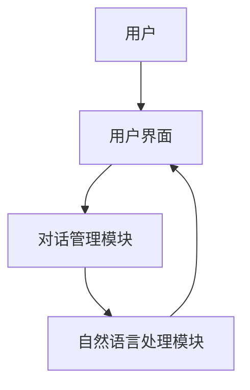
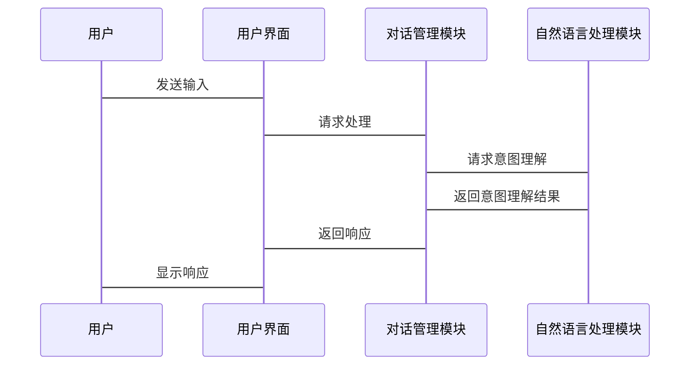

                 


# 构建企业级对话系统：多轮对话管理与意图理解的深度整合

## 关键词：
- 企业级对话系统
- 多轮对话管理
- 意图理解
- 自然语言处理
- 对话系统架构

## 摘要：
企业级对话系统是人工智能领域的重要应用，涉及多轮对话管理和意图理解的深度整合。本文从背景介绍、核心概念、算法原理、系统架构、项目实战和最佳实践等方面展开，详细阐述了企业级对话系统的构建过程。通过分析对话管理与意图理解的协同优化，结合数学模型和实际案例，为读者提供了全面的技术指导。

---

## 第一部分: 企业级对话系统概述

### 第1章: 对话系统的发展与挑战

#### 1.1 对话系统的定义与背景
- **1.1.1 对话系统的定义**  
  对话系统是一种能够理解和生成人类语言的智能系统，通过多轮对话与用户交互，提供服务或信息。

- **1.1.2 对话系统的演变历程**  
  从基于规则的简单对话系统，到基于统计和深度学习的复杂系统，对话系统的演变体现了技术的进步。

- **1.1.3 企业级对话系统的重要性**  
  在企业级应用中，对话系统需要处理复杂的业务逻辑和多轮对话，确保用户体验和效率。

#### 1.2 多轮对话管理的背景
- **1.2.1 多轮对话的基本概念**  
  多轮对话是指用户与系统之间进行的多轮交互，每轮对话都依赖于前一轮的状态和内容。

- **1.2.2 企业级对话的复杂性**  
  企业级对话系统需要处理多样化的用户需求和复杂的业务逻辑，对对话管理提出了更高的要求。

- **1.2.3 多轮对话管理的必要性**  
  通过有效的对话管理，系统能够理解和跟踪对话上下文，确保对话的连贯性和正确性。

#### 1.3 意图理解的核心作用
- **1.3.1 意图理解的定义**  
  意图理解是通过分析用户的输入，识别用户的真实需求或意图。

- **1.3.2 意图理解在对话系统中的地位**  
  意图理解是对话系统的核心模块，直接影响对话管理和用户体验。

- **1.3.3 意图理解的技术挑战**  
  意图理解需要处理歧义、上下文依赖和数据稀疏性等问题，增加了技术实现的难度。

### 第2章: 企业级对话系统的架构与核心要素

#### 2.1 对话系统的整体架构
- **2.1.1 系统组成模块**  
  企业级对话系统通常包括用户界面、对话管理模块、自然语言处理模块、业务逻辑处理模块等。

- **2.1.2 模块间的协作关系**  
  各模块协同工作，确保对话的流畅和业务逻辑的正确执行。

- **2.1.3 系统的可扩展性**  
  系统设计应考虑未来的扩展需求，支持新增功能和服务。

#### 2.2 多轮对话管理的核心要素
- **2.2.1 对话上下文**  
  对话上下文是对话管理的核心，记录了当前对话的状态和历史信息。

- **2.2.2 对话状态**  
  对话状态反映了系统对当前对话的理解和定位，用于指导后续的对话策略。

- **2.2.3 对话策略**  
  对话策略决定了系统在不同状态下的响应方式，确保对话的顺利进行。

#### 2.3 意图理解的关键属性
- **2.3.1 意图分类**  
  意图分类是将用户输入映射到预定义的意图类别，如“查询订单”、“投诉建议”等。

- **2.3.2 槽位填充**  
  槽位填充是在意图分类的基础上，提取具体的实体信息，如订单号、时间等。

- **2.3.3 意图理解和对话管理的结合**  
  意图理解的结果为对话管理提供输入，而对话管理的输出又指导意图理解的调整，两者相互促进，实现对话的流畅性。

---

## 第二部分: 对话系统的算法原理

### 第3章: 对话管理的算法实现

#### 3.1 基于规则的对话管理
- **规则定义**  
  通过预定义的规则，系统根据当前对话状态和用户输入，选择下一步的操作。

- **优点与缺点**  
  优点是实现简单，适用于规则明确的场景；缺点是灵活性差，难以应对复杂情况。

#### 3.2 基于统计的对话管理
- **统计模型**  
  使用机器学习算法，基于历史数据训练对话管理模型，预测下一步的最佳操作。

- **优点与缺点**  
  优点是灵活性高，能够处理复杂场景；缺点是需要大量数据和计算资源。

#### 3.3 基于深度学习的对话管理
- **深度学习模型**  
  使用如BERT、Transformer等深度学习模型，通过端到端的训练，自动生成对话策略。

- **优点与缺点**  
  优点是性能优异，能够处理复杂的上下文信息；缺点是训练成本高，需要大量数据和计算资源。

### 第4章: 意图理解的算法实现

#### 4.1 基于模板的意图理解
- **模板匹配**  
  将用户输入与预定义的模板进行匹配，识别意图和槽位。

- **优点与缺点**  
  优点是实现简单，适用于规则明确的场景；缺点是灵活性差，难以应对多样化输入。

#### 4.2 基于特征工程的意图理解
- **特征提取**  
  从用户输入中提取关键词、句式结构等特征，用于意图分类和槽位填充。

- **优点与缺点**  
  优点是能够处理多样化输入，灵活性较高；缺点是特征设计依赖人工经验，难以自动化。

#### 4.3 基于深度学习的意图理解
- **深度学习模型**  
  使用如LSTM、BERT等模型，通过端到端的训练，自动生成意图理解和槽位填充结果。

- **优点与缺点**  
  优点是性能优异，能够处理复杂的上下文信息；缺点是训练成本高，需要大量数据和计算资源。

---

## 第三部分: 对话系统的系统架构与设计

### 第5章: 系统架构设计

#### 5.1 系统功能设计
- **领域模型**  
  使用Mermaid类图描述系统的模块和交互关系，明确各模块的功能和接口。

```mermaid
classDiagram
    class 用户界面 {
        显示对话内容
        接收用户输入
    }
    class 对话管理模块 {
        维护对话上下文
        根据意图生成响应
    }
    class 自然语言处理模块 {
        分析用户输入
        生成意图理解和槽位填充结果
    }
    用户界面 --> 对话管理模块
    对话管理模块 --> 自然语言处理模块
    用户界面 <---> 用户
```

#### 5.2 系统架构设计
- **整体架构**  
  使用Mermaid架构图展示系统的整体架构，包括前端、后端、自然语言处理模块和对话管理模块。



#### 5.3 系统接口设计
- **接口描述**  
  定义系统各模块之间的接口，如对话管理模块与自然语言处理模块之间的接口。

#### 5.4 系统交互设计
- **交互流程**  
  使用Mermaid序列图描述系统的交互流程，包括用户输入、意图理解、对话管理、生成响应等步骤。



---

## 第四部分: 项目实战

### 第6章: 企业级对话系统的实战应用

#### 6.1 项目背景
- **项目目标**  
  构建一个企业级对话系统，实现多轮对话管理和意图理解的深度整合。

#### 6.2 环境部署
- **环境配置**  
  安装必要的开发工具和依赖库，如Python、TensorFlow、Keras等。

#### 6.3 核心功能实现
- **意图理解模块**  
  使用预训练的自然语言处理模型，如BERT，进行意图分类和槽位填充。

- **对话管理模块**  
  实现基于深度学习的对话管理，根据意图理解和对话状态生成响应。

#### 6.4 项目总结
- **案例分析**  
  通过具体案例分析，展示系统的实际应用和效果。

- **经验总结**  
  总结项目实施中的经验教训，提出改进建议。

---

## 第五部分: 最佳实践与注意事项

### 第7章: 对话系统的优化与维护

#### 7.1 性能优化
- **模型优化**  
  通过模型压缩、参数调整等方法，提升系统的响应速度和准确性。

#### 7.2 安全性考虑
- **数据安全**  
  确保用户数据的安全性和隐私性，防止数据泄露。

#### 7.3 可扩展性设计
- **模块化设计**  
  将系统设计为模块化结构，便于未来的扩展和维护。

### 第8章: 小结与展望

#### 8.1 小结
- **核心内容回顾**  
  总结文章的核心内容，强调对话管理与意图理解的深度整合的重要性。

#### 8.2 注意事项
- **实际应用中的注意事项**  
  提醒读者在实际应用中需要注意的问题，如数据质量、模型训练等。

#### 8.3 拓展阅读
- **推荐阅读资料**  
  推荐相关的技术书籍和论文，供读者进一步学习和研究。

---

## 作者：AI天才研究院/AI Genius Institute & 禅与计算机程序设计艺术 /Zen And The Art of Computer Programming

