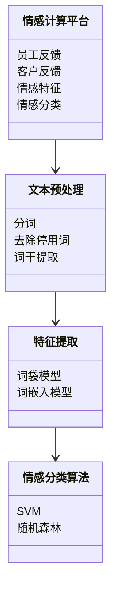
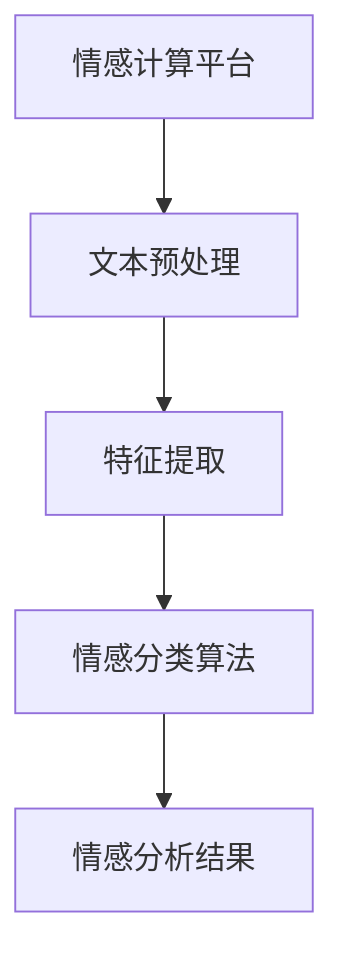
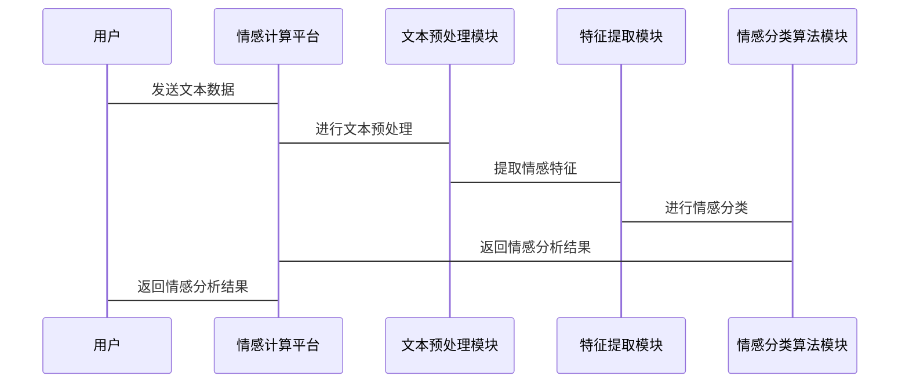

                 


```markdown
# 构建企业级情感计算平台：员工满意度与客户情绪分析

> 关键词：情感计算，员工满意度，客户情绪分析，自然语言处理，机器学习，情感分析算法

> 摘要：本文详细探讨了如何构建一个企业级的情感计算平台，专注于员工满意度分析和客户情绪分析。文章从背景介绍、核心概念、算法原理、系统架构设计到项目实战，全面解析了情感计算的各个方面。通过对比不同算法的优缺点，结合实际案例分析，本文为读者提供了从理论到实践的完整指南，帮助企业在实际应用中提升员工满意度和客户体验。

---

## 第一部分: 情感计算平台背景与概述

### 第1章: 情感计算平台的背景与应用

#### 1.1 情感计算的定义与核心概念
情感计算（Affective Computing）是一种通过计算机技术来识别、理解和响应人类情感状态的跨学科领域。它结合了心理学、认知科学和计算机科学，旨在赋予机器理解和处理情感的能力。情感计算的核心目标是通过分析语言、文字、语音和面部表情等多模态数据，推断出个体的情感状态，并据此做出相应的反馈或决策。

在企业环境中，情感计算的应用主要集中在员工满意度分析和客户情绪分析。员工满意度分析可以帮助企业识别员工的工作状态和情绪变化，从而及时采取措施改善工作环境；而客户情绪分析则有助于企业了解客户对产品或服务的满意度，及时调整策略以提升客户体验。

#### 1.2 情感计算在企业中的应用
##### 1.2.1 员工满意度分析
员工满意度是企业在评估员工工作状态和团队凝聚力时的重要指标。传统的方法通常依赖于定期的问卷调查和数据分析，但这种方法存在效率低下、难以实时捕捉情绪变化等问题。情感计算通过分析员工在邮件、聊天记录、工作报告等文本数据中的情感倾向，能够更及时、准确地评估员工的工作状态和满意度。

##### 1.2.2 客户情绪分析
客户情绪分析是情感计算在企业中的另一个重要应用。企业可以通过分析客户的反馈、评论、投诉等文本数据，了解客户对产品或服务的满意度和情感倾向。这种分析可以帮助企业识别客户不满的情绪，及时解决问题，提升客户忠诚度和满意度。

##### 1.2.3 情感计算的其他应用场景
除了员工满意度分析和客户情绪分析，情感计算在企业中的其他应用场景还包括：
- 市场分析：通过分析社交媒体上的用户评论，帮助企业了解市场趋势和竞争对手的动态。
- 品牌声誉管理：通过监测媒体和网络上的品牌相关评论，帮助企业维护和提升品牌声誉。
- 客户支持：通过实时分析客户与支持团队的对话，快速识别客户情绪，提供更有效的支持服务。

#### 1.3 情感计算的技术基础
##### 1.3.1 自然语言处理
自然语言处理（NLP）是情感计算的重要技术基础。NLP通过处理和理解人类语言，帮助企业从文本数据中提取有用的信息。在情感计算中，NLP主要用于文本预处理、情感特征提取和情感分类等步骤。

##### 1.3.2 机器学习
机器学习是情感计算的另一个核心技术。通过训练模型，机器学习可以帮助计算机从大量数据中学习情感特征，并根据这些特征对新的文本数据进行分类。常用的情感分类算法包括支持向量机（SVM）、随机森林（Random Forest）和深度学习模型（如卷积神经网络CNN和循环神经网络RNN）。

##### 1.3.3 情感分析算法
情感分析算法是情感计算的核心工具。这些算法通过分析文本的情感倾向，将其分类为正面、负面或中性。情感分析算法可以基于词袋模型（Bag of Words）、词嵌入模型（Word Embedding）或深度学习模型。

---

### 第2章: 情感计算的核心概念与联系

#### 2.1 情感计算的核心概念原理
##### 2.1.1 情感分析的基本原理
情感分析的基本原理是通过文本数据中的情感特征，推断出文本的情感倾向。情感分析的过程通常包括以下几个步骤：
1. 文本预处理：包括分词、去除停用词、词干提取等。
2. 特征提取：从文本中提取情感相关的特征，如关键词、情感词典中的词汇等。
3. 情感分类：使用机器学习算法对提取的特征进行分类，确定文本的情感倾向。

##### 2.1.2 文本预处理
文本预处理是情感分析的重要步骤。预处理的目标是将原始文本转化为适合算法处理的形式。常见的文本预处理步骤包括：
- 分词：将文本分割成单词或短语。
- 去除停用词：去掉一些常见的无意义词汇，如“的”、“是”等。
- 词干提取：将词汇转化为其基本形式，如将“computing”转化为“compute”。

##### 2.1.3 特征提取与分类
特征提取是情感分析的关键步骤。通过提取文本中的情感特征，算法能够更好地理解文本的情感倾向。常用的特征提取方法包括：
- 词袋模型：将文本表示为一个词频向量。
- 词嵌入模型：将词汇映射到低维的连续向量空间（如Word2Vec）。

分类是情感分析的最终步骤。常用的分类算法包括SVM、随机森林和Naive Bayes等。

#### 2.2 情感计算的核心概念对比
##### 2.2.1 情感分析算法对比
以下是一个情感分析算法的对比表格：

| 算法名称       | 优点                                      | 缺点                                      |
|----------------|-------------------------------------------|-------------------------------------------|
| 支持向量机（SVM）| 高准确率，适合小规模数据                 | 计算复杂度高，不适合大规模数据             |
| 随机森林       | 高准确率，适合大规模数据                 | 对特征工程依赖较高                       |
| Naive Bayes    | 计算简单，适合文本分类                   | 对特征独立性假设较强，可能影响准确率       |

##### 2.2.2 不同情感分析模型的优缺点
- 支持向量机（SVM）：SVM是一种监督学习算法，适用于小规模数据的分类。它通过在特征空间中找到一个超平面，将数据分成不同的类别。SVM在情感分析中表现出色，但计算复杂度较高，不适合处理大规模数据。

- 随机森林：随机森林是一种基于树的集成学习算法，通过构建多棵决策树并进行投票或平均来提高分类准确率。随机森林对噪声数据有较强的鲁棒性，适合处理大规模数据。

#### 2.3 情感计算的ER实体关系图
以下是一个情感计算平台的实体关系图：

```mermaid
erDiagram
    情感计算平台 {
        员工反馈
        客户反馈
        情感特征
        情感分类
    }
    员工反馈 --> 情感特征
    客户反馈 --> 情感特征
    情感特征 --> 情感分类
```

---

## 第三部分: 情感计算算法原理

### 第3章: 情感计算算法原理

#### 3.1 支持向量机(SVM)算法
##### 3.1.1 SVM算法的基本原理
支持向量机（SVM）是一种监督学习算法，主要用于分类和回归问题。SVM的核心思想是通过找到一个超平面，将数据分成不同的类别。在情感分析中，SVM可以用来将文本分成正面、负面或中性。

##### 3.1.2 SVM算法的数学模型
SVM的数学模型如下：

$$
\text{目标函数: } \min_{w,b,\xi} \frac{1}{2}||w||^2 + C\sum_{i=1}^n \xi_i
$$

$$
\text{约束条件: } y_i(w \cdot x_i + b) \geq 1 - \xi_i
$$

其中，\( w \) 是权重向量，\( b \) 是偏置项，\( \xi_i \) 是松弛变量，\( C \) 是惩罚参数。

##### 3.1.3 SVM算法的实现步骤
1. 文本预处理：对文本进行分词、去停用词等处理。
2. 特征提取：将文本转换为数值向量。
3. 模型训练：使用SVM算法对训练数据进行训练。
4. 模型预测：使用训练好的模型对新的文本进行分类。

#### 3.2 随机森林算法
##### 3.2.1 随机森林算法的基本原理
随机森林是一种基于树的集成学习算法。它通过构建多棵决策树，并将这些树的结果进行投票或平均，得到最终的分类结果。随机森林对特征工程依赖较高，适合处理大规模数据。

##### 3.2.2 随机森林算法的数学模型
随机森林的投票机制如下：

$$
\text{类别数} = \sum_{i=1}^n \text{类别}_i \times \text{权重}_i
$$

其中，\( \text{类别}_i \) 是第i棵决策树的分类结果，\( \text{权重}_i \) 是决策树的权重。

##### 3.2.3 随机森林算法的实现步骤
1. 文本预处理：对文本进行分词、去停用词等处理。
2. 特征提取：将文本转换为数值向量。
3. 模型训练：使用随机森林算法对训练数据进行训练。
4. 模型预测：使用训练好的模型对新的文本进行分类。

---

## 第四部分: 情感计算系统架构设计方案

### 第4章: 情感计算系统架构设计

#### 4.1 问题场景介绍
情感计算系统需要处理大量的文本数据，包括员工反馈和客户反馈。这些数据需要经过预处理、特征提取、分类等步骤，最终生成情感分析结果。

#### 4.2 领域模型设计
以下是情感计算系统的领域模型类图：



#### 4.3 系统架构设计
以下是情感计算系统的架构图：



#### 4.4 系统接口设计
情感计算平台需要提供以下接口：
- 接收文本数据接口
- 返回情感分析结果接口

#### 4.5 系统交互设计
以下是系统交互的序列图：



---

## 第五部分: 项目实战

### 第5章: 项目实战

#### 5.1 环境安装
以下是项目所需的环境和工具：
- Python 3.8+
- Scikit-learn
- NLTK
- SpaCy

#### 5.2 系统核心实现
##### 5.2.1 文本预处理代码
```python
import nltk
from nltk.corpus import stopwords

def text_preprocessing(text):
    tokens = nltk.word_tokenize(text)
    stop_words = set(stopwords.words('english'))
    filtered_tokens = [token for token in tokens if token.lower() not in stop_words]
    return filtered_tokens
```

##### 5.2.2 特征提取代码
```python
from sklearn.feature_extraction.text import TfidfVectorizer

vectorizer = TfidfVectorizer()
X = vectorizer.fit_transform(corpus)
```

##### 5.2.3 情感分类代码
```python
from sklearn.svm import SVC
from sklearn.ensemble import RandomForestClassifier

# 使用SVM进行分类
svm_model = SVC()
svm_model.fit(X_train, y_train)
y_pred_svm = svm_model.predict(X_test)

# 使用随机森林进行分类
rf_model = RandomForestClassifier()
rf_model.fit(X_train, y_train)
y_pred_rf = rf_model.predict(X_test)
```

#### 5.3 代码功能解读
- 文本预处理代码：对文本进行分词和去除停用词处理。
- 特征提取代码：使用TF-IDF方法提取文本特征。
- 情感分类代码：分别使用SVM和随机森林算法进行情感分类，并输出分类结果。

#### 5.4 实际案例分析
以下是一个实际案例分析：

假设我们有一个客户评论数据集，包括正面、负面和中性评论。我们可以通过上述代码进行情感分类，输出每个评论的情感倾向。

#### 5.5 项目小结
通过本项目，我们学会了如何构建一个情感计算系统，包括文本预处理、特征提取和情感分类。我们还对比了SVM和随机森林算法的优缺点，掌握了如何选择合适的算法进行情感分类。

---

## 第六部分: 最佳实践

### 第6章: 最佳实践

#### 6.1 小结
情感计算是一种重要的技术，能够帮助企业更好地理解员工和客户的情感状态。通过构建情感计算平台，企业可以提升员工满意度和客户体验。

#### 6.2 注意事项
- 数据质量：情感计算的效果依赖于高质量的数据。
- 特征工程：特征工程是情感分类的重要步骤，需要仔细设计。
- 算法选择：选择合适的算法可以提高分类准确率。

#### 6.3 拓展阅读
- 《自然语言处理实战》
- 《机器学习实战》
- 《情感计算入门》

---

## 作者：AI天才研究院/AI Genius Institute & 禅与计算机程序设计艺术/Zen And The Art of Computer Programming
```

