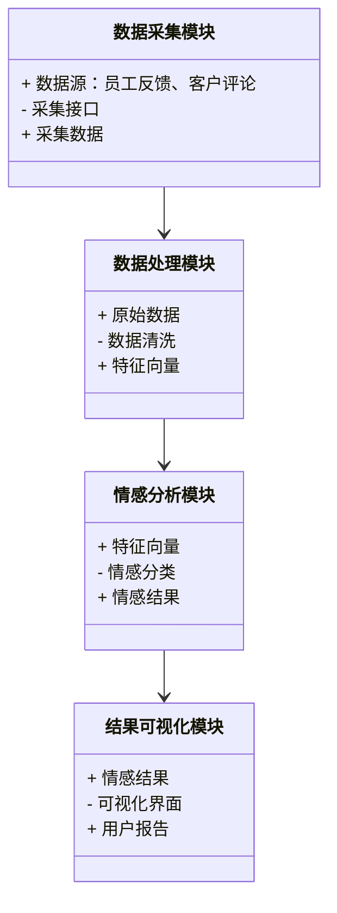
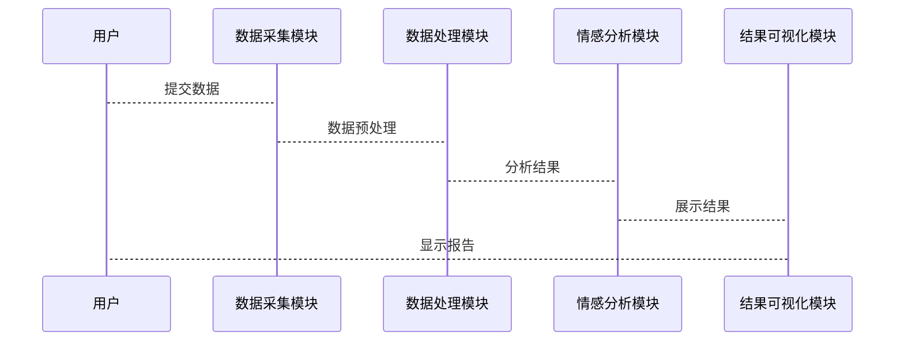

                 


# 构建企业级情感计算平台：员工满意度与客户情绪的综合分析

**关键词**：情感计算，员工满意度，客户情绪分析，自然语言处理，机器学习，企业级系统

**摘要**：  
随着企业数字化转型的深入，情感计算在员工满意度和客户情绪分析中的应用越来越重要。本文将从理论到实践，详细探讨如何构建一个企业级情感计算平台，实现对员工和客户情绪的综合分析。通过自然语言处理（NLP）和机器学习技术，我们能够从海量数据中提取情感信息，为企业决策提供有力支持。文章内容包括情感计算的核心概念、算法原理、系统架构设计以及实际项目案例，帮助读者全面理解并掌握构建情感计算平台的关键技术。

---

## 第一章: 企业级情感计算平台的背景与需求

### 1.1 情感计算的定义与背景
情感计算（Affective Computing）是一种通过计算技术来识别、分析和理解人类情感状态的科学。它结合了计算机科学、认知科学和心理学，旨在通过数据驱动的方式，量化人类的情感表达。

#### 1.1.1 什么是情感计算
情感计算的核心目标是通过分析文本、语音、图像等数据，识别其中的情感倾向（如正面、负面或中性）。企业级情感计算关注的是如何将这些情感信息应用于实际业务场景，如员工管理、客户服务等。

#### 1.1.2 情感计算的发展历程
情感计算的研究可以追溯到20世纪90年代，随着自然语言处理和机器学习技术的进步，情感计算在近年来取得了显著进展。企业级情感计算的应用也逐渐从理论研究走向实际落地。

#### 1.1.3 企业级情感计算的重要性
在企业中，员工满意度和客户情绪是影响企业绩效的关键因素。通过情感计算，企业可以实时监控员工和客户的情绪状态，及时发现问题并采取措施，从而提升整体满意度和客户忠诚度。

### 1.2 员工满意度与客户情绪分析的必要性
#### 1.2.1 员工满意度对企业的影响
员工满意度高，通常意味着员工的工作积极性和创造力更强，能够为企业创造更大的价值。通过分析员工的情感数据，企业可以识别出员工的不满情绪，并及时采取措施改善工作环境。

#### 1.2.2 客户情绪对企业决策的作用
客户的情绪直接反映了他们对产品或服务的满意度。通过分析客户的评论、反馈和情感数据，企业可以更好地理解客户需求，优化产品设计和服务流程。

#### 1.2.3 综合分析的必要性
员工和客户的满意度密切相关。例如，员工的不满情绪可能会影响客户服务质量，而客户的负面反馈也可能反过来影响员工士气。因此，综合分析员工和客户的情绪数据，可以帮助企业找到问题的根源，并制定更有效的解决方案。

### 1.3 情感计算在企业中的应用场景
#### 1.3.1 人力资源管理中的应用
通过分析员工的邮件、聊天记录和绩效评价，企业可以识别员工的情绪状态，预测员工流失风险，并制定针对性的激励措施。

#### 1.3.2 客户关系管理中的应用
通过分析客户的社交媒体评论、客服对话和产品评价，企业可以实时监控客户情绪，识别潜在的客户流失风险，并采取主动措施挽留客户。

#### 1.3.3 市场分析中的应用
情感计算可以帮助企业在市场调研中分析消费者对产品的看法和偏好，从而为市场策略提供数据支持。

### 1.4 本章小结
本章主要介绍了情感计算的定义、发展历程及其在企业中的重要性。通过分析员工满意度和客户情绪，企业可以更好地理解内部和外部的情感数据，从而制定更有效的管理策略。

---

## 第二章: 情感计算的核心概念与技术

### 2.1 情感计算的核心概念
#### 2.1.1 情感计算的基本原理
情感计算的核心是通过分析文本、语音或图像等数据，提取情感特征，并将其转化为可量化的指标（如情感强度、情感类别等）。

#### 2.1.2 情感计算的关键技术
- **文本预处理**：包括分词、去停用词、词干提取等。
- **特征提取**：通过词袋模型、TF-IDF或词嵌入（如Word2Vec）提取文本特征。
- **情感分类**：基于机器学习或深度学习算法（如SVM、随机森林、LSTM等）对情感进行分类。

#### 2.1.3 情感计算的分类与层次
情感计算可以分为文本情感分析、语音情感分析和视觉情感分析。文本情感分析是最常见的形式，广泛应用于社交媒体、客户服务等领域。

### 2.2 自然语言处理在情感计算中的应用
#### 2.2.1 NLP的基本概念
自然语言处理（NLP）是计算机科学和人工智能的交叉领域，旨在让计算机能够理解和处理人类语言。

#### 2.2.2 NLP在情感分析中的作用
NLP技术（如文本分词、实体识别、情感分析）是情感计算的基础，能够帮助我们从文本中提取情感信息。

#### 2.2.3 常见的NLP技术与工具
- **分词工具**：如jieba（中文）、spaCy（英文）。
- **情感分析工具**：如NLTK、TextBlob。
- **深度学习模型**：如BERT、GPT。

### 2.3 机器学习在情感计算中的应用
#### 2.3.1 机器学习的基本原理
机器学习是一种通过数据训练模型的技术，能够从经验中学习并改进性能。

#### 2.3.2 常见的机器学习算法
- **监督学习**：如支持向量机（SVM）、随机森林。
- **无监督学习**：如聚类分析。
- **深度学习**：如LSTM、Transformer。

#### 2.3.3 机器学习在情感分类中的应用
通过训练模型，我们可以对文本进行情感分类（如正面、负面、中性）。

### 2.4 情感计算与其他技术的关系
#### 2.4.1 情感计算与大数据分析
情感计算依赖于大数据技术进行数据采集和分析，而大数据分析则为情感计算提供了丰富的数据源。

#### 2.4.2 情感计算与人工智能
情感计算是人工智能的一个重要分支，旨在让计算机具备理解和处理人类情感的能力。

#### 2.4.3 情感计算与数据挖掘
数据挖掘技术（如关联规则挖掘、分类分析）为情感计算提供了方法论支持。

### 2.5 本章小结
本章详细介绍了情感计算的核心概念、NLP和机器学习技术在情感计算中的作用，以及情感计算与其他技术的关系。这些知识为我们后续的系统设计和实现奠定了理论基础。

---

## 第三章: 情感计算的算法原理与实现

### 3.1 情感分析的基本流程
#### 3.1.1 数据预处理
- **文本清洗**：去除标点符号、停用词。
- **分词**：将文本分割成词语或短语。
- **词干提取**：将词语转换为词干。

#### 3.1.2 特征提取
- **词袋模型**：将文本转换为词袋向量。
- **TF-IDF**：计算词语的重要性。
- **词嵌入**：使用Word2Vec生成词向量。

#### 3.1.3 情感分类
- **训练模型**：使用训练数据训练分类器。
- **测试模型**：使用测试数据评估模型性能。
- **优化模型**：调整模型参数，提高分类准确率。

### 3.2 常见的情感分类算法
#### 3.2.1 支持向量机（SVM）
SVM是一种常用的分类算法，适用于小规模数据集。

```python
from sklearn.svm import SVC
model = SVC()
model.fit(X_train, y_train)
```

#### 3.2.2 随机森林（Random Forest）
随机森林是一种基于决策树的集成算法，适用于高维数据。

```python
from sklearn.ensemble import RandomForestClassifier
model = RandomForestClassifier()
model.fit(X_train, y_train)
```

#### 3.2.3 深度学习模型（LSTM）
LSTM适用于长文本的情感分析。

```python
from tensorflow.keras.layers import LSTM, Dense
from tensorflow.keras.models import Sequential
model = Sequential()
model.add(LSTM(64, input_shape=(max_len, embedding_dim)))
model.add(Dense(3, activation='softmax'))
model.compile(loss='sparse_categorical_crossentropy', optimizer='adam', metrics=['accuracy'])
```

### 3.3 情感计算的数学模型
#### 3.3.1 词袋模型
词袋模型将文本表示为一个词语的向量，例如：
$$
\text{词袋向量} = (\text{词}_1, \text{词}_2, \dots, \text{词}_n)
$$

#### 3.3.2 TF-IDF公式
TF-IDF（Term Frequency-Inverse Document Frequency）计算词语的重要性：
$$
\text{TF-IDF}(t, d) = \text{TF}(t, d) \times \text{IDF}(t)
$$

#### 3.3.3 余弦相似度
余弦相似度用于计算两个向量之间的相似性：
$$
\text{余弦相似度} = \frac{\vec{A} \cdot \vec{B}}{|\vec{A}| \times |\vec{B}|}
$$

### 3.4 本章小结
本章详细介绍了情感分析的基本流程和常见算法的实现原理，包括数据预处理、特征提取和情感分类。通过这些技术，我们可以实现对文本情感的自动化分析。

---

## 第四章: 系统分析与架构设计

### 4.1 项目背景与需求分析
#### 4.1.1 项目背景
随着企业数字化转型的深入，如何通过情感计算提升员工满意度和客户忠诚度成为企业关注的焦点。

#### 4.1.2 项目目标
构建一个企业级情感计算平台，实现对员工和客户情绪的综合分析。

### 4.2 系统功能设计
#### 4.2.1 功能模块划分
- **数据采集模块**：采集员工和客户的文本数据。
- **数据处理模块**：对文本数据进行预处理和特征提取。
- **情感分析模块**：对文本进行情感分类。
- **结果可视化模块**：展示情感分析结果。

#### 4.2.2 领域模型类图


### 4.3 系统架构设计
#### 4.3.1 架构设计概述
系统采用分层架构，包括数据层、业务逻辑层和表现层。

#### 4.3.2 系统架构图


### 4.4 接口设计与交互流程
#### 4.4.1 接口设计
- **数据接口**：提供API用于数据采集。
- **分析接口**：提供API用于情感分析。
- **可视化接口**：提供API用于结果展示。

#### 4.4.2 交互流程


### 4.5 本章小结
本章从项目背景出发，设计了系统的功能模块和架构，并通过类图和序列图展示了系统的交互流程。

---

## 第五章: 项目实战与代码实现

### 5.1 环境安装与配置
#### 5.1.1 安装Python环境
使用Anaconda或虚拟环境安装Python 3.x。

#### 5.1.2 安装依赖库
安装必要的库：
```bash
pip install numpy pandas scikit-learn tensorflow nltk
```

### 5.2 数据采集与预处理
#### 5.2.1 数据采集
从员工反馈和客户评论中采集文本数据。

#### 5.2.2 数据清洗
使用NLTK库进行文本清洗：
```python
import nltk
from nltk.corpus import stopwords

nltk.download('stopwords')
stop_words = set(stopwords.words('english'))

def preprocess(text):
    text = text.lower()
    text = text.replace("'", "")
    words = text.split()
    filtered_words = [word for word in words if word not in stop_words]
    return ' '.join(filtered_words)

text = "I love this product, but it has some issues."
clean_text = preprocess(text)
print(clean_text)  # Output: "i love this product issue"
```

### 5.3 特征提取与模型训练
#### 5.3.1 特征提取
使用TF-IDF进行特征提取：
```python
from sklearn.feature_extraction.text import TfidfVectorizer

vectorizer = TfidfVectorizer()
X = vectorizer.fit_transform(corpus)
```

#### 5.3.2 模型训练
使用随机森林进行情感分类：
```python
from sklearn.ensemble import RandomForestClassifier

model = RandomForestClassifier()
model.fit(X_train, y_train)
```

#### 5.3.3 模型评估
评估模型的准确率：
```python
from sklearn.metrics import accuracy_score

y_pred = model.predict(X_test)
print(accuracy_score(y_test, y_pred))  # 输出准确率
```

### 5.4 本章小结
本章通过实际项目案例，详细展示了情感计算平台的搭建过程，包括环境配置、数据预处理、特征提取和模型训练。

---

## 第六章: 优化与扩展

### 6.1 模型优化
#### 6.1.1 超参数调优
使用网格搜索优化模型：
```python
from sklearn.model_selection import GridSearchCV

param_grid = {'n_estimators': [100, 200], 'max_depth': [None, 10]}
grid_search = GridSearchCV(RandomForestClassifier(), param_grid)
grid_search.fit(X_train, y_train)
best_model = grid_search.best_estimator_
```

#### 6.1.2 集成学习
使用集成学习提升模型性能：
```python
from sklearn.ensemble import VotingClassifier

model1 = SVC()
model2 = RandomForestClassifier()
model3 = LogisticRegression()

voting_model = VotingClassifier(estimators=[('svm', model1), ('rf', model2), ('lr', model3)])
voting_model.fit(X_train, y_train)
```

### 6.2 系统扩展
#### 6.2.1 多语言支持
扩展系统支持多语言情感分析，如中文、西班牙语等。

#### 6.2.2 实时分析
通过流数据处理技术，实现实时情感分析。

### 6.3 未来趋势
#### 6.3.1 深度学习的进一步应用
随着深度学习技术的发展，情感分析将更加精细和准确。

#### 6.3.2 多模态情感计算
未来，情感计算将结合文本、语音、图像等多种模态数据，实现更全面的情感分析。

### 6.4 本章小结
本章讨论了如何优化情感计算模型，并扩展系统的功能。同时，展望了未来情感计算的发展趋势。

---

## 第七章: 总结与展望

### 7.1 全文总结
本文详细探讨了企业级情感计算平台的构建过程，包括情感计算的核心概念、算法原理、系统架构设计以及实际项目案例。通过这些技术，我们可以实现对员工和客户情绪的综合分析，为企业决策提供支持。

### 7.2 未来展望
随着人工智能和大数据技术的不断发展，情感计算将在企业中发挥越来越重要的作用。未来，我们需要进一步研究如何结合深度学习和多模态数据，提升情感分析的准确性和实用性。

### 7.3 致谢
感谢读者的耐心阅读，也感谢所有参与本文写作和支持的团队成员。

---

**作者：AI天才研究院/AI Genius Institute & 禅与计算机程序设计艺术 /Zen And The Art of Computer Programming**

