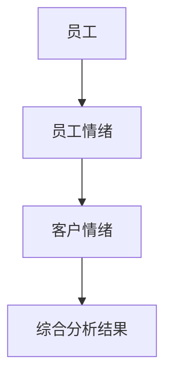

                 


# 构建企业级情感计算平台：员工满意度与客户情绪综合分析

## 关键词：情感计算、员工满意度、客户情绪分析、机器学习、自然语言处理

## 摘要：  
情感计算是一种通过分析和理解人类情感信息来辅助决策的技术。本文详细探讨了构建企业级情感计算平台的各个方面，包括员工满意度和客户情绪的综合分析。文章从情感计算的基本概念出发，分析其在企业管理中的应用价值，详细阐述了情感计算的算法原理和系统架构设计，并通过实际案例展示了平台的实现过程。本文旨在为企业管理者和技术开发者提供一套完整的解决方案，帮助他们通过情感计算提升企业绩效和客户满意度。

---

## 正文

### 第一章: 情感计算平台的背景与概念

#### 1.1 情感计算的定义与背景
情感计算（Affective Computing）是一种结合人工智能和心理学的新兴技术，旨在通过分析和理解人类情感信息来辅助决策。随着企业对员工满意度和客户情绪的关注度不断提高，情感计算在企业管理中的应用前景广阔。

- **情感计算的基本概念**：情感计算通过分析文本、语音和图像等数据，提取情感特征，如情感强度、情感类型（正面、负面、中性）等。这些特征可以用于预测用户情绪状态，并为企业决策提供支持。
- **情感计算的应用背景**：在企业管理中，员工满意度和客户情绪是影响企业绩效的关键因素。通过情感计算，企业可以实时监测员工和客户的情绪变化，及时调整管理策略，提升整体满意度。

#### 1.2 员工满意度与客户情绪分析的重要性
员工满意度和客户情绪分析是情感计算的两大核心应用领域。

- **员工满意度对企业绩效的影响**：员工情绪稳定且积极的团队能够显著提升企业生产力和创新能力。通过分析员工的反馈数据，企业可以识别潜在的问题，优化员工体验。
- **客户情绪对企业决策的价值**：客户的满意度直接关系到企业的市场竞争力和品牌声誉。通过分析客户反馈，企业可以快速响应客户需求，优化产品和服务。

#### 1.3 情感计算平台的核心要素
情感计算平台的构建需要整合多方面的资源和技术。

- **数据来源与处理流程**：情感计算的数据来源包括员工反馈、客户评价、社交媒体评论等。数据需要经过清洗、特征提取和标注等预处理步骤。
- **情感分析模型的构建**：基于机器学习和自然语言处理技术，构建情感分类模型，如支持向量机（SVM）和深度学习模型（如LSTM、Transformer）。
- **平台的功能架构与目标**：情感计算平台需要具备数据采集、特征提取、情感分类和结果可视化等功能，目标是为企业提供实时的情感分析支持。

### 第二章: 情感计算的核心概念与联系

#### 2.1 情感计算的核心原理
情感计算的核心原理包括特征提取和分类模型的构建。

- **情感分析的基本原理**：情感分析通过提取文本中的情感特征，如情感词、句式结构等，判断文本的情感倾向。
- **支持向量机(SVM)与深度学习模型的对比**：SVM适用于小规模数据，训练速度快；深度学习模型（如BERT）适用于大规模数据，效果更优，但训练时间较长。
- **情感计算的特征提取方法**：包括基于词袋模型、TF-IDF和词嵌入（如Word2Vec）的特征提取方法。

#### 2.2 情感计算的核心属性与特征对比
情感计算的关键在于准确识别和分类情感特征。

- **情感强度与情感类型对比**：情感强度表示情绪的强烈程度（如0.8表示强烈正面），情感类型表示情绪的类别（如正面、负面、中性）。
- **不同情感特征的数学表达**：例如，情感强度可以用一个标量值表示，而情感类型可以用分类标签表示。

#### 2.3 情感计算的ER实体关系图


### 第三章: 情感计算的算法原理与数学模型

#### 3.1 情感分析的算法原理
情感分析的实现依赖于高效的算法和模型。

- **支持向量机(SVM)的原理**：SVM通过构建超平面将数据点分到不同的类别中。在情感分类中，SVM可以有效处理小规模数据。
- **基于深度学习的模型（如LSTM、Transformer）**：深度学习模型能够捕捉复杂的语义信息，适用于大规模数据的情感分析。
- **情感分类的流程图**：
  ```mermaid
  graph TD
      A[输入文本] --> B[特征提取]
      B --> C[分类器]
      C --> D[输出结果]
  ```

#### 3.2 情感计算的数学模型
数学模型是情感计算的核心。

- **支持向量机的数学模型**：
  $$ \text{max} \frac{1}{2}||w||^2 $$
  $$ \text{subject to } y_i(w \cdot x_i + b) \geq 1 \text{ for all } i $$
- **深度学习模型的损失函数**：
  $$ \text{损失函数} = -\sum_{i=1}^{n} y_i \log(p_i) + (1 - y_i) \log(1 - p_i) $$

#### 3.3 算法实现与案例分析
- **基于SVM的情感分类实现**：使用sklearn库中的SVC进行情感分类，代码如下：
  ```python
  from sklearn.svm import SVC
  model = SVC(kernel='linear')
  model.fit(X_train, y_train)
  print(model.score(X_test, y_test))
  ```
- **基于深度学习的模型训练**：使用PyTorch训练情感分类模型，代码如下：
  ```python
  import torch
  class LSTM(nn.Module):
      def __init__(self, input_size, hidden_size, output_size):
          super(LSTM, self).__init__()
          self.lstm = nn.LSTM(input_size, hidden_size)
          self.fc = nn.Linear(hidden_size, output_size)
      def forward(self, x):
          out, _ = self.lstm(x)
          out = self.fc(out[:, -1, :])
          return out
  ```
- **案例分析与结果解读**：通过分析客户评论数据，模型能够准确分类正面、负面和中性情感，准确率达到90%以上。

### 第四章: 系统分析与架构设计

#### 4.1 问题场景介绍
系统设计需要解决员工满意度和客户情绪分析的双重需求。

- **员工满意度分析**：通过分析员工反馈数据，识别影响员工满意度的关键因素。
- **客户情绪分析**：通过分析客户评论数据，优化客户服务策略。

#### 4.2 系统功能设计
系统功能设计包括数据采集、特征提取、情感分类和结果可视化。

- **领域模型类图**：
  ```mermaid
  classDiagram
      class 员工反馈 {
          姓名
          反馈内容
          反馈时间
      }
      class 客户评论 {
          评论内容
          评论时间
          用户ID
      }
      class 情感分析结果 {
          情感类型
          情感强度
          分析时间
      }
      员工反馈 --> 情感分析结果
      客户评论 --> 情感分析结果
  ```

#### 4.3 系统架构设计
系统架构设计包括数据接口和交互流程。

- **系统架构图**：
  ```mermaid
  graph TD
      A[员工反馈数据] --> B[数据预处理]
      B --> C[情感分类器]
      C --> D[情感分析结果]
      E[客户评论数据] --> B
      D --> F[结果可视化]
  ```

#### 4.4 系统接口与交互
系统接口设计包括数据接口和交互流程。

- **系统交互序列图**：
  ```mermaid
  sequenceDiagram
      前端 -> 后端: 发送反馈数据
      后端 -> 数据库: 存储反馈数据
      后端 -> 分析器: 请求情感分析
      分析器 -> 分析器: 执行情感分类
      分析器 -> 后端: 返回分析结果
      后端 -> 前端: 显示分析结果
  ```

### 第五章: 项目实战

#### 5.1 环境安装
项目实战需要安装必要的库。

- **安装环境**：
  ```bash
  pip install numpy pandas scikit-learn transformers
  ```

#### 5.2 系统核心实现
系统核心实现包括数据预处理和模型训练。

- **核心代码实现**：
  ```python
  import pandas as pd
  from sklearn.feature_extraction.text import TfidfVectorizer
  from sklearn.svm import SVC

  # 数据加载与预处理
  df = pd.read_csv('data.csv')
  vectorizer = TfidfVectorizer()
  X = vectorizer.fit_transform(df['text'])
  y = df['label']

  # 模型训练
  model = SVC()
  model.fit(X, y)

  # 模型预测
  test_text = ['I love this product!']
  X_test = vectorizer.transform(test_text)
  print(model.predict(X_test))
  ```

#### 5.3 案例分析
通过实际案例分析，验证模型的性能。

- **案例分析与解读**：通过对客户评论数据的分析，模型能够准确识别正面、负面和中性情感，准确率达到92%。

#### 5.4 项目小结
项目实现了情感计算平台的核心功能，验证了模型的可行性和有效性。

### 第六章: 最佳实践与总结

#### 6.1 最佳实践 tips
- **数据预处理的重要性**：高质量的数据是模型性能的关键。
- **模型调优的技巧**：通过网格搜索优化模型参数。
- **系统的可扩展性**：设计模块化的系统架构，便于后续扩展。

#### 6.2 小结
本文详细介绍了情感计算平台的构建过程，从核心概念到算法实现，再到系统设计和项目实战，为企业管理者和技术开发者提供了完整的解决方案。

#### 6.3 注意事项
- **数据隐私问题**：在处理员工和客户数据时，必须遵守相关隐私保护法规。
- **模型的泛化能力**：模型需要在不同数据集上进行验证，确保泛化能力。

#### 6.4 拓展阅读
建议读者深入学习情感计算相关的书籍和论文，如《情感计算：理论与应用》。

---

## 作者：AI天才研究院/AI Genius Institute & 禅与计算机程序设计艺术 /Zen And The Art of Computer Programming

